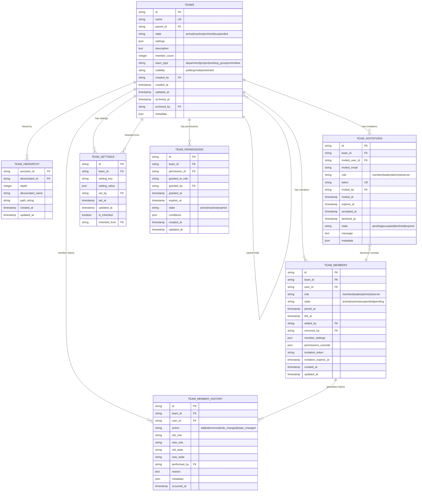
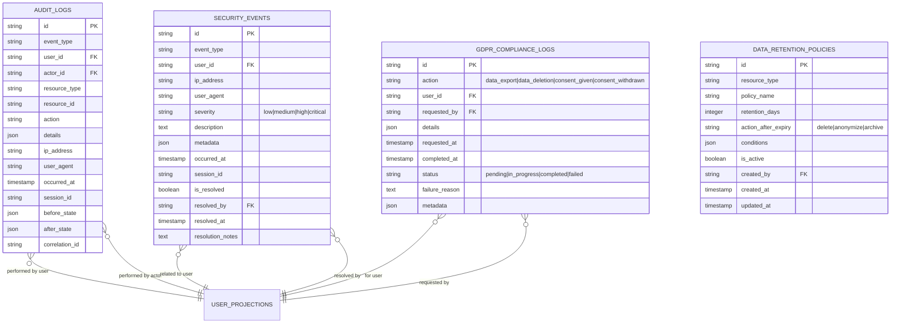

# 2. Entity Relationship Diagrams for UMS-STI

## 2.1. Executive Summary

This document provides comprehensive Entity Relationship Diagrams (ERDs) for the User Management System with Single Table Inheritance (UMS-STI) using Mermaid syntax. These diagrams illustrate the database schema, entity relationships, and data structures that support the event-sourced, CQRS-based system with consistent state management across User and Team entities.

## 2.2. Learning Objectives

After reviewing this document, readers will understand:

- **2.2.1.** Complete database schema and entity relationships
- **2.2.2.** Single Table Inheritance implementation for user types
- **2.2.3.** Team hierarchy structure using closure tables
- **2.2.4.** Permission and role assignment relationships
- **2.2.5.** Event store and projection table structures
- **2.2.6.** Consistent state management across entities

## 2.3. Prerequisite Knowledge

Before reviewing these diagrams, ensure familiarity with:

- **2.3.1.** Database design principles and normalization
- **2.3.2.** Single Table Inheritance patterns
- **2.3.3.** Closure table hierarchy implementation
- **2.3.4.** Event-sourcing data structures
- **2.3.5.** CQRS read model design

## 2.4. Core Entity Relationships

### 2.4.1. Complete System ERD


### 2.4.2. User Domain ERD


### 2.4.3. Team Domain ERD



## 2.5. Event Store and Projections ERD

### 2.5.1. Event Store Schema


### 2.5.2. Read Model Projections


## 2.6. Audit and Compliance ERD

### 2.6.1. Audit Logging Schema



### 2.6.2. Analytics and Metrics Schema


## 2.7. State Management Consistency

### 2.7.1. User State Transitions


### 2.7.2. Team State Transitions


## 2.8. Permission and Role Management ERD

### 2.8.1. Permission System Schema


## 2.9. Integration and External Systems ERD

### 2.9.1. External System Integration


## 2.10. Cross-References

### 2.10.1. Related Diagrams

- **Architectural Diagrams**: See [010-architectural-diagrams.md](010-architectural-diagrams.md) for system architecture overview
- **Business Process Flows**: See [030-business-process-flows.md](030-business-process-flows.md) for workflow diagrams
- **Swim Lanes**: See [040-swim-lanes.md](040-swim-lanes.md) for responsibility mapping
- **Domain Models**: See [050-domain-models.md](050-domain-models.md) for domain-specific diagrams
- **FSM Diagrams**: See [060-fsm-diagrams.md](060-fsm-diagrams.md) for state machine diagrams

### 2.10.2. Related Documentation

- **Database Foundation**: See [../020-database-foundation/010-database-design.md](../020-database-foundation/010-database-design.md)
- **User Models**: See [../030-user-models/010-sti-architecture-explained.md](../030-user-models/010-sti-architecture-explained.md)
- **Team Hierarchy**: See [../040-team-hierarchy/010-closure-table-theory.md](../040-team-hierarchy/010-closure-table-theory.md)
- **Permission System**: See [../050-permission-system/010-permission-design.md](../050-permission-system/010-permission-design.md)
- **Event-Sourcing Architecture**: See [../070-event-sourcing-cqrs/010-event-sourcing-architecture.md](../070-event-sourcing-cqrs/010-event-sourcing-architecture.md)

## 2.11. Database Constraints and Indexes

### 2.11.1. Primary Key and Unique Constraints

```sql
-- User Domain Constraints
ALTER TABLE users ADD CONSTRAINT uk_users_email UNIQUE (email);
ALTER TABLE user_sessions ADD CONSTRAINT uk_user_sessions_token UNIQUE (session_token);
ALTER TABLE guest_profiles ADD CONSTRAINT uk_guest_profiles_session UNIQUE (session_id);

-- Team Domain Constraints
ALTER TABLE teams ADD CONSTRAINT uk_teams_name UNIQUE (name);
ALTER TABLE team_hierarchy ADD CONSTRAINT pk_team_hierarchy PRIMARY KEY (ancestor_id, descendant_id);
ALTER TABLE team_invitations ADD CONSTRAINT uk_team_invitations_token UNIQUE (token);

-- Permission Domain Constraints
ALTER TABLE permissions ADD CONSTRAINT uk_permissions_name UNIQUE (name);
ALTER TABLE roles ADD CONSTRAINT uk_roles_name UNIQUE (name);

-- Event Store Constraints
ALTER TABLE stored_events ADD CONSTRAINT uk_stored_events_aggregate_version UNIQUE (aggregate_root_id, aggregate_version);
ALTER TABLE event_streams ADD CONSTRAINT uk_event_streams_name UNIQUE (stream_name);
```

### 2.11.2. Performance Indexes

```sql
-- User Domain Indexes
CREATE INDEX idx_users_type_state ON users(user_type, state);
CREATE INDEX idx_users_state_created ON users(state, created_at);
CREATE INDEX idx_users_last_login ON users(last_login_at);
CREATE INDEX idx_user_sessions_user_active ON user_sessions(user_id, is_active);

-- Team Domain Indexes
CREATE INDEX idx_teams_parent_state ON teams(parent_id, state);
CREATE INDEX idx_teams_state_created ON teams(state, created_at);
CREATE INDEX idx_team_hierarchy_descendant_depth ON team_hierarchy(descendant_id, depth);
CREATE INDEX idx_team_members_team_state ON team_members(team_id, state);
CREATE INDEX idx_team_members_user_state ON team_members(user_id, state);

-- Permission Domain Indexes
CREATE INDEX idx_user_permissions_user_context ON user_permissions(user_id, context_type, context_id);
CREATE INDEX idx_user_permissions_permission_state ON user_permissions(permission_id, state);
CREATE INDEX idx_user_roles_user_context ON user_roles(user_id, context_type, context_id);

-- Event Store Indexes
CREATE INDEX idx_stored_events_aggregate ON stored_events(aggregate_root_id);
CREATE INDEX idx_stored_events_class_created ON stored_events(event_class, created_at);
CREATE INDEX idx_stored_events_stream ON stored_events(event_stream);
CREATE INDEX idx_stored_events_correlation ON stored_events(correlation_id);

-- Projection Indexes
CREATE INDEX idx_user_projections_type_state ON user_projections(user_type, state);
CREATE INDEX idx_team_projections_parent_state ON team_projections(parent_id, state);
CREATE INDEX idx_team_member_projections_team_role ON team_member_projections(team_id, role);

-- Audit and Analytics Indexes
CREATE INDEX idx_audit_logs_user_occurred ON audit_logs(user_id, occurred_at);
CREATE INDEX idx_audit_logs_resource_action ON audit_logs(resource_type, action);
CREATE INDEX idx_analytics_events_user_occurred ON analytics_events(user_id, occurred_at);
CREATE INDEX idx_daily_active_users_date ON daily_active_users(activity_date);
```

## 2.12. References and Further Reading

### 2.12.1. Database Design

- [Database Design Fundamentals](https://www.lucidchart.com/pages/database-diagram/database-design)
- [Entity Relationship Modeling](https://www.smartdraw.com/entity-relationship-diagram/)
- [Normalization and Denormalization](https://www.geeksforgeeks.org/normal-forms-in-dbms/)

### 2.12.2. Single Table Inheritance

- [Single Table Inheritance in Laravel](https://laravel.com/docs/eloquent-relationships#polymorphic-relationships)
- [STI Design Patterns](https://martinfowler.com/eaaCatalog/singleTableInheritance.html)
- [Parental Package Documentation](https://github.com/tighten/parental)

### 2.12.3. Closure Tables

- [Closure Table Pattern](https://www.slideshare.net/billkarwin/models-for-hierarchical-data)
- [Hierarchical Data in MySQL](https://mikehillyer.com/articles/managing-hierarchical-data-in-mysql/)
- [Tree Structures in SQL](https://www.postgresql.org/docs/current/ltree.html)

### 2.12.4. Event Sourcing Data Models

- [Event Store Schema Design](https://eventstore.com/blog/event-store-schema-design)
- [Projection Design Patterns](https://eventstore.com/blog/projections-1-theory)
- [CQRS Read Model Design](https://docs.microsoft.com/en-us/azure/architecture/patterns/cqrs)
