# 3. Business Process Flows for UMS-STI

## 3.1. Executive Summary

This document provides comprehensive business process flow diagrams for the User Management System with Single Table Inheritance (UMS-STI) using Mermaid syntax. These diagrams illustrate the key business workflows, user journeys, and system processes that define how users, teams, and permissions interact within the event-sourced, CQRS-based system.

## 3.2. Learning Objectives

After reviewing this document, readers will understand:

- **3.2.1.** Complete user lifecycle and registration processes
- **3.2.2.** Team creation and management workflows
- **3.2.3.** Permission and role assignment processes
- **3.2.4.** Authentication and authorization flows
- **3.2.5.** GDPR compliance and data management processes
- **3.2.6.** Event-sourcing and CQRS workflow patterns

## 3.3. Prerequisite Knowledge

Before reviewing these diagrams, ensure familiarity with:

- **3.3.1.** Business process modeling concepts
- **3.3.2.** User experience design principles
- **3.3.3.** Event-sourcing and CQRS patterns
- **3.3.4.** Authentication and authorization concepts
- **3.3.5.** GDPR compliance requirements

## 3.4. User Management Processes

### 3.4.1. User Registration Process

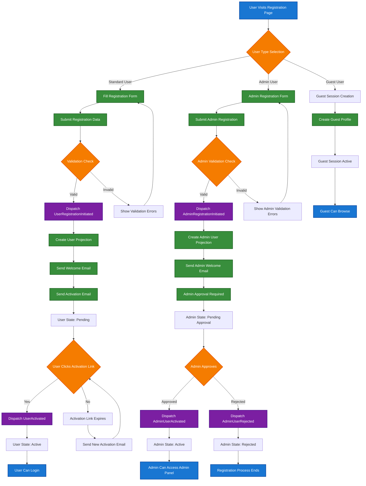

### 3.4.2. User Authentication Process

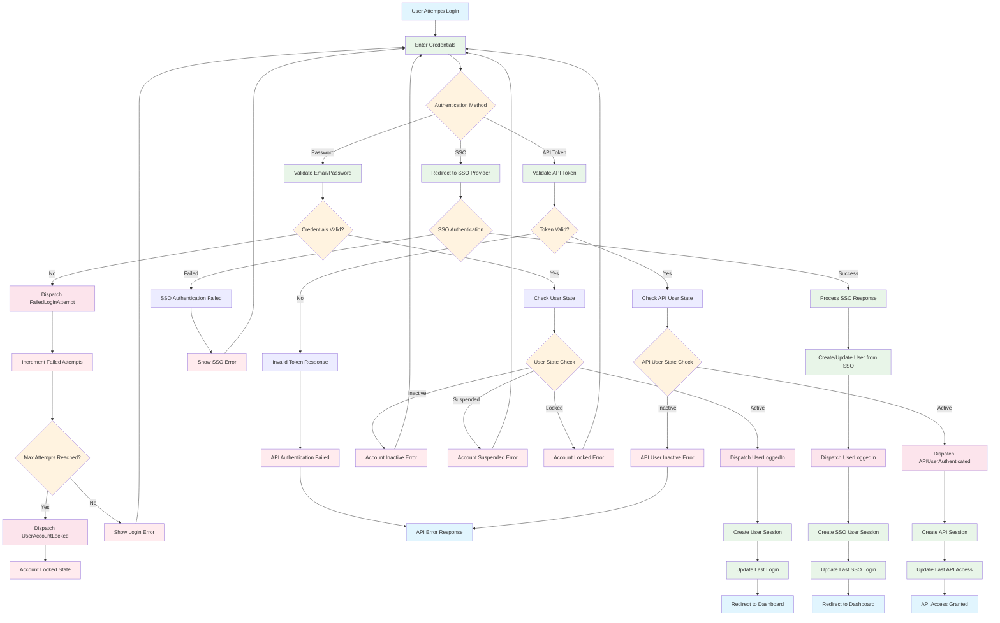

### 3.4.3. User Profile Management Process

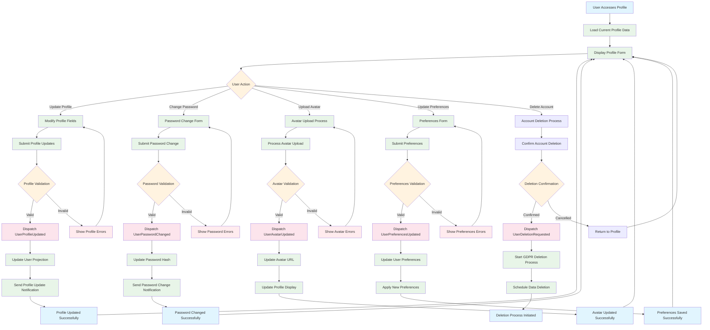

## 3.5. Team Management Processes

### 3.5.1. Team Creation Process

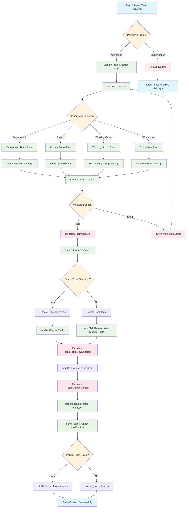

### 3.5.2. Team Member Management Process

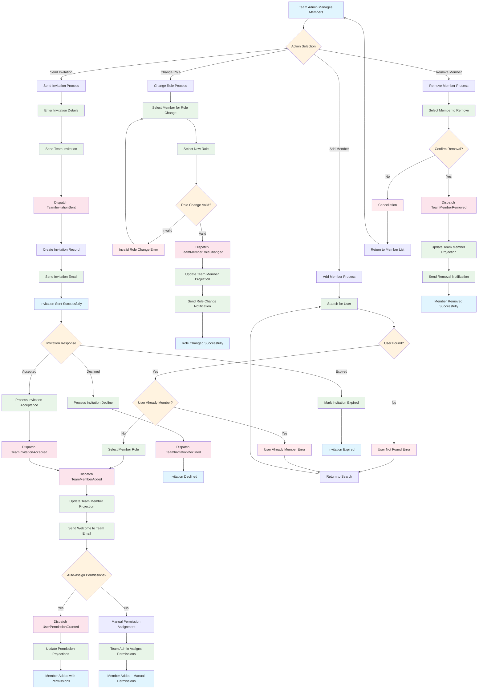

### 3.5.3. Team Hierarchy Management Process

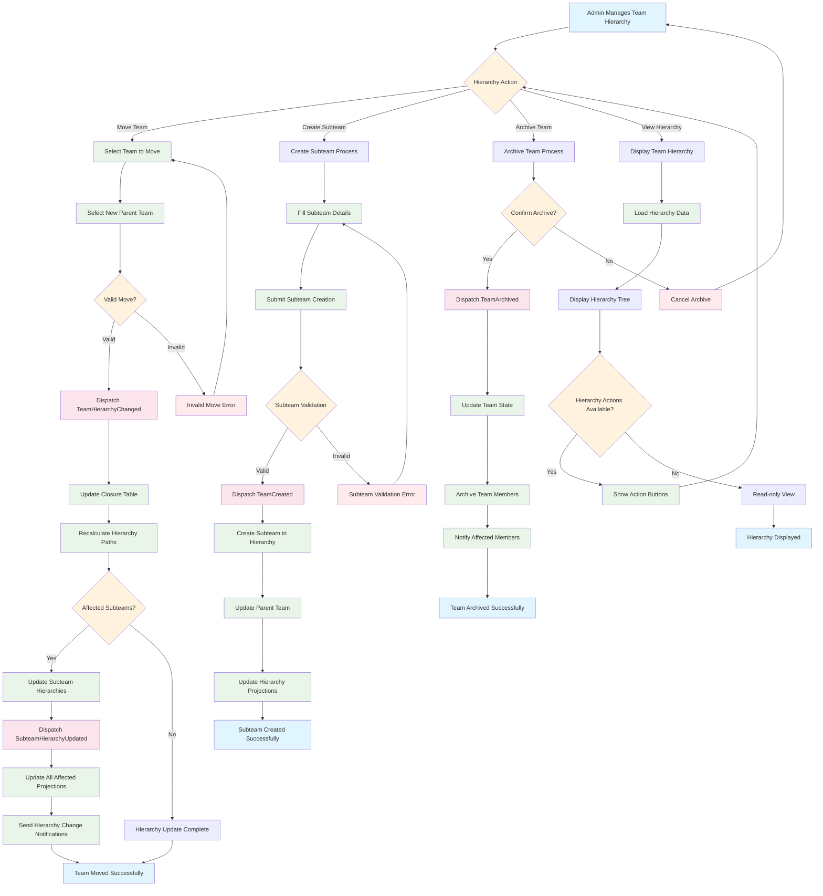

## 3.6. Permission and Role Management Processes

### 3.6.1. Permission Assignment Process

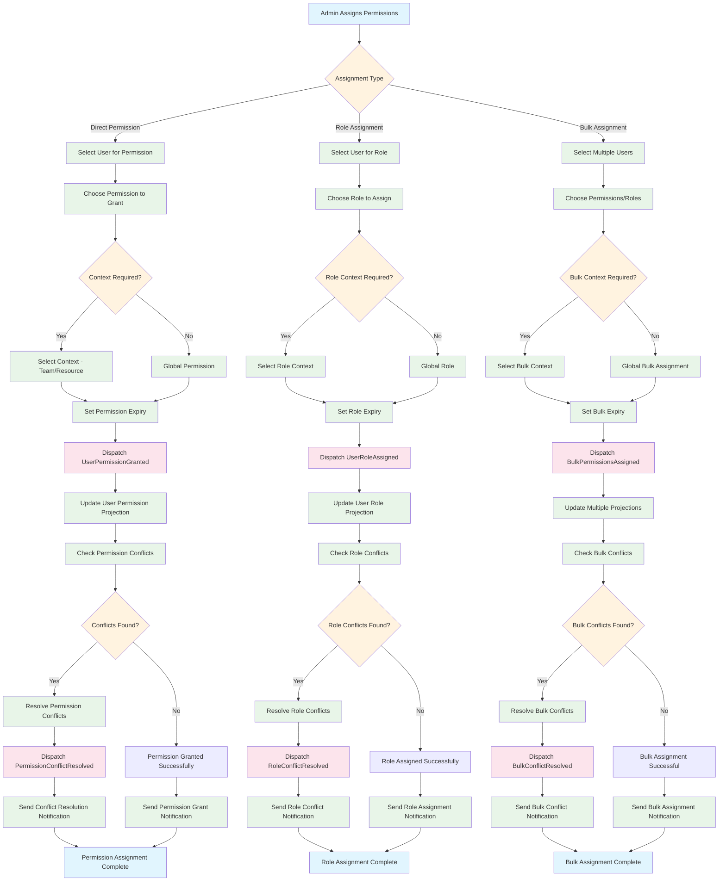

### 3.6.2. Permission Revocation Process

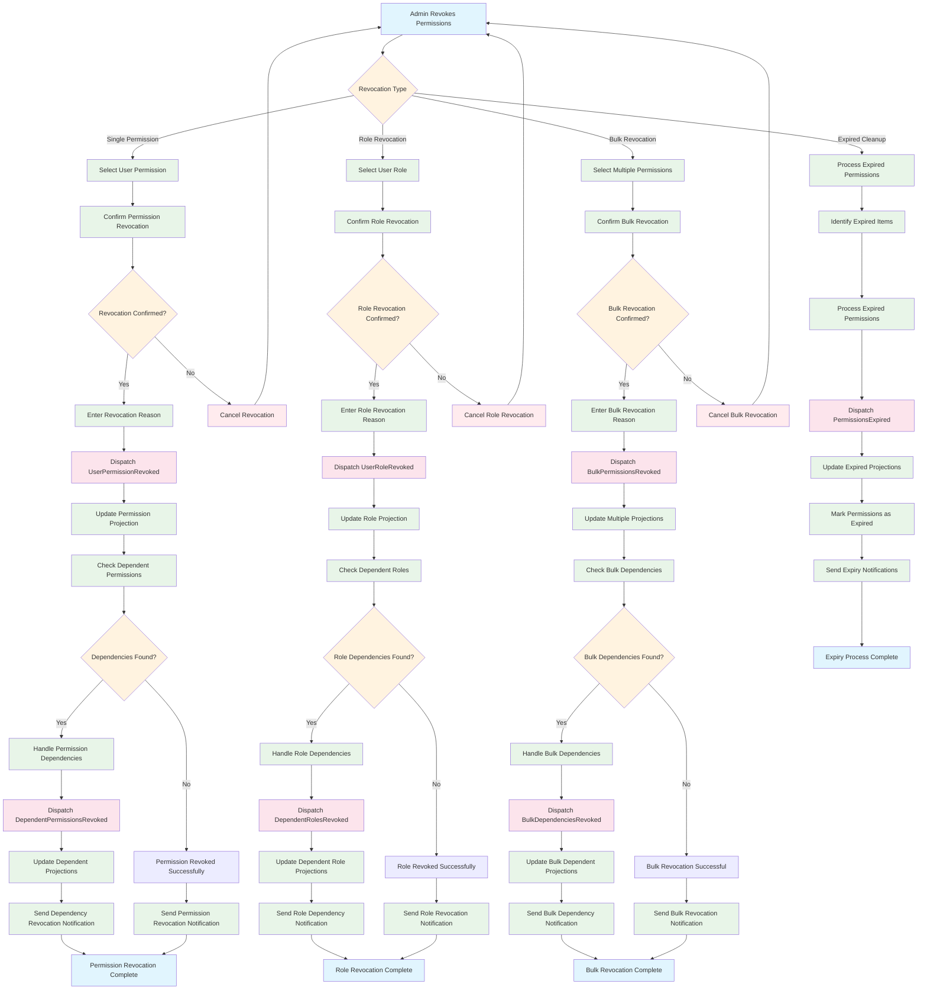

## 3.7. GDPR Compliance Processes

### 3.7.1. Data Export Process

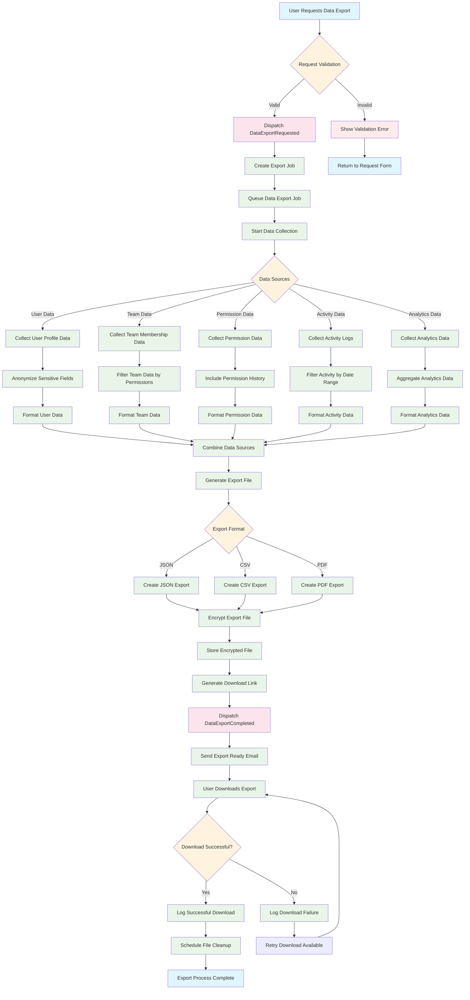

### 3.7.2. Data Deletion Process

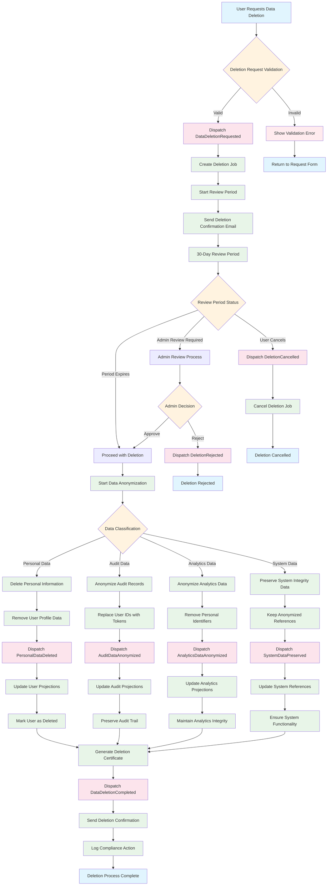

## 3.8. Event-Sourcing and CQRS Processes

### 3.8.1. Command Processing Flow

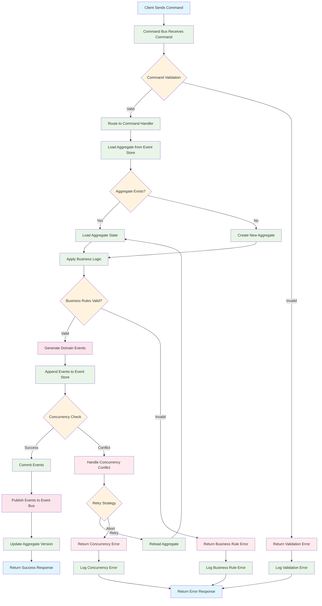

### 3.8.2. Query Processing Flow

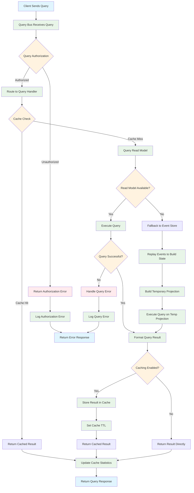

### 3.8.3. Event Processing Flow

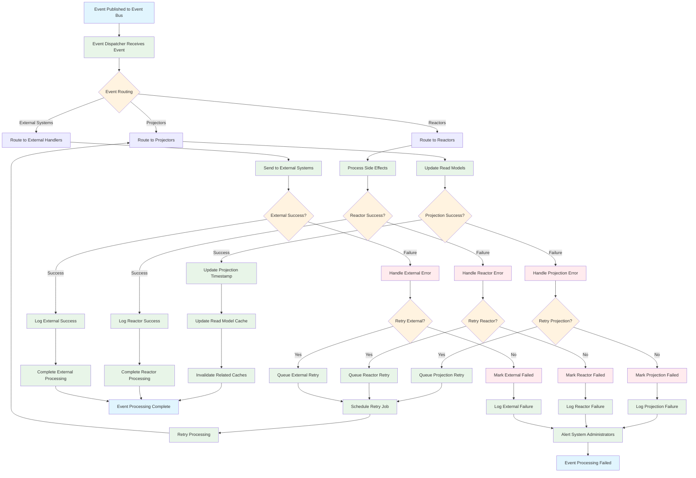

## 3.9. Cross-References

### 3.9.1. Related Diagrams

- **Architectural Diagrams**: See [010-architectural-diagrams.md](010-architectural-diagrams.md) for system architecture overview
- **ERD Diagrams**: See [020-erd-diagrams.md](020-erd-diagrams.md) for detailed entity relationships
- **Swim Lanes**: See [040-swim-lanes.md](040-swim-lanes.md) for responsibility mapping
- **Domain Models**: See [050-domain-models.md](050-domain-models.md) for domain-specific diagrams
- **FSM Diagrams**: See [060-fsm-diagrams.md](060-fsm-diagrams.md) for state machine diagrams

### 3.9.2. Related Documentation

- **User Models**: See [../030-user-models/010-sti-architecture-explained.md](../030-user-models/010-sti-architecture-explained.md)
- **Team Hierarchy**: See [../040-team-hierarchy/010-closure-table-theory.md](../040-team-hierarchy/010-closure-table-theory.md)
- **Permission System**: See [../050-permission-system/010-permission-design.md](../050-permission-system/010-permission-design.md)
- **GDPR Compliance**: See [../060-gdpr-compliance/010-gdpr-implementation.md](../060-gdpr-compliance/010-gdpr-implementation.md)
- **Event-Sourcing Architecture**: See [../070-event-sourcing-cqrs/010-event-sourcing-architecture.md](../070-event-sourcing-cqrs/010-event-sourcing-architecture.md)

## 3.10. Process Optimization Guidelines

### 3.10.1. Performance Considerations

- **Asynchronous Processing**: Use queues for non-critical operations
- **Batch Operations**: Group similar operations for efficiency
- **Caching Strategy**: Cache frequently accessed data
- **Database Optimization**: Use appropriate indexes and query optimization

### 3.10.2. Error Handling Best Practices

- **Graceful Degradation**: Provide fallback mechanisms
- **Retry Logic**: Implement exponential backoff for transient failures
- **Circuit Breakers**: Prevent cascade failures
- **Monitoring**: Track process success rates and performance metrics

### 3.10.3. Security Considerations

- **Input Validation**: Validate all user inputs
- **Authorization Checks**: Verify permissions at each step
- **Audit Logging**: Log all significant actions
- **Data Protection**: Encrypt sensitive data in transit and at rest

## 3.11. References and Further Reading

### 3.11.1. Business Process Modeling

- [Business Process Model and Notation (BPMN)](https://www.bpmn.org/)
- [Workflow Patterns](http://www.workflowpatterns.com/)
- [Process Mining Techniques](https://www.processmining.org/)

### 3.11.2. User Experience Design

- [User Journey Mapping](https://www.nngroup.com/articles/journey-mapping-101/)
- [Service Design Thinking](https://www.interaction-design.org/literature/topics/service-design)
- [Customer Experience Management](https://www.salesforce.com/resources/articles/customer-experience/)

### 3.11.3. Event-Driven Architecture

- [Event-Driven Architecture Patterns](https://microservices.io/patterns/data/event-driven-architecture.html)
- [Saga Pattern](https://microservices.io/patterns/data/saga.html)
- [Event Sourcing Patterns](https://martinfowler.com/eaaDev/EventSourcing.html)

### 3.11.4. GDPR Compliance

- [GDPR Implementation Guide](https://gdpr.eu/implementation/)
- [Data Protection Impact Assessment](https://gdpr.eu/data-protection-impact-assessment-template/)
- [Privacy by Design Principles](https://www.ipc.on.ca/wp-content/uploads/resources/7foundationalprinciples.pdf)
