# 4. Swim Lane Diagrams for UMS-STI

## 4.1. Executive Summary

This document provides comprehensive swim lane diagrams for the User Management System with Single Table Inheritance (UMS-STI) using Mermaid syntax. These diagrams illustrate responsibility mapping, cross-functional processes, and actor interactions within the event-sourced, CQRS-based system. Swim lane diagrams help visualize who does what and when in complex business processes involving multiple actors and systems.

## 4.2. Learning Objectives

After reviewing this document, readers will understand:

- **4.2.1.** Actor responsibilities and interactions in user management processes
- **4.2.2.** Cross-functional workflows between different system components
- **4.2.3.** Responsibility boundaries between users, admins, and system processes
- **4.2.4.** Event-sourcing and CQRS component interactions
- **4.2.5.** External system integration points and responsibilities
- **4.2.6.** Error handling and escalation paths across different actors

## 4.3. Prerequisite Knowledge

Before reviewing these diagrams, ensure familiarity with:

- **4.3.1.** Swim lane diagram notation and concepts
- **4.3.2.** UMS-STI system architecture and components
- **4.3.3.** Event-sourcing and CQRS patterns
- **4.3.4.** Role-based access control concepts
- **4.3.5.** Business process modeling fundamentals

## 4.4. User Registration and Activation Swim Lanes

### 4.4.1. User Self-Registration Process

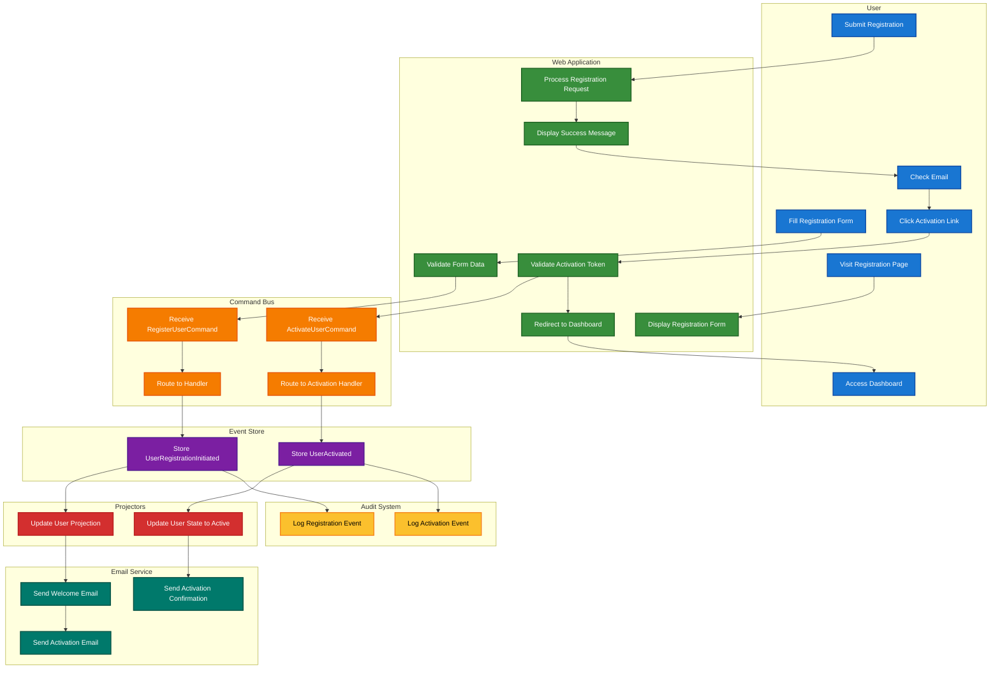

### 4.4.2. Admin-Managed User Registration

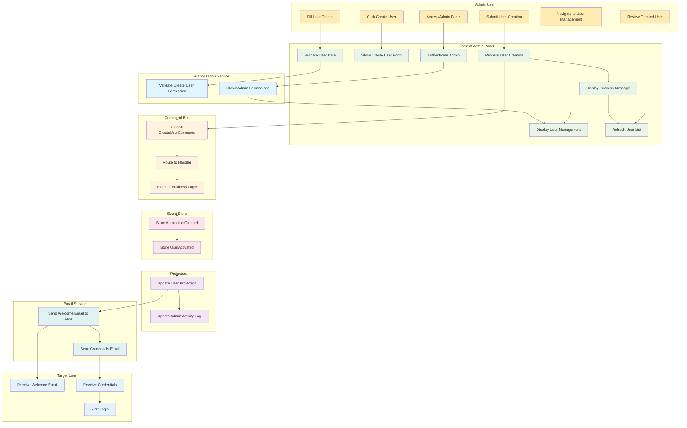

## 4.5. Team Management Swim Lanes

### 4.5.1. Team Creation and Member Addition

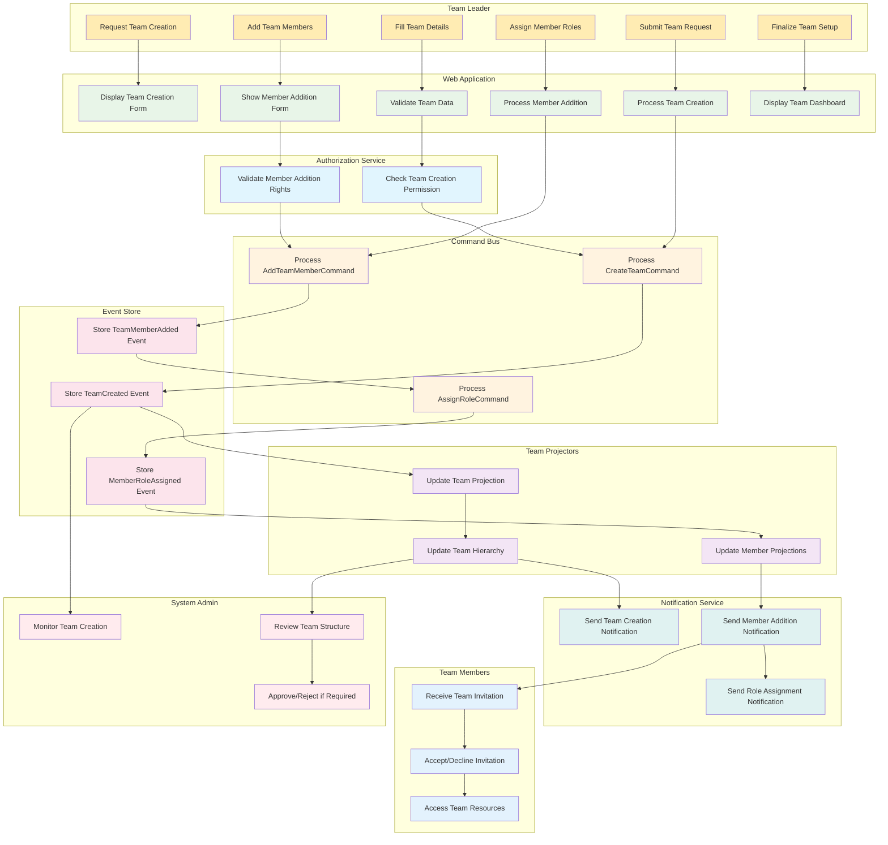

### 4.5.2. Team Hierarchy Management

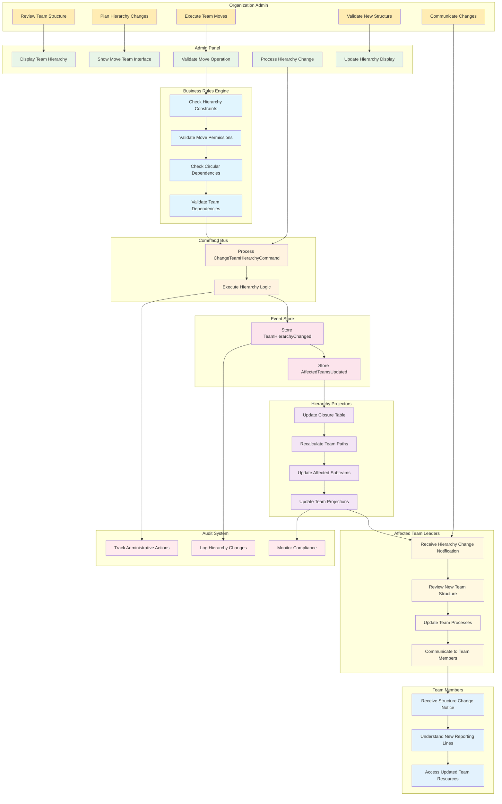

## 4.6. Permission Management Swim Lanes

### 4.6.1. Role-Based Permission Assignment

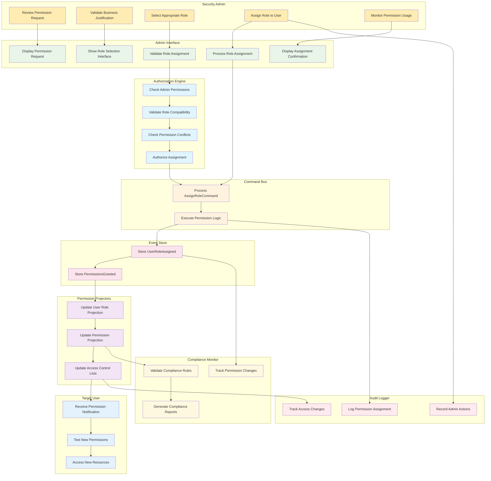

### 4.6.2. Permission Revocation Process

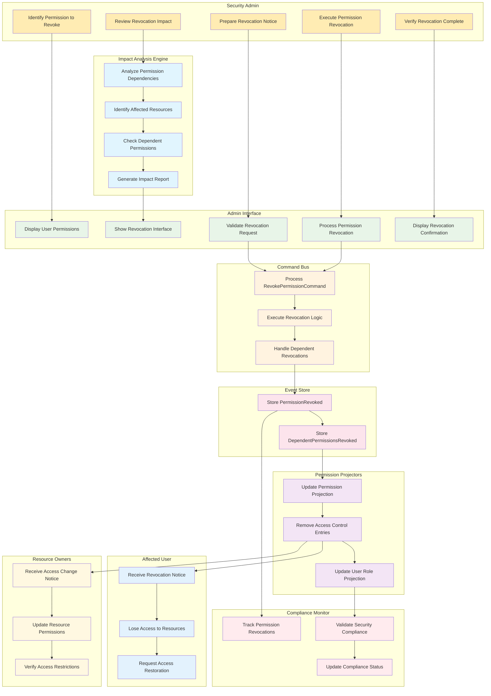

## 4.7. GDPR Compliance Swim Lanes

### 4.7.1. Data Export Request Process

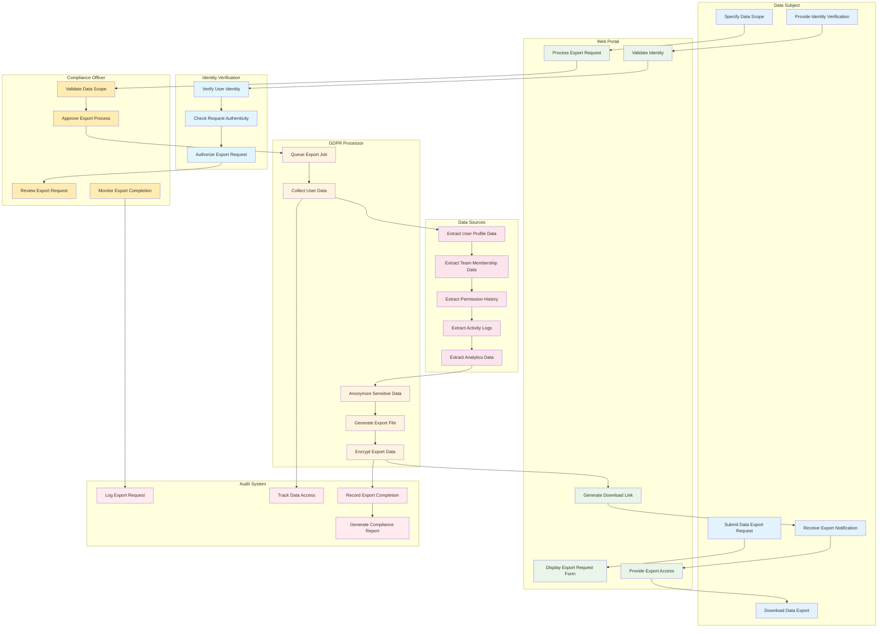

### 4.7.2. Data Deletion Request Process

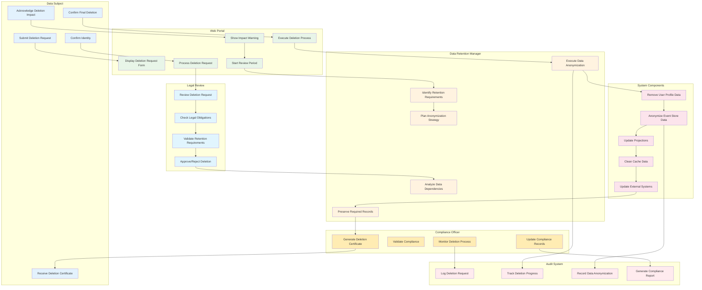

## 4.8. Event-Sourcing and CQRS Swim Lanes

### 4.8.1. Command Processing Workflow

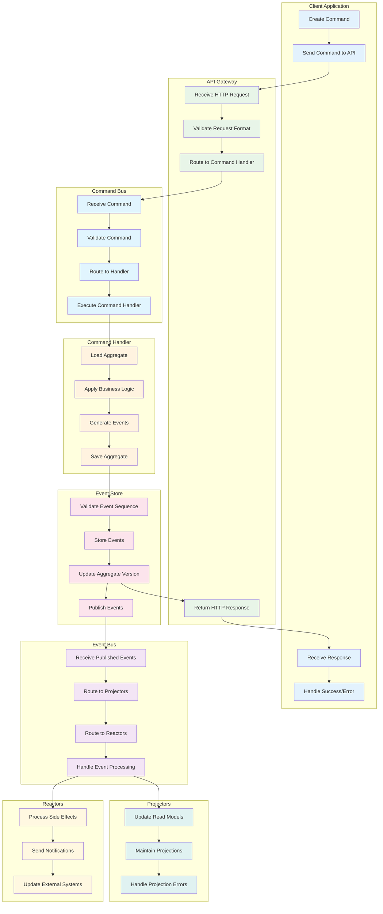

### 4.8.2. Query Processing Workflow

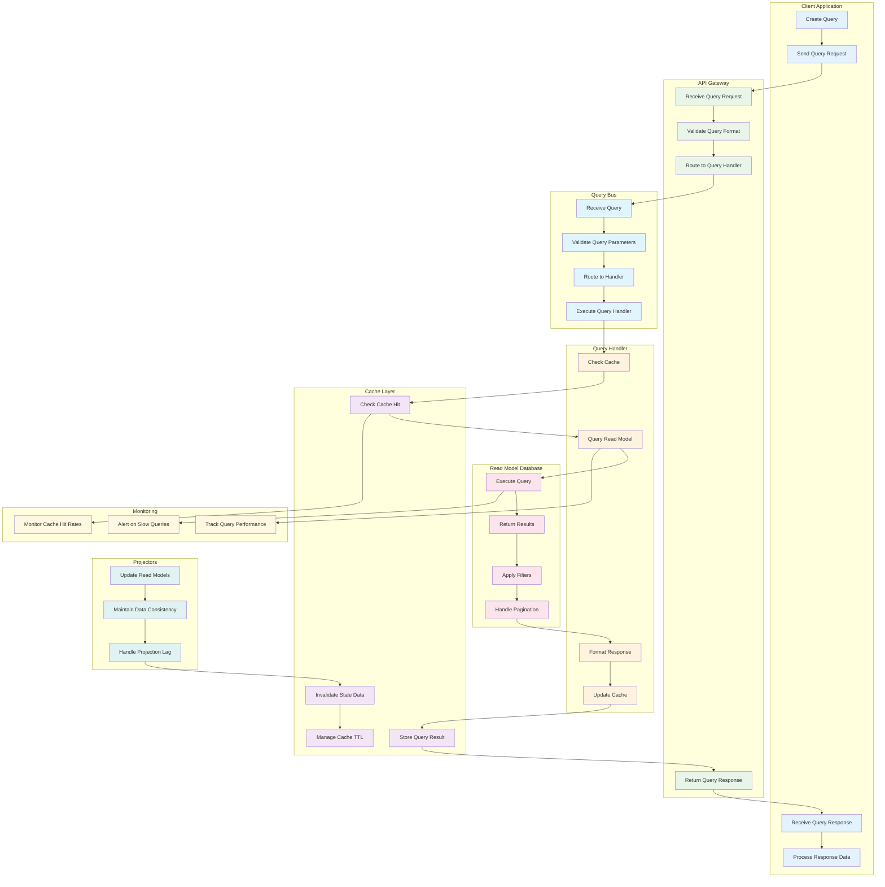

## 4.9. Error Handling and Recovery Swim Lanes

### 4.9.1. System Error Recovery Process

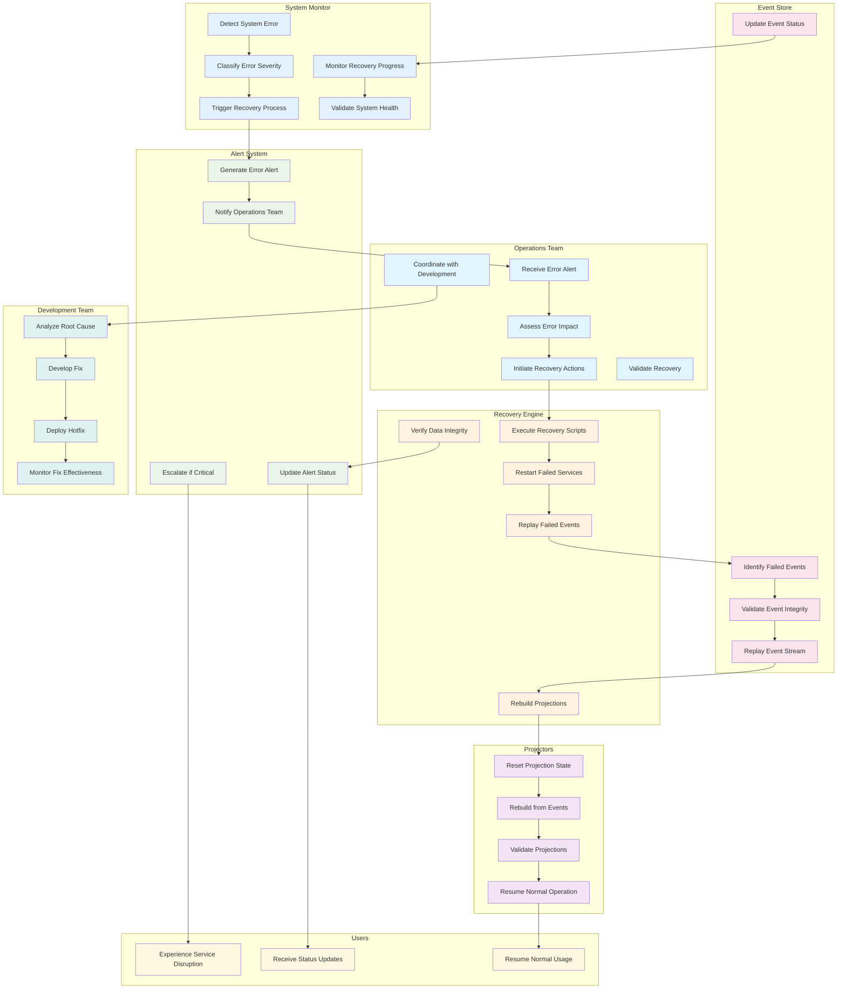

## 4.10. Cross-References

### 4.10.1. Related Diagrams

- **Architectural Diagrams**: See [010-architectural-diagrams.md](010-architectural-diagrams.md) for system architecture overview
- **ERD Diagrams**: See [020-erd-diagrams.md](020-erd-diagrams.md) for detailed entity relationships
- **Business Process Flows**: See [030-business-process-flows.md](030-business-process-flows.md) for detailed process workflows
- **Domain Models**: See [050-domain-models.md](050-domain-models.md) for domain-specific diagrams
- **FSM Diagrams**: See [060-fsm-diagrams.md](060-fsm-diagrams.md) for state machine diagrams

### 4.10.2. Related Documentation

- **User Models**: See [../030-user-models/010-sti-architecture-explained.md](../030-user-models/010-sti-architecture-explained.md)
- **Team Hierarchy**: See [../040-team-hierarchy/010-closure-table-theory.md](../040-team-hierarchy/010-closure-table-theory.md)
- **Permission System**: See [../050-permission-system/010-permission-design.md](../050-permission-system/010-permission-design.md)
- **GDPR Compliance**: See [../060-gdpr-compliance/010-gdpr-implementation.md](../060-gdpr-compliance/010-gdpr-implementation.md)
- **Event-Sourcing Architecture**: See [../070-event-sourcing-cqrs/010-event-sourcing-architecture.md](../070-event-sourcing-cqrs/010-event-sourcing-architecture.md)

## 4.11. Swim Lane Design Principles

### 4.11.1. Actor Responsibility Mapping

- **Clear Boundaries**: Each swim lane represents a distinct actor or system component
- **Responsibility Isolation**: Actions are clearly assigned to appropriate actors
- **Communication Flows**: Interactions between actors are explicitly shown
- **Error Handling**: Error paths and escalation procedures are documented

### 4.11.2. Process Optimization Guidelines

- **Parallel Processing**: Identify opportunities for concurrent execution
- **Bottleneck Identification**: Highlight potential performance constraints
- **Automation Opportunities**: Mark manual processes that could be automated
- **Monitoring Points**: Identify key metrics and monitoring requirements

### 4.11.3. Security and Compliance Considerations

- **Authorization Checkpoints**: Verify permissions at appropriate stages
- **Audit Trail Requirements**: Ensure all actions are properly logged
- **Data Protection**: Implement appropriate data handling procedures
- **Compliance Validation**: Verify regulatory requirement adherence

## 4.12. References and Further Reading

### 4.12.1. Swim Lane Modeling

- [Business Process Modeling Notation (BPMN)](https://www.bpmn.org/)
- [Swim Lane Diagram Best Practices](https://www.lucidchart.com/pages/swim-lane-diagram)
- [Cross-Functional Process Mapping](https://www.isixsigma.com/tools-templates/flowchart/cross-functional-process-map/)

### 4.12.2. Responsibility Assignment

- [RACI Matrix](https://www.projectmanagement.com/articles/328368/RACI-Charts--What-are-They-and-How-to-Use-Them)
- [Responsibility Assignment Matrix](https://www.pmi.org/learning/library/responsibility-assignment-matrix-ram-6382)
- [Organizational Design Principles](https://www.mckinsey.com/business-functions/organization/our-insights/the-organization-blog)

### 4.12.3. Event-Driven Architecture

- [Event-Driven Architecture Patterns](https://microservices.io/patterns/data/event-driven-architecture.html)
- [CQRS and Event Sourcing](https://martinfowler.com/bliki/CQRS.html)
- [Distributed Systems Design](https://www.amazon.com/Designing-Data-Intensive-Applications-Reliable-Maintainable/dp/1449373321)

### 4.12.4. Error Handling and Recovery

- [Resilience Patterns](https://docs.microsoft.com/en-us/azure/architecture/patterns/category/resiliency)
- [Circuit Breaker Pattern](https://martinfowler.com/bliki/CircuitBreaker.html)
- [Bulkhead Pattern](https://docs.microsoft.com/en-us/azure/architecture/patterns/bulkhead)
