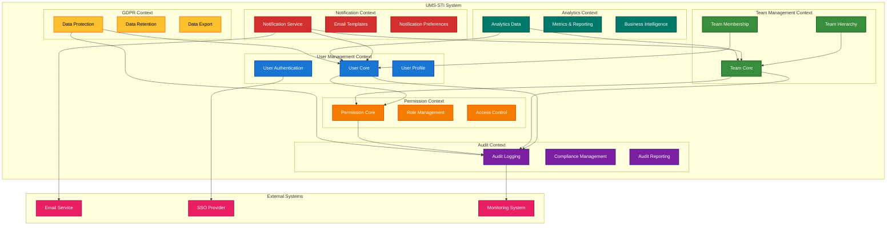

# 5. Domain Models for UMS-STI

## 5.1. Executive Summary

This document provides comprehensive domain model diagrams for the User Management System with Single Table Inheritance (UMS-STI) using Mermaid syntax. These diagrams illustrate the domain-driven design concepts, bounded contexts, domain entities, value objects, and their relationships within the event-sourced, CQRS-based system. Domain models help visualize the business logic structure and ensure proper separation of concerns across different domains.

## 5.2. Learning Objectives

After reviewing this document, readers will understand:

- **5.2.1.** Domain-driven design concepts and bounded contexts
- **5.2.2.** Entity and value object relationships within each domain
- **5.2.3.** Aggregate boundaries and consistency rules
- **5.2.4.** Domain service interactions and dependencies
- **5.2.5.** Cross-domain communication patterns
- **5.2.6.** Event-sourcing integration with domain models

## 5.3. Prerequisite Knowledge

Before reviewing these diagrams, ensure familiarity with:

- **5.3.1.** Domain-driven design principles and patterns
- **5.3.2.** Entity, value object, and aggregate concepts
- **5.3.3.** Bounded context and ubiquitous language
- **5.3.4.** Event-sourcing and CQRS patterns
- **5.3.5.** UMS-STI business requirements and rules

## 5.4. Bounded Context Overview

### 5.4.1. System Bounded Contexts



## 5.5. User Management Domain

### 5.5.1. User Domain Model

```mermaid
classDiagram
    class User {
        <<Entity>>
        +UserId id
        +Email email
        +UserType type
        +UserState state
        +UserProfile profile
        +DateTime createdAt
        +DateTime updatedAt
        +register(email, type, profileData)
        +activate(activatedBy)
        +deactivate(reason)
        +updateProfile(updates)
        +changeEmail(newEmail)
        +changePassword(newPassword)
    }

    class UserId {
        <<Value Object>>
        +String value
        +fromString(value)
        +toString()
        +equals(other)
    }

    class Email {
        <<Value Object>>
        +String value
        +fromString(email)
        +toString()
        +isValid()
        +getDomain()
    }

    class UserType {
        <<Enumeration>>
        STANDARD
        ADMIN
        GUEST
        SYSTEM_USER
    }

    class UserState {
        <<Enumeration>>
        PENDING
        ACTIVE
        INACTIVE
        SUSPENDED
        ARCHIVED
    }

    class UserProfile {
        <<Value Object>>
        +String name
        +String bio
        +String avatarUrl
        +Map~String,String~ customFields
        +DateTime lastLoginAt
        +updateField(field, value)
        +getDisplayName()
    }

    class UserPermission {
        <<Entity>>
        +PermissionId id
        +UserId userId
        +Permission permission
        +PermissionContext context
        +DateTime grantedAt
        +UserId grantedBy
        +DateTime expiresAt
        +isActive()
        +isExpired()
    }

    class Permission {
        <<Value Object>>
        +String name
        +String description
        +PermissionLevel level
        +equals(other)
    }

    class PermissionContext {
        <<Value Object>>
        +String type
        +String resourceId
        +Map~String,String~ metadata
        +matches(other)
    }

    class UserRole {
        <<Entity>>
        +RoleId id
        +UserId userId
        +Role role
        +RoleContext context
        +DateTime assignedAt
        +UserId assignedBy
        +isActive()
    }

    class Role {
        <<Value Object>>
        +String name
        +String description
        +Set~Permission~ permissions
        +hasPermission(permission)
    }

    User ||--|| UserId : "has"
    User ||--|| Email : "has"
    User ||--|| UserType : "has"
    User ||--|| UserState : "has"
    User ||--|| UserProfile : "has"
    User ||--o{ UserPermission : "has"
    User ||--o{ UserRole : "has"
    UserPermission ||--|| Permission : "grants"
    UserPermission ||--|| PermissionContext : "in"
    UserRole ||--|| Role : "assigns"
    Role ||--o{ Permission : "contains"

    classDef entity fill:#e3f2fd
    classDef valueObject fill:#e8f5e8
    classDef enumeration fill:#fff3e0

    class User,UserPermission,UserRole entity
    class UserId,Email,UserProfile,Permission,PermissionContext,Role valueObject
    class UserType,UserState enumeration
```

### 5.5.2. User Authentication Domain

```mermaid
classDiagram
    class UserSession {
        <<Entity>>
        +SessionId id
        +UserId userId
        +String ipAddress
        +String userAgent
        +AuthenticationMethod method
        +DateTime startedAt
        +DateTime lastActivityAt
        +DateTime expiresAt
        +SessionState state
        +isActive()
        +extend()
        +terminate()
    }

    class SessionId {
        <<Value Object>>
        +String value
        +generate()
        +fromString(value)
        +toString()
    }

    class AuthenticationMethod {
        <<Enumeration>>
        PASSWORD
        SSO
        API_TOKEN
        TWO_FACTOR
    }

    class SessionState {
        <<Enumeration>>
        ACTIVE
        EXPIRED
        TERMINATED
        SUSPENDED
    }

    class LoginAttempt {
        <<Entity>>
        +AttemptId id
        +String email
        +String ipAddress
        +String userAgent
        +AuthenticationMethod method
        +AttemptResult result
        +String failureReason
        +DateTime attemptedAt
        +isSuccessful()
    }

    class AttemptResult {
        <<Enumeration>>
        SUCCESS
        INVALID_CREDENTIALS
        ACCOUNT_LOCKED
        ACCOUNT_INACTIVE
        TOO_MANY_ATTEMPTS
    }

    class PasswordPolicy {
        <<Value Object>>
        +Integer minLength
        +Integer maxLength
        +Boolean requireUppercase
        +Boolean requireLowercase
        +Boolean requireNumbers
        +Boolean requireSpecialChars
        +Integer maxAge
        +validate(password)
        +calculateStrength(password)
    }

    class TwoFactorAuth {
        <<Entity>>
        +TwoFactorId id
        +UserId userId
        +TwoFactorMethod method
        +String secret
        +Boolean isEnabled
        +DateTime enabledAt
        +generateCode()
        +validateCode(code)
    }

    class TwoFactorMethod {
        <<Enumeration>>
        TOTP
        SMS
        EMAIL
        BACKUP_CODES
    }

    UserSession ||--|| SessionId : "has"
    UserSession ||--|| AuthenticationMethod : "uses"
    UserSession ||--|| SessionState : "has"
    LoginAttempt ||--|| AttemptResult : "has"
    LoginAttempt ||--|| AuthenticationMethod : "uses"
    TwoFactorAuth ||--|| TwoFactorMethod : "uses"

    classDef entity fill:#e3f2fd
    classDef valueObject fill:#e8f5e8
    classDef enumeration fill:#fff3e0

    class UserSession,LoginAttempt,TwoFactorAuth entity
    class SessionId,PasswordPolicy valueObject
    class AuthenticationMethod,SessionState,AttemptResult,TwoFactorMethod enumeration
```

## 5.6. Team Management Domain

### 5.6.1. Team Core Domain

```mermaid
classDiagram
    class Team {
        <<Entity>>
        +TeamId id
        +TeamName name
        +TeamId parentId
        +TeamType type
        +TeamState state
        +TeamSettings settings
        +UserId createdBy
        +DateTime createdAt
        +DateTime updatedAt
        +create(name, parentId, createdBy)
        +updateName(newName)
        +changeParent(newParentId)
        +archive(reason)
        +addMember(userId, role)
        +removeMember(userId, reason)
    }

    class TeamId {
        <<Value Object>>
        +String value
        +generate()
        +fromString(value)
        +toString()
        +equals(other)
    }

    class TeamName {
        <<Value Object>>
        +String value
        +fromString(name)
        +toString()
        +isValid()
        +maxLength()
    }

    class TeamType {
        <<Enumeration>>
        DEPARTMENT
        PROJECT
        WORKING_GROUP
        COMMITTEE
        TEMPORARY
    }

    class TeamState {
        <<Enumeration>>
        ACTIVE
        INACTIVE
        ARCHIVED
        SUSPENDED
    }

    class TeamSettings {
        <<Value Object>>
        +Boolean isPublic
        +Boolean allowSelfJoin
        +Integer maxMembers
        +Map~String,String~ customSettings
        +update(key, value)
        +get(key)
    }

    class TeamMember {
        <<Entity>>
        +MemberId id
        +TeamId teamId
        +UserId userId
        +TeamRole role
        +MembershipState state
        +DateTime joinedAt
        +UserId addedBy
        +DateTime leftAt
        +String leaveReason
        +changeRole(newRole)
        +deactivate(reason)
    }

    class TeamRole {
        <<Enumeration>>
        MEMBER
        LEADER
        ADMIN
        OBSERVER
    }

    class MembershipState {
        <<Enumeration>>
        ACTIVE
        INACTIVE
        PENDING
        REMOVED
    }

    class TeamHierarchy {
        <<Entity>>
        +HierarchyId id
        +TeamId ancestorId
        +TeamId descendantId
        +Integer depth
        +String path
        +DateTime createdAt
        +isDirectChild()
        +getLevel()
    }

    Team ||--|| TeamId : "has"
    Team ||--|| TeamName : "has"
    Team ||--|| TeamType : "has"
    Team ||--|| TeamState : "has"
    Team ||--|| TeamSettings : "has"
    Team ||--o{ TeamMember : "contains"
    Team ||--o{ TeamHierarchy : "participates in"
    TeamMember ||--|| TeamRole : "has"
    TeamMember ||--|| MembershipState : "has"

    classDef entity fill:#e3f2fd
    classDef valueObject fill:#e8f5e8
    classDef enumeration fill:#fff3e0

    class Team,TeamMember,TeamHierarchy entity
    class TeamId,TeamName,TeamSettings valueObject
    class TeamType,TeamState,TeamRole,MembershipState enumeration
```

### 5.6.2. Team Hierarchy Domain

```mermaid
classDiagram
    class HierarchyManager {
        <<Domain Service>>
        +moveTeam(teamId, newParentId)
        +calculatePath(teamId)
        +getAncestors(teamId)
        +getDescendants(teamId)
        +validateMove(teamId, newParentId)
        +detectCircularReference(teamId, parentId)
    }

    class TeamPath {
        <<Value Object>>
        +List~TeamId~ path
        +Integer depth
        +String pathString
        +fromTeamIds(teamIds)
        +contains(teamId)
        +getParent()
        +getRoot()
    }

    class HierarchyConstraints {
        <<Value Object>>
        +Integer maxDepth
        +Integer maxChildren
        +Set~TeamType~ allowedChildTypes
        +Boolean allowCircularReferences
        +validate(operation)
    }

    class TeamTree {
        <<Aggregate>>
        +TeamId rootId
        +Map~TeamId,Team~ teams
        +Map~TeamId,Set~TeamId~~ children
        +Map~TeamId,TeamId~ parents
        +addTeam(team, parentId)
        +removeTeam(teamId)
        +moveTeam(teamId, newParentId)
        +getSubtree(teamId)
        +validateStructure()
    }

    class HierarchyEvent {
        <<Domain Event>>
        +EventId id
        +TeamId teamId
        +TeamId oldParentId
        +TeamId newParentId
        +List~TeamId~ affectedTeams
        +DateTime occurredAt
        +UserId triggeredBy
    }

    class ClosureTable {
        <<Value Object>>
        +TeamId ancestor
        +TeamId descendant
        +Integer depth
        +DateTime createdAt
        +isDirectRelation()
        +isSelfReference()
    }

    HierarchyManager --> TeamPath : "calculates"
    HierarchyManager --> HierarchyConstraints : "validates against"
    HierarchyManager --> TeamTree : "manages"
    TeamTree --> HierarchyEvent : "emits"
    TeamTree --> ClosureTable : "maintains"

    classDef domainService fill:#e3f2fd
    classDef valueObject fill:#e8f5e8
    classDef aggregate fill:#fff3e0
    classDef domainEvent fill:#fce4ec

    class HierarchyManager domainService
    class TeamPath,HierarchyConstraints,ClosureTable valueObject
    class TeamTree aggregate
    class HierarchyEvent domainEvent
```

## 5.7. Permission Management Domain

### 5.7.1. Permission Core Domain

```mermaid
classDiagram
    class PermissionManager {
        <<Domain Service>>
        +grantPermission(userId, permission, context)
        +revokePermission(userId, permission, context)
        +checkPermission(userId, permission, context)
        +getEffectivePermissions(userId)
        +resolveConflicts(permissions)
    }

    class PermissionSet {
        <<Value Object>>
        +Set~Permission~ permissions
        +PermissionContext context
        +DateTime effectiveFrom
        +DateTime effectiveUntil
        +contains(permission)
        +isEffective()
        +merge(other)
    }

    class PermissionRule {
        <<Entity>>
        +RuleId id
        +String name
        +RuleType type
        +PermissionCondition condition
        +PermissionAction action
        +Integer priority
        +Boolean isActive
        +evaluate(context)
        +matches(permission)
    }

    class RuleType {
        <<Enumeration>>
        ALLOW
        DENY
        CONDITIONAL
        INHERITED
    }

    class PermissionCondition {
        <<Value Object>>
        +String expression
        +Map~String,Object~ parameters
        +evaluate(context)
        +isValid()
    }

    class PermissionAction {
        <<Value Object>>
        +ActionType type
        +Set~Permission~ permissions
        +String reason
        +execute()
    }

    class ActionType {
        <<Enumeration>>
        GRANT
        REVOKE
        MODIFY
        INHERIT
    }

    class AccessControlList {
        <<Entity>>
        +AclId id
        +String resourceType
        +String resourceId
        +List~AclEntry~ entries
        +UserId ownerId
        +DateTime createdAt
        +addEntry(entry)
        +removeEntry(entryId)
        +checkAccess(userId, permission)
    }

    class AclEntry {
        <<Value Object>>
        +EntryId id
        +PrincipalType principalType
        +String principalId
        +Permission permission
        +AccessType accessType
        +DateTime createdAt
        +matches(principal, permission)
    }

    class PrincipalType {
        <<Enumeration>>
        USER
        ROLE
        TEAM
        GROUP
    }

    class AccessType {
        <<Enumeration>>
        ALLOW
        DENY
        INHERIT
    }

    PermissionManager --> PermissionSet : "manages"
    PermissionManager --> PermissionRule : "applies"
    PermissionRule ||--|| RuleType : "has"
    PermissionRule ||--|| PermissionCondition : "has"
    PermissionRule ||--|| PermissionAction : "executes"
    PermissionAction ||--|| ActionType : "has"
    AccessControlList ||--o{ AclEntry : "contains"
    AclEntry ||--|| PrincipalType : "has"
    AclEntry ||--|| AccessType : "has"

    classDef domainService fill:#e3f2fd
    classDef entity fill:#e8f5e8
    classDef valueObject fill:#fff3e0
    classDef enumeration fill:#fce4ec

    class PermissionManager domainService
    class PermissionRule,AccessControlList entity
    class PermissionSet,PermissionCondition,PermissionAction,AclEntry valueObject
    class RuleType,ActionType,PrincipalType,AccessType enumeration
```

### 5.7.2. Role Management Domain

```mermaid
classDiagram
    class RoleManager {
        <<Domain Service>>
        +createRole(name, permissions)
        +assignRole(userId, roleId, context)
        +revokeRole(userId, roleId)
        +getEffectiveRoles(userId)
        +calculatePermissions(roles)
    }

    class RoleDefinition {
        <<Entity>>
        +RoleId id
        +RoleName name
        +String description
        +RoleType type
        +Set~Permission~ permissions
        +RoleHierarchy hierarchy
        +Boolean isActive
        +DateTime createdAt
        +addPermission(permission)
        +removePermission(permission)
        +inheritsFrom(parentRole)
    }

    class RoleName {
        <<Value Object>>
        +String value
        +fromString(name)
        +toString()
        +isValid()
        +normalize()
    }

    class RoleType {
        <<Enumeration>>
        SYSTEM
        ORGANIZATIONAL
        FUNCTIONAL
        TEMPORARY
        CUSTOM
    }

    class RoleHierarchy {
        <<Value Object>>
        +RoleId parentRole
        +Set~RoleId~ childRoles
        +Integer level
        +addChild(roleId)
        +removeChild(roleId)
        +getAncestors()
        +getDescendants()
    }

    class RoleAssignment {
        <<Entity>>
        +AssignmentId id
        +UserId userId
        +RoleId roleId
        +AssignmentContext context
        +AssignmentState state
        +DateTime assignedAt
        +UserId assignedBy
        +DateTime expiresAt
        +isActive()
        +isExpired()
        +extend(newExpiryDate)
    }

    class AssignmentContext {
        <<Value Object>>
        +String scope
        +String resourceType
        +String resourceId
        +Map~String,String~ metadata
        +matches(other)
        +isGlobal()
    }

    class AssignmentState {
        <<Enumeration>>
        ACTIVE
        INACTIVE
        EXPIRED
        REVOKED
        SUSPENDED
    }

    class RoleConflict {
        <<Value Object>>
        +ConflictType type
        +Set~RoleId~ conflictingRoles
        +String description
        +ConflictSeverity severity
        +resolve()
    }

    class ConflictType {
        <<Enumeration>>
        PERMISSION_OVERLAP
        HIERARCHY_VIOLATION
        MUTUAL_EXCLUSION
        TEMPORAL_CONFLICT
    }

    class ConflictSeverity {
        <<Enumeration>>
        LOW
        MEDIUM
        HIGH
        CRITICAL
    }

    RoleManager --> RoleDefinition : "manages"
    RoleManager --> RoleAssignment : "creates"
    RoleManager --> RoleConflict : "detects"
    RoleDefinition ||--|| RoleName : "has"
    RoleDefinition ||--|| RoleType : "has"
    RoleDefinition ||--|| RoleHierarchy : "has"
    RoleAssignment ||--|| AssignmentContext : "has"
    RoleAssignment ||--|| AssignmentState : "has"
    RoleConflict ||--|| ConflictType : "has"
    RoleConflict ||--|| ConflictSeverity : "has"

    classDef domainService fill:#e3f2fd
    classDef entity fill:#e8f5e8
    classDef valueObject fill:#fff3e0
    classDef enumeration fill:#fce4ec

    class RoleManager domainService
    class RoleDefinition,RoleAssignment entity
    class RoleName,RoleHierarchy,AssignmentContext,RoleConflict valueObject
    class RoleType,AssignmentState,ConflictType,ConflictSeverity enumeration
```

## 5.8. Audit and Compliance Domain

### 5.8.1. Audit Domain Model

```mermaid
classDiagram
    class AuditLogger {
        <<Domain Service>>
        +logEvent(event, context)
        +logUserAction(userId, action, resource)
        +logSystemEvent(event, metadata)
        +logSecurityEvent(event, severity)
        +queryAuditTrail(criteria)
    }

    class AuditEvent {
        <<Entity>>
        +EventId id
        +EventType type
        +String eventName
        +UserId actorId
        +String resourceType
        +String resourceId
        +EventSeverity severity
        +Map~String,Object~ eventData
        +String ipAddress
        +String userAgent
        +DateTime occurredAt
        +getDescription()
        +isSensitive()
    }

    class EventType {
        <<Enumeration>>
        USER_ACTION
        SYSTEM_EVENT
        SECURITY_EVENT
        COMPLIANCE_EVENT
        ERROR_EVENT
    }

    class EventSeverity {
        <<Enumeration>>
        INFO
        WARNING
        ERROR
        CRITICAL
        SECURITY
    }

    class AuditTrail {
        <<Aggregate>>
        +TrailId id
        +String resourceType
        +String resourceId
        +List~AuditEvent~ events
        +DateTime startDate
        +DateTime endDate
        +addEvent(event)
        +getEventsByType(type)
        +getEventsByActor(actorId)
        +generateReport()
    }

    class ComplianceRule {
        <<Entity>>
        +RuleId id
        +String name
        +ComplianceFramework framework
        +String requirement
        +RuleCondition condition
        +RetentionPolicy retention
        +Boolean isActive
        +evaluate(auditEvent)
        +getViolations()
    }

    class ComplianceFramework {
        <<Enumeration>>
        GDPR
        SOX
        HIPAA
        PCI_DSS
        ISO_27001
        CUSTOM
    }

    class RuleCondition {
        <<Value Object>>
        +String expression
        +Map~String,Object~ parameters
        +evaluate(event)
        +isValid()
    }

    class RetentionPolicy {
        <<Value Object>>
        +Duration retentionPeriod
        +RetentionAction action
        +Boolean isActive
        +shouldRetain(event)
        +getExpiryDate(event)
    }

    class RetentionAction {
        <<Enumeration>>
        DELETE
        ARCHIVE
        ANONYMIZE
        ENCRYPT
    }

    AuditLogger --> AuditEvent : "creates"
    AuditLogger --> AuditTrail : "maintains"
    AuditEvent ||--|| EventType : "has"
    AuditEvent ||--|| EventSeverity : "has"
    AuditTrail ||--o{ AuditEvent : "contains"
    ComplianceRule ||--|| ComplianceFramework : "belongs to"
    ComplianceRule ||--|| RuleCondition : "has"
    ComplianceRule ||--|| RetentionPolicy : "has"
    RetentionPolicy ||--|| RetentionAction : "specifies"

    classDef domainService fill:#e3f2fd
    classDef entity fill:#e8f5e8
    classDef aggregate fill:#fff3e0
    classDef valueObject fill:#fce4ec
    classDef enumeration fill:#f3e5f5

    class AuditLogger domainService
    class AuditEvent,ComplianceRule entity
    class AuditTrail aggregate
    class RuleCondition,RetentionPolicy valueObject
    class EventType,EventSeverity,ComplianceFramework,RetentionAction enumeration
```

## 5.9. GDPR Compliance Domain

### 5.9.1. Data Protection Domain

```mermaid
classDiagram
    class DataProtectionManager {
        <<Domain Service>>
        +processDataRequest(request)
        +exportUserData(userId, scope)
        +deleteUserData(userId, scope)
        +anonymizeData(userId)
        +validateRetention(data)
    }

    class DataSubjectRequest {
        <<Entity>>
        +RequestId id
        +UserId subjectId
        +RequestType type
        +RequestScope scope
        +RequestState state
        +String justification
        +DateTime requestedAt
        +DateTime processedAt
        +UserId processedBy
        +process()
        +approve()
        +reject(reason)
    }

    class RequestType {
        <<Enumeration>>
        ACCESS
        RECTIFICATION
        ERASURE
        PORTABILITY
        RESTRICTION
        OBJECTION
    }

    class RequestScope {
        <<Value Object>>
        +Set~String~ dataTypes
        +DateRange dateRange
        +Set~String~ systems
        +Boolean includeBackups
        +covers(dataType)
        +isComplete()
    }

    class RequestState {
        <<Enumeration>>
        SUBMITTED
        UNDER_REVIEW
        APPROVED
        REJECTED
        IN_PROGRESS
        COMPLETED
        CANCELLED
    }

    class PersonalData {
        <<Entity>>
        +DataId id
        +UserId subjectId
        +DataCategory category
        +String dataType
        +Object dataValue
        +DataClassification classification
        +LegalBasis legalBasis
        +DateTime collectedAt
        +DateTime expiresAt
        +isPersonal()
        +isSensitive()
        +canBeProcessed()
    }

    class DataCategory {
        <<Enumeration>>
        IDENTITY
        CONTACT
        DEMOGRAPHIC
        BEHAVIORAL
        FINANCIAL
        HEALTH
        BIOMETRIC
        LOCATION
    }

    class DataClassification {
        <<Enumeration>>
        PUBLIC
        INTERNAL
        CONFIDENTIAL
        RESTRICTED
        SENSITIVE
    }

    class LegalBasis {
        <<Enumeration>>
        CONSENT
        CONTRACT
        LEGAL_OBLIGATION
        VITAL_INTERESTS
        PUBLIC_TASK
        LEGITIMATE_INTERESTS
    }

    class DataRetention {
        <<Value Object>>
        +Duration retentionPeriod
        +RetentionReason reason
        +Boolean isActive
        +DateTime startDate
        +DateTime endDate
        +isExpired()
        +extend(period)
    }

    class RetentionReason {
        <<Enumeration>>
        LEGAL_REQUIREMENT
        BUSINESS_NEED
        CONSENT_BASED
        CONTRACT_BASED
        AUDIT_REQUIREMENT
    }

    class AnonymizationStrategy {
        <<Value Object>>
        +AnonymizationMethod method
        +Map~String,String~ fieldMappings
        +Boolean preserveStructure
        +apply(data)
        +isReversible()
    }

    class AnonymizationMethod {
        <<Enumeration>>
        DELETION
        MASKING
        GENERALIZATION
        PERTURBATION
        SYNTHETIC_DATA
    }

    DataProtectionManager --> DataSubjectRequest : "processes"
    DataProtectionManager --> PersonalData : "manages"
    DataSubjectRequest ||--|| RequestType : "has"
    DataSubjectRequest ||--|| RequestScope : "has"
    DataSubjectRequest ||--|| RequestState : "has"
    PersonalData ||--|| DataCategory : "belongs to"
    PersonalData ||--|| DataClassification : "has"
    PersonalData ||--|| LegalBasis : "has"
    PersonalData ||--|| DataRetention : "has"
    DataRetention ||--|| RetentionReason : "has"
    DataProtectionManager --> AnonymizationStrategy : "uses"
    AnonymizationStrategy ||--|| AnonymizationMethod : "uses"

    classDef domainService fill:#e3f2fd
    classDef entity fill:#e8f5e8
    classDef valueObject fill:#fff3e0
    classDef enumeration fill:#fce4ec

    class DataProtectionManager domainService
    class DataSubjectRequest,PersonalData entity
    class RequestScope,DataRetention,AnonymizationStrategy valueObject
    class RequestType,RequestState,DataCategory,DataClassification,LegalBasis,RetentionReason,AnonymizationMethod enumeration
```

## 5.10. Event-Sourcing Integration

### 5.10.1. Domain Events Model

```mermaid
classDiagram
    class DomainEvent {
        <<Abstract>>
        +EventId id
        +String aggregateId
        +Integer aggregateVersion
        +DateTime occurredAt
        +UserId triggeredBy
        +Map~String,Object~ metadata
        +getEventType()
        +getPayload()
    }

    class UserDomainEvent {
        <<Abstract>>
        +UserId userId
        +UserEventType eventType
    }

    class TeamDomainEvent {
        <<Abstract>>
        +TeamId teamId
        +TeamEventType eventType
    }

    class PermissionDomainEvent {
        <<Abstract>>
        +UserId userId
        +Permission permission
        +PermissionEventType eventType
    }

    class UserRegistered {
        +Email email
        +UserType userType
        +Map~String,Object~ profileData
    }

    class UserActivated {
        +UserId activatedBy
        +String activationMethod
    }

    class TeamCreated {
        +TeamName name
        +TeamId parentId
        +TeamType type
        +UserId createdBy
    }

    class TeamMemberAdded {
        +UserId memberId
        +TeamRole role
        +UserId addedBy
    }

    class PermissionGranted {
        +Permission permission
        +PermissionContext context
        +UserId grantedBy
        +DateTime expiresAt
    }

    class EventStore {
        <<Repository>>
        +append(events)
        +getEvents(aggregateId)
        +getEventsSince(timestamp)
        +replay(aggregateId)
    }

    class EventBus {
        <<Domain Service>>
        +publish(event)
        +subscribe(eventType, handler)
        +unsubscribe(eventType, handler)
    }

    class EventHandler {
        <<Interface>>
        +handle(event)
        +canHandle(eventType)
    }

    DomainEvent <|-- UserDomainEvent
    DomainEvent <|-- TeamDomainEvent
    DomainEvent <|-- PermissionDomainEvent
    UserDomainEvent <|-- UserRegistered
    UserDomainEvent <|-- UserActivated
    TeamDomainEvent <|-- TeamCreated
    TeamDomainEvent <|-- TeamMemberAdded
    PermissionDomainEvent <|-- PermissionGranted

    EventStore --> DomainEvent : "stores"
    EventBus --> DomainEvent : "publishes"
    EventBus --> EventHandler : "notifies"

    classDef abstractClass fill:#e3f2fd
    classDef concreteEvent fill:#e8f5e8
    classDef repository fill:#fff3e0
    classDef domainService fill:#fce4ec
    classDef interface fill:#f3e5f5

    class DomainEvent,UserDomainEvent,TeamDomainEvent,PermissionDomainEvent abstractClass
    class UserRegistered,UserActivated,TeamCreated,TeamMemberAdded,PermissionGranted concreteEvent
    class EventStore repository
    class EventBus domainService
    class EventHandler interface
```

## 5.11. Cross-References

### 5.11.1. Related Diagrams

- **Architectural Diagrams**: See [010-architectural-diagrams.md](010-architectural-diagrams.md) for system architecture overview
- **ERD Diagrams**: See [020-erd-diagrams.md](020-erd-diagrams.md) for detailed entity relationships
- **Business Process Flows**: See [030-business-process-flows.md](030-business-process-flows.md) for process workflows
- **Swim Lanes**: See [040-swim-lanes.md](040-swim-lanes.md) for responsibility mapping
- **FSM Diagrams**: See [060-fsm-diagrams.md](060-fsm-diagrams.md) for state machine diagrams

### 5.11.2. Related Documentation

- **User Models**: See [../030-user-models/010-sti-architecture-explained.md](../030-user-models/010-sti-architecture-explained.md)
- **Team Hierarchy**: See [../040-team-hierarchy/010-closure-table-theory.md](../040-team-hierarchy/010-closure-table-theory.md)
- **Permission System**: See [../050-permission-system/010-permission-design.md](../050-permission-system/010-permission-design.md)
- **GDPR Compliance**: See [../060-gdpr-compliance/010-gdpr-implementation.md](../060-gdpr-compliance/010-gdpr-implementation.md)
- **Event-Sourcing Architecture**: See [../070-event-sourcing-cqrs/010-event-sourcing-architecture.md](../070-event-sourcing-cqrs/010-event-sourcing-architecture.md)

## 5.12. Domain Design Principles

### 5.12.1. Bounded Context Guidelines

- **Context Autonomy**: Each bounded context should be self-contained with minimal dependencies
- **Ubiquitous Language**: Consistent terminology within each context
- **Anti-Corruption Layer**: Protect domain models from external system influences
- **Context Mapping**: Clear relationships and communication patterns between contexts

### 5.12.2. Aggregate Design Rules

- **Consistency Boundaries**: Aggregates enforce business invariants
- **Transaction Boundaries**: One aggregate per transaction
- **Reference by Identity**: Aggregates reference each other by ID, not direct references
- **Small Aggregates**: Keep aggregates focused and minimal

### 5.12.3. Domain Service Guidelines

- **Stateless Operations**: Domain services should not maintain state
- **Business Logic**: Encapsulate complex business rules that don't belong to entities
- **Coordination**: Orchestrate operations across multiple aggregates
- **Interface Segregation**: Focused, single-purpose service interfaces

## 5.13. References and Further Reading

### 5.13.1. Domain-Driven Design

- [Domain-Driven Design - Eric Evans](https://domainlanguage.com/ddd/)
- [Implementing Domain-Driven Design - Vaughn Vernon](https://vaughnvernon.co/?page_id=168)
- [Domain-Driven Design Reference - Eric Evans](https://domainlanguage.com/wp-content/uploads/2016/05/DDD_Reference_2015-03.pdf)

### 5.13.2. Bounded Context Design

- [Bounded Context - Martin Fowler](https://martinfowler.com/bliki/BoundedContext.html)
- [Context Mapping - Alberto Brandolini](https://www.infoq.com/articles/ddd-contextmapping/)
- [Strategic Domain-Driven Design](https://vaadin.com/learn/tutorials/ddd/strategic_domain_driven_design)

### 5.13.3. Aggregate Design

- [Effective Aggregate Design - Vaughn Vernon](https://dddcommunity.org/library/vernon_2011/)
- [Aggregate Design Canvas](https://github.com/ddd-crew/aggregate-design-canvas)
- [Domain Events - Udi Dahan](https://udidahan.com/2009/06/14/domain-events-salvation/)

### 5.13.4. Event-Sourcing Integration

- [Event Sourcing - Martin Fowler](https://martinfowler.com/eaaDev/EventSourcing.html)
- [Domain Events vs Integration Events](https://docs.microsoft.com/en-us/dotnet/architecture/microservices/microservice-ddd-cqrs-patterns/domain-events-design-implementation)
- [Event Storming](https://www.eventstorming.com/)
