# 6. Finite State Machine Diagrams for UMS-STI

## 6.1. Executive Summary

This document provides comprehensive Finite State Machine (FSM) diagrams for the User Management System with Single Table Inheritance (UMS-STI) using Mermaid syntax. These diagrams illustrate the state transitions, lifecycle management, and business rules that govern entity states within the event-sourced, CQRS-based system with consistent state management across User and Team entities.

## 6.2. Learning Objectives

After reviewing this document, readers will understand:

- **6.2.1.** User lifecycle state transitions and business rules
- **6.2.2.** Team state management and hierarchy implications
- **6.2.3.** Permission and role assignment state flows
- **6.2.4.** Event-driven state transition triggers
- **6.2.5.** Cross-entity state consistency requirements
- **6.2.6.** Error handling and recovery state patterns

## 6.3. Prerequisite Knowledge

Before reviewing these diagrams, ensure familiarity with:

- **6.3.1.** Finite state machine concepts and notation
- **6.3.2.** Event-sourcing state management patterns
- **6.3.3.** CQRS command and event handling
- **6.3.4.** Business rule validation and constraints
- **6.3.5.** Entity lifecycle management principles

## 6.4. User Entity State Machines

### 6.4.1. Core User Lifecycle FSM

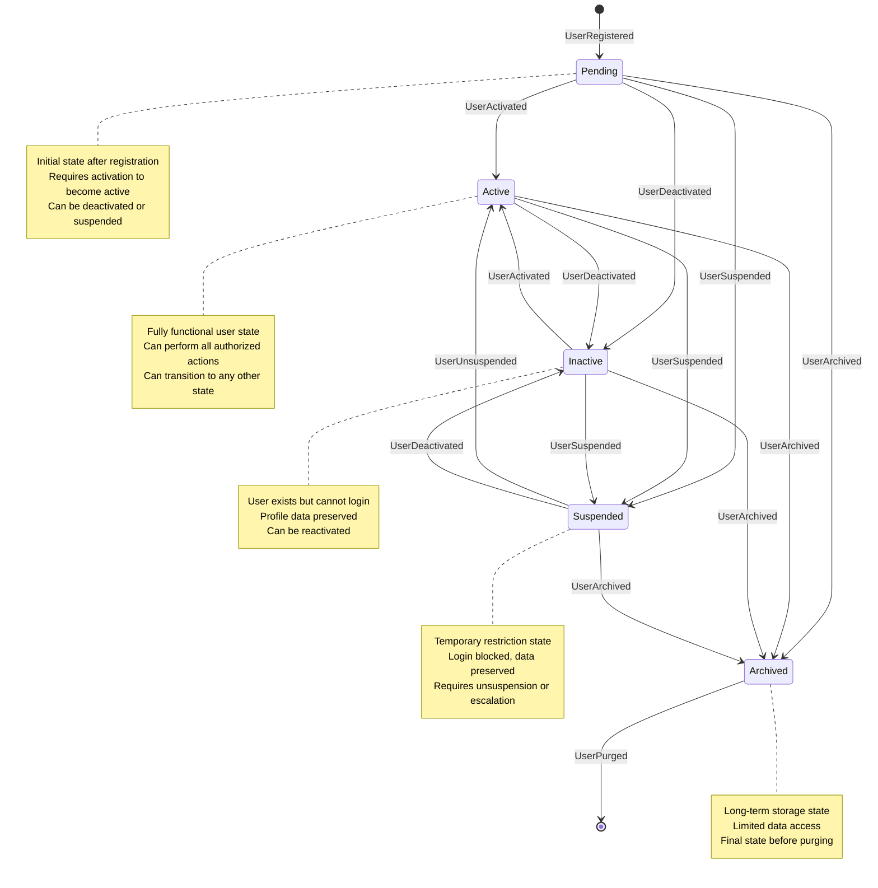

### 6.4.2. User Type-Specific State Machines

#### 6.4.2.1. Standard User FSM

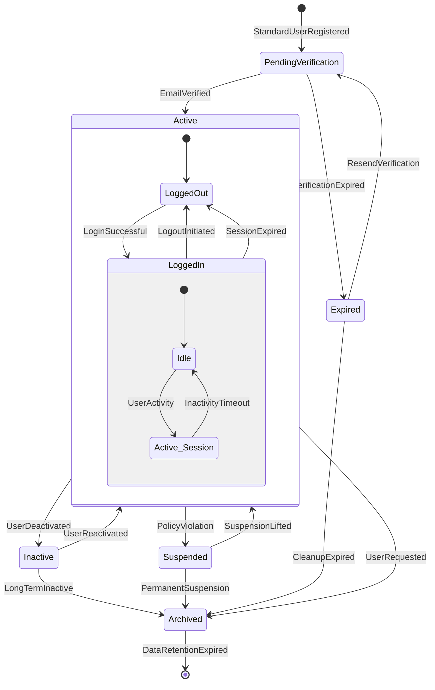

#### 6.4.2.2. Admin User FSM

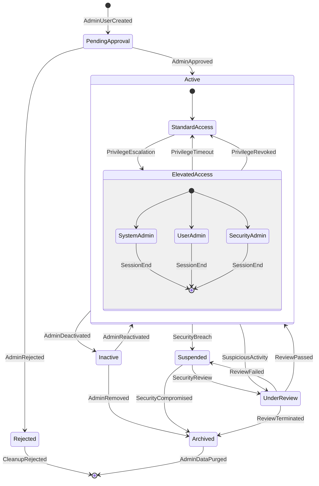

#### 6.4.2.3. Guest User FSM

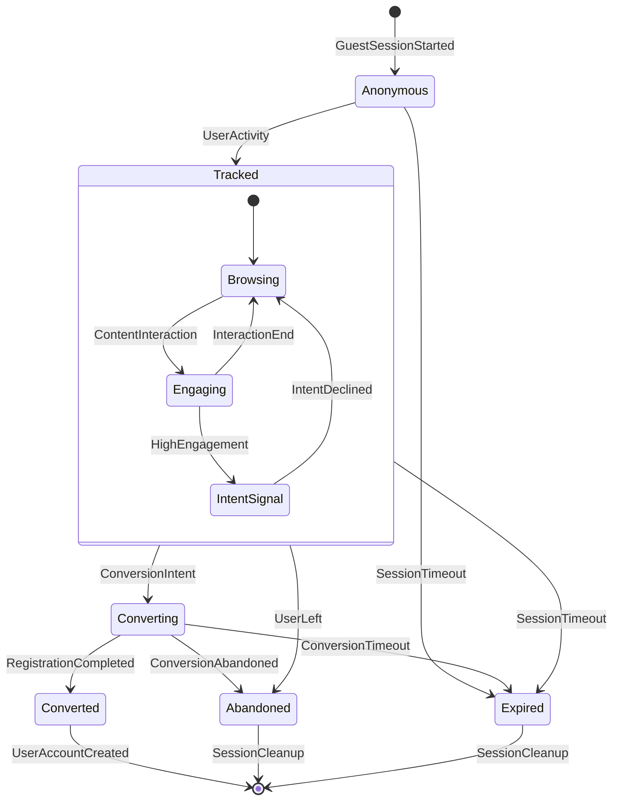

## 6.5. Team Entity State Machines

### 6.5.1. Team Lifecycle FSM

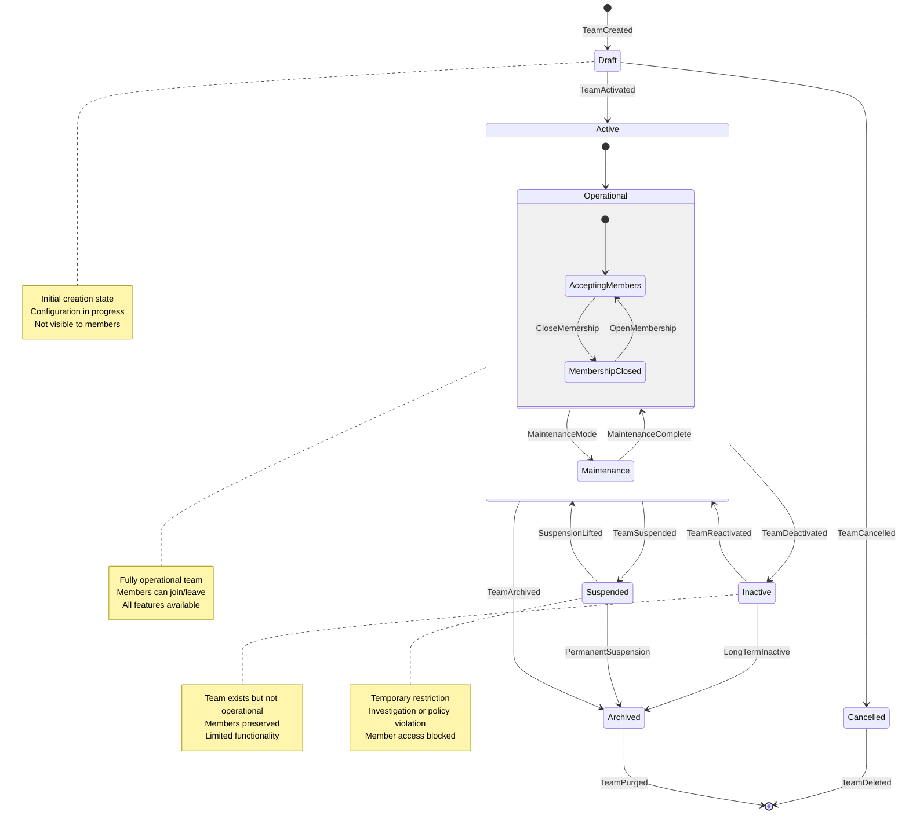

### 6.5.2. Team Membership FSM

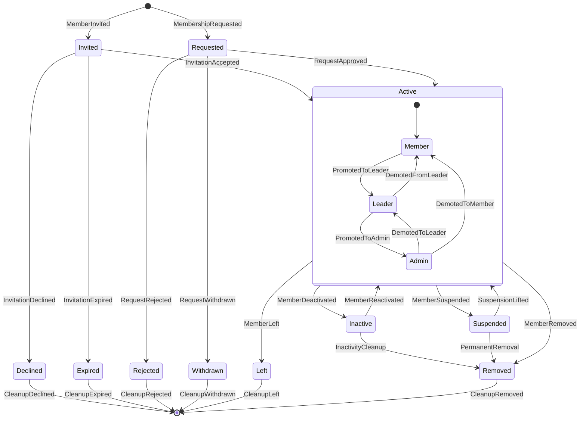

## 6.6. Permission and Role State Machines

### 6.6.1. Role Assignment FSM

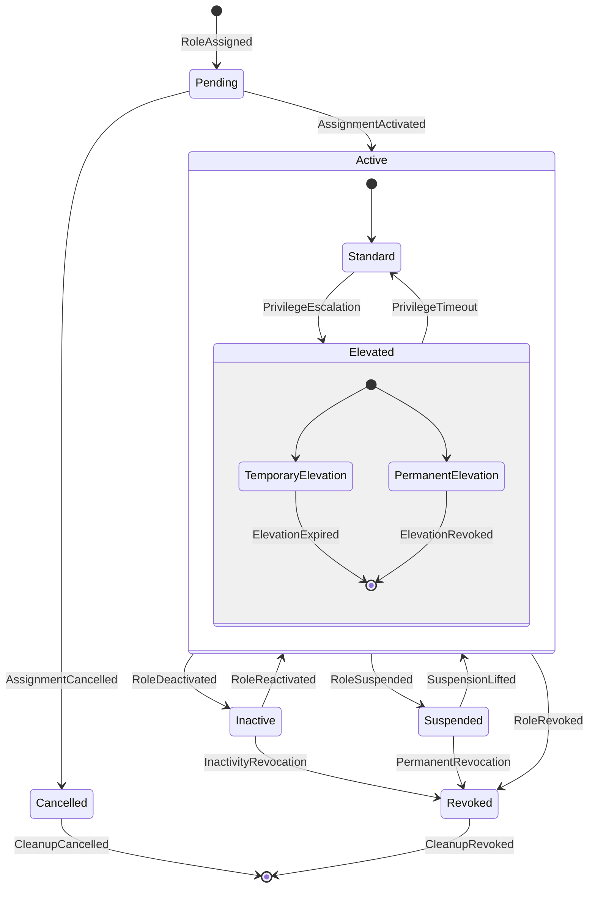

### 6.6.2. Permission Grant FSM

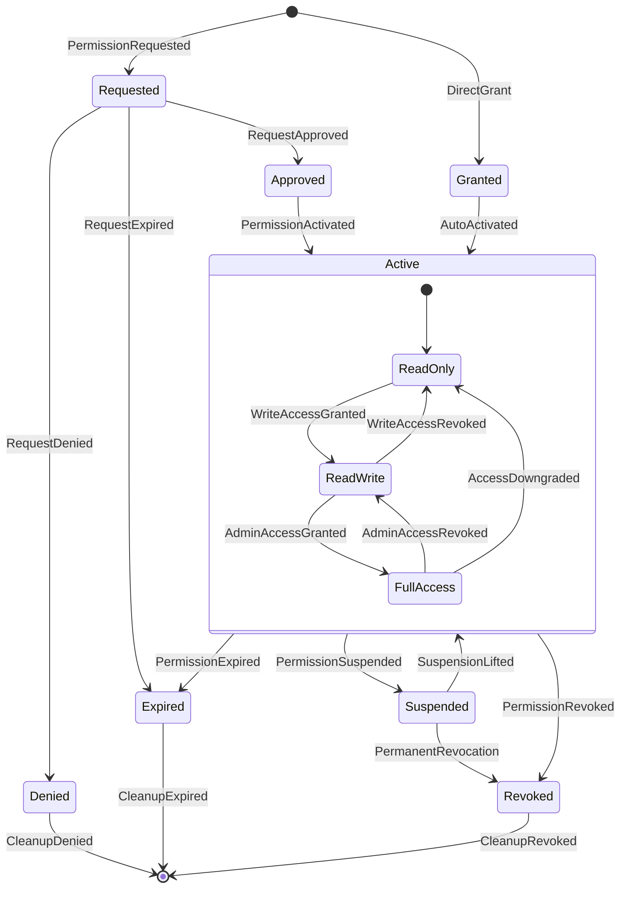

## 6.7. Event-Driven State Transitions

### 6.7.1. Event Processing FSM

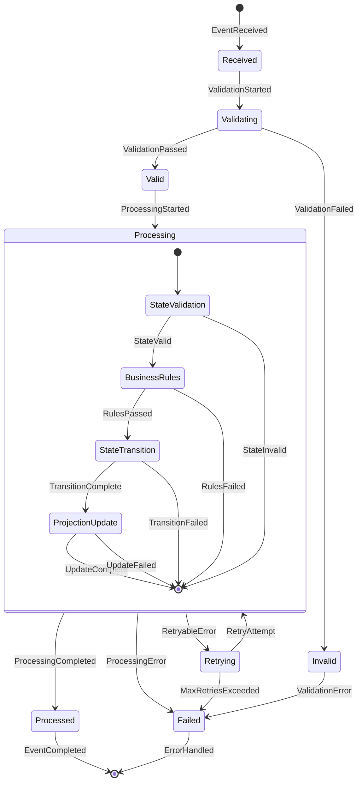

### 6.7.2. Saga State Machine

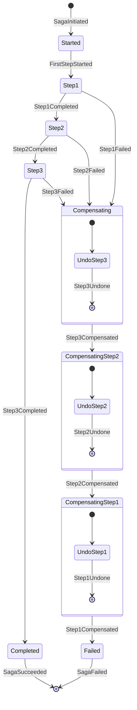

## 6.8. Cross-Entity State Consistency

### 6.8.1. User-Team Consistency FSM

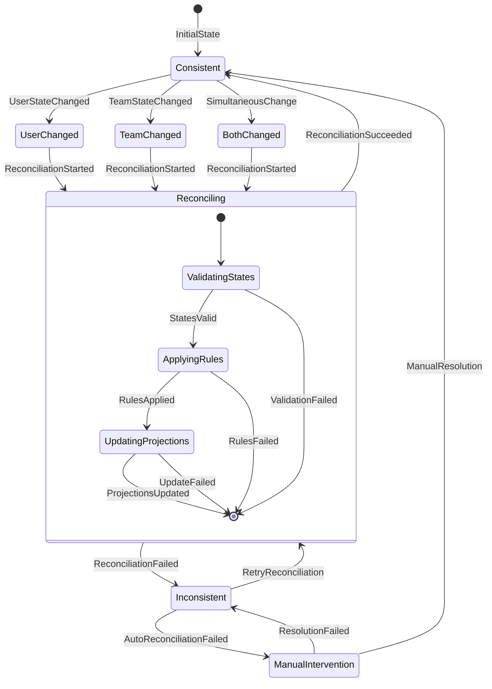

## 6.9. Error Handling and Recovery

### 6.9.1. Error Recovery FSM

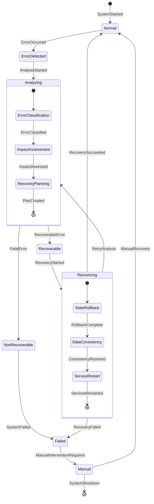

## 6.10. State Transition Rules and Constraints

### 6.10.1. Business Rule Validation

The following business rules govern state transitions:

#### 6.10.1.1. User State Rules
- **Pending → Active**: Requires email verification or admin approval
- **Active → Suspended**: Requires valid reason and authorized actor
- **Suspended → Active**: Requires suspension review and approval
- **Any State → Archived**: Preserves audit trail and relationships
- **Archived → Purged**: Follows data retention policies

#### 6.10.1.2. Team State Rules
- **Draft → Active**: Requires minimum configuration and owner assignment
- **Active → Inactive**: Preserves member relationships and data
- **Inactive → Active**: Validates team configuration and owner status
- **Any State → Archived**: Handles member notifications and cleanup
- **Parent Team Archived**: Child teams must be archived or reassigned

#### 6.10.1.3. Cross-Entity Rules
- **User Archived**: All team memberships become inactive
- **Team Archived**: All member relationships become inactive
- **Admin User Suspended**: Elevated permissions immediately revoked
- **Team Owner Removed**: New owner must be assigned or team archived

### 6.10.2. State Transition Events

Each state transition generates corresponding domain events:

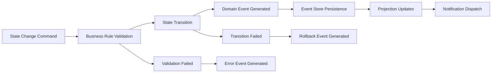

## 6.11. Monitoring and Observability

### 6.11.1. State Transition Metrics

Key metrics to monitor for state machine health:

- **Transition Success Rate**: Percentage of successful state transitions
- **Transition Latency**: Time taken for state changes to complete
- **Error Rate**: Frequency of failed transitions by error type
- **Consistency Lag**: Time between related entity state synchronization
- **Recovery Time**: Duration of error recovery processes

### 6.11.2. State Machine Health Checks

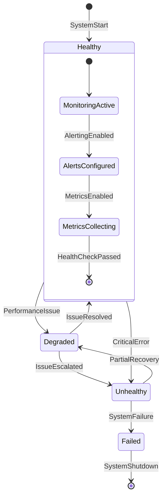

## 6.12. Implementation Guidelines

### 6.12.1. State Machine Implementation

- Use Laravel's state machine packages (e.g., `spatie/laravel-model-states`)
- Implement state guards for business rule validation
- Create state transition listeners for event generation
- Use database transactions for atomic state changes
- Implement compensation patterns for complex workflows

### 6.12.2. Testing Strategy

- Unit tests for individual state transitions
- Integration tests for cross-entity consistency
- Property-based testing for state invariants
- Chaos engineering for error recovery validation
- Performance testing for high-volume state changes

## 6.13. Cross-References

This document relates to other UMS-STI documentation:

- **[1. Architectural Diagrams](010-architectural-diagrams.md)**: System architecture context
- **[2. ERD Diagrams](020-erd-diagrams.md)**: Database schema and relationships
- **[3. Business Process Flows](030-business-process-flows.md)**: Process workflows
- **[4. Swim Lane Diagrams](040-swim-lanes.md)**: Actor responsibilities
- **[5. Domain Models](050-domain-models.md)**: Domain entity definitions

---

*This document is part of the UMS-STI Event-Sourcing and CQRS Architecture documentation suite. For questions or clarifications, refer to the main documentation index or contact the development team.*
