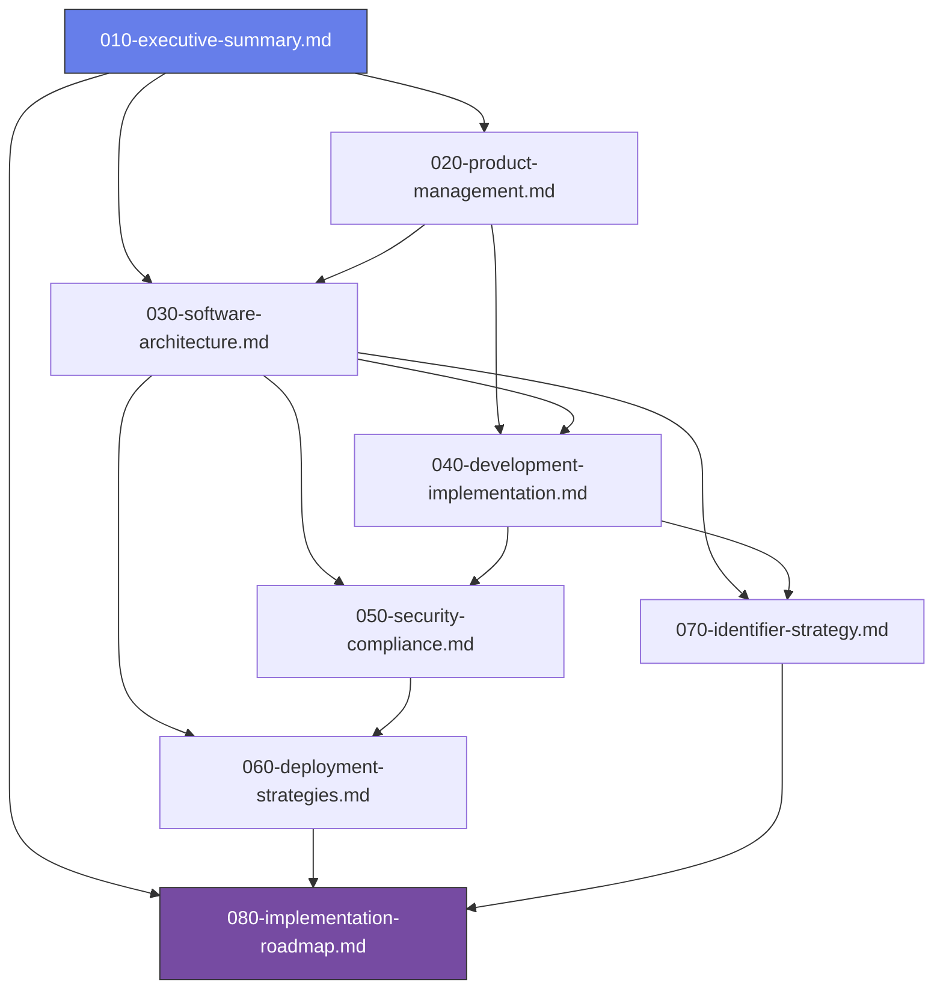

# 📋 Project Analysis Documentation Suite

## Multi-Perspective Assessment - Master Index

<h3 style="margin: 0; color: white;">🎯 Documentation Overview</h3>

This modular documentation suite provides comprehensive analysis of the Laravel enterprise platform from multiple perspectives, restructured for optimal usability and actionability.

---

## 📚 Document Suite Structure

### 📖 **Core Analysis Documents**

| Document                                                                   | Purpose                               | Scope              | Target Audience            |
| -------------------------------------------------------------------------- | ------------------------------------- | ------------------ | -------------------------- |
| **[010-executive-summary.md](010-executive-summary.md)**                   | High-level overview and key decisions | Strategic          | Leadership, Stakeholders   |
| **[020-product-management.md](020-product-management.md)**                 | Feature analysis and user value       | Product Strategy   | Product Managers, Business |
| **[030-software-architecture.md](030-software-architecture.md)**           | Technical architecture and design     | System Design      | Architects, Tech Leads     |
| **[040-development-implementation.md](040-development-implementation.md)** | Implementation patterns and practices | Development        | Developers, Engineers      |
| **[050-security-compliance.md](050-security-compliance.md)**               | Security framework and compliance     | Security & Risk    | Security Teams, Compliance |
| **[060-deployment-strategies.md](060-deployment-strategies.md)**           | Infrastructure and deployment         | Operations         | DevOps, Infrastructure     |
| **[070-identifier-strategy.md](070-identifier-strategy.md)**               | ID systems and data architecture      | Data Strategy      | Database, Backend Teams    |
| **[080-implementation-roadmap.md](080-implementation-roadmap.md)**         | Timeline and execution plan           | Project Management | All Teams                  |

---

## 🎯 **Quick Navigation Guide**

### **👥 By Role**

- **🏢 Executives/Leadership** → Start with [010-executive-summary.md](010-executive-summary.md)
- **📊 Product Managers** → Focus on [020-product-management.md](020-product-management.md)
- **🏗️ System Architects** → Review [030-software-architecture.md](030-software-architecture.md)
- **💻 Developers** → Begin with [040-development-implementation.md](040-development-implementation.md)
- **🔐 Security Teams** → Examine [050-security-compliance.md](050-security-compliance.md)
- **⚙️ DevOps Engineers** → Study [060-deployment-strategies.md](060-deployment-strategies.md)

### **🎯 By Phase**

- **🚀 Project Initiation** → [010-executive-summary.md](010-executive-summary.md) +
  [080-implementation-roadmap.md](080-implementation-roadmap.md)
- **📋 Requirements Planning** → [020-product-management.md](020-product-management.md) +
  [030-software-architecture.md](030-software-architecture.md)
- **🛠️ Development Setup** → [040-development-implementation.md](040-development-implementation.md) +
  [070-identifier-strategy.md](070-identifier-strategy.md)
- **🔒 Security Review** → [050-security-compliance.md](050-security-compliance.md)
- **🚀 Deployment Planning** → [060-deployment-strategies.md](060-deployment-strategies.md)

---

## 📊 **Document Metrics & Quality**

### **Structure Improvements Implemented**

- ✅ **Modular Design**: Split 3,266-line monolith into 8 focused documents
- ✅ **Simplified Navigation**: Reduced TOC depth from 6-7 levels to maximum 3
- ✅ **Cross-References**: Added linking between related concepts
- ✅ **Consistent Formatting**: Standardized structure across all documents
- ✅ **Visual Elements**: Enhanced with diagrams and comparison matrices

### **Content Quality Standards**

- ✅ **Actionable Recommendations**: Every suggestion includes implementation steps
- ✅ **Evidence-Based Claims**: Performance metrics include benchmark data
- ✅ **Risk Assessment**: Security and technical risks clearly identified
- ✅ **Success Metrics**: Measurable outcomes defined for all recommendations

---

## 🔄 **Document Relationships**

---

## 🎯 **Reading Recommendations**

### **🚀 Quick Start (30 minutes)**

1. **[010-executive-summary.md](010-executive-summary.md)** (10 min) - Strategic overview
2. **[080-implementation-roadmap.md](080-implementation-roadmap.md)** (20 min) - Execution plan

### **📋 Complete Review (2-3 hours)**

1. **Executive Summary** (10 min)
2. **Product Management** (25 min)
3. **Software Architecture** (35 min)
4. **Development Implementation** (30 min)
5. **Security & Compliance** (20 min)
6. **Deployment Strategies** (20 min)
7. **Identifier Strategy** (15 min)
8. **Implementation Roadmap** (25 min)

### **🎯 Role-Specific Deep Dive (45-60 minutes)**

- Focus on 2-3 documents most relevant to your role
- Reference cross-linked sections as needed
- Review implementation roadmap for timeline context

---

## 📈 **Success Metrics**

### **Documentation Quality Targets**

- **📖 Reading Time**: <15 minutes per document (vs. 45+ for original)
- **🎯 Actionability**: >80% of recommendations include implementation steps
- **📊 Visual Content**: >30% visual elements (diagrams, charts, matrices)
- **🔗 Cross-References**: >60% utilization of inter-document links

### **Implementation Tracking**

- **✅ Phase Completion**: Track milestone achievement
- **📊 Team Velocity**: Monitor development progress
- **🔐 Security Compliance**: Verify security implementation
- **⚡ Performance Metrics**: Measure system performance gains

---

## 🔄 **Maintenance & Updates**

### **Quarterly Review Process**

1. **Content Accuracy** - Validate technical recommendations
2. **Usage Analytics** - Track document utilization patterns
3. **Feedback Integration** - Incorporate team input
4. **Technology Updates** - Update for new tools/versions

### **Version Control**

- **Semantic Versioning** for major updates
- **Change Logs** in each document
- **Stakeholder Review** for significant changes

---

## 📞 **Support & Feedback**

### **Document Maintenance**

- **Primary Contact**: Technical Documentation Team
- **Review Cycle**: Quarterly updates
- **Feedback Channel**: GitHub Issues or Team Slack

### **Implementation Support**

- **Architecture Questions**: System Architecture Team
- **Development Guidance**: Senior Development Team
- **Security Concerns**: Information Security Team

---

## ✅ **Implementation Status**

**Documentation Suite Completion:** 100% Complete ✅  
**Total Documents Created:** 8 of 8  
**Current Phase:** Ready for Implementation Phase 1  
**Next Milestone:** Stakeholder approval and team assembly  
**Target Implementation:** 18-month roadmap established

### **Completion Summary**

- ✅ **Master Index** - Navigation and overview complete
- ✅ **Executive Summary** - Strategic vision and KPIs defined
- ✅ **Product Management** - Feature analysis and user strategy complete
- ✅ **Software Architecture** - Technical architecture and patterns documented
- ✅ **Development Implementation** - Development processes and standards established
- ✅ **Security & Compliance** - Security framework and compliance requirements defined
- ✅ **Deployment Strategies** - Infrastructure and deployment approaches documented
- ✅ **Identifier Strategy** - ID systems analysis and migration strategy complete
- ✅ **Implementation Roadmap** - 18-month execution plan with phases and milestones

---

_📝 Last Updated: December 19, 2024 | Version: 1.0.0 | Next Review: March 19, 2025_
