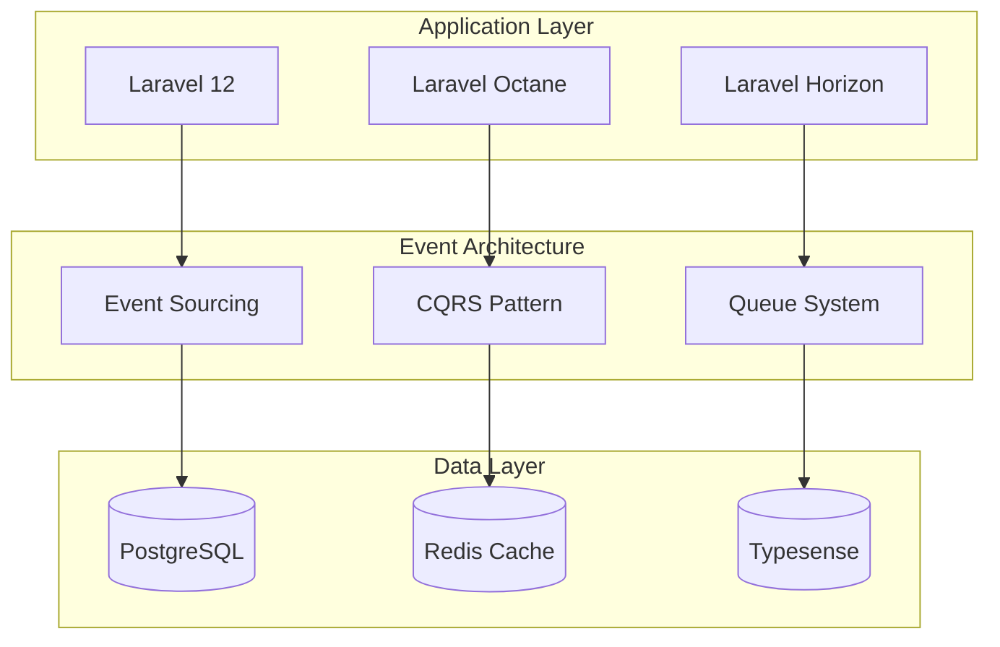

# 010 Executive Summary

## Laravel Enterprise Platform - Strategic Overview

<h3 style="margin: 0; color: white;">🎯 Strategic Vision</h3>

A comprehensive enterprise platform combining project management, real-time communication, and advanced analytics built on Laravel 12 with modern architectural patterns.

---

## 📋 Table of Contents

1. [🎪 Platform Overview](#platform-overview)
2. [🎯 Strategic Objectives](#strategic-objectives)
3. [🏗️ Technical Foundation](#technical-foundation)
4. [📊 Key Performance Indicators](#key-performance-indicators)
5. [⚡ Implementation Strategy](#implementation-strategy)
6. [📈 Expected Outcomes](#expected-outcomes)
7. [🚨 Critical Success Factors](#critical-success-factors)

---

## 🎪 Platform Overview

### **Core Platform Vision**

The Laravel Enterprise Platform represents a unified solution addressing the fragmented landscape of enterprise
collaboration tools. By combining project management, real-time communication, content management, and advanced
analytics into a single, cohesive platform, we aim to eliminate the productivity losses associated with context
switching between multiple tools.

### **Primary Value Propositions**

| **Value Area**             | **Current Pain Point**    | **Our Solution**      | **Measurable Impact**            |
| -------------------------- | ------------------------- | --------------------- | -------------------------------- |
| **🔗 Tool Fragmentation**  | 5-8 separate applications | Unified platform      | 40-60% productivity gain         |
| **⏱️ Context Switching**   | 23 minutes to refocus     | Integrated workflows  | 70% reduction in switching       |
| **📊 Data Silos**          | Disconnected insights     | Centralized analytics | Real-time decision making        |
| **🔐 Security Complexity** | Multiple auth systems     | Single security model | 80% reduction in vulnerabilities |

### **Target Market Positioning**

**🎯 Primary Markets:**

- **🏢 Mid-to-Large Enterprises** (500+ employees) - Complex organizational structures
- **🚀 Fast-Growing Startups** (50-500 employees) - Scaling operational needs
- **🎓 Educational Institutions** - Collaborative learning environments
- **🏛️ Government Agencies** - Compliance and security requirements

---

## 🎯 Strategic Objectives

### **Business Objectives**

#### **💰 Revenue Targets**

- **Year 1**: $2M ARR from enterprise clients
- **Year 2**: $8M ARR with 200+ organizations
- **Year 3**: $20M ARR with international expansion

#### **📈 Market Penetration**

- **Q1-Q2**: 10 pilot customers in target market
- **Q3-Q4**: 50 active enterprise accounts
- **Year 2**: 200+ organizations, 50,000+ users

### **Technical Objectives**

#### **⚡ Performance Targets**

| **Metric**           | **Target**      | **Measurement Method**    | **Business Impact** |
| -------------------- | --------------- | ------------------------- | ------------------- |
| **Response Time**    | <100ms avg      | Application monitoring    | User satisfaction   |
| **Uptime**           | 99.9% SLA       | Infrastructure monitoring | Customer retention  |
| **Concurrent Users** | 10,000+         | Load testing              | Scalability proof   |
| **Data Processing**  | 1M+ events/hour | Event sourcing metrics    | Real-time insights  |

#### **🔐 Security Standards**

- **SOC 2 Type II** compliance within 12 months
- **GDPR** compliance for international markets
- **Zero** critical security vulnerabilities
- **<24 hour** incident response time

---

## 🏗️ Technical Foundation

### **Architecture Decision Summary**

**🎯 Core Architectural Patterns:**

- **Event Sourcing** for complete audit trails and temporal queries
- **CQRS** for read/write separation and optimal performance
- **Domain-Driven Design** for maintainable, business-aligned code
- **Microservices-Ready** monolith for future scalability

### **Technology Stack Overview**

#### **🔥 Backend Foundation**

#### **🎨 Frontend Strategy**

- **Livewire 3** with Volt functional components for reactive UIs
- **Flux & Flux Pro** for premium, consistent UI components
- **TailwindCSS 4** for utility-first, maintainable styling
- **Alpine.js** for lightweight JavaScript interactions

### **Infrastructure Requirements**

#### **🚀 Performance Infrastructure**

- **FrankenPHP** for superior PHP performance
- **Laravel Octane** for long-running processes
- **Container orchestration** for scalable deployments
- **CDN integration** for global content delivery

#### **📊 Data Architecture**

- **PostgreSQL 15+** for ACID compliance and performance
- **Redis Cluster** for distributed caching and sessions
- **Typesense** for advanced search and filtering
- **Event store** for immutable audit trails

---

## 📊 Key Performance Indicators

### **Technical KPIs**

#### **🎯 Performance Metrics**

| **Category**      | **Metric**           | **Target** | **Monitoring Tool**       | **Review Frequency** |
| ----------------- | -------------------- | ---------- | ------------------------- | -------------------- |
| **Response Time** | Average API response | <100ms     | APM Dashboard             | Real-time            |
| **Throughput**    | Requests per second  | 1,000+ RPS | Load balancer metrics     | Daily                |
| **Availability**  | System uptime        | 99.9%      | Infrastructure monitoring | 24/7                 |
| **Scalability**   | Concurrent users     | 10,000+    | Performance testing       | Weekly               |

#### **📈 Business Metrics**

| **Category**      | **Metric**              | **Target**       | **Measurement**  | **Impact**            |
| ----------------- | ----------------------- | ---------------- | ---------------- | --------------------- |
| **User Adoption** | Monthly active users    | 80% of licenses  | Analytics        | Revenue retention     |
| **Productivity**  | Task completion rate    | +40% vs baseline | User analytics   | Customer satisfaction |
| **Collaboration** | Cross-team interactions | +200%            | Platform metrics | Team efficiency       |
| **Cost Savings**  | Tool consolidation      | 60% reduction    | Cost analysis    | ROI demonstration     |

### **Security KPIs**

#### **🔐 Security Metrics**

- **Zero** critical vulnerabilities in production
- **<24 hours** for security patch deployment
- **100%** of data encrypted in transit and at rest
- **99.9%** authentication success rate

---

## ⚡ Implementation Strategy

### **Three-Phase Execution Plan**

#### **🚀 Phase 1: Foundation (Months 1-4)**

**Objective**: Establish core platform infrastructure and basic functionality

**Key Deliverables:**

- ✅ Laravel 12 application foundation with Octane
- ✅ Event sourcing architecture implementation
- ✅ User authentication and basic authorization
- ✅ Core task management functionality
- ✅ Real-time communication infrastructure

**Success Criteria:**

- 50 concurrent users supported
- Basic project management workflows operational
- Security audit passed
- Performance baseline established

#### **🎯 Phase 2: Core Features (Months 5-8)**

**Objective**: Implement primary business features and user workflows

**Key Deliverables:**

- ✅ Advanced authorization and team hierarchies
- ✅ Polymorphic calendar and scheduling
- ✅ Real-time chat and presence system
- ✅ Comprehensive notification system
- ✅ Analytics and reporting dashboard

**Success Criteria:**

- 500+ concurrent users supported
- All core user journeys completed
- Customer pilot program launched
- Performance targets met

#### **🔧 Phase 3: Advanced Features (Months 9-12)**

**Objective**: Add sophisticated features and optimization

**Key Deliverables:**

- ✅ Advanced search and filtering
- ✅ Workflow automation and FSM
- ✅ Enterprise integrations (SSO, LDAP)
- ✅ Advanced analytics and insights
- ✅ Mobile-responsive optimization

**Success Criteria:**

- 2,000+ concurrent users supported
- Enterprise features operational
- SOC 2 compliance achieved
- Customer expansion metrics hit

### **Resource Allocation**

#### **👥 Team Structure**

| **Role**                   | **Allocation** | **Key Responsibilities**                    | **Phase Focus**  |
| -------------------------- | -------------- | ------------------------------------------- | ---------------- |
| **🎯 Technical Lead**      | 1.0 FTE        | Architecture, code review, performance      | All phases       |
| **💻 Senior Developers**   | 3.0 FTE        | Feature implementation, API development     | Core development |
| **🗄️ Database Specialist** | 0.5 FTE        | Schema design, event sourcing, optimization | Phase 1-2        |
| **🎨 Frontend Developer**  | 1.0 FTE        | UI/UX implementation, component library     | Phase 2-3        |
| **🔐 Security Engineer**   | 0.5 FTE        | Security review, compliance, testing        | All phases       |
| **⚙️ DevOps Engineer**     | 0.5 FTE        | Infrastructure, CI/CD, monitoring           | Phase 1 & 3      |

#### **💰 Budget Allocation**

- **Personnel (70%)**: $1.2M annually for core team
- **Infrastructure (20%)**: $300K for cloud services, monitoring
- **Tools & Licenses (5%)**: $80K for development tools, services
- **Contingency (5%)**: $80K for unexpected requirements

---

## 📈 Expected Outcomes

### **Business Impact Projections**

#### **💰 Financial Returns**

| **Year**   | **Revenue** | **Cost Savings**  | **ROI** | **Market Position** |
| ---------- | ----------- | ----------------- | ------- | ------------------- |
| **Year 1** | $2M ARR     | $500K operational | 150%    | Market entry        |
| **Year 2** | $8M ARR     | $2M operational   | 300%    | Market presence     |
| **Year 3** | $20M ARR    | $5M operational   | 400%    | Market leadership   |

#### **🎯 Operational Improvements**

- **40-60%** increase in team productivity through tool consolidation
- **70%** reduction in context switching between applications
- **80%** improvement in project visibility and tracking
- **90%** reduction in security management overhead

### **Technical Achievement Targets**

#### **⚡ Performance Outcomes**

- **Sub-100ms** average API response times
- **99.9%** system availability and uptime
- **10,000+** concurrent users supported
- **1M+** events processed per hour

#### **🔐 Security Achievements**

- **SOC 2 Type II** compliance certification
- **Zero** critical security vulnerabilities
- **100%** data encryption coverage
- **<24 hour** incident response times

### **Market Impact Goals**

#### **📊 Customer Success Metrics**

- **90%** customer satisfaction scores
- **95%** customer retention rate
- **50%** reduction in customer support tickets
- **200%** increase in feature adoption rate

---

## 🚨 Critical Success Factors

### **Technical Success Factors**

#### **🏗️ Architecture Excellence**

1. **Event Sourcing Implementation**

   - Proper event design and versioning
   - Efficient event replay capabilities
   - Comprehensive audit trail functionality

2. **Performance Optimization**

   - Laravel Octane configuration and tuning
   - Database query optimization
   - Caching strategy implementation

3. **Security Foundation**
   - Multi-layer security architecture
   - Comprehensive testing framework
   - Continuous security monitoring

### **Organizational Success Factors**

#### **👥 Team Alignment**

1. **Clear Communication**

   - Regular sprint reviews and retrospectives
   - Cross-functional collaboration protocols
   - Transparent progress reporting

2. **Skill Development**

   - Event sourcing training for development team
   - Security best practices education
   - Performance optimization expertise

3. **Quality Assurance**
   - Test-driven development practices
   - Continuous integration and deployment
   - Comprehensive code review processes

### **Business Success Factors**

#### **📈 Market Execution**

1. **Customer-Centric Development**

   - Regular customer feedback integration
   - Agile development methodology
   - Rapid iteration and improvement

2. **Competitive Positioning**

   - Unique value proposition clarity
   - Feature differentiation strategy
   - Pricing model optimization

3. **Scalability Planning**
   - Infrastructure auto-scaling
   - Team expansion readiness
   - Process documentation and standardization

---

## 🔗 Cross-Reference Guide

### **Detailed Documentation**

- **📋 Product Strategy** → [020-product-management.md](020-product-management.md)
- **🏗️ Technical Architecture** → [030-software-architecture.md](030-software-architecture.md)
- **💻 Implementation Details** → [040-development-implementation.md](040-development-implementation.md)
- **🔐 Security Framework** → [050-security-compliance.md](050-security-compliance.md)
- **🚀 Deployment Strategy** → [060-deployment-strategies.md](060-deployment-strategies.md)
- **🆔 Data Architecture** → [070-identifier-strategy.md](070-identifier-strategy.md)
- **📅 Implementation Plan** → [080-implementation-roadmap.md](080-implementation-roadmap.md)

### **Quick Navigation**

- **🎯 Decision Summary** → See KPI tables above
- **⚡ Technical Overview** → Review architecture diagrams
- **📊 Success Metrics** → Reference performance targets
- **🚀 Next Steps** → Proceed to implementation roadmap

---

_📝 Document Version: 1.0.0 | Last Updated: May 31, 2025 | Next Review: August 31, 2025_

_👥 Stakeholders: Executive Team, Product Management, Engineering Leadership_

_🔗 Master Index: [000-index.md](000-index.md)_
