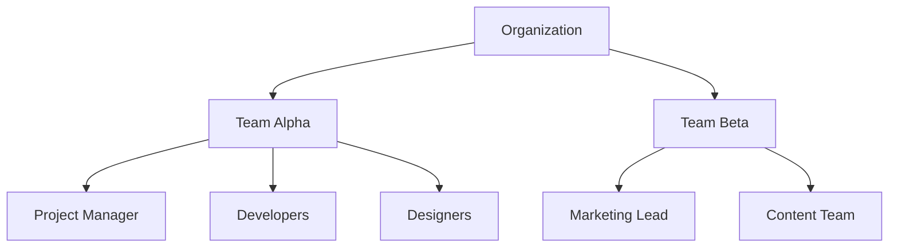

# 020 - Product Management Strategy

## Table of Contents

- [Product Vision & Strategy](#product-vision--strategy)
- [Feature Analysis](#feature-analysis)
- [User Experience Strategy](#user-experience-strategy)
- [Team Management Features](#team-management-features)
- [Real-time Communication](#real-time-communication)
- [Analytics & Reporting](#analytics--reporting)

---

## Product Vision & Strategy

### 🎯 Core Value Proposition

Our multi-tenant Laravel platform delivers **enterprise-grade team collaboration** with real-time features optimized for
modern distributed teams. The platform combines task management, project coordination, and team communication in a
unified experience.

**Key Differentiators:**

- 🔄 **Event-driven architecture** ensuring data consistency
- ⚡ **Real-time collaboration** with sub-100ms response times
- 🏢 **Multi-tenant isolation** with enterprise security
- 📊 **Advanced analytics** for data-driven team insights

### 📊 Success Metrics & KPIs

| Metric Category       | Target              | Current Baseline | Success Criteria      |
| --------------------- | ------------------- | ---------------- | --------------------- |
| **User Engagement**   | 85% DAU/MAU         | TBD              | >80% sustained        |
| **Performance**       | <100ms response     | TBD              | 95th percentile       |
| **Feature Adoption**  | 70% new feature use | TBD              | Within 30 days        |
| **Team Productivity** | 40% improvement     | Baseline survey  | Quarterly measurement |

### 🚀 Product Roadmap

#### Phase 1: Foundation (Months 1-2)

- ✅ Multi-tenant user management
- ✅ Team hierarchy system
- ✅ Basic task management
- ✅ Security framework

#### Phase 2: Core Features (Months 3-4)

- 📋 Advanced task workflows with state management
- 📅 Integrated calendar system
- 📎 File attachment management
- 🔍 Basic search functionality

#### Phase 3: Real-time Features (Months 5-6)

- 💬 Real-time chat system
- 🔔 Smart notification engine
- 👥 Presence detection
- 🔄 Live collaboration features

#### Phase 4: Advanced Capabilities (Months 7-8)

- 📊 Kanban board interface
- 🔍 Advanced search with Typesense
- 📝 Blog content management
- 📈 Analytics dashboard

---

## Feature Analysis

### 🏗️ Core Platform Features

#### Multi-Tenant Architecture

**Business Value:** Enable SaaS deployment with complete tenant isolation

- 🏢 **Tenant Management**: Organization-level data separation
- 👥 **Team Hierarchies**: Flexible organizational structures
- 🔐 **Security Isolation**: Complete data segregation
- 💰 **Billing Integration**: Per-tenant subscription management

#### Task Management System

**Business Value:** Streamline project execution with advanced workflow management

- 📋 **Task Creation**: Rich task definition with metadata
- 🔄 **State Machine**: Configurable workflow states (Draft → In Progress → Review → Complete)
- 👤 **Assignment System**: User and team-based task assignment
- 📊 **Progress Tracking**: Visual progress indicators and analytics

#### Team Collaboration

**Business Value:** Reduce communication overhead and improve coordination

- 💬 **Real-time Chat**: Instant messaging with threading
- 📎 **File Sharing**: Secure document management
- 🔔 **Smart Notifications**: Contextual, non-intrusive alerts
- 👥 **Presence System**: Live user status and activity

### 📱 User Experience Features

#### Interface Design

- 🎨 **Modern UI**: Clean, intuitive design with Flux components
- 📱 **Mobile Responsive**: Optimized for all device types
- 🌙 **Dark Mode**: User preference-based theming
- ♿ **Accessibility**: WCAG 2.1 AA compliance

#### Performance Optimization

- ⚡ **Fast Loading**: Sub-2 second page loads
- 🔄 **Real-time Updates**: Instant UI updates via WebSockets
- 💾 **Offline Support**: Progressive Web App capabilities
- 🎯 **Smart Caching**: Intelligent data prefetching

### 🔧 Administrative Features

#### System Management

- 🛡️ **User Management**: Comprehensive user administration
- 🔐 **Permission System**: Granular role-based access control
- 📊 **System Monitoring**: Real-time performance dashboards
- 🔧 **Configuration**: Flexible system settings

---

## User Experience Strategy

### 🎯 User-Centered Design Principles

#### Accessibility First

- ♿ **WCAG 2.1 AA Compliance**: Full accessibility standards
- ⌨️ **Keyboard Navigation**: Complete keyboard accessibility
- 🔍 **Screen Reader Support**: Semantic HTML and ARIA labels
- 🎨 **High Contrast**: Accessible color schemes

#### Mobile-First Approach

- 📱 **Responsive Design**: Fluid layouts for all screen sizes
- 👆 **Touch Optimization**: Touch-friendly interface elements
- 📡 **Offline Capability**: Progressive Web App features
- 🔋 **Performance**: Optimized for mobile networks

### 📊 User Journey Optimization

#### Onboarding Experience

1. **Welcome Flow**: Guided setup with progress indicators
2. **Team Setup**: Streamlined team creation process
3. **Feature Discovery**: Interactive tutorial system
4. **Quick Wins**: Immediate value demonstration

#### Daily Workflow

1. **Dashboard**: Personalized activity overview
2. **Task Management**: Intuitive task creation and updates
3. **Collaboration**: Seamless team communication
4. **Reporting**: Easy progress tracking and analytics

### 🔄 Feedback Integration

#### User Research Methods

- 📋 **User Surveys**: Regular satisfaction measurements
- 👥 **Focus Groups**: Qualitative feedback sessions
- 📊 **Analytics**: Behavioral data analysis
- 🧪 **A/B Testing**: Feature optimization testing

---

## Team Management Features

### 👥 Organizational Structure

#### Hierarchical Team Management



#### Role-Based Permissions

- 🏢 **Organization Admin**: Full system access
- 👥 **Team Lead**: Team management and oversight
- 📋 **Project Manager**: Project and task coordination
- 👤 **Team Member**: Task execution and collaboration
- 👁️ **Observer**: Read-only access for stakeholders

### 🔐 Security & Access Control

#### Permission Matrix

| Role          | View Tasks | Create Tasks | Edit Tasks  | Delete Tasks | Manage Team |
| ------------- | ---------- | ------------ | ----------- | ------------ | ----------- |
| **Admin**     | ✅         | ✅           | ✅          | ✅           | ✅          |
| **Team Lead** | ✅         | ✅           | ✅          | ✅           | ✅          |
| **PM**        | ✅         | ✅           | ✅          | ⚠️ Own only  | ❌          |
| **Member**    | ✅         | ✅           | ⚠️ Own only | ❌           | ❌          |
| **Observer**  | ✅         | ❌           | ❌          | ❌           | ❌          |

#### Multi-Factor Authentication

- 📱 **TOTP Support**: Google Authenticator, Authy
- 📧 **Email Verification**: Secondary email confirmation
- 🔑 **Hardware Keys**: FIDO2/WebAuthn support
- 📱 **SMS Backup**: Emergency access codes

---

## Real-time Communication

### 💬 Chat System Architecture

#### Message Features

- 💬 **Threading**: Organized conversation threads
- 📎 **File Sharing**: Drag-and-drop file attachments
- 🎯 **Mentions**: User and channel mentions with notifications
- 📝 **Rich Text**: Markdown support for formatting
- 🔍 **Search**: Full-text message search across channels

#### Presence System

- 🟢 **Online Status**: Real-time user availability
- ⏰ **Last Seen**: Timestamp for offline users
- 💬 **Typing Indicators**: Live typing status display
- 📱 **Device Status**: Mobile/desktop activity indicators

### 🔔 Notification Engine

#### Smart Notification Logic

```php
// Intelligent notification filtering
class NotificationEngine
{
    public function shouldNotify(User $user, Event $event): bool
    {
        return $this->checkUserPreferences($user, $event)
            && $this->isWithinQuietHours($user)
            && !$this->isSpamming($user, $event)
            && $this->isRelevant($user, $event);
    }
}
```

#### Notification Channels

- 🔔 **In-App**: Real-time browser notifications
- 📧 **Email**: Configurable email summaries
- 📱 **Push**: Mobile push notifications
- 💬 **Chat**: Direct message notifications
- 📊 **Digest**: Daily/weekly activity summaries

---

## Analytics & Reporting

### 📊 Performance Dashboards

#### Team Productivity Metrics

- 📈 **Task Completion Rate**: Percentage of tasks completed on time
- ⏱️ **Average Resolution Time**: Mean time from creation to completion
- 🔄 **Velocity Tracking**: Team throughput over time
- 🎯 **Goal Achievement**: Progress toward team objectives

#### User Engagement Analytics

- 👥 **Active Users**: Daily, weekly, monthly active users
- 📱 **Feature Usage**: Adoption rates for platform features
- 💬 **Communication Volume**: Message and collaboration frequency
- ⏰ **Session Duration**: Average user session length

### 📈 Business Intelligence

#### Custom Reporting

- 📊 **Report Builder**: Drag-and-drop report creation
- 📅 **Scheduled Reports**: Automated report delivery
- 📤 **Export Options**: PDF, CSV, Excel export formats
- 🔍 **Data Filtering**: Advanced filtering and segmentation

#### Integration Capabilities

- 📊 **BI Tools**: Integration with Tableau, Power BI
- 📈 **Data Warehouse**: ETL pipeline for analytics
- 🔌 **API Access**: RESTful API for custom integrations
- 📡 **Webhooks**: Real-time data streaming

---

## Success Criteria & Validation

### 🎯 Product Success Metrics

#### User Satisfaction

- ⭐ **NPS Score**: Target >50 (Industry benchmark)
- 😊 **User Satisfaction**: >4.5/5 average rating
- 🔄 **Retention Rate**: >85% monthly retention
- 📈 **Growth Rate**: 15% MoM user growth

#### Technical Performance

- ⚡ **Response Time**: <100ms average API response
- 🔄 **Uptime**: 99.9% system availability
- 🐛 **Error Rate**: <0.1% critical errors
- 🔒 **Security**: Zero critical vulnerabilities

### ✅ Validation Methods

#### Continuous Feedback Loop

1. **User Analytics**: Behavioral data collection
2. **Feature Flags**: Gradual feature rollout
3. **A/B Testing**: Data-driven feature optimization
4. **User Interviews**: Qualitative feedback gathering
5. **Support Metrics**: Issue resolution tracking

---

**Cross-References:**

- [030 - Software Architecture](030-software-architecture.md) - Technical implementation details
- [040 - Development Implementation](040-development-implementation.md) - Development practices
- [080 - Implementation Roadmap](080-implementation-roadmap.md) - Detailed timeline

_Last Updated: [Current Date]_ _Document Version: 1.0_
