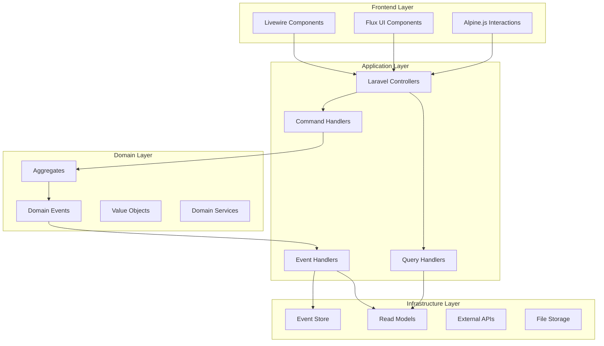
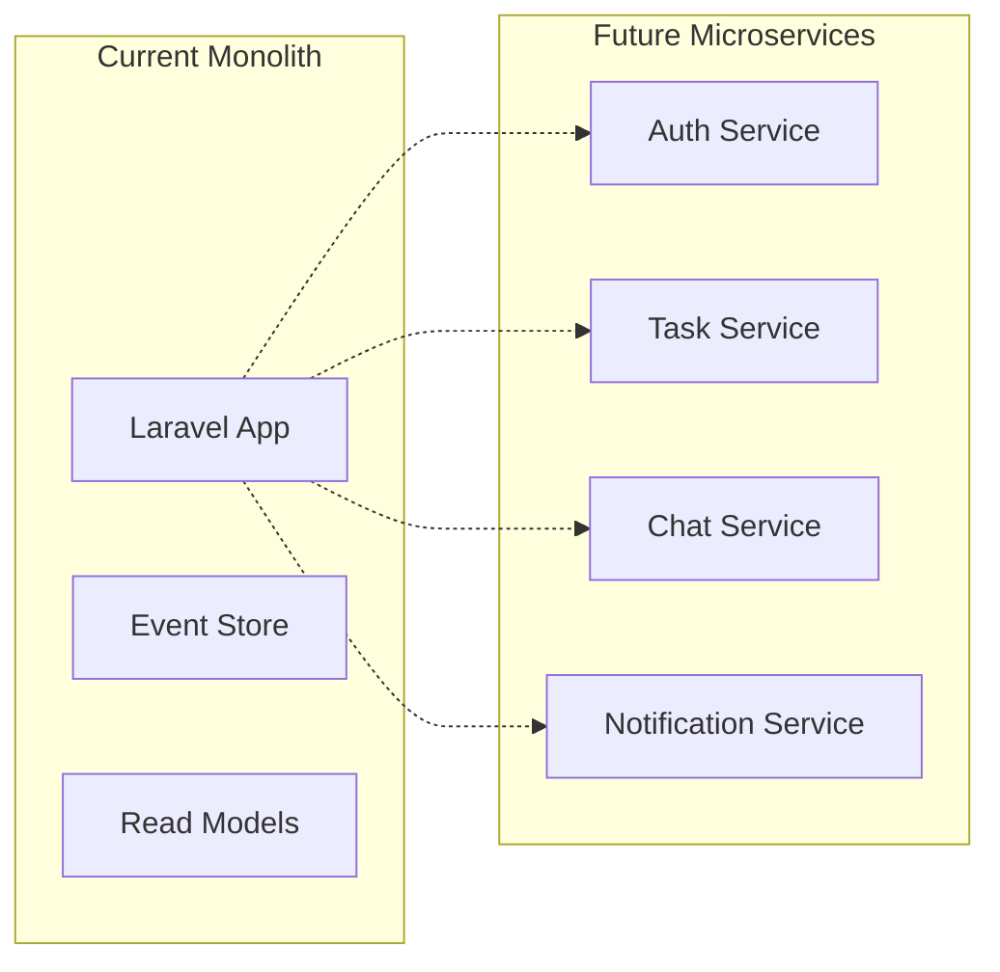

# 030 - Software Architecture

## Table of Contents

- [Architecture Overview](#architecture-overview)
- [Event Sourcing Implementation](#event-sourcing-implementation)
- [Package Integration Strategy](#package-integration-strategy)
- [Performance Optimization](#performance-optimization)
- [Security Architecture](#security-architecture)
- [Scalability Design](#scalability-design)

---

## Architecture Overview

### 🏗️ High-Level Architecture



### 🎯 Architectural Principles

#### CQRS (Command Query Responsibility Segregation)

- **Commands**: State-changing operations handled by aggregates
- **Queries**: Read operations served by optimized read models
- **Separation**: Clear distinction between write and read concerns
- **Performance**: Independent scaling of read and write operations

#### Event Sourcing Foundation

- **Event Store**: Complete audit trail of all state changes
- **Aggregates**: Business logic encapsulation and consistency
- **Projections**: Optimized views for query operations
- **Replay**: Ability to rebuild state from events

#### Domain-Driven Design (DDD)

- **Bounded Contexts**: Clear domain boundaries
- **Ubiquitous Language**: Shared vocabulary between business and tech
- **Aggregates**: Consistency boundaries and business rules
- **Domain Events**: Cross-aggregate communication

---

## Event Sourcing Implementation

### 📊 Event Store Architecture

#### Core Components

```php
<?php
// Event Store Structure
class EventStore
{
    // Optimized with Snowflake IDs for performance
    protected $table = 'event_store';

    protected $structure = [
        'id' => 'snowflake_id',           // Sequential for performance
        'aggregate_uuid' => 'uuid',        // External aggregate identifier
        'aggregate_type' => 'string',      // Aggregate class name
        'aggregate_version' => 'integer',   // Optimistic concurrency
        'event_type' => 'string',          // Event class name
        'event_data' => 'json',            // Serialized event payload
        'metadata' => 'json',              // Context and tracing info
        'recorded_at' => 'timestamp',      // Event recording time
    ];
}
```

#### Event Sourcing Benefits

| Aspect                    | Traditional CRUD       | Event Sourcing       | Advantage          |
| ------------------------- | ---------------------- | -------------------- | ------------------ |
| **Audit Trail**           | Limited logging        | Complete history     | 100% auditability  |
| **Debugging**             | Difficult reproduction | Full event replay    | Perfect debugging  |
| **Business Intelligence** | Snapshot data only     | Time-series analysis | Rich analytics     |
| **Compliance**            | Manual tracking        | Automatic compliance | Regulatory ready   |
| **Data Recovery**         | Backup dependent       | Event-based rebuild  | Disaster resilient |

### 🔄 Aggregate Design

#### Task Aggregate Example

```php
<?php
namespace App\Domain\Task;

use Spatie\EventSourcing\AggregateRoots\AggregateRoot;

class TaskAggregate extends AggregateRoot
{
    private string $title;
    private TaskStatus $status;
    private ?string $assignedTo = null;

    public function createTask(string $title, string $createdBy): self
    {
        $this->recordThat(new TaskWasCreated(
            taskId: $this->uuid(),
            title: $title,
            createdBy: $createdBy,
            createdAt: now()
        ));

        return $this;
    }

    public function assignTo(string $userId): self
    {
        if ($this->status === TaskStatus::COMPLETED) {
            throw new CannotAssignCompletedTask();
        }

        $this->recordThat(new TaskWasAssigned(
            taskId: $this->uuid(),
            assignedTo: $userId,
            assignedAt: now()
        ));

        return $this;
    }

    public function markAsCompleted(): self
    {
        if ($this->status === TaskStatus::COMPLETED) {
            throw new TaskAlreadyCompleted();
        }

        $this->recordThat(new TaskWasCompleted(
            taskId: $this->uuid(),
            completedAt: now()
        ));

        return $this;
    }

    // Event application methods
    protected function applyTaskWasCreated(TaskWasCreated $event): void
    {
        $this->title = $event->title;
        $this->status = TaskStatus::DRAFT;
    }

    protected function applyTaskWasAssigned(TaskWasAssigned $event): void
    {
        $this->assignedTo = $event->assignedTo;
        $this->status = TaskStatus::IN_PROGRESS;
    }

    protected function applyTaskWasCompleted(TaskWasCompleted $event): void
    {
        $this->status = TaskStatus::COMPLETED;
    }
}
```

### 📈 Projection Strategy

#### Read Model Optimization

```php
<?php
// Optimized read models for different use cases
class TaskListProjector extends Projector
{
    protected array $handlesEvents = [
        TaskWasCreated::class => 'onTaskWasCreated',
        TaskWasAssigned::class => 'onTaskWasAssigned',
        TaskWasCompleted::class => 'onTaskWasCompleted',
    ];

    public function onTaskWasCreated(TaskWasCreated $event): void
    {
        TaskListItem::create([
            'uuid' => $event->taskId,
            'ulid' => Str::ulid(), // User-facing identifier
            'title' => $event->title,
            'status' => 'draft',
            'created_by' => $event->createdBy,
            'created_at' => $event->createdAt,
            'updated_at' => $event->createdAt,
        ]);
    }

    public function onTaskWasAssigned(TaskWasAssigned $event): void
    {
        TaskListItem::where('uuid', $event->taskId)->update([
            'assigned_to' => $event->assignedTo,
            'status' => 'in_progress',
            'updated_at' => $event->assignedAt,
        ]);
    }
}
```

---

## Package Integration Strategy

### 🏢 Spatie Ecosystem Integration

#### Core Event Sourcing Stack

```php
// config/event-sourcing.php
return [
    'aggregate_root' => [
        'cache_driver' => env('EVENT_SOURCING_CACHE_DRIVER', 'redis'),
        'cache_prefix' => env('EVENT_SOURCING_CACHE_PREFIX', 'laravel_event_sourcing'),
    ],

    'event_store' => [
        'driver' => 'eloquent',
        'table_name' => 'stored_events',
        'connection' => env('EVENT_SOURCING_DB_CONNECTION'),
    ],

    'snapshot' => [
        'driver' => 'eloquent',
        'table_name' => 'snapshots',
    ],
];
```

#### Permission & Security Integration

```php
// Spatie Permission with Event Sourcing
class UserPermissionProjector extends Projector
{
    public function onUserWasCreated(UserWasCreated $event): void
    {
        $user = User::create($event->userData);
        $user->assignRole('team_member'); // Default role
    }

    public function onUserRoleWasChanged(UserRoleWasChanged $event): void
    {
        $user = User::find($event->userId);
        $user->syncRoles($event->roles);
    }
}
```

### ⚡ Laravel Octane Configuration

#### FrankenPHP Optimization

```php
// config/octane.php
return [
    'server' => env('OCTANE_SERVER', 'frankenphp'),

    'frankenphp' => [
        'workers' => env('OCTANE_WORKERS', 4),
        'task_workers' => env('OCTANE_TASK_WORKERS', 6),
        'max_requests' => env('OCTANE_MAX_REQUESTS', 500),
    ],

    'warm' => [
        'config',
        'routes',
        'views',
        'event-sourcing',
    ],

    'listeners' => [
        WorkerStarting::class => [
            EnsureUploadedFilesAreValid::class,
        ],

        RequestReceived::class => [
            EnsureRequestHasId::class,
            EnsureUserIsAuthenticated::class,
        ],

        RequestTerminated::class => [
            FlushArrayCache::class,
            FlushTemporaryContainerInstances::class,
        ],
    ],
];
```

### 🔍 Search Integration (Typesense)

#### Advanced Search Configuration

```php
// config/scout.php
return [
    'driver' => env('SCOUT_DRIVER', 'typesense'),

    'typesense' => [
        'client' => [
            'api_key' => env('TYPESENSE_API_KEY'),
            'nodes' => [
                [
                    'host' => env('TYPESENSE_HOST', 'localhost'),
                    'port' => env('TYPESENSE_PORT', '8108'),
                    'protocol' => env('TYPESENSE_PROTOCOL', 'http'),
                ],
            ],
            'connection_timeout_seconds' => 2,
            'healthcheck_interval_seconds' => 30,
        ],
    ],
];

// Searchable model implementation
class Task extends Model
{
    use Searchable;

    public function toSearchableArray(): array
    {
        return [
            'id' => $this->ulid,
            'title' => $this->title,
            'description' => $this->description,
            'status' => $this->status,
            'assigned_to_name' => $this->assignedUser?->name,
            'created_at' => $this->created_at->timestamp,
            'updated_at' => $this->updated_at->timestamp,
        ];
    }

    public function searchableOptions(): array
    {
        return [
            'default_sorting_field' => 'updated_at',
            'fields' => [
                [
                    'name' => 'title',
                    'type' => 'string',
                    'facet' => false,
                ],
                [
                    'name' => 'status',
                    'type' => 'string',
                    'facet' => true,
                ],
                [
                    'name' => 'created_at',
                    'type' => 'int64',
                    'sort' => true,
                ],
            ],
        ];
    }
}
```

---

## Performance Optimization

### ⚡ Database Performance

#### Identifier Strategy Implementation

```php
// Hybrid identifier strategy for optimal performance
abstract class BaseModel extends Model
{
    protected $primaryKey = 'id'; // Auto-increment for DB performance

    protected static function boot(): void
    {
        parent::boot();

        static::creating(function ($model) {
            // Snowflake for time-ordered operations
            $model->snowflake_id = app(SnowflakeId::class)->generate();

            // UUID for external APIs
            $model->uuid = Str::uuid();

            // ULID for time-sensitive user-facing features
            if (method_exists($model, 'needsUlid') && $model->needsUlid()) {
                $model->ulid = Str::ulid();
            }
        });
    }
}
```

#### Query Optimization Strategies

```php
// Event store optimizations
class OptimizedEventStore
{
    public function getEventsInTimeRange(Carbon $start, Carbon $end): Collection
    {
        // Use Snowflake IDs for efficient time-based queries
        $startId = SnowflakeId::fromTimestamp($start);
        $endId = SnowflakeId::fromTimestamp($end);

        return DB::table('stored_events')
            ->whereBetween('id', [$startId, $endId])
            ->orderBy('id') // Already in temporal order
            ->get();
    }

    public function getAggregateEvents(string $aggregateUuid): Collection
    {
        return DB::table('stored_events')
            ->where('aggregate_uuid', $aggregateUuid)
            ->orderBy('aggregate_version')
            ->get();
    }
}
```

### 💾 Caching Strategy

#### Multi-Layer Caching

```php
// Intelligent caching with Redis
class CacheStrategy
{
    public function getTaskList(string $teamId): Collection
    {
        return Cache::tags(['tasks', "team:$teamId"])
            ->remember("tasks:team:$teamId", 300, function () use ($teamId) {
                return TaskListItem::where('team_id', $teamId)
                    ->with(['assignedUser', 'creator'])
                    ->get();
            });
    }

    public function invalidateTeamCache(string $teamId): void
    {
        Cache::tags(["team:$teamId"])->flush();
    }
}
```

### 🔄 Real-time Performance

#### WebSocket Optimization

```php
// Laravel Reverb configuration for optimal performance
// config/reverb.php
return [
    'apps' => [
        [
            'app_id' => env('REVERB_APP_ID'),
            'key' => env('REVERB_APP_KEY'),
            'secret' => env('REVERB_APP_SECRET'),
            'options' => [
                'cluster' => env('REVERB_CLUSTER'),
                'encrypted' => true,
                'max_connections' => env('REVERB_MAX_CONNECTIONS', 1000),
                'max_frame_size' => env('REVERB_MAX_FRAME_SIZE', 10240),
            ],
        ],
    ],
];

// Efficient broadcasting
class TaskUpdatedNotification implements ShouldBroadcast
{
    use Queueable;

    public function broadcastOn(): array
    {
        return [
            new PrivateChannel("team.{$this->task->team_id}"),
            new PrivateChannel("user.{$this->task->assigned_to}"),
        ];
    }

    public function broadcastWith(): array
    {
        return [
            'task' => $this->task->only(['ulid', 'title', 'status']),
            'timestamp' => now()->toISOString(),
        ];
    }
}
```

---

## Security Architecture

### 🔐 Authentication & Authorization

#### Multi-Factor Authentication

```php
// DevDojo Auth with MFA enhancement
class MfaService
{
    public function enableTwoFactor(User $user): TwoFactorSetup
    {
        $secret = $this->generateSecret();

        $user->update([
            'two_factor_secret' => encrypt($secret),
            'two_factor_enabled' => false, // Pending confirmation
        ]);

        return new TwoFactorSetup(
            secret: $secret,
            qrCode: $this->generateQrCode($user, $secret),
            recoveryCodes: $this->generateRecoveryCodes($user)
        );
    }

    public function verifyTwoFactorCode(User $user, string $code): bool
    {
        $secret = decrypt($user->two_factor_secret);

        return $this->verifyTotp($secret, $code) ||
               $this->verifyRecoveryCode($user, $code);
    }
}
```

#### Permission Matrix Implementation

```php
// Complex permission system with Spatie
class TaskPolicy
{
    use HandlesAuthorization;

    public function view(User $user, Task $task): bool
    {
        return $user->can('view tasks') ||
               $task->isAssignedTo($user) ||
               $task->isCreatedBy($user) ||
               $user->teams->contains($task->team_id);
    }

    public function update(User $user, Task $task): bool
    {
        return $user->can('edit tasks') ||
               ($task->isAssignedTo($user) && $user->can('edit own tasks'));
    }

    public function transition(User $user, Task $task, string $toState): bool
    {
        $transitions = TaskStatus::getAllowedTransitions($task->status);

        return in_array($toState, $transitions) &&
               $this->update($user, $task);
    }
}
```

### 🛡️ Data Protection

#### Encryption Strategy

```php
// Selective field encryption
class EncryptedModel extends Model
{
    protected $encrypted = ['sensitive_notes', 'personal_data'];

    protected function asEncrypted($value): string
    {
        return encrypt($value);
    }

    protected function fromEncrypted($value): string
    {
        return decrypt($value);
    }

    public function getAttribute($key)
    {
        $value = parent::getAttribute($key);

        if (in_array($key, $this->encrypted) && $value) {
            return $this->fromEncrypted($value);
        }

        return $value;
    }

    public function setAttribute($key, $value)
    {
        if (in_array($key, $this->encrypted)) {
            $value = $this->asEncrypted($value);
        }

        return parent::setAttribute($key, $value);
    }
}
```

---

## Scalability Design

### 📈 Horizontal Scaling Strategy

#### Microservice Architecture Preparation



#### Database Scaling

```php
// Read/Write splitting configuration
// config/database.php
'connections' => [
    'pgsql_write' => [
        'driver' => 'pgsql',
        'host' => env('DB_WRITE_HOST', '127.0.0.1'),
        'database' => env('DB_DATABASE'),
        'username' => env('DB_USERNAME'),
        'password' => env('DB_PASSWORD'),
    ],

    'pgsql_read' => [
        'driver' => 'pgsql',
        'host' => env('DB_READ_HOST', '127.0.0.1'),
        'database' => env('DB_DATABASE'),
        'username' => env('DB_READ_USERNAME'),
        'password' => env('DB_READ_PASSWORD'),
    ],
];

// Model with read/write separation
abstract class ScalableModel extends Model
{
    protected $connection = 'pgsql_write';

    public function newQuery()
    {
        if (app()->runningInConsole() || request()->isMethod('GET')) {
            $this->setConnection('pgsql_read');
        }

        return parent::newQuery();
    }
}
```

### ⚡ Performance Monitoring

#### APM Integration

```php
// Application Performance Monitoring
class PerformanceMiddleware
{
    public function handle($request, Closure $next)
    {
        $start = microtime(true);

        $response = $next($request);

        $duration = (microtime(true) - $start) * 1000;

        if ($duration > 100) { // Threshold: 100ms
            Log::warning('Slow request detected', [
                'url' => $request->fullUrl(),
                'method' => $request->method(),
                'duration_ms' => $duration,
                'memory_mb' => memory_get_peak_usage() / 1024 / 1024,
            ]);
        }

        return $response;
    }
}
```

---

## Architecture Validation

### ✅ Quality Assurance

#### Automated Testing Strategy

```php
// Architecture test with Pest
test('events follow naming conventions')
    ->expect('App\Domain\Events')
    ->toOnlyUse([
        'Spatie\EventSourcing\StoredEvents\ShouldBeStored',
        'Carbon\Carbon',
        'Ramsey\Uuid\UuidInterface',
    ])
    ->and('App\Domain\Events')
    ->toHaveSuffix('Event');

test('aggregates extend correct base class')
    ->expect('App\Domain\Aggregates')
    ->toExtend('Spatie\EventSourcing\AggregateRoots\AggregateRoot');

test('projectors handle correct events')
    ->expect('App\Projectors')
    ->toExtend('Spatie\EventSourcing\Projectors\Projector');
```

#### Performance Benchmarks

```php
// Performance testing
class ArchitecturePerformanceTest extends TestCase
{
    public function test_event_store_write_performance(): void
    {
        $events = collect(range(1, 1000))->map(fn($i) =>
            new TaskWasCreated("task-$i", "Test Task $i", auth()->id())
        );

        $startTime = microtime(true);

        foreach ($events as $event) {
            event($event);
        }

        $duration = microtime(true) - $startTime;

        // Should handle 1000 events in under 1 second
        $this->assertLessThan(1.0, $duration);
    }
}
```

---

**Cross-References:**

- [020 - Product Management](020-product-management.md) - Feature requirements
- [040 - Development Implementation](040-development-implementation.md) - Implementation details
- [050 - Security Compliance](050-security-compliance.md) - Security specifications
- [060 - Deployment Strategies](060-deployment-strategies.md) - Infrastructure setup

_Last Updated: [Current Date]_ _Document Version: 1.0_
