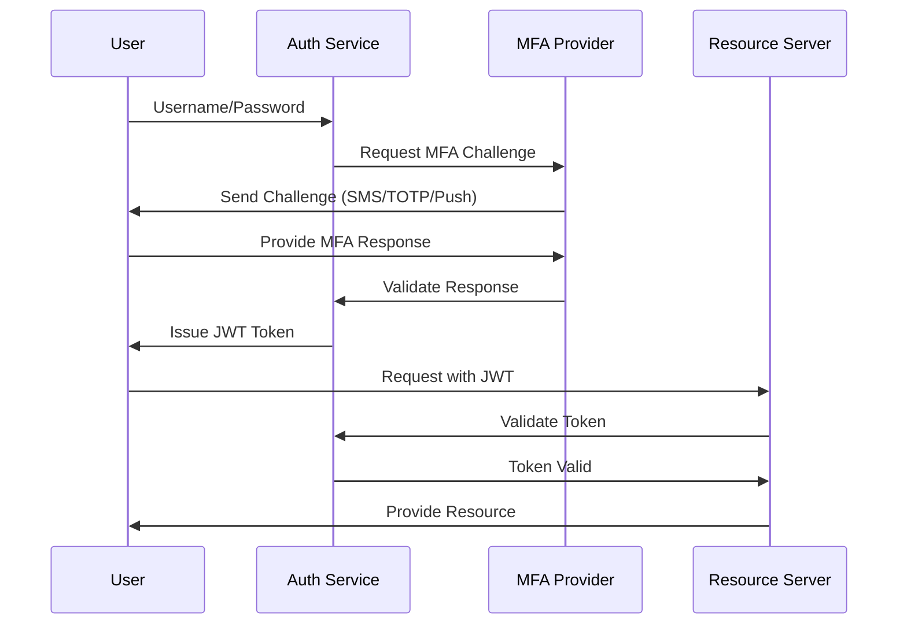
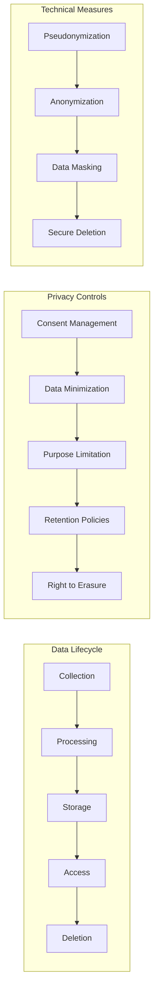
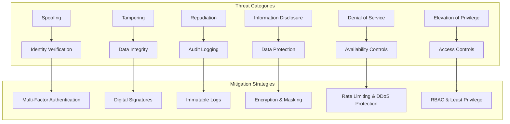
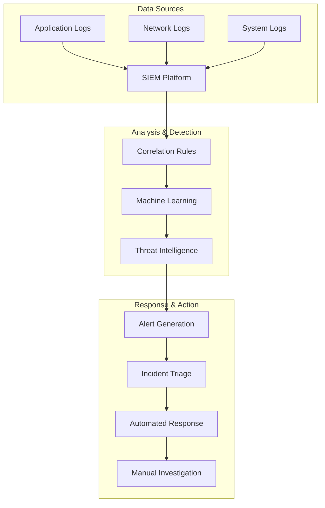
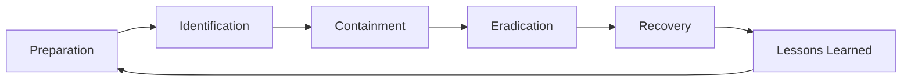

# 🔒 Security & Compliance Framework

**Document ID:** 050-security-compliance  
**Last Updated:** 2024-12-19  
**Version:** 1.0  
**Related Documents:** [030-software-architecture](030-software-architecture.md),
[040-development-implementation](040-development-implementation.md),
[080-implementation-roadmap](080-implementation-roadmap.md)

---

## Executive Summary

This document outlines the comprehensive security framework and compliance requirements for our multi-tier application
architecture. It establishes security controls, compliance protocols, and risk management strategies to ensure data
protection, regulatory adherence, and system integrity.

**Key Security Objectives:**

- Implement zero-trust security architecture
- Ensure GDPR, SOC 2, and industry-specific compliance
- Establish comprehensive audit trails and monitoring
- Maintain 99.9% security incident response effectiveness

---

## Table of Contents

1. [Security Architecture Framework](#security-architecture-framework)
2. [Authentication & Authorization](#authentication--authorization)
3. [Data Protection & Privacy](#data-protection--privacy)
4. [Compliance Requirements](#compliance-requirements)
5. [Threat Management](#threat-management)
6. [Security Monitoring](#security-monitoring)
7. [Incident Response](#incident-response)
8. [Implementation Roadmap](#implementation-roadmap)

---

## Security Architecture Framework

### Zero-Trust Security Model

```mermaid
graph TB
    subgraph "Zero-Trust Architecture"
        A[User Request] --> B[Identity Verification]
        B --> C[Device Authentication]
        C --> D[Network Security]
        D --> E[Application Security]
        E --> F[Data Security]
        F --> G[Resource Access]
    end

    subgraph "Security Layers"
        H[Network Perimeter] --> I[Application Firewall]
        I --> J[API Gateway Security]
        J --> K[Service Mesh Security]
        K --> L[Database Security]
    end

    subgraph "Monitoring & Response"
        M[SIEM System] --> N[Threat Detection]
        N --> O[Automated Response]
        O --> P[Incident Management]
    end
```



### Security Principles

**Core Security Principles:**

1. **Least Privilege Access**: Grant minimum required permissions
2. **Defense in Depth**: Multiple security layers
3. **Fail Secure**: Default deny policies
4. **Continuous Verification**: Never trust, always verify
5. **Audit Everything**: Comprehensive logging and monitoring

### Security Domains

| Domain                  | Components                       | Priority | Status         |
| ----------------------- | -------------------------------- | -------- | -------------- |
| Identity & Access       | OAuth 2.0, RBAC, MFA             | Critical | Implementation |
| Network Security        | TLS 1.3, VPN, Firewall           | Critical | Active         |
| Application Security    | OWASP Top 10, SAST, DAST         | High     | Planning       |
| Data Security           | Encryption, DLP, Backup          | Critical | Implementation |
| Infrastructure Security | Container Security, K8s Policies | High     | Planning       |

---

## Authentication & Authorization

### Multi-Factor Authentication (MFA)

**MFA Implementation Strategy:**



### Role-Based Access Control (RBAC)

**Role Hierarchy:**

```yaml
roles:
  super_admin:
    permissions: ['*']
    inheritance: []

  admin:
    permissions:
      - 'users.manage'
      - 'system.configure'
      - 'audit.view'
    inheritance: ['moderator']

  moderator:
    permissions:
      - 'content.moderate'
      - 'users.suspend'
      - 'reports.view'
    inheritance: ['user']

  user:
    permissions:
      - 'profile.read'
      - 'profile.write'
      - 'content.create'
    inheritance: []
```

### OAuth 2.0 Implementation

**OAuth Flow Configuration:**

- **Authorization Code Flow**: Web applications
- **PKCE Flow**: Mobile and SPA applications
- **Client Credentials Flow**: Service-to-service
- **Device Authorization Flow**: IoT devices

**Token Management:**

- **Access Token Lifetime**: 15 minutes
- **Refresh Token Lifetime**: 30 days
- **Token Rotation**: Automatic on refresh
- **Revocation Support**: Immediate token invalidation

---

## Data Protection & Privacy

### Encryption Standards

**Encryption at Rest:**

- **Algorithm**: AES-256-GCM
- **Key Management**: AWS KMS / Azure Key Vault
- **Key Rotation**: Automated every 90 days
- **Backup Encryption**: Separate key hierarchy

**Encryption in Transit:**

- **Protocol**: TLS 1.3
- **Cipher Suites**: AEAD ciphers only
- **Certificate Management**: Automated renewal
- **HSTS**: Strict-Transport-Security enabled

### Personal Data Protection

**GDPR Compliance Framework:**



**Data Classification:**

- **Public**: Marketing content, documentation
- **Internal**: Business processes, analytics
- **Confidential**: Customer data, financial records
- **Restricted**: Authentication data, encryption keys

### Privacy by Design

**Implementation Principles:**

1. **Data Minimization**: Collect only necessary data
2. **Purpose Limitation**: Use data only for stated purposes
3. **Storage Limitation**: Retain data for minimum required time
4. **Transparency**: Clear privacy notices and policies
5. **User Rights**: Comprehensive data subject rights

---

## Compliance Requirements

### Regulatory Frameworks

**Primary Compliance Standards:**

- **GDPR**: General Data Protection Regulation
- **SOC 2 Type II**: Service Organization Control
- **ISO 27001**: Information Security Management
- **PCI DSS**: Payment Card Industry Data Security
- **HIPAA**: Health Insurance Portability (if applicable)

### SOC 2 Compliance

**Trust Service Criteria:**

```yaml
security:
  description: 'Information and systems are protected against unauthorized access'
  controls:
    - access_management
    - logical_security
    - network_security
    - data_classification

availability:
  description: 'Information and systems are available for operation and use'
  controls:
    - performance_monitoring
    - capacity_management
    - backup_procedures
    - disaster_recovery

processing_integrity:
  description: 'System processing is complete, valid, accurate, timely, and authorized'
  controls:
    - data_validation
    - error_handling
    - quality_assurance
    - change_management

confidentiality:
  description: 'Information designated as confidential is protected'
  controls:
    - data_encryption
    - access_restrictions
    - secure_transmission
    - confidentiality_agreements

privacy:
  description:
    'Personal information is collected, used, retained, disclosed, and disposed of in conformity with commitments'
  controls:
    - privacy_notice
    - data_collection
    - data_retention
    - data_disposal
```

### Audit and Documentation

**Compliance Documentation:**

- **Policy Documents**: Security policies and procedures
- **Control Matrices**: Mapping controls to requirements
- **Evidence Collection**: Automated compliance monitoring
- **Audit Reports**: Regular internal and external audits
- **Remediation Plans**: Compliance gap resolution

---

## Threat Management

### Threat Modeling

**STRIDE Threat Analysis:**



### Vulnerability Management

**Vulnerability Lifecycle:**

1. **Discovery**: Automated scanning and manual testing
2. **Assessment**: Risk scoring and prioritization
3. **Remediation**: Patch management and fixes
4. **Verification**: Validation of remediation
5. **Reporting**: Status tracking and metrics

**Scanning Schedule:**

- **Infrastructure**: Weekly automated scans
- **Applications**: Continuous SAST/DAST
- **Dependencies**: Daily vulnerability checks
- **Containers**: On every build and deployment

### Security Testing

**Testing Methodologies:**

- **SAST**: Static Application Security Testing
- **DAST**: Dynamic Application Security Testing
- **IAST**: Interactive Application Security Testing
- **Penetration Testing**: Quarterly external assessments
- **Red Team Exercises**: Annual comprehensive testing

---

## Security Monitoring

### Security Operations Center (SOC)

**SOC Architecture:**



### Key Security Metrics

**Security KPIs:**

- **Mean Time to Detection (MTTD)**: < 5 minutes
- **Mean Time to Response (MTTR)**: < 15 minutes
- **False Positive Rate**: < 5%
- **Security Incident Resolution**: 95% within SLA
- **Vulnerability Remediation**: Critical within 24 hours

### Monitoring Tools

**Security Stack:**

- **SIEM**: Splunk Enterprise Security
- **EDR**: CrowdStrike Falcon
- **Vulnerability Scanner**: Nessus Professional
- **WAF**: Cloudflare Security
- **DLP**: Microsoft Purview

---

## Incident Response

### Incident Response Plan

**Response Phases:**



### Incident Classification

**Severity Levels:**

- **Critical (P1)**: Active data breach, system compromise
- **High (P2)**: Potential data exposure, service disruption
- **Medium (P3)**: Security policy violation, unsuccessful attack
- **Low (P4)**: Security awareness, minor configuration issue

### Response Team Structure

**Incident Response Team:**

- **Incident Commander**: Overall response coordination
- **Security Analyst**: Technical investigation and analysis
- **System Administrator**: System containment and recovery
- **Legal Counsel**: Regulatory and legal implications
- **Communications**: Internal and external communications

### Communication Plan

**Stakeholder Notification:**

- **Internal Team**: Immediate (within 15 minutes)
- **Management**: Within 1 hour
- **Customers**: Within 4 hours (if affected)
- **Regulators**: Within 72 hours (GDPR requirement)
- **Law Enforcement**: As required by jurisdiction

---

## Implementation Roadmap

### Phase 1: Foundation (Months 1-3)

**Core Security Infrastructure:**

- [ ] Identity and Access Management (IAM) implementation
- [ ] Multi-factor authentication deployment
- [ ] Network security controls (firewalls, VPN)
- [ ] Basic encryption implementation (at rest and in transit)
- [ ] Security monitoring tools deployment

**Deliverables:**

- Functional IAM system with RBAC
- MFA enabled for all administrative accounts
- Network segmentation and access controls
- Data encryption across all systems
- Basic SIEM deployment and configuration

### Phase 2: Enhanced Protection (Months 4-6)

**Advanced Security Controls:**

- [ ] Application security testing integration
- [ ] Container and Kubernetes security
- [ ] Advanced threat detection and response
- [ ] Data loss prevention (DLP) implementation
- [ ] Security awareness training program

**Deliverables:**

- Automated security testing in CI/CD pipeline
- Container security policies and scanning
- Advanced threat detection capabilities
- DLP policies and enforcement
- Comprehensive security training program

### Phase 3: Compliance & Optimization (Months 7-12)

**Compliance and Maturity:**

- [ ] SOC 2 Type II certification
- [ ] GDPR compliance validation
- [ ] Security maturity assessment
- [ ] Incident response plan testing
- [ ] Continuous improvement program

**Deliverables:**

- SOC 2 Type II certification achieved
- GDPR compliance documentation and validation
- Mature security processes and procedures
- Tested and validated incident response capabilities
- Ongoing security improvement framework

### Success Metrics

**Key Performance Indicators:**

- **Security Incidents**: Reduce by 80% year-over-year
- **Compliance Score**: Achieve 95% across all frameworks
- **Mean Time to Detection**: Under 5 minutes
- **Mean Time to Response**: Under 15 minutes
- **Security Training Completion**: 100% of workforce

---

## Cross-References

- **[030-software-architecture.md](030-software-architecture.md)**: Security architecture integration points
- **[040-development-implementation.md](040-development-implementation.md)**: Secure development practices and tools
- **[060-deployment-strategies.md](060-deployment-strategies.md)**: Security considerations in deployment
- **[080-implementation-roadmap.md](080-implementation-roadmap.md)**: Security implementation timeline and dependencies

---

**Next Document:** [060-deployment-strategies.md](060-deployment-strategies.md) - Infrastructure and Deployment
Approaches
