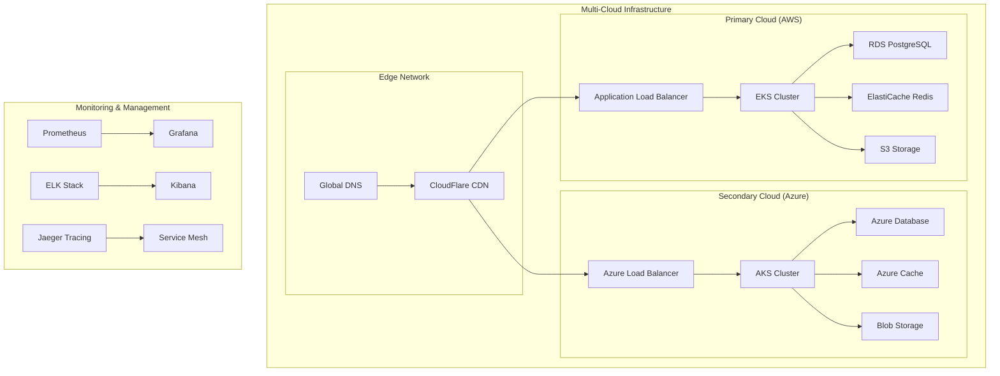
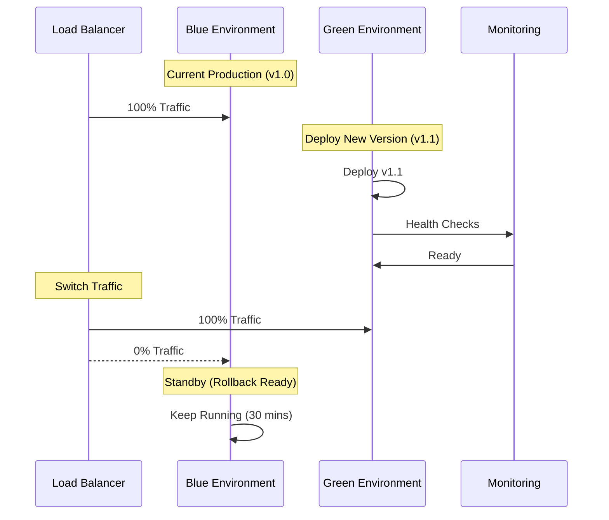
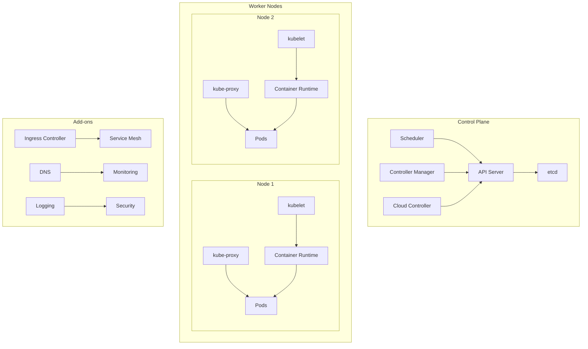
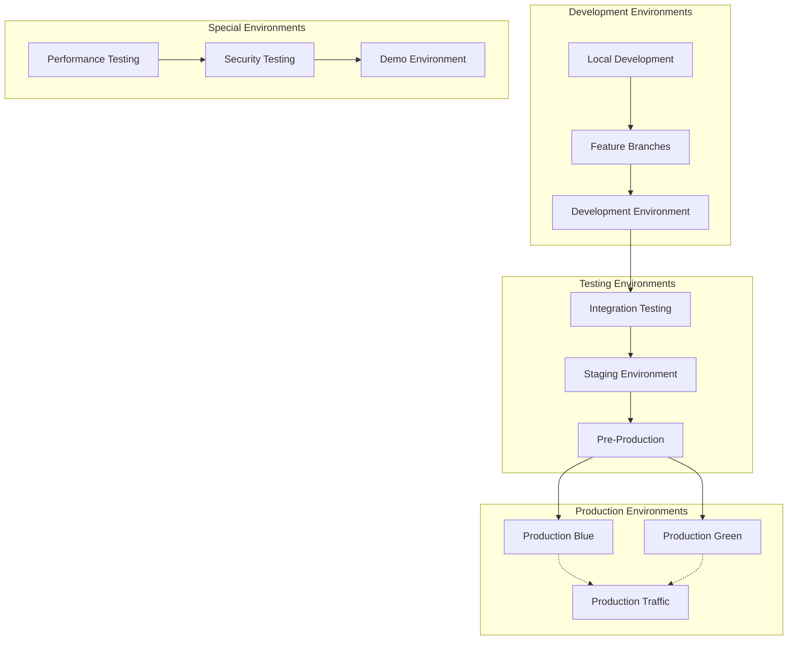
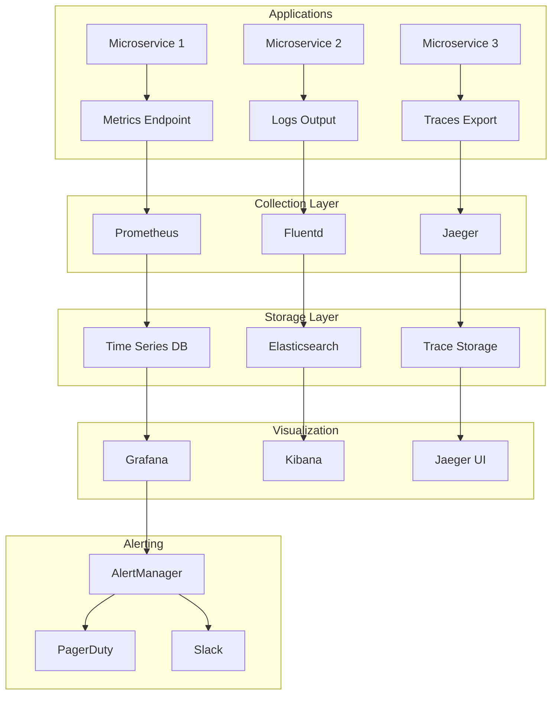
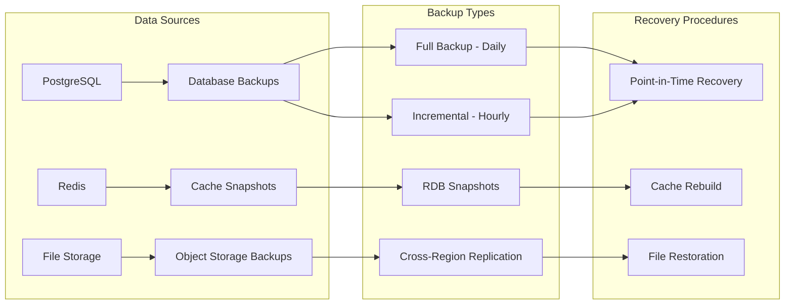

# 🚀 Deployment Strategies & Infrastructure

**Document ID:** 060-deployment-strategies  
**Last Updated:** 2024-12-19  
**Version:** 1.0  
**Related Documents:** [030-software-architecture](030-software-architecture.md),
[050-security-compliance](050-security-compliance.md), [080-implementation-roadmap](080-implementation-roadmap.md)

---

## Executive Summary

This document outlines the comprehensive deployment strategies, infrastructure architecture, and operational procedures
for our multi-tier application ecosystem. It establishes deployment patterns, infrastructure as code practices, and
operational excellence frameworks to ensure reliable, scalable, and efficient system delivery.

**Key Deployment Objectives:**

- Achieve 99.9% deployment success rate
- Implement zero-downtime deployment strategies
- Establish Infrastructure as Code (IaC) practices
- Ensure multi-environment deployment consistency

---

## Table of Contents

1. [Infrastructure Architecture](#infrastructure-architecture)
2. [Deployment Patterns](#deployment-patterns)
3. [Container Orchestration](#container-orchestration)
4. [CI/CD Pipeline Strategy](#cicd-pipeline-strategy)
5. [Environment Management](#environment-management)
6. [Monitoring & Observability](#monitoring--observability)
7. [Disaster Recovery](#disaster-recovery)
8. [Implementation Timeline](#implementation-timeline)

---

## Infrastructure Architecture

### Cloud-Native Architecture



### Infrastructure Components

**Core Infrastructure Stack:**

- **Compute**: Kubernetes clusters (EKS/AKS)
- **Database**: PostgreSQL with read replicas
- **Cache**: Redis clusters with persistence
- **Storage**: Object storage (S3/Blob) with CDN
- **Networking**: Service mesh with mutual TLS
- **Monitoring**: Prometheus, Grafana, ELK stack

### Infrastructure as Code (IaC)

**Terraform Configuration Structure:**

```yaml
infrastructure:
  modules:
    - networking:
        vpc_cidr: '10.0.0.0/16'
        subnets:
          public: ['10.0.1.0/24', '10.0.2.0/24']
          private: ['10.0.10.0/24', '10.0.20.0/24']
          database: ['10.0.100.0/24', '10.0.200.0/24']

    - kubernetes:
        node_groups:
          system:
            instance_type: 't3.medium'
            min_size: 2
            max_size: 5
          application:
            instance_type: 't3.large'
            min_size: 3
            max_size: 20

    - database:
        engine: 'postgres'
        version: '15.4'
        instance_class: 'db.r6g.large'
        multi_az: true
        backup_retention: 30

    - monitoring:
        prometheus:
          retention: '30d'
          storage: '100Gi'
        grafana:
          admin_password: '${random_password.grafana_admin}'
```

### Resource Optimization

**Cost Management Strategy:**

- **Auto-scaling**: Horizontal and vertical pod autoscaling
- **Spot Instances**: 70% spot instances for non-critical workloads
- **Reserved Instances**: 30% reserved for predictable workloads
- **Resource Quotas**: Namespace-level resource limits
- **Lifecycle Policies**: Automated resource cleanup

---

## Deployment Patterns

### Blue-Green Deployment



**Blue-Green Configuration:**

- **Deployment Time**: 5-10 minutes
- **Rollback Time**: < 30 seconds
- **Resource Overhead**: 2x during deployment
- **Risk Level**: Low (instant rollback capability)

### Canary Deployment

**Canary Release Strategy:**

```yaml
canary_deployment:
  stages:
    - name: 'initial'
      traffic_percentage: 5
      duration: '10m'
      success_criteria:
        error_rate: '< 0.1%'
        response_time: '< 500ms'

    - name: 'ramp_up'
      traffic_percentage: 25
      duration: '20m'
      success_criteria:
        error_rate: '< 0.1%'
        response_time: '< 500ms'

    - name: 'full_rollout'
      traffic_percentage: 100
      duration: 'continuous'
      success_criteria:
        error_rate: '< 0.1%'
        response_time: '< 500ms'

  rollback_triggers:
    - error_rate: '> 1%'
    - response_time: '> 1000ms'
    - manual_intervention: true
```

### Rolling Deployment

**Rolling Update Configuration:**

- **Max Unavailable**: 25%
- **Max Surge**: 25%
- **Update Strategy**: RollingUpdate
- **Readiness Probe**: HTTP health check
- **Liveness Probe**: Application health endpoint

---

## Container Orchestration

### Kubernetes Architecture



### Kubernetes Manifests Structure

**Application Deployment:**

```yaml
apiVersion: apps/v1
kind: Deployment
metadata:
  name: user-service
  namespace: production
spec:
  replicas: 3
  strategy:
    type: RollingUpdate
    rollingUpdate:
      maxUnavailable: 1
      maxSurge: 1
  selector:
    matchLabels:
      app: user-service
  template:
    metadata:
      labels:
        app: user-service
        version: v1.2.0
    spec:
      containers:
        - name: user-service
          image: registry.example.com/user-service:v1.2.0
          ports:
            - containerPort: 8080
          env:
            - name: DATABASE_URL
              valueFrom:
                secretKeyRef:
                  name: database-secret
                  key: url
          resources:
            requests:
              memory: '256Mi'
              cpu: '250m'
            limits:
              memory: '512Mi'
              cpu: '500m'
          livenessProbe:
            httpGet:
              path: /health
              port: 8080
            initialDelaySeconds: 30
            periodSeconds: 10
          readinessProbe:
            httpGet:
              path: /ready
              port: 8080
            initialDelaySeconds: 5
            periodSeconds: 5
```

### Service Mesh Integration

**Istio Configuration:**

- **Traffic Management**: Intelligent routing and load balancing
- **Security**: Mutual TLS and access policies
- **Observability**: Distributed tracing and metrics
- **Policy Enforcement**: Rate limiting and circuit breaking

---

## CI/CD Pipeline Strategy

### Pipeline Architecture

```mermaid
graph LR
    subgraph "Source Control"
        A[Git Repository] --> B[Webhook Trigger]
    end

    subgraph "CI Pipeline"
        B --> C[Code Quality Check]
        C --> D[Unit Tests]
        D --> E[Security Scan]
        E --> F[Build Docker Image]
        F --> G[Container Scan]
        G --> H[Push to Registry]
    end

    subgraph "CD Pipeline"
        H --> I[Deploy to Dev]
        I --> J[Integration Tests]
        J --> K[Deploy to Staging]
        K --> L[E2E Tests]
        L --> M[Deploy to Production]
    end

    subgraph "Operations"
        M --> N[Health Monitoring]
        N --> O[Performance Testing]
        O --> P[Alert Management]
    end
```



### GitOps Workflow

**ArgoCD Configuration:**

```yaml
apiVersion: argoproj.io/v1alpha1
kind: Application
metadata:
  name: user-service-prod
  namespace: argocd
spec:
  project: default
  source:
    repoURL: https://github.com/company/k8s-manifests
    targetRevision: main
    path: production/user-service
  destination:
    server: https://kubernetes.default.svc
    namespace: production
  syncPolicy:
    automated:
      prune: true
      selfHeal: true
    syncOptions:
      - CreateNamespace=true
  revisionHistoryLimit: 10
```

### Pipeline Quality Gates

**Quality Criteria:**

- **Code Coverage**: Minimum 80%
- **Security Scan**: No critical vulnerabilities
- **Performance Tests**: Response time < 500ms
- **Integration Tests**: 100% pass rate
- **Deployment Success**: Zero failed deployments

### Branch Strategy

**Git Flow Implementation:**

- **main**: Production-ready code
- **develop**: Integration branch for features
- **feature/\***: Individual feature development
- **hotfix/\***: Critical production fixes
- **release/\***: Release preparation branches

---

## Environment Management

### Environment Strategy



### Environment Configuration

**Environment Specifications:**

```yaml
environments:
  development:
    replicas: 1
    resources:
      cpu: '100m'
      memory: '128Mi'
    database: 'dev-postgres'
    features:
      debug_mode: true
      log_level: 'debug'

  staging:
    replicas: 2
    resources:
      cpu: '250m'
      memory: '256Mi'
    database: 'staging-postgres'
    features:
      debug_mode: false
      log_level: 'info'

  production:
    replicas: 5
    resources:
      cpu: '500m'
      memory: '512Mi'
    database: 'prod-postgres-cluster'
    features:
      debug_mode: false
      log_level: 'warn'
```

### Configuration Management

**ConfigMap and Secret Management:**

- **Application Config**: ConfigMaps for non-sensitive data
- **Secrets Management**: Kubernetes secrets with encryption
- **Environment Variables**: Injected at runtime
- **Feature Flags**: External configuration service
- **Database Migrations**: Automated with version control

---

## Monitoring & Observability

### Observability Stack



### Key Metrics

**SLI/SLO Definition:**

```yaml
service_level_indicators:
  availability:
    definition: 'Percentage of successful HTTP requests'
    measurement: "sum(rate(http_requests_total{status!~'5..'}[5m])) / sum(rate(http_requests_total[5m]))"
    objective: 99.9%

  latency:
    definition: '95th percentile response time'
    measurement: 'histogram_quantile(0.95, rate(http_request_duration_seconds_bucket[5m]))'
    objective: '< 500ms'

  error_rate:
    definition: 'Percentage of HTTP 5xx responses'
    measurement: "sum(rate(http_requests_total{status=~'5..'}[5m])) / sum(rate(http_requests_total[5m]))"
    objective: '< 0.1%'
```

### Alerting Strategy

**Alert Hierarchy:**

- **Critical**: Service down, data loss risk
- **Warning**: Performance degradation, capacity issues
- **Info**: Deployment notifications, maintenance alerts

**Alert Routing:**

- **Critical**: Immediate PagerDuty escalation
- **Warning**: Slack notification during business hours
- **Info**: Email digest and dashboard display

---

## Disaster Recovery

### Backup Strategy



### Business Continuity Plan

**Recovery Time Objectives (RTO):**

- **Critical Services**: 15 minutes
- **Standard Services**: 1 hour
- **Non-Critical Services**: 4 hours

**Recovery Point Objectives (RPO):**

- **Transactional Data**: 5 minutes
- **User Content**: 15 minutes
- **Analytics Data**: 1 hour

### Multi-Region Deployment

**Failover Strategy:**

- **Active-Active**: Primary and secondary regions
- **Automatic Failover**: Health-based traffic routing
- **Data Synchronization**: Asynchronous replication
- **Conflict Resolution**: Last-write-wins with timestamps

---

## Implementation Timeline

### Phase 1: Foundation (Months 1-2)

**Infrastructure Setup:**

- [ ] Cloud provider account setup and configuration
- [ ] Kubernetes cluster deployment (EKS/AKS)
- [ ] Basic networking and security groups
- [ ] Container registry setup
- [ ] Initial CI/CD pipeline implementation

**Deliverables:**

- Functional Kubernetes clusters in dev/staging
- Basic CI/CD pipeline with automated builds
- Container registry with security scanning
- Infrastructure as Code (Terraform) foundation

### Phase 2: Core Services (Months 3-4)

**Service Deployment:**

- [ ] Database clusters with high availability
- [ ] Redis cache clusters with persistence
- [ ] Service mesh implementation (Istio)
- [ ] Monitoring and logging stack deployment
- [ ] Basic application deployments

**Deliverables:**

- Production-ready database infrastructure
- Service mesh with security policies
- Comprehensive monitoring and alerting
- Core applications deployed and functional

### Phase 3: Advanced Features (Months 5-6)

**Production Optimization:**

- [ ] Blue-green deployment implementation
- [ ] Canary deployment strategies
- [ ] Advanced monitoring and observability
- [ ] Disaster recovery procedures
- [ ] Performance optimization and auto-scaling

**Deliverables:**

- Zero-downtime deployment capabilities
- Advanced deployment strategies operational
- Full observability stack with SLO monitoring
- Tested disaster recovery procedures
- Optimized performance and cost management

### Success Metrics

**Deployment KPIs:**

- **Deployment Frequency**: Daily deployments achieved
- **Lead Time**: Code to production in < 2 hours
- **Deployment Success Rate**: 99.9% successful deployments
- **Mean Time to Recovery**: < 15 minutes
- **Infrastructure Cost**: 20% reduction through optimization

---

## Cross-References

- **[030-software-architecture.md](030-software-architecture.md)**: Architecture components and service integration
- **[050-security-compliance.md](050-security-compliance.md)**: Security controls and compliance in deployment
- **[070-identifier-strategy.md](070-identifier-strategy.md)**: Identifier consistency across environments
- **[080-implementation-roadmap.md](080-implementation-roadmap.md)**: Implementation timeline and dependencies

---

**Next Document:** [070-identifier-strategy.md](070-identifier-strategy.md) - Consolidated ID Systems Analysis
