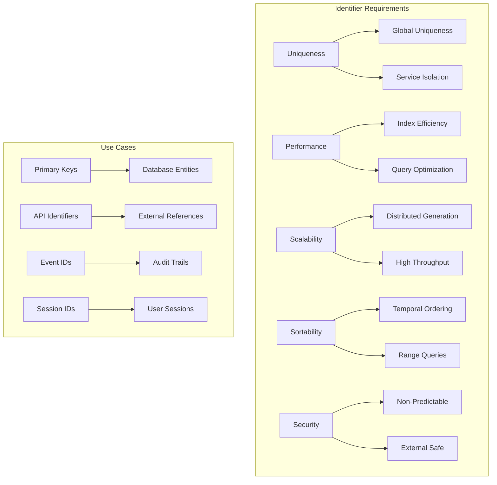
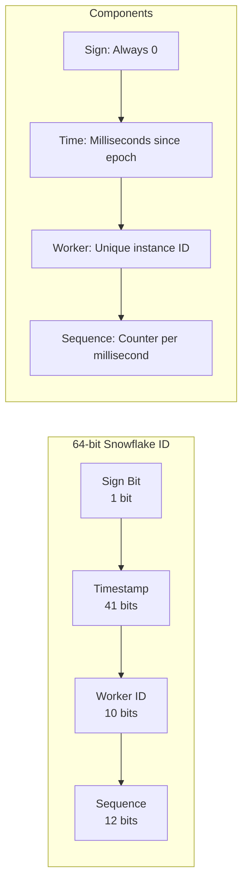
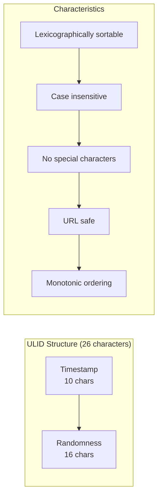
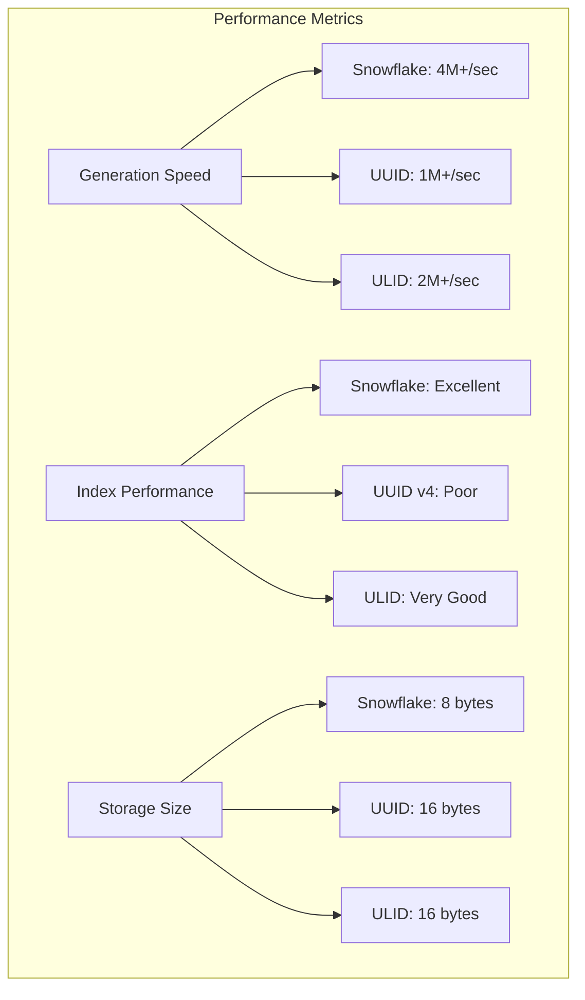

# 🔗 Identifier Strategy & Systems Analysis

**Document ID:** 070-identifier-strategy  
**Last Updated:** 2024-12-19  
**Version:** 1.0  
**Related Documents:** [030-software-architecture](030-software-architecture.md),
[040-development-implementation](040-development-implementation.md),
[060-deployment-strategies](060-deployment-strategies.md)

---

## Executive Summary

This document provides a comprehensive analysis of identifier systems for our multi-tier application architecture. It
evaluates Snowflake IDs, UUIDs, and ULIDs to establish a consistent, scalable, and performance-optimized identifier
strategy across all system components.

**Key Strategic Decisions:**

- Adopt Snowflake IDs for primary entity identification
- Implement UUIDs for external API integration
- Use ULIDs for distributed event sourcing
- Establish consistent identifier patterns across all services

---

## Table of Contents

1. [Identifier Requirements Analysis](#identifier-requirements-analysis)
2. [Snowflake ID Implementation](#snowflake-id-implementation)
3. [UUID Strategy](#uuid-strategy)
4. [ULID Integration](#ulid-integration)
5. [Comparative Analysis](#comparative-analysis)
6. [Implementation Guidelines](#implementation-guidelines)
7. [Migration Strategy](#migration-strategy)
8. [Performance Optimization](#performance-optimization)

---

## Identifier Requirements Analysis

### Business Requirements

**Primary Requirements:**

- **Uniqueness**: Globally unique across all services
- **Performance**: Optimized for database indexing and queries
- **Scalability**: Support for distributed system generation
- **Sortability**: Time-ordered for efficient range queries
- **Security**: Non-predictable for external exposure

### Technical Requirements



### System Context

**Identifier Usage Patterns:**

- **User Management**: 10M+ users, high read/write ratio
- **Content Management**: 100M+ items, frequent queries
- **Event Sourcing**: 1B+ events, append-only patterns
- **API Integration**: External system compatibility
- **Audit Logging**: Comprehensive traceability

---

## Snowflake ID Implementation

### Snowflake ID Structure



**Snowflake ID Characteristics:**

- **Total Length**: 64 bits (8 bytes)
- **Timestamp Range**: 69 years from custom epoch
- **Worker Instances**: 1,024 unique workers
- **Sequences per MS**: 4,096 per worker per millisecond
- **Generation Rate**: 4M+ IDs per second per worker

### Laravel Implementation

**Snowflake ID Service:**

```php
<?php

namespace App\Services;

class SnowflakeIdGenerator
{
    private const EPOCH = 1640995200000; // 2022-01-01 00:00:00 UTC
    private const WORKER_ID_BITS = 10;
    private const SEQUENCE_BITS = 12;
    private const MAX_WORKER_ID = (1 << self::WORKER_ID_BITS) - 1;
    private const MAX_SEQUENCE = (1 << self::SEQUENCE_BITS) - 1;

    private int $workerId;
    private int $sequence = 0;
    private int $lastTimestamp = -1;

    public function __construct(int $workerId)
    {
        if ($workerId < 0 || $workerId > self::MAX_WORKER_ID) {
            throw new InvalidArgumentException("Worker ID must be between 0 and " . self::MAX_WORKER_ID);
        }
        $this->workerId = $workerId;
    }

    public function generate(): string
    {
        $timestamp = $this->currentTimestamp();

        if ($timestamp < $this->lastTimestamp) {
            throw new RuntimeException("Clock moved backwards");
        }

        if ($timestamp === $this->lastTimestamp) {
            $this->sequence = ($this->sequence + 1) & self::MAX_SEQUENCE;
            if ($this->sequence === 0) {
                $timestamp = $this->waitNextMillis($this->lastTimestamp);
            }
        } else {
            $this->sequence = 0;
        }

        $this->lastTimestamp = $timestamp;

        return (string) (
            (($timestamp - self::EPOCH) << (self::WORKER_ID_BITS + self::SEQUENCE_BITS)) |
            ($this->workerId << self::SEQUENCE_BITS) |
            $this->sequence
        );
    }

    private function currentTimestamp(): int
    {
        return (int) (microtime(true) * 1000);
    }

    private function waitNextMillis(int $lastTimestamp): int
    {
        $timestamp = $this->currentTimestamp();
        while ($timestamp <= $lastTimestamp) {
            $timestamp = $this->currentTimestamp();
        }
        return $timestamp;
    }
}
```

### Database Integration

**Migration for Snowflake IDs:**

```php
<?php

use Illuminate\Database\Migrations\Migration;
use Illuminate\Database\Schema\Blueprint;
use Illuminate\Support\Facades\Schema;

return new class extends Migration
{
    public function up(): void
    {
        Schema::create('users', function (Blueprint $table) {
            $table->bigInteger('id')->primary(); // Snowflake ID
            $table->string('uuid')->unique()->index(); // External reference
            $table->string('email')->unique();
            $table->timestamp('email_verified_at')->nullable();
            $table->string('password');
            $table->rememberToken();
            $table->timestamps();

            // Indexes for performance
            $table->index('created_at');
            $table->index(['email', 'created_at']);
        });
    }

    public function down(): void
    {
        Schema::dropIfExists('users');
    }
};
```

### Model Integration

**Eloquent Model with Snowflake ID:**

```php
<?php

namespace App\Models;

use App\Services\SnowflakeIdGenerator;
use Illuminate\Database\Eloquent\Model;
use Illuminate\Support\Str;

class User extends Model
{
    protected $keyType = 'string';
    public $incrementing = false;

    protected $fillable = [
        'email',
        'password',
        'name',
    ];

    protected static function boot()
    {
        parent::boot();

        static::creating(function ($model) {
            if (empty($model->id)) {
                $generator = app(SnowflakeIdGenerator::class);
                $model->id = $generator->generate();
            }

            if (empty($model->uuid)) {
                $model->uuid = (string) Str::uuid();
            }
        });
    }
}
```

---

## UUID Strategy

### UUID Version Analysis

**UUID Version Comparison:**

```yaml
uuid_versions:
  v1:
    description: 'Time-based with MAC address'
    advantages: ['Temporal ordering', 'Unique across space and time']
    disadvantages: ['Privacy concerns', 'MAC address exposure']
    use_case: 'Internal systems with temporal requirements'

  v4:
    description: 'Random-based'
    advantages: ['Privacy-friendly', 'No coordination required']
    disadvantages: ['No temporal ordering', 'Larger index fragmentation']
    use_case: 'External APIs and public identifiers'

  v6:
    description: 'Time-ordered with random data'
    advantages: ['Temporal ordering', 'Privacy-friendly', 'Database-friendly']
    disadvantages: ['Newer standard', 'Limited library support']
    use_case: 'Modern applications requiring both ordering and privacy'

  v7:
    description: 'Unix timestamp with random data'
    advantages: ['Sortable', 'Efficient indexing', 'Future-proof']
    disadvantages: ['Very new standard', 'Limited adoption']
    use_case: 'Next-generation distributed systems'
```

### Implementation Strategy

**UUID Usage Matrix:**

- **External APIs**: UUIDv4 for public-facing identifiers
- **Internal References**: UUIDv6 for cross-service communication
- **Event Sourcing**: UUIDv7 for event ordering
- **Session Management**: UUIDv4 for security and unpredictability

### Laravel UUID Implementation

**UUID Trait for Models:**

```php
<?php

namespace App\Traits;

use Illuminate\Support\Str;

trait HasUuid
{
    protected static function bootHasUuid(): void
    {
        static::creating(function ($model) {
            if (empty($model->uuid)) {
                $model->uuid = (string) Str::uuid();
            }
        });
    }

    public function getRouteKeyName(): string
    {
        return 'uuid';
    }

    public function scopeByUuid($query, string $uuid)
    {
        return $query->where('uuid', $uuid);
    }
}
```

---

## ULID Integration

### ULID Structure and Benefits



**ULID Advantages:**

- **Sortability**: Lexicographically sortable by time
- **Compactness**: 26 characters vs 36 for UUID
- **Readability**: Case-insensitive, no special characters
- **Performance**: Better database indexing than random UUIDs

### Laravel ULID Implementation

**ULID Generator Service:**

```php
<?php

namespace App\Services;

use InvalidArgumentException;

class UlidGenerator
{
    private const ENCODING = '0123456789ABCDEFGHJKMNPQRSTVWXYZ';
    private const ENCODING_LENGTH = 32;
    private const TIME_LENGTH = 10;
    private const RANDOM_LENGTH = 16;

    private static int $lastTime = 0;
    private static array $lastRandom = [];

    public function generate(?int $timestamp = null): string
    {
        $timestamp = $timestamp ?? (int) (microtime(true) * 1000);

        if ($timestamp < 0) {
            throw new InvalidArgumentException('Timestamp must be a positive number');
        }

        $timeChars = $this->encodeTime($timestamp);
        $randomChars = $this->encodeRandom($timestamp);

        return $timeChars . $randomChars;
    }

    private function encodeTime(int $timestamp): string
    {
        $time = '';
        for ($i = self::TIME_LENGTH - 1; $i >= 0; $i--) {
            $time = self::ENCODING[$timestamp & 31] . $time;
            $timestamp = $timestamp >> 5;
        }

        return $time;
    }

    private function encodeRandom(int $timestamp): string
    {
        if ($timestamp === self::$lastTime) {
            // Increment previous random value
            $this->incrementRandom();
        } else {
            // Generate new random value
            self::$lastRandom = [];
            for ($i = 0; $i < self::RANDOM_LENGTH; $i++) {
                self::$lastRandom[$i] = random_int(0, 31);
            }
            self::$lastTime = $timestamp;
        }

        $random = '';
        foreach (self::$lastRandom as $value) {
            $random .= self::ENCODING[$value];
        }

        return $random;
    }

    private function incrementRandom(): void
    {
        for ($i = self::RANDOM_LENGTH - 1; $i >= 0; $i--) {
            if (self::$lastRandom[$i] < 31) {
                self::$lastRandom[$i]++;
                return;
            }
            self::$lastRandom[$i] = 0;
        }

        // If we reach here, we've overflowed
        throw new InvalidArgumentException('Random value overflow');
    }
}
```

### Event Sourcing Integration

**Event Model with ULID:**

```php
<?php

namespace App\Models;

use App\Services\UlidGenerator;
use Illuminate\Database\Eloquent\Model;

class Event extends Model
{
    protected $keyType = 'string';
    public $incrementing = false;

    protected $fillable = [
        'aggregate_id',
        'event_type',
        'event_data',
        'metadata',
    ];

    protected $casts = [
        'event_data' => 'array',
        'metadata' => 'array',
    ];

    protected static function boot()
    {
        parent::boot();

        static::creating(function ($model) {
            if (empty($model->id)) {
                $generator = app(UlidGenerator::class);
                $model->id = $generator->generate();
            }
        });
    }

    public function scopeByAggregateId($query, string $aggregateId)
    {
        return $query->where('aggregate_id', $aggregateId);
    }

    public function scopeAfterEvent($query, string $eventId)
    {
        return $query->where('id', '>', $eventId);
    }
}
```

---

## Comparative Analysis

### Performance Comparison



### Feature Matrix

| Feature               | Snowflake ID    | UUID v4         | UUID v6/v7      | ULID             |
| --------------------- | --------------- | --------------- | --------------- | ---------------- |
| **Uniqueness**        | Global          | Global          | Global          | Global           |
| **Sortability**       | ✅ Time-ordered | ❌ Random       | ✅ Time-ordered | ✅ Lexicographic |
| **Size**              | 8 bytes         | 16 bytes        | 16 bytes        | 16 bytes         |
| **Generation Speed**  | Very Fast       | Fast            | Fast            | Fast             |
| **Index Performance** | Excellent       | Poor            | Good            | Very Good        |
| **External Safe**     | ❌ Predictable  | ✅ Random       | ✅ Random       | ✅ Random        |
| **Human Readable**    | ❌ Numbers only | ❌ Hex + dashes | ❌ Hex + dashes | ✅ Base32        |
| **URL Safe**          | ✅              | ❌ (dashes)     | ❌ (dashes)     | ✅               |

### Recommendation Matrix

**Use Case Recommendations:**

```yaml
primary_entities:
  identifier: 'Snowflake ID'
  rationale: 'Optimal performance, temporal ordering, compact storage'
  examples: ['users', 'orders', 'products', 'organizations']

external_apis:
  identifier: 'UUID v4'
  rationale: 'Industry standard, unpredictable, widely supported'
  examples: ['API keys', 'public references', 'external integrations']

event_sourcing:
  identifier: 'ULID'
  rationale: 'Lexicographic ordering, monotonic, URL-safe'
  examples: ['events', 'audit_logs', 'message_queues']

session_management:
  identifier: 'UUID v4'
  rationale: 'Security through unpredictability'
  examples: ['session_tokens', 'csrf_tokens', 'temporary_codes']

cross_service:
  identifier: 'UUID v6'
  rationale: 'Time-ordered, privacy-friendly, service-agnostic'
  examples: ['correlation_ids', 'request_ids', 'transaction_ids']
```

---

## Implementation Guidelines

### Service Configuration

**Identifier Service Provider:**

```php
<?php

namespace App\Providers;

use App\Services\SnowflakeIdGenerator;
use App\Services\UlidGenerator;
use Illuminate\Support\ServiceProvider;

class IdentifierServiceProvider extends ServiceProvider
{
    public function register(): void
    {
        $this->app->singleton(SnowflakeIdGenerator::class, function ($app) {
            $workerId = config('identifiers.snowflake.worker_id', 1);
            return new SnowflakeIdGenerator($workerId);
        });

        $this->app->singleton(UlidGenerator::class, function ($app) {
            return new UlidGenerator();
        });
    }

    public function boot(): void
    {
        $this->publishes([
            __DIR__.'/../../config/identifiers.php' => config_path('identifiers.php'),
        ], 'config');
    }
}
```

**Configuration File:**

```php
<?php

return [
    'snowflake' => [
        'worker_id' => env('SNOWFLAKE_WORKER_ID', 1),
        'epoch' => env('SNOWFLAKE_EPOCH', 1640995200000), // 2022-01-01
    ],

    'uuid' => [
        'version' => env('UUID_VERSION', 4),
        'node' => env('UUID_NODE', null),
    ],

    'ulid' => [
        'monotonic' => env('ULID_MONOTONIC', true),
    ],
];
```

### Database Design Patterns

**Multi-Identifier Table Structure:**

```sql
CREATE TABLE users (
    id BIGINT PRIMARY KEY,                    -- Snowflake ID (internal)
    uuid UUID UNIQUE NOT NULL,               -- UUID v4 (external)
    email VARCHAR(255) UNIQUE NOT NULL,
    password VARCHAR(255) NOT NULL,
    created_at TIMESTAMP DEFAULT CURRENT_TIMESTAMP,
    updated_at TIMESTAMP DEFAULT CURRENT_TIMESTAMP ON UPDATE CURRENT_TIMESTAMP,

    INDEX idx_uuid (uuid),
    INDEX idx_email_created (email, created_at),
    INDEX idx_created_at (created_at)
);

CREATE TABLE events (
    id CHAR(26) PRIMARY KEY,                 -- ULID (sortable events)
    aggregate_id BIGINT NOT NULL,            -- Snowflake ID reference
    event_type VARCHAR(100) NOT NULL,
    event_data JSON NOT NULL,
    metadata JSON,
    created_at TIMESTAMP DEFAULT CURRENT_TIMESTAMP,

    INDEX idx_aggregate_created (aggregate_id, created_at),
    INDEX idx_event_type (event_type),
    INDEX idx_created_at (created_at)
);
```

---

## Migration Strategy

### Phase 1: Infrastructure Setup

**Step 1: Service Implementation**

```bash
# Install dependencies
composer require ramsey/uuid
composer require robinvdvleuten/ulid

# Create identifier services
php artisan make:service SnowflakeIdGenerator
php artisan make:service UlidGenerator
php artisan make:provider IdentifierServiceProvider
```

**Step 2: Configuration**

```php
// Add to config/app.php providers array
App\Providers\IdentifierServiceProvider::class,

// Publish configuration
php artisan vendor:publish --provider="App\Providers\IdentifierServiceProvider"
```

### Phase 2: Model Updates

**Step 3: Update Existing Models**

```php
// Update User model
use App\Traits\HasSnowflakeId;
use App\Traits\HasUuid;

class User extends Model
{
    use HasSnowflakeId, HasUuid;

    // ...existing code...
}
```

**Step 4: Database Migrations**

```php
// Create migration for identifier columns
php artisan make:migration add_identifiers_to_existing_tables

// Migration content
public function up(): void
{
    Schema::table('users', function (Blueprint $table) {
        $table->string('uuid')->unique()->after('id');
        $table->index('uuid');
    });
}
```

### Phase 3: API Integration

**Step 5: API Route Updates**

```php
// Update routes to use UUIDs for external access
Route::get('/api/users/{user:uuid}', [UserController::class, 'show']);
Route::put('/api/users/{user:uuid}', [UserController::class, 'update']);
```

**Step 6: Response Transformers**

```php
// API Resource using UUID for external references
class UserResource extends JsonResource
{
    public function toArray($request): array
    {
        return [
            'id' => $this->uuid,  // Use UUID for external API
            'email' => $this->email,
            'name' => $this->name,
            'created_at' => $this->created_at,
        ];
    }
}
```

---

## Performance Optimization

### Indexing Strategy

**Optimized Index Configuration:**

```sql
-- Primary access patterns
CREATE INDEX idx_users_uuid ON users(uuid);
CREATE INDEX idx_users_email_created ON users(email, created_at);

-- Event sourcing patterns
CREATE INDEX idx_events_aggregate_id ON events(aggregate_id, id);
CREATE INDEX idx_events_type_created ON events(event_type, created_at);

-- Composite indexes for common queries
CREATE INDEX idx_users_status_created ON users(status, created_at)
WHERE status != 'deleted';
```

### Caching Strategy

**Identifier Caching:**

```php
<?php

namespace App\Services;

use Illuminate\Support\Facades\Cache;

class CachedIdentifierService
{
    private SnowflakeIdGenerator $snowflake;
    private UlidGenerator $ulid;

    public function __construct(
        SnowflakeIdGenerator $snowflake,
        UlidGenerator $ulid
    ) {
        $this->snowflake = $snowflake;
        $this->ulid = $ulid;
    }

    public function resolveUserByUuid(string $uuid): ?User
    {
        return Cache::remember(
            "user:uuid:{$uuid}",
            3600, // 1 hour
            fn() => User::where('uuid', $uuid)->first()
        );
    }

    public function getEventsAfter(string $aggregateId, string $afterEventId): Collection
    {
        $cacheKey = "events:{$aggregateId}:after:{$afterEventId}";

        return Cache::remember($cacheKey, 300, function () use ($aggregateId, $afterEventId) {
            return Event::byAggregateId($aggregateId)
                       ->afterEvent($afterEventId)
                       ->orderBy('id')
                       ->get();
        });
    }
}
```

### Monitoring and Metrics

**Performance Monitoring:**

```php
// Add to your monitoring service
$metrics = [
    'identifier_generation_time' => [
        'snowflake' => microtime(true) - $start,
        'uuid' => microtime(true) - $start,
        'ulid' => microtime(true) - $start,
    ],
    'database_query_performance' => [
        'uuid_lookups' => $queryTime,
        'snowflake_range_queries' => $queryTime,
        'ulid_ordering' => $queryTime,
    ],
];
```

---

## Cross-References

- **[030-software-architecture.md](030-software-architecture.md)**: Event sourcing and CQRS identifier patterns
- **[040-development-implementation.md](040-development-implementation.md)**: Implementation patterns and testing
  strategies
- **[060-deployment-strategies.md](060-deployment-strategies.md)**: Identifier consistency across environments
- **[080-implementation-roadmap.md](080-implementation-roadmap.md)**: Identifier migration timeline and dependencies

---

**Next Document:** [080-implementation-roadmap.md](080-implementation-roadmap.md) - Implementation Timeline and
Execution Plan
