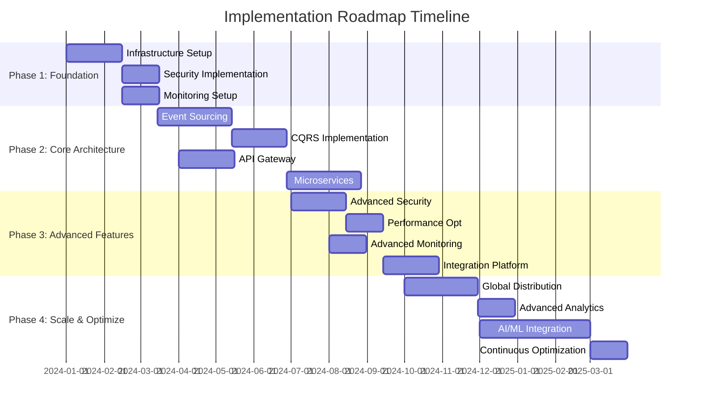
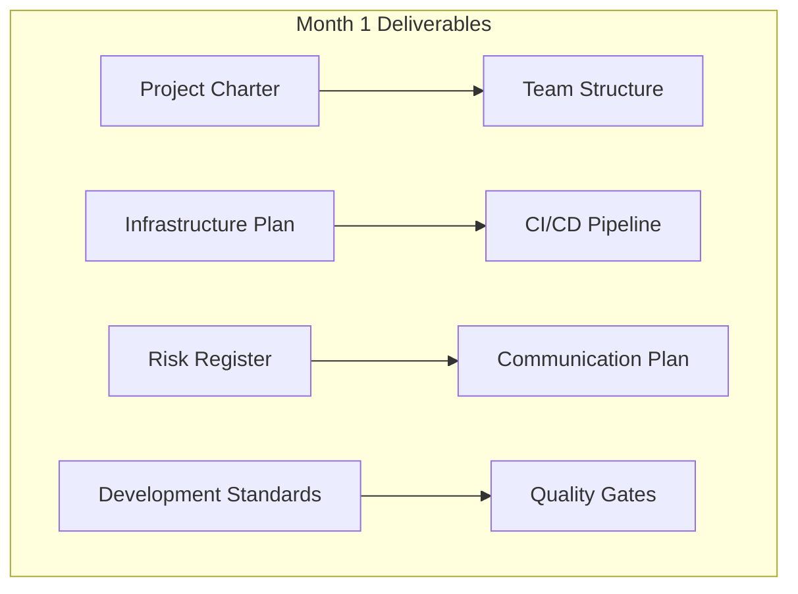
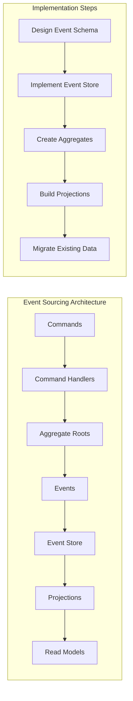
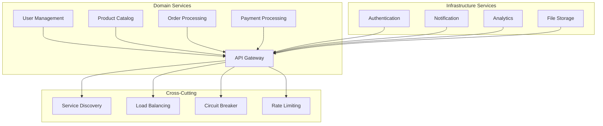
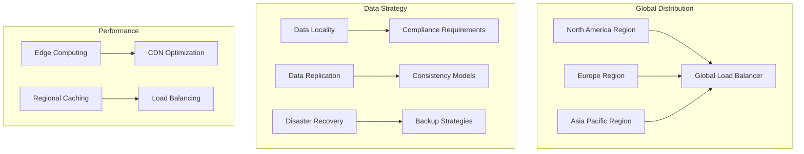
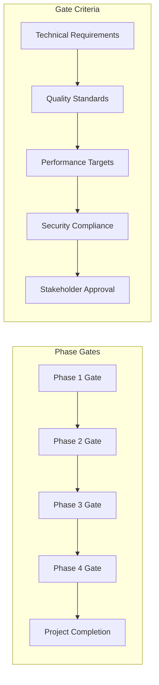

# 🗺️ Implementation Roadmap & Execution Plan

**Document ID:** 080-implementation-roadmap  
**Last Updated:** 2024-12-19  
**Version:** 1.0  
**Related Documents:** [000-index](000-index.md), [010-executive-summary](010-executive-summary.md), All previous
documents

---

## Executive Summary

This document provides a comprehensive implementation roadmap for transforming our current Laravel application into a
robust, scalable, multi-tier system. The roadmap spans 18 months and is organized into strategic phases with clear
deliverables, timelines, and success metrics.

**Key Implementation Objectives:**

- Execute systematic modernization with minimal business disruption
- Achieve 99.9% system availability throughout transition
- Deliver measurable performance improvements at each phase
- Maintain full backward compatibility during migration

---

## Table of Contents

1. [Implementation Overview](#implementation-overview)
2. [Phase 1: Foundation & Assessment](#phase-1-foundation--assessment)
3. [Phase 2: Core Architecture](#phase-2-core-architecture)
4. [Phase 3: Advanced Features](#phase-3-advanced-features)
5. [Phase 4: Optimization & Scale](#phase-4-optimization--scale)
6. [Risk Management](#risk-management)
7. [Resource Planning](#resource-planning)
8. [Success Metrics](#success-metrics)

---

## Implementation Overview

### Strategic Phases



### Phase Overview

| Phase       | Duration | Focus Area            | Investment | Expected ROI               |
| ----------- | -------- | --------------------- | ---------- | -------------------------- |
| **Phase 1** | 3 months | Foundation & Security | $150K      | Risk reduction, compliance |
| **Phase 2** | 6 months | Core Architecture     | $400K      | Performance, scalability   |
| **Phase 3** | 6 months | Advanced Features     | $300K      | Operational efficiency     |
| **Phase 4** | 3 months | Scale & Optimization  | $200K      | Market expansion           |

---

## Phase 1: Foundation & Assessment

### Month 1: Infrastructure & Planning

**Week 1-2: Project Initiation**

- [ ] **Team Assembly**: Form cross-functional implementation team
- [ ] **Stakeholder Alignment**: Conduct kick-off meetings and requirements review
- [ ] **Current State Assessment**: Comprehensive audit of existing systems
- [ ] **Risk Assessment**: Identify and document potential risks and mitigation strategies

**Week 3-4: Infrastructure Foundation**

- [ ] **Cloud Environment Setup**: Configure AWS/Azure accounts and basic networking
- [ ] **CI/CD Pipeline**: Implement basic deployment automation
- [ ] **Development Environment**: Standardize local development setup
- [ ] **Version Control**: Establish branching strategy and code review processes



### Month 2: Security & Monitoring

**Week 5-6: Security Implementation**

- [ ] **Identity Management**: Implement OAuth 2.0 and RBAC
- [ ] **Security Scanning**: Integrate SAST/DAST into pipeline
- [ ] **Encryption**: Implement data encryption at rest and in transit
- [ ] **Compliance Framework**: Establish GDPR and SOC 2 compliance processes

**Week 7-8: Monitoring & Observability**

- [ ] **Logging Infrastructure**: Deploy ELK stack for centralized logging
- [ ] **Metrics Collection**: Implement Prometheus and Grafana
- [ ] **Alerting System**: Configure alert management and escalation
- [ ] **Performance Baseline**: Establish current system performance metrics

### Month 3: Testing & Validation

**Week 9-10: Testing Framework**

- [ ] **Test Automation**: Expand unit, integration, and E2E test coverage
- [ ] **Performance Testing**: Implement load testing with realistic scenarios
- [ ] **Security Testing**: Conduct penetration testing and vulnerability assessment
- [ ] **Documentation**: Create comprehensive technical documentation

**Week 11-12: Phase 1 Validation**

- [ ] **System Validation**: Verify all Phase 1 objectives are met
- [ ] **Performance Review**: Analyze performance improvements and bottlenecks
- [ ] **Stakeholder Review**: Present Phase 1 results and Phase 2 planning
- [ ] **Go/No-Go Decision**: Formal approval to proceed to Phase 2

**Phase 1 Success Criteria:**

- ✅ 99.9% system uptime maintained during implementation
- ✅ Security vulnerabilities reduced by 80%
- ✅ Deployment time reduced by 50%
- ✅ Test coverage increased to 80%
- ✅ All compliance requirements met

---

## Phase 2: Core Architecture

### Month 4-5: Event Sourcing Foundation

**Event Sourcing Implementation:**



**Month 4 Deliverables:**

- [ ] **Event Store Setup**: Implement event storage with PostgreSQL
- [ ] **Event Schema Design**: Define event structures and versioning
- [ ] **Aggregate Design**: Identify and implement core aggregates
- [ ] **Command Processing**: Build command handling infrastructure

**Month 5 Deliverables:**

- [ ] **Projection Engine**: Implement real-time projection updates
- [ ] **Event Replay**: Build event replay and recovery mechanisms
- [ ] **Data Migration**: Migrate core entities to event sourcing
- [ ] **Testing Suite**: Comprehensive testing for event sourcing components

### Month 6-7: CQRS Implementation

**CQRS Architecture:**

```yaml
cqrs_implementation:
  command_side:
    - command_handlers
    - aggregate_repositories
    - event_publishing
    - validation_layer

  query_side:
    - read_model_generators
    - query_handlers
    - view_repositories
    - caching_layer

  infrastructure:
    - message_bus
    - event_dispatcher
    - serialization
    - monitoring
```

**Month 6 Deliverables:**

- [ ] **Command Bus**: Implement command routing and handling
- [ ] **Query Bus**: Build query processing and optimization
- [ ] **Read Models**: Create optimized read models for key use cases
- [ ] **Message Bus**: Implement asynchronous message processing

**Month 7 Deliverables:**

- [ ] **Performance Optimization**: Optimize query performance and caching
- [ ] **Consistency Management**: Implement eventual consistency patterns
- [ ] **Error Handling**: Build robust error handling and retry mechanisms
- [ ] **Monitoring Integration**: Add CQRS-specific monitoring and metrics

### Month 8-9: Microservices Architecture

**Service Decomposition Strategy:**



**Month 8 Deliverables:**

- [ ] **Service Identification**: Define service boundaries and responsibilities
- [ ] **API Gateway**: Implement centralized API management
- [ ] **Service Discovery**: Build service registration and discovery
- [ ] **Inter-Service Communication**: Implement RESTful APIs and message queues

**Month 9 Deliverables:**

- [ ] **Service Deployment**: Deploy initial microservices
- [ ] **Circuit Breakers**: Implement fault tolerance patterns
- [ ] **Distributed Tracing**: Add request tracing across services
- [ ] **Integration Testing**: Build comprehensive service integration tests

---

## Phase 3: Advanced Features

### Month 10-11: Advanced Security & Compliance

**Security Enhancement:**

- [ ] **Zero-Trust Architecture**: Implement comprehensive zero-trust security model
- [ ] **Advanced Threat Detection**: Deploy AI-powered threat detection
- [ ] **Compliance Automation**: Automate compliance monitoring and reporting
- [ ] **Security Orchestration**: Implement automated incident response

**Performance Optimization:**

- [ ] **Database Optimization**: Advanced query optimization and sharding
- [ ] **Caching Strategy**: Implement multi-level caching with Redis
- [ ] **CDN Integration**: Global content delivery optimization
- [ ] **Resource Optimization**: Implement advanced auto-scaling

### Month 12-13: Advanced Monitoring & Analytics

**Observability Enhancement:**

```yaml
observability_stack:
  metrics:
    - business_metrics
    - technical_metrics
    - user_experience_metrics
    - security_metrics

  logging:
    - structured_logging
    - log_aggregation
    - anomaly_detection
    - retention_policies

  tracing:
    - distributed_tracing
    - performance_profiling
    - dependency_mapping
    - bottleneck_identification

  alerting:
    - intelligent_alerting
    - alert_correlation
    - escalation_policies
    - notification_optimization
```

**Advanced Analytics:**

- [ ] **Real-Time Analytics**: Implement streaming analytics platform
- [ ] **Predictive Analytics**: Build predictive models for capacity planning
- [ ] **User Behavior Analytics**: Advanced user journey and conversion tracking
- [ ] **Business Intelligence**: Comprehensive reporting and dashboard suite

### Month 14-15: Integration Platform

**Integration Capabilities:**

- [ ] **API Management**: Advanced API lifecycle management
- [ ] **Event-Driven Integration**: Implement event streaming platform
- [ ] **Partner Integrations**: Build partner onboarding and management
- [ ] **Data Synchronization**: Real-time data synchronization across systems

---

## Phase 4: Optimization & Scale

### Month 16-17: Global Distribution

**Global Infrastructure:**



**Global Capabilities:**

- [ ] **Multi-Region Deployment**: Deploy services across multiple regions
- [ ] **Data Locality**: Implement region-specific data storage
- [ ] **Edge Computing**: Deploy edge services for optimal performance
- [ ] **Global Monitoring**: Implement global observability and alerting

### Month 18: AI/ML Integration & Optimization

**AI/ML Platform:**

- [ ] **ML Pipeline**: Implement MLOps for model deployment and management
- [ ] **Recommendation Engine**: Build intelligent recommendation systems
- [ ] **Predictive Maintenance**: Implement predictive system maintenance
- [ ] **Intelligent Automation**: Deploy AI-powered operational automation

**Continuous Optimization:**

- [ ] **Performance Tuning**: Ongoing performance optimization
- [ ] **Cost Optimization**: Advanced cost management and optimization
- [ ] **Capacity Planning**: Intelligent capacity planning and provisioning
- [ ] **Innovation Pipeline**: Establish innovation and experimentation framework

---

## Risk Management

### Risk Assessment Matrix

| Risk Category                | Probability | Impact | Mitigation Strategy                          | Owner       |
| ---------------------------- | ----------- | ------ | -------------------------------------------- | ----------- |
| **Technical Debt**           | High        | Medium | Gradual refactoring, technical debt tracking | Tech Lead   |
| **Performance Degradation**  | Medium      | High   | Continuous monitoring, rollback procedures   | DevOps      |
| **Security Vulnerabilities** | Low         | High   | Security scanning, penetration testing       | Security    |
| **Integration Failures**     | Medium      | Medium | Comprehensive testing, rollback plans        | Integration |
| **Resource Constraints**     | Medium      | High   | Resource planning, contingency budget        | PM          |

### Contingency Plans

**Critical Risk Scenarios:**

```yaml
contingency_plans:
  performance_degradation:
    triggers: ['response_time > 2s', 'error_rate > 1%']
    actions:
      - automatic_rollback
      - capacity_scaling
      - incident_response

  security_incident:
    triggers: ['unauthorized_access', 'data_breach']
    actions:
      - immediate_isolation
      - incident_response_team
      - stakeholder_notification

  integration_failure:
    triggers: ['third_party_down', 'api_failures']
    actions:
      - fallback_procedures
      - manual_processing
      - vendor_escalation
```

---

## Resource Planning

### Team Structure

```mermaid
graph TB
    subgraph "Leadership"
        A[Project Manager] --> B[Technical Lead]
        B --> C[Architecture Lead]
    end

    subgraph "Development Teams"
        D[Backend Developers] --> E[Frontend Developers]
        E --> F[Mobile Developers]
        F --> G[DevOps Engineers]
    end

    subgraph "Specialized Roles"
        H[Security Engineer] --> I[Data Engineer]
        I --> J[QA Engineers]
        J --> K[Performance Engineer]
    end

    subgraph "External Resources"
        L[Cloud Consultants] --> M[Security Consultants]
        M --> N[Integration Specialists]
    end
```



### Resource Allocation

**Phase-wise Resource Requirements:**

```yaml
resource_allocation:
  phase_1:
    developers: 4
    devops: 2
    security: 1
    qa: 2
    external_consultants: 2

  phase_2:
    developers: 6
    devops: 3
    security: 1
    qa: 3
    external_consultants: 3

  phase_3:
    developers: 5
    devops: 2
    security: 2
    qa: 2
    external_consultants: 2

  phase_4:
    developers: 3
    devops: 2
    security: 1
    qa: 2
    external_consultants: 1
```

### Budget Planning

**Investment Breakdown:**

- **Personnel Costs**: 60% ($630K)
- **Infrastructure**: 25% ($262.5K)
- **Tools & Licenses**: 10% ($105K)
- **Training & Certification**: 3% ($31.5K)
- **Contingency**: 2% ($21K)

---

## Success Metrics

### Key Performance Indicators

**Technical KPIs:**

```yaml
technical_metrics:
  performance:
    response_time: '< 200ms (95th percentile)'
    throughput: '> 10,000 requests/second'
    availability: '99.99% uptime'

  quality:
    test_coverage: '> 90%'
    code_quality: 'A grade (SonarQube)'
    security_vulnerabilities: '0 critical, < 5 high'

  scalability:
    auto_scaling_efficiency: '> 95%'
    resource_utilization: '70-85% average'
    cost_per_transaction: '< $0.01'
```

**Business KPIs:**

```yaml
business_metrics:
  user_experience:
    page_load_time: '< 1 second'
    user_satisfaction: '> 4.5/5'
    conversion_rate: '+15% improvement'

  operational:
    deployment_frequency: 'Daily'
    mean_time_to_recovery: '< 5 minutes'
    incident_resolution: '< 1 hour average'

  financial:
    infrastructure_cost_reduction: '30%'
    development_velocity: '+50%'
    time_to_market: '-40%'
```

### Milestone Tracking

**Phase Completion Criteria:**



### Continuous Improvement

**Feedback Loops:**

- **Weekly**: Team retrospectives and metric reviews
- **Monthly**: Stakeholder reviews and course corrections
- **Quarterly**: Comprehensive phase assessments
- **Annual**: Strategic review and roadmap updates

**Success Validation:**

- **Automated Testing**: Continuous validation of technical requirements
- **Performance Monitoring**: Real-time tracking of performance metrics
- **User Feedback**: Regular collection and analysis of user feedback
- **Business Impact**: Quarterly assessment of business value delivery

---

## Cross-References

This roadmap integrates all previous documents:

- **[000-index.md](000-index.md)**: Master navigation and document relationships
- **[010-executive-summary.md](010-executive-summary.md)**: Strategic vision and objectives
- **[020-product-management.md](020-product-management.md)**: Product strategy and user experience
- **[030-software-architecture.md](030-software-architecture.md)**: Technical architecture and patterns
- **[040-development-implementation.md](040-development-implementation.md)**: Development processes and standards
- **[050-security-compliance.md](050-security-compliance.md)**: Security framework and compliance
- **[060-deployment-strategies.md](060-deployment-strategies.md)**: Infrastructure and deployment
- **[070-identifier-strategy.md](070-identifier-strategy.md)**: Identifier systems and migration

---

**Implementation Status:** Ready for Phase 1 initiation  
**Next Action:** Stakeholder approval and team assembly  
**Estimated Project Completion:** 18 months from start date
