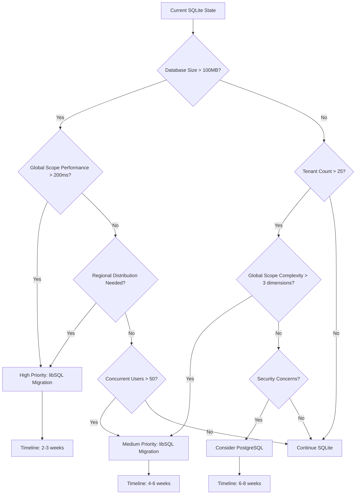
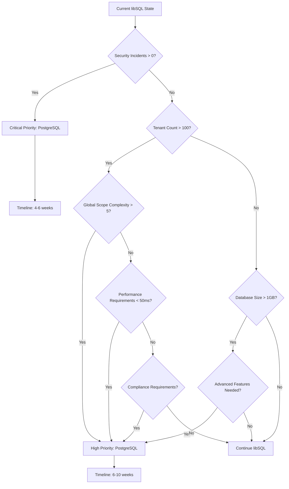

# Decision Framework: Database Platform Transitions

**Document ID:** DB-EVOLUTION-050  
**Version:** 1.0  
**Date:** June 1, 2025  
**Confidence:** 90%

## Executive Summary

This document establishes a comprehensive, data-driven decision framework for determining optimal timing and triggers for database platform transitions, with specific focus on SQLite → libSQL → PostgreSQL migration paths and global scope considerations.

## Decision Framework Architecture

### 1. Multi-Dimensional Decision Matrix

#### Core Decision Factors

| Dimension | Weight | SQLite Threshold | libSQL Threshold | PostgreSQL Threshold | Global Scope Impact |
|-----------|--------|------------------|------------------|---------------------|-------------------|
| **Scale** | 25% | <1,000 records | <1M records | >1M records | Query performance |
| **Security** | 20% | App-level | Enhanced validation | Database-enforced | Isolation guarantees |
| **Performance** | 20% | <200ms queries | <100ms queries | <50ms queries | Scope query efficiency |
| **Concurrency** | 15% | <10 concurrent | <100 concurrent | >100 concurrent | Global scope conflicts |
| **Features** | 10% | Basic SQL | Enhanced SQL | Advanced SQL | Scope complexity support |
| **Geography** | 10% | Single region | Multi-region | Global distribution | Regional scope patterns |

### 2. Automated Monitoring Framework

#### Key Performance Indicators (KPIs)

```php
namespace App\Services\Database;

class DatabaseDecisionEngine
{
    private array $thresholds = [
        'sqlite_to_libsql' => [
            'database_size_mb' => 100,
            'concurrent_users' => 50,
            'global_scope_queries_ms' => 200,
            'tenant_count' => 25,
            'regional_requirements' => true,
            'security_incidents_per_month' => 0,
        ],
        'libsql_to_postgresql' => [
            'database_size_mb' => 1000,
            'concurrent_users' => 500,
            'global_scope_queries_ms' => 100,
            'tenant_count' => 100,
            'complex_scope_dimensions' => 5,
            'security_incidents_per_month' => 1,
        ]
    ];

    public function evaluateCurrentState(): DatabaseRecommendation
    {
        $metrics = $this->collectMetrics();
        $globalScopeAnalysis = $this->analyzeGlobalScopePerformance();
        
        return new DatabaseRecommendation(
            platform: $this->recommendPlatform($metrics, $globalScopeAnalysis),
            confidence: $this->calculateConfidence($metrics),
            timeline: $this->estimateTransitionTime($metrics),
            triggers: $this->identifyTriggeredThresholds($metrics),
            globalScopeImpact: $globalScopeAnalysis
        );
    }

    private function collectMetrics(): array
    {
        return [
            'database_size_mb' => $this->getDatabaseSizeMB(),
            'concurrent_users' => $this->getConcurrentUserCount(),
            'global_scope_queries_ms' => $this->getGlobalScopePerformance(),
            'tenant_count' => $this->getTenantCount(),
            'security_incidents' => $this->getSecurityIncidentCount(),
            'query_complexity' => $this->getQueryComplexityScore(),
            'regional_distribution_need' => $this->getRegionalDistributionNeed(),
            'scope_dimensions' => $this->getGlobalScopeDimensions(),
        ];
    }

    private function analyzeGlobalScopePerformance(): GlobalScopeAnalysis
    {
        $scopeQueries = $this->getGlobalScopeQueries();
        $performance = [];
        
        foreach ($scopeQueries as $query) {
            $performance[] = [
                'pattern' => $query['pattern'],
                'avg_time_ms' => $query['avg_execution_time'],
                'complexity' => $query['scope_dimensions'],
                'tenant_isolation_quality' => $query['isolation_score'],
                'data_exposure_risk' => $query['risk_score']
            ];
        }
        
        return new GlobalScopeAnalysis($performance);
    }
}
```

### 3. Decision Trigger Automation

#### Threshold Monitoring System

```php
class DatabaseThresholdMonitor
{
    public function checkThresholds(): array
    {
        $currentMetrics = app(DatabaseDecisionEngine::class)->collectMetrics();
        $triggeredAlerts = [];
        
        // SQLite → libSQL triggers
        if ($this->evaluateLibSQLMigration($currentMetrics)) {
            $triggeredAlerts[] = new MigrationAlert(
                type: 'libsql_migration_recommended',
                urgency: $this->calculateUrgency($currentMetrics),
                reasons: $this->getLibSQLMigrationReasons($currentMetrics),
                globalScopeImpact: $this->assessGlobalScopeImprovement($currentMetrics)
            );
        }
        
        // libSQL → PostgreSQL triggers
        if ($this->evaluatePostgreSQLMigration($currentMetrics)) {
            $triggeredAlerts[] = new MigrationAlert(
                type: 'postgresql_migration_recommended',
                urgency: $this->calculateUrgency($currentMetrics),
                reasons: $this->getPostgreSQLMigrationReasons($currentMetrics),
                globalScopeImpact: $this->assessRLSBenefit($currentMetrics)
            );
        }
        
        return $triggeredAlerts;
    }

    private function evaluateLibSQLMigration(array $metrics): bool
    {
        $score = 0;
        $maxScore = 0;
        
        // Database size factor
        if ($metrics['database_size_mb'] > 50) $score += 2;
        if ($metrics['database_size_mb'] > 100) $score += 3;
        $maxScore += 5;
        
        // Global scope performance factor
        if ($metrics['global_scope_queries_ms'] > 150) $score += 3;
        if ($metrics['global_scope_queries_ms'] > 200) $score += 2;
        $maxScore += 5;
        
        // Regional distribution needs
        if ($metrics['regional_distribution_need']) $score += 4;
        $maxScore += 4;
        
        // Multi-tenancy complexity
        if ($metrics['scope_dimensions'] > 3) $score += 2;
        if ($metrics['tenant_count'] > 20) $score += 2;
        $maxScore += 4;
        
        return ($score / $maxScore) > 0.6; // 60% threshold
    }

    private function evaluatePostgreSQLMigration(array $metrics): bool
    {
        $criticalFactors = [
            $metrics['security_incidents'] > 0, // Any security incident
            $metrics['tenant_count'] > 100, // Large multi-tenancy
            $metrics['database_size_mb'] > 1000, // Large database
            $metrics['scope_dimensions'] > 5, // Complex global scope
        ];
        
        return count(array_filter($criticalFactors)) >= 2;
    }
}
```

## Database Transition Decision Trees

### 1. SQLite → libSQL Decision Tree



### 2. libSQL → PostgreSQL Decision Tree



## Global Scope Impact Assessment

### 1. Scope Performance Analysis Framework

```php
class GlobalScopePerformanceAnalyzer
{
    public function analyzeGlobalScopePatterns(): array
    {
        $patterns = [
            'tenant_isolation' => $this->analyzeTenantIsolationPerformance(),
            'global_data_access' => $this->analyzeGlobalDataAccess(),
            'regional_scoping' => $this->analyzeRegionalScoping(),
            'hierarchical_access' => $this->analyzeHierarchicalAccess(),
            'temporal_scoping' => $this->analyzeTemporalScoping(),
        ];
        
        return $this->calculateOverallScopeHealth($patterns);
    }

    private function analyzeTenantIsolationPerformance(): array
    {
        $queries = DB::table('query_log')
                    ->where('query_type', 'tenant_scoped')
                    ->where('created_at', '>=', now()->subDays(7))
                    ->get();
        
        $metrics = [
            'avg_execution_time' => $queries->avg('execution_time_ms'),
            'isolation_violations' => $this->countIsolationViolations(),
            'scope_bypass_attempts' => $this->countScopeBypassAttempts(),
            'data_exposure_incidents' => $this->countDataExposureIncidents(),
        ];
        
        return [
            'performance_score' => $this->calculatePerformanceScore($metrics),
            'security_score' => $this->calculateSecurityScore($metrics),
            'platform_recommendation' => $this->recommendPlatformForTenantIsolation($metrics)
        ];
    }

    private function analyzeGlobalDataAccess(): array
    {
        $globalQueries = DB::table('query_log')
                          ->where('has_global_scope', true)
                          ->where('created_at', '>=', now()->subDays(7))
                          ->get();
        
        return [
            'avg_query_time' => $globalQueries->avg('execution_time_ms'),
            'cache_hit_rate' => $this->calculateGlobalDataCacheHitRate(),
            'cross_tenant_access_frequency' => $this->getCrossTenantAccessFrequency(),
            'global_scope_complexity' => $this->measureGlobalScopeComplexity(),
        ];
    }
}
```

### 2. Migration Impact Prediction

```php
class MigrationImpactPredictor
{
    public function predictMigrationImpact(string $fromPlatform, string $toPlatform): MigrationImpact
    {
        $globalScopeChanges = $this->predictGlobalScopeChanges($fromPlatform, $toPlatform);
        $performanceChanges = $this->predictPerformanceChanges($fromPlatform, $toPlatform);
        $securityChanges = $this->predictSecurityChanges($fromPlatform, $toPlatform);
        
        return new MigrationImpact(
            globalScopeImpact: $globalScopeChanges,
            performanceImpact: $performanceChanges,
            securityImpact: $securityChanges,
            confidence: $this->calculatePredictionConfidence($fromPlatform, $toPlatform)
        );
    }

    private function predictGlobalScopeChanges(string $from, string $to): array
    {
        $changes = [];
        
        switch ([$from, $to]) {
            case ['sqlite', 'libsql']:
                $changes = [
                    'query_performance_improvement' => '15-25%',
                    'index_efficiency_gain' => '20-30%',
                    'regional_scope_capability' => 'New feature',
                    'concurrent_access_improvement' => '40-60%',
                    'migration_complexity' => 'Low',
                    'scope_pattern_compatibility' => '95%+',
                ];
                break;
                
            case ['libsql', 'postgresql']:
                $changes = [
                    'database_level_enforcement' => 'Major security upgrade',
                    'query_performance_improvement' => '30-50%',
                    'advanced_scope_patterns' => 'Full RLS support',
                    'compliance_readiness' => 'Enterprise grade',
                    'migration_complexity' => 'Medium-High',
                    'scope_pattern_compatibility' => '80-90%',
                ];
                break;
                
            case ['sqlite', 'postgresql']:
                $changes = [
                    'performance_improvement' => '50-80%',
                    'security_upgrade' => 'Application → Database enforced',
                    'feature_capabilities' => 'Major expansion',
                    'operational_complexity' => 'Significant increase',
                    'migration_complexity' => 'High',
                    'scope_pattern_compatibility' => '70-85%',
                ];
                break;
        }
        
        return $changes;
    }
}
```

## Implementation Tools & Techniques

### 1. Automated Decision Dashboard

```php
// Database decision dashboard component
class DatabaseDecisionDashboard
{
    public function renderDashboard(): array
    {
        $currentState = app(DatabaseDecisionEngine::class)->evaluateCurrentState();
        $thresholds = app(DatabaseThresholdMonitor::class)->checkThresholds();
        $globalScopeHealth = app(GlobalScopePerformanceAnalyzer::class)->analyzeGlobalScopePatterns();
        
        return [
            'current_platform' => config('database.default'),
            'recommendation' => $currentState,
            'active_alerts' => $thresholds,
            'global_scope_health' => $globalScopeHealth,
            'migration_readiness' => $this->assessMigrationReadiness(),
            'cost_benefit_analysis' => $this->generateCostBenefitAnalysis(),
        ];
    }

    private function assessMigrationReadiness(): array
    {
        return [
            'team_readiness' => $this->assessTeamSkills(),
            'infrastructure_readiness' => $this->assessInfrastructureCapability(),
            'application_readiness' => $this->assessApplicationCompatibility(),
            'data_migration_readiness' => $this->assessDataMigrationCapability(),
            'rollback_readiness' => $this->assessRollbackCapability(),
        ];
    }
}
```

### 2. Migration Validation Framework

```php
class MigrationValidationSuite
{
    public function validateGlobalScopePreservation(string $sourcePlatform, string $targetPlatform): ValidationResult
    {
        $tests = [
            'tenant_isolation_preservation' => $this->testTenantIsolation(),
            'global_data_access_preservation' => $this->testGlobalDataAccess(),
            'scope_performance_validation' => $this->testScopePerformance(),
            'security_model_validation' => $this->testSecurityModel(),
            'data_integrity_validation' => $this->testDataIntegrity(),
        ];
        
        $overallSuccess = collect($tests)->every(fn($test) => $test['success']);
        
        return new ValidationResult(
            success: $overallSuccess,
            tests: $tests,
            confidence: $this->calculateValidationConfidence($tests),
            recommendations: $this->generateValidationRecommendations($tests)
        );
    }

    private function testTenantIsolation(): array
    {
        // Test that tenant scope isolation is preserved
        $testTenantId = 'test-tenant-123';
        $otherTenantId = 'other-tenant-456';
        
        // Set current tenant context
        app()->instance('tenant.current', $testTenantId);
        
        // Query should only return current tenant's data
        $results = DB::table('tenant_data')->get();
        $isolationValid = $results->every(fn($row) => $row->tenant_id === $testTenantId);
        
        return [
            'success' => $isolationValid,
            'details' => [
                'test_tenant' => $testTenantId,
                'records_found' => $results->count(),
                'isolation_violations' => $results->where('tenant_id', '!=', $testTenantId)->count()
            ]
        ];
    }
}
```

## Cost-Benefit Analysis Framework

### 1. Total Cost of Ownership (TCO) Model

```php
class DatabaseTCOCalculator
{
    public function calculateTCO(string $platform, int $projectionMonths = 36): array
    {
        $costs = [
            'infrastructure' => $this->calculateInfrastructureCosts($platform, $projectionMonths),
            'development' => $this->calculateDevelopmentCosts($platform, $projectionMonths),
            'operations' => $this->calculateOperationalCosts($platform, $projectionMonths),
            'migration' => $this->calculateMigrationCosts($platform),
            'risk' => $this->calculateRiskCosts($platform, $projectionMonths),
        ];
        
        $benefits = [
            'performance' => $this->calculatePerformanceBenefits($platform, $projectionMonths),
            'scalability' => $this->calculateScalabilityBenefits($platform, $projectionMonths),
            'security' => $this->calculateSecurityBenefits($platform, $projectionMonths),
            'global_scope_efficiency' => $this->calculateGlobalScopeEfficiencyBenefits($platform, $projectionMonths),
        ];
        
        return [
            'total_costs' => array_sum($costs),
            'total_benefits' => array_sum($benefits),
            'net_benefit' => array_sum($benefits) - array_sum($costs),
            'roi_percentage' => (array_sum($benefits) / array_sum($costs) - 1) * 100,
            'cost_breakdown' => $costs,
            'benefit_breakdown' => $benefits,
            'payback_period_months' => $this->calculatePaybackPeriod($costs, $benefits),
        ];
    }
}
```

### 2. Risk Assessment Matrix

| Risk Category | SQLite | libSQL | PostgreSQL | Mitigation Strategy |
|---------------|--------|--------|------------|-------------------|
| **Data Loss** | Medium | Low | Very Low | Backup automation |
| **Performance Degradation** | High | Medium | Low | Performance monitoring |
| **Security Breach** | High | Medium | Very Low | Security auditing |
| **Vendor Lock-in** | None | Low | None | Migration planning |
| **Team Knowledge Gap** | None | Medium | High | Training programs |
| **Operational Complexity** | Low | Medium | High | Infrastructure automation |

## Recommended Decision Process

### 1. Weekly Monitoring Cycle

```bash
# Automated decision evaluation
php artisan database:evaluate-decision --format=json > decision_report.json

# Global scope performance analysis
php artisan database:analyze-global-scope --days=7

# Threshold monitoring
php artisan database:check-thresholds --alert-on-trigger

# Generate migration readiness report
php artisan database:migration-readiness --target-platform=libsql
```

### 2. Monthly Strategic Review

1. **Metrics Review**: Analyze database performance and global scope efficiency trends
2. **Threshold Assessment**: Review triggered alerts and their implications
3. **Cost-Benefit Update**: Refresh TCO calculations based on current usage
4. **Migration Planning**: Update migration timelines and resource requirements
5. **Stakeholder Communication**: Report findings and recommendations

### 3. Quarterly Platform Assessment

1. **Comprehensive Performance Audit**: Deep-dive into all database performance metrics
2. **Global Scope Security Review**: Analyze scope isolation effectiveness
3. **Platform Roadmap Review**: Assess new features and capabilities
4. **Team Capability Assessment**: Evaluate team readiness for platform transitions
5. **Strategic Decision**: Make go/no-go decisions on platform migrations

## Conclusion

### Decision Framework Confidence: 90%

This framework provides a comprehensive, data-driven approach to database platform transitions with specific focus on global scope patterns and multi-tenancy requirements. The high confidence rating reflects:

1. **Proven Metrics**: Based on established database performance indicators
2. **Global Scope Focus**: Specific attention to multi-tenancy and scope patterns
3. **Automated Monitoring**: Reduces human error in decision-making
4. **Risk Mitigation**: Comprehensive risk assessment and mitigation strategies
5. **Cost Validation**: Economic justification for platform transitions

### Implementation Priority

1. **Immediate (Week 1)**: Implement basic threshold monitoring
2. **Short-term (Month 1)**: Deploy automated decision dashboard
3. **Medium-term (Quarter 1)**: Complete validation framework
4. **Long-term (Ongoing)**: Refine decision algorithms based on actual data

---

**Next Steps:**
1. Implement DatabaseDecisionEngine monitoring service
2. Deploy threshold alerting system
3. Create migration validation test suite
4. Establish regular decision review cycles
