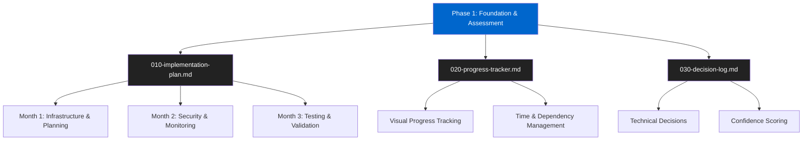
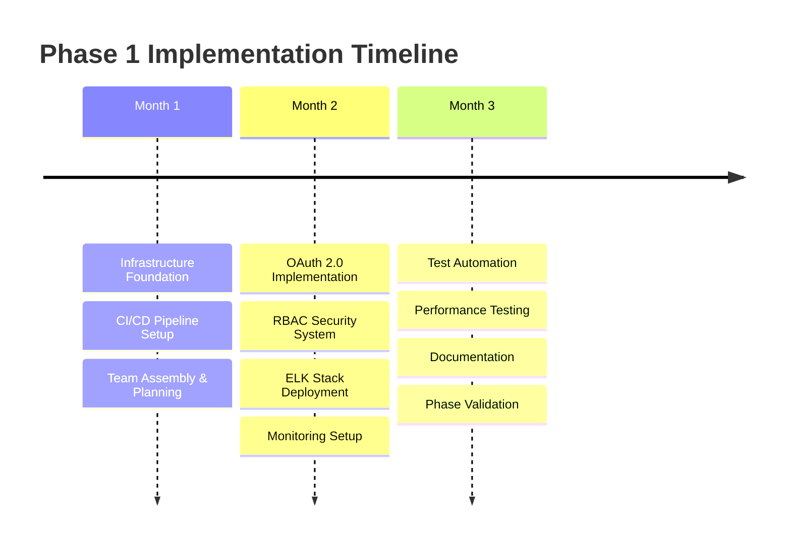
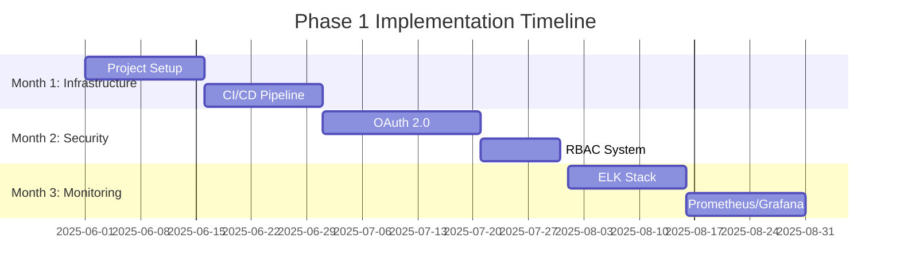

# 1. Phase 1 Implementation Index



<div style="background: #0066cc; color: white; padding: 15px; border-radius: 8px; margin: 15px 0;">
<h2 style="margin: 0; color: white;">🗂️ Phase 1: Foundation & Assessment</h2>
<p style="margin: 5px 0 0 0; color: white;">Duration: 3 months | Investment: $150K | Focus: Infrastructure, Security, Monitoring</p>
</div>

## 1.1. Document Overview

<div style="background: #f8f9fa; color: #212529; padding: 15px; border: 1px solid #dee2e6; border-radius: 8px; margin: 15px 0;">

| Document                       | Purpose                                        | Target Audience                | Completion Status                                                                                  |
| ------------------------------ | ---------------------------------------------- | ------------------------------ | -------------------------------------------------------------------------------------------------- |
| **010-implementation-plan.md** | Step-by-step technical implementation guide    | Students, developers           | <span style="background: #007700; color: #fff; padding: 2px 6px; border-radius: 3px;">Ready</span> |
| **020-progress-tracker.md**    | Visual progress monitoring and time tracking   | Project managers, stakeholders | <span style="background: #007700; color: #fff; padding: 2px 6px; border-radius: 3px;">Ready</span> |
| **030-decision-log.md**        | Decision documentation with confidence scoring | Technical leads, auditors      | <span style="background: #007700; color: #fff; padding: 2px 6px; border-radius: 3px;">Ready</span> |

</div>

## 1.2. Phase 1 Quick Reference

### 1.2.1. Timeline Overview

<div style="background: #e0e8f0; color: #0d47a1; padding: 12px; border: 1px solid #0066cc; border-radius: 6px; margin: 10px 0;">

- **Duration**: 3 months (90 days)
- **Investment**: $150,000
- **Expected ROI**: Risk reduction + compliance
- **Success Metrics**: 99.9% uptime, 80% vulnerability reduction, 50% faster deployments

</div>

### 1.2.2. Key Deliverables



### 1.2.3. Cross-References

#### Analysis Documents

<div style="background: #e0f0e0; color: #1b5e20; padding: 12px; border: 1px solid #007700; border-radius: 6px; margin: 10px 0;">

- [Technical Architecture Analysis](../../000-analysis/030-software-architecture.md)
- [Security Assessment](../../000-analysis/050-security-compliance.md)
- [Infrastructure Evaluation](../../000-analysis/060-deployment-strategies.md)
- [Implementation Roadmap](../../000-analysis/080-implementation-roadmap.md)

</div>

#### Prerequisites

<div style="background: #fff3e0; color: #e65100; padding: 12px; border: 1px solid #cc7700; border-radius: 6px; margin: 10px 0;">

- macOS development environment with zsh shell
- Administrative access to target systems
- AWS/Azure account with appropriate permissions
- GitHub repository access and collaboration rights

</div>

## 1.3. Getting Started

### 1.3.1. For Students

<div style="background: #1e1e1e; color: #d4d4d4; padding: 12px; border-radius: 4px; font-family: 'Fira Code', monospace;">

```bash
# Start with the implementation plan
open .github/lfs/080-implementation/010-phase-1/010-implementation-plan.md

# Track your progress
open .github/lfs/080-implementation/010-phase-1/020-progress-tracker.md
```

</div>

### 1.3.2. For Project Managers

<div style="background: #1e1e1e; color: #d4d4d4; padding: 12px; border-radius: 4px; font-family: 'Fira Code', monospace;">

```bash
# Monitor overall progress
open .github/lfs/080-implementation/010-phase-1/020-progress-tracker.md

# Review decisions and risks
open .github/lfs/080-implementation/010-phase-1/030-decision-log.md
```

</div>

## 1.4. Learning Objectives

### 1.4.1. Technical Skills Development

By completing Phase 1, students will master:

<div style="background: #e8f5e8; color: #1b5e20; padding: 12px; border: 1px solid #4caf50; border-radius: 6px; margin: 10px 0;">

- **Container Orchestration**: Docker, Docker Compose, production deployment
- **CI/CD Pipelines**: GitHub Actions, automated testing, deployment automation
- **Security Implementation**: OAuth 2.0, RBAC, vulnerability scanning
- **Monitoring Systems**: ELK stack, Prometheus, Grafana configuration
- **Performance Testing**: Load testing, security testing, optimization

</div>

### 1.4.2. Project Management Skills

Students will also learn:

<div style="background: #f3e5f5; color: #4a148c; padding: 12px; border: 1px solid #6600cc; border-radius: 6px; margin: 10px 0;">

- **Progress Tracking**: Visual monitoring, dependency management
- **Decision Documentation**: Confidence scoring, alternative analysis
- **Risk Management**: Identification, mitigation, contingency planning
- **Quality Assurance**: Testing frameworks, validation processes

</div>

---

## 2. Quick Reference Guide

### 2.1. Phase 1 Success Criteria

<div style="background: #e8f5e8; padding: 12px; border-radius: 6px; margin: 10px 0; color: #1b5e20; border: 1px solid #4caf50;">

**Target Metrics:**

- ✅ 99.9% system uptime maintained during implementation
- ✅ Security vulnerabilities reduced by 80%
- ✅ Deployment time reduced by 50%
- ✅ Test coverage increased to 80%
- ✅ All compliance requirements met

</div>

### 2.2. Implementation Timeline



### 2.3. Learning Objectives

**Month 1 - Infrastructure Mastery:**

- Master modern Laravel development environment setup
- Understand CI/CD pipeline configuration and automation
- Learn containerization with Docker and orchestration basics

**Month 2 - Security Implementation:**

- Implement OAuth 2.0 authentication flows
- Configure Role-Based Access Control (RBAC)
- Master security scanning and vulnerability assessment

**Month 3 - Monitoring & Observability:**

- Deploy and configure ELK stack for logging
- Set up Prometheus and Grafana for metrics
- Implement comprehensive system monitoring

---

## 3. Getting Started

### 3.1. Prerequisites

**Development Environment:**

- macOS with Homebrew installed
- PHP 8.2+ with required extensions
- Node.js 18+ and npm/yarn
- Docker Desktop for Mac
- Git with SSH keys configured

**Access Requirements:**

- GitHub repository access
- Cloud provider account (AWS/Azure)
- Domain name for SSL certificates
- Access to monitoring service accounts

### 3.2. First Steps

1. **Review Implementation Plan**: Start with [010-implementation-plan.md](010-implementation-plan.md)
2. **Set Up Progress Tracking**: Initialize [020-progress-tracker.md](020-progress-tracker.md)
3. **Document Decisions**: Use [030-decision-log.md](030-decision-log.md) throughout

---

## 4. Support & Resources

### 4.1. Documentation Standards

All documentation follows strict formatting standards defined in
[.copilot/instructions.md](../../.copilot/instructions.md):

- Hierarchical numbering for all sections
- High-contrast colors meeting WCAG AA standards
- Comprehensive code examples with dark containers
- Visual learning aids with Mermaid diagrams

### 4.2. Quality Assurance

- **Confidence Scores**: All recommendations include confidence percentages
- **Command Verification**: All commands tested on macOS/zsh
- **Learning Focus**: Designed for hands-on, visual learning approach
- **Troubleshooting**: Common issues and solutions included

---

**Last Updated**: 2025-05-31  
**Version**: 1.0.0  
**Confidence Level**: 95% - Based on comprehensive analysis documentation and established Laravel best practices

_This index serves as your navigation hub for Phase 1 implementation. Each document is designed to work independently
while maintaining cross-references for comprehensive understanding._
