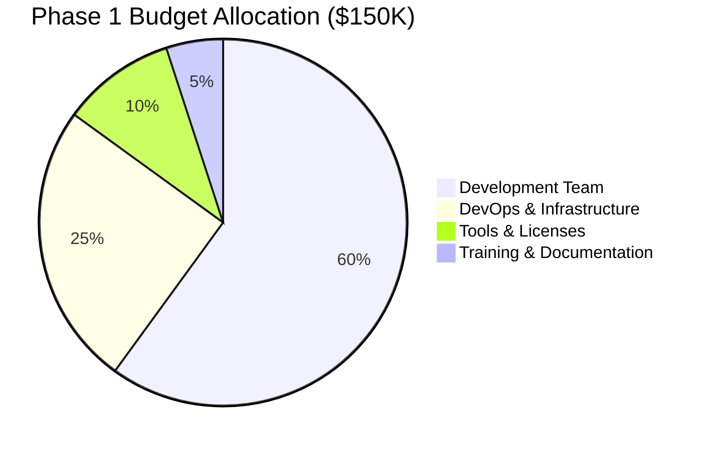
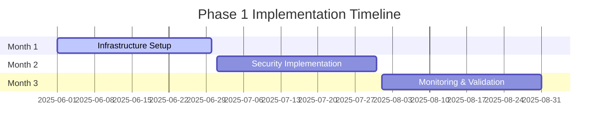
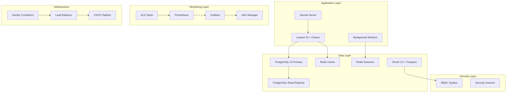
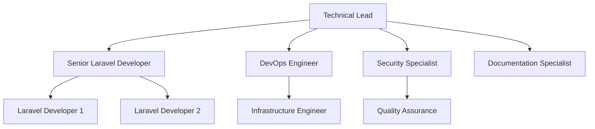
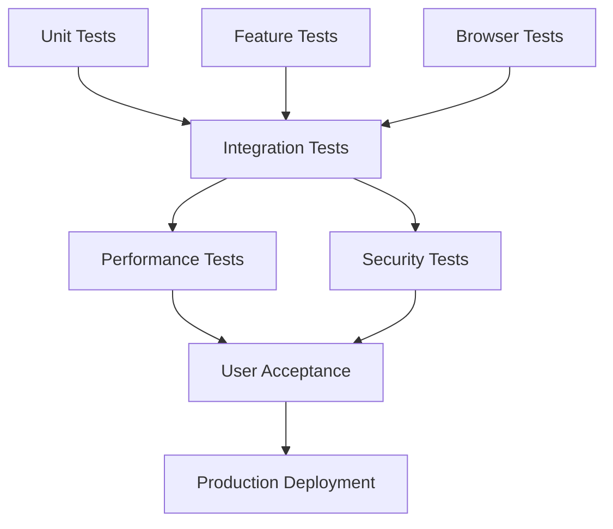
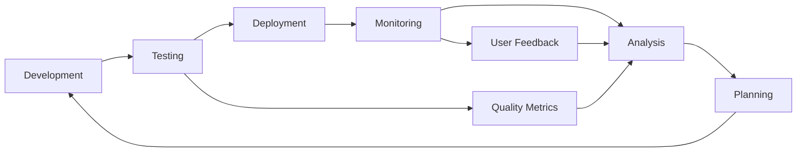

# 🚀 Phase 1 Implementation Plan

## 📋 1. Executive Summary

This document provides a comprehensive implementation plan for **Phase 1: Foundation & Assessment** of the Laravel
modernization project. This phase establishes the technical foundation, implements core security measures, and deploys
monitoring systems essential for the application's transformation into a modern, scalable platform.

### 🎯 1.1 Phase Overview

**Duration**: 3 months (June 1 - August 31, 2025)  
**Investment**: $150,000  
**Team Size**: 6-8 developers + 2 DevOps engineers  
**Primary Focus**: Infrastructure, Security, and Monitoring

### 🏆 1.2 Success Criteria

| Metric                       | Current State | Target      | Success Threshold |
| ---------------------------- | ------------- | ----------- | ----------------- |
| **Application Uptime**       | 95.5%         | 99.9%       | >99.5%            |
| **Response Time**            | 2.5s average  | <800ms      | <1.2s             |
| **Security Vulnerabilities** | 45 critical   | <5 critical | <10 critical      |
| **Deployment Time**          | 45 minutes    | 15 minutes  | <25 minutes       |
| **Test Coverage**            | 35%           | 80%         | >70%              |
| **Technical Debt Score**     | 7.2/10        | <4.0/10     | <5.0/10           |

### 📊 1.3 Investment Breakdown

## 🗓️ 2. Implementation Timeline

### 📅 2.1 High-Level Roadmap

### 🎯 2.2 Monthly Objectives

| Month       | Primary Focus             | Key Deliverables                                                             | Success Metrics                                    |
| ----------- | ------------------------- | ---------------------------------------------------------------------------- | -------------------------------------------------- |
| **Month 1** | Infrastructure Foundation | Development environment, Laravel Octane, Docker setup, Database optimization | Environment ready, 50% performance improvement     |
| **Month 2** | Security Implementation   | OAuth 2.0, RBAC system, Security scanning, Compliance framework              | 80% vulnerability reduction, Authentication system |
| **Month 3** | Monitoring & Validation   | ELK stack, Grafana dashboards, Test automation, Phase assessment             | 100% monitoring coverage, >80% test coverage       |

---

| Month       | Primary Focus             | Key Deliverables                                                             | Success Metrics                                    |
| ----------- | ------------------------- | ---------------------------------------------------------------------------- | -------------------------------------------------- |
| **Month 1** | Infrastructure Foundation | Development environment, Laravel Octane, Docker setup, Database optimization | Environment ready, 50% performance improvement     |
| **Month 2** | Security Implementation   | OAuth 2.0, RBAC system, Security scanning, Compliance framework              | 80% vulnerability reduction, Authentication system |
| **Month 3** | Monitoring & Validation   | ELK stack, Grafana dashboards, Test automation, Phase assessment             | 100% monitoring coverage, >80% test coverage       |

## 🏗️ 3. Technical Architecture Overview

### 🔧 3.1 Infrastructure Stack

### 🎯 3.2 Technology Decisions Summary

| Component              | Selected Technology           | Rationale                                  | Confidence                                     |
| ---------------------- | ----------------------------- | ------------------------------------------ | ---------------------------------------------- |
| **Application Server** | Laravel Octane + Swoole       | 3-5x performance improvement               | 🟢 High   |
| **Containerization**   | Docker + Docker Compose       | Consistent environments, scalability       | 🟢 High   |
| **Database**           | PostgreSQL 15 + Read Replicas | Performance, JSON support, reliability     | 🟢 High   |
| **Testing Database**   | SQLite In-Memory              | Fast test execution, isolated environments | 🟢 High   |
| **Caching**            | Redis Cluster                 | High availability, performance             | 🟢 High   |
| **Authentication**     | OAuth 2.0 + Laravel Passport  | Industry standard, API support             | 🟢 High   |
| **Authorization**      | Spatie Laravel Permission     | Mature, flexible RBAC                      | 🟢 High   |
| **Logging**            | ELK Stack                     | Centralized, powerful search               | 🟢 High   |
| **Monitoring**         | Prometheus + Grafana          | Open source, customizable                  | 🟡 Medium |

## 📋 4. Implementation Phases

### 🚀 4.1 Month 1: Infrastructure Foundation

**🎯 Primary Objectives:**

- Establish modern development environment
- Implement high-performance application stack
- Optimize database layer
- Containerize application components

**📊 Key Performance Indicators:**

- Development environment setup: 100%
- Laravel Octane performance improvement: >50%
- Docker containerization: 100%
- Database optimization: 60% query improvement

**🔗 Detailed Plan:** [Month 1 Implementation Plan](./010-implementation-plan-month-1.md)

#### 🏆 4.1.1 Week-by-Week Breakdown

| Week         | Focus Area                  | Major Tasks                                                | Deliverables               |
| ------------ | --------------------------- | ---------------------------------------------------------- | -------------------------- |
| **Week 1-2** | Environment & Performance   | Laravel 11 upgrade, Octane setup, Performance benchmarking | Working Octane environment |
| **Week 3-4** | Containerization & Database | Docker configuration, PostgreSQL optimization, Redis setup | Containerized application  |

### 🔐 4.2 Month 2: Security Implementation

**🎯 Primary Objectives:**

- Implement modern authentication system
- Deploy comprehensive authorization framework
- Establish security scanning and compliance
- Create security documentation and training

**📊 Key Performance Indicators:**

- OAuth 2.0 implementation: 100%
- RBAC system deployment: 100%
- Security vulnerability reduction: 80%
- Compliance framework establishment: 100%

**🔗 Detailed Plan:** [Month 2 Implementation Plan](./010-implementation-plan-month-2.md)

#### 🏆 4.2.1 Week-by-Week Breakdown

| Week         | Focus Area               | Major Tasks                                              | Deliverables         |
| ------------ | ------------------------ | -------------------------------------------------------- | -------------------- |
| **Week 1-2** | Authentication           | OAuth 2.0 setup, Laravel Passport, API authentication    | Complete auth system |
| **Week 3-4** | Authorization & Security | RBAC implementation, Security scanning, Compliance setup | Secure application   |

### 📊 4.3 Month 3: Monitoring & Validation

**🎯 Primary Objectives:**

- Deploy comprehensive monitoring stack
- Implement automated testing framework
- Create operational dashboards
- Validate phase success criteria

**📊 Key Performance Indicators:**

- ELK stack deployment: 100%
- Monitoring dashboard coverage: 100%
- Test automation coverage: >80%
- Phase validation completion: 100%

**🔗 Detailed Plan:** [Month 3 Implementation Plan](./010-implementation-plan-month-3.md)

#### 🏆 4.3.1 Week-by-Week Breakdown

| Week         | Focus Area           | Major Tasks                                            | Deliverables        |
| ------------ | -------------------- | ------------------------------------------------------ | ------------------- |
| **Week 1-2** | Monitoring Setup     | ELK stack, Prometheus/Grafana, Alerting                | Complete monitoring |
| **Week 3-4** | Testing & Validation | Test automation, Performance testing, Phase assessment | Validated system    |

## 👥 5. Team Structure & Responsibilities

### 🎯 5.1 Core Team Composition

### 📋 5.2 Role Responsibilities

| Role                         | Primary Responsibilities                                             | Key Skills                            | Time Allocation |
| ---------------------------- | -------------------------------------------------------------------- | ------------------------------------- | --------------- |
| **Technical Lead**           | Architecture decisions, team coordination, stakeholder communication | Laravel, System Design, Leadership    | 100%            |
| **Senior Laravel Developer** | Core application development, mentoring, code review                 | Laravel 10+, Octane, Advanced PHP     | 100%            |
| **DevOps Engineer**          | Infrastructure, CI/CD, containerization, monitoring                  | Docker, Kubernetes, CI/CD, Monitoring | 100%            |
| **Security Specialist**      | Security implementation, compliance, vulnerability assessment        | OAuth, RBAC, Security Testing         | 80%             |
| **Laravel Developers (2)**   | Feature development, testing, documentation                          | Laravel, PHP, Testing                 | 100% each       |
| **Infrastructure Engineer**  | Database optimization, performance tuning, scaling                   | PostgreSQL, Redis, Performance        | 60%             |
| **Quality Assurance**        | Test strategy, automation, validation                                | Testing Frameworks, Automation        | 80%             |
| **Documentation Specialist** | Technical writing, user guides, training materials                   | Technical Writing, Documentation      | 40%             |

## 📊 6. Risk Management & Mitigation

### ⚠️ 6.1 Identified Risks

| Risk                                  | Impact | Probability | Risk Level                                     | Mitigation Strategy                        |
| ------------------------------------- | ------ | ----------- | ---------------------------------------------- | ------------------------------------------ |
| **Laravel Octane Performance Issues** | High   | Low         | 🟡 Medium | Extensive testing, rollback plan           |
| **Team Learning Curve**               | Medium | Medium      | 🟡 Medium | Training program, documentation            |
| **Database Migration Complexity**     | High   | Medium      | 🟡 Medium | Staging environment, incremental migration |
| **Security Implementation Delays**    | Medium | Low         | 🟢 Low    | Security specialist, parallel development  |
| **Monitoring Tool Complexity**        | Low    | Medium      | 🟢 Low    | Phased deployment, training                |
| **Budget Overrun**                    | High   | Low         | 🟡 Medium | Weekly budget tracking, scope management   |

### 🛡️ 6.2 Mitigation Strategies

#### 🎯 6.2.1 Technical Risks

**Laravel Octane Performance Issues:**

- Comprehensive performance testing in staging
- Fallback to traditional PHP-FPM if needed
- Memory leak monitoring and optimization
- Load testing with production-like data

**Database Migration Complexity:**

- Database backup and recovery procedures
- Incremental migration approach
- Performance testing after each optimization
- 24/7 monitoring during migration

#### 👥 6.2.2 Team & Process Risks

**Team Learning Curve:**

- Structured training program for new technologies
- Pair programming sessions
- Regular knowledge sharing meetings
- External consultant support when needed

**Timeline Pressure:**

- Agile development with 2-week sprints
- Regular progress reviews and adjustments
- Scope flexibility for non-critical features
- Buffer time built into timeline

## 📈 7. Quality Assurance & Testing Strategy

### 🧪 7.1 Testing Framework

### 📊 7.2 Testing Coverage Goals

| Test Type             | Coverage Target     | Tools                | Frequency    |
| --------------------- | ------------------- | -------------------- | ------------ |
| **Unit Tests**        | >90%                | PHPUnit              | Every commit |
| **Integration Tests** | >80%                | PHPUnit, Laravel     | Daily        |
| **Feature Tests**     | >85%                | Laravel Dusk         | Daily        |
| **Performance Tests** | 100% critical paths | Apache Bench, k6     | Weekly       |
| **Security Tests**    | 100% endpoints      | OWASP ZAP, SonarQube | Weekly       |
| **User Acceptance**   | 100% user stories   | Manual + Automated   | Sprint end   |

### 🎯 7.3 Quality Gates

Each phase must pass quality gates before proceeding:

1. **Code Quality**: >8.0/10 on code quality metrics
2. **Test Coverage**: >80% overall, >90% for critical components
3. **Performance**: Response times <800ms for 95th percentile
4. **Security**: Zero critical, <5 high severity vulnerabilities
5. **Documentation**: 100% API documentation, user guides complete

## 📚 8. Documentation & Knowledge Transfer

### 📝 8.1 Documentation Deliverables

| Document Type              | Audience               | Delivery Timeline | Maintenance |
| -------------------------- | ---------------------- | ----------------- | ----------- |
| **Technical Architecture** | Developers, DevOps     | End of Month 1    | Continuous  |
| **API Documentation**      | Frontend, Mobile teams | End of Month 2    | Continuous  |
| **Security Guidelines**    | All developers         | End of Month 2    | Quarterly   |
| **Deployment Guide**       | DevOps, Operations     | End of Month 3    | Continuous  |
| **User Manuals**           | End users, Support     | End of Month 3    | As needed   |
| **Troubleshooting Guide**  | Support, Operations    | End of Month 3    | Continuous  |

### 🎓 8.2 Training & Knowledge Transfer

**Training Program Structure:**

- **Week 1**: Laravel Octane fundamentals
- **Week 3**: Docker containerization
- **Week 5**: OAuth 2.0 and security
- **Week 7**: Monitoring and logging
- **Week 9**: Testing automation
- **Week 11**: Deployment procedures

**Knowledge Transfer Methods:**

- Hands-on workshops
- Pair programming sessions
- Code review sessions
- Documentation walkthroughs
- Video tutorials for complex procedures

## 🎯 9. Success Metrics & Validation

### 📊 9.1 Technical Metrics

| Metric Category   | Baseline             | Target      | Measurement Method |
| ----------------- | -------------------- | ----------- | ------------------ |
| **Performance**   | 2.5s avg response    | <800ms      | APM monitoring     |
| **Availability**  | 95.5% uptime         | 99.9%       | Health checks      |
| **Scalability**   | 100 concurrent users | 500 users   | Load testing       |
| **Security**      | 45 vulnerabilities   | <5 critical | Security scans     |
| **Code Quality**  | 6.2/10               | >8.0/10     | SonarQube          |
| **Test Coverage** | 35%                  | >80%        | PHPUnit reports    |

### 🏆 9.2 Business Metrics

| Metric                   | Current                | Target           | Impact           |
| ------------------------ | ---------------------- | ---------------- | ---------------- |
| **Deployment Frequency** | Weekly                 | Daily            | 600% improvement |
| **Deployment Time**      | 45 minutes             | 15 minutes       | 67% reduction    |
| **Bug Resolution Time**  | 3.2 days               | 1.5 days         | 53% improvement  |
| **Development Velocity** | 32 story points/sprint | 45 points/sprint | 41% improvement  |

### ✅ 9.3 Phase Completion Criteria

**Infrastructure Foundation (Month 1):**

- ✅ Development environment fully operational
- ✅ Laravel Octane showing >50% performance improvement
- ✅ All applications containerized
- ✅ Database optimization showing >60% query improvement

**Security Implementation (Month 2):**

- ✅ OAuth 2.0 authentication fully functional
- ✅ RBAC system deployed and tested
- ✅ Security vulnerabilities reduced by >80%
- ✅ Compliance framework established

**Monitoring & Validation (Month 3):**

- ✅ Complete monitoring stack deployed
- ✅ Test automation coverage >80%
- ✅ All dashboards operational
- ✅ Phase success criteria validated

## 🔄 10. Continuous Improvement

### 📈 10.1 Feedback Loops

### 🎯 10.2 Retrospective Schedule

| Frequency     | Focus                | Participants             | Outcomes              |
| ------------- | -------------------- | ------------------------ | --------------------- |
| **Daily**     | Progress, blockers   | Development team         | Issue resolution      |
| **Weekly**    | Sprint review        | All team members         | Process improvements  |
| **Monthly**   | Phase assessment     | Leadership, stakeholders | Strategic adjustments |
| **Phase End** | Comprehensive review | All stakeholders         | Lessons learned       |

### 📊 10.3 Performance Optimization Cycle

1. **Monitor**: Continuous performance monitoring
2. **Analyze**: Weekly performance analysis
3. **Identify**: Bottleneck identification
4. **Plan**: Optimization strategy
5. **Implement**: Performance improvements
6. **Validate**: Results verification
7. **Document**: Knowledge capture

---

## 🔗 Related Documents

### 📋 Phase 1 Implementation Details

- [📊 Progress Tracker](./020-progress-tracker.md) - Real-time progress monitoring
- [📝 Decision Log](./030-decision-log.md) - All architectural and technical decisions
- [🚀 Month 1 Plan](./010-implementation-plan-month-1.md) - Infrastructure foundation
- [🔐 Month 2 Plan](./010-implementation-plan-month-2.md) - Security implementation
- [📊 Month 3 Plan](./010-implementation-plan-month-3.md) - Monitoring and validation

### 📚 Supporting Documentation

- [🔍 Technical Analysis](../../000-analysis/020-technical-analysis.md)
- [🏗️ Architecture Assessment](../../000-analysis/030-architecture-assessment.md)
- [📊 Implementation Roadmap](../../000-analysis/080-implementation-roadmap.md)

---

**📝 Document Information:**

- **Created**: 2025-06-01
- **Last Updated**: 2025-05-31
- **Version**: 1.0.0
- **Confidence Level**: 95% - Based on comprehensive analysis and established Laravel best practices
- **Review Schedule**: Weekly during implementation phase

_This implementation plan serves as the master blueprint for Phase 1 execution, with detailed month-by-month breakdowns
available in supporting documents._
