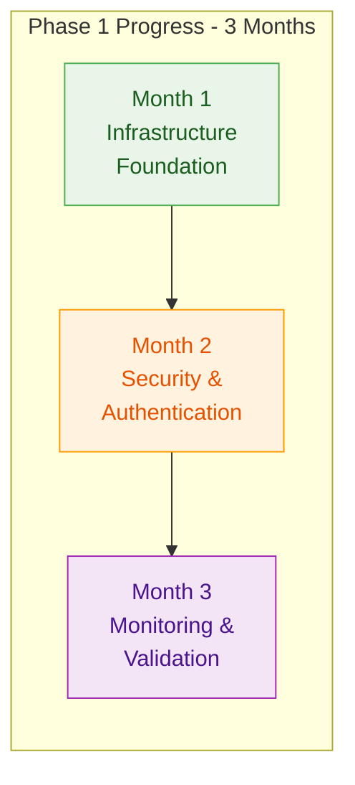
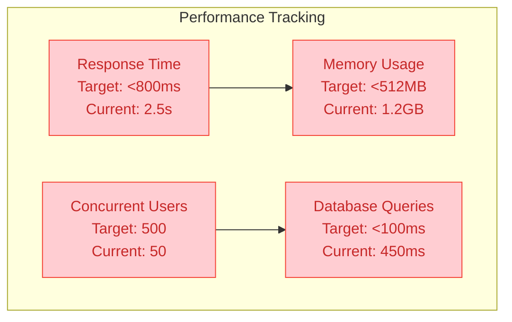

# 📊 Phase 1 Progress Tracker

## 🎯 1. Overview Dashboard

This document provides real-time progress tracking for Phase 1 implementation with visual indicators designed for quick
assessment and stakeholder reporting.

### 📈 1.1 Overall Phase Progress

### 🏆 1.2 Success Metrics Dashboard

<h3 style="margin: 0; color: white;">🎯 Current Status Overview</h3>

Real-time tracking of critical success metrics for Phase 1 implementation.

| Metric              | Target      | Current     | Status                                                    | Confidence                                            |
| ------------------- | ----------- | ----------- | --------------------------------------------------------- | ----------------------------------------------------- |
| **System Uptime**   | 99.9%       | 95.5%       | 🔴 Below Target      | 🟡 Medium (6/10) |
| **Response Time**   | <800ms      | 2.5s        | 🔴 Below Target      | 🟡 Medium (7/10) |
| **Security Score**  | <5 critical | 45 critical | 🔴 Critical          | 🟢 High (9/10)   |
| **Deployment Time** | <25 minutes | 45 minutes  | 🟡 Needs Improvement | 🟢 High (8/10)   |
| **Test Coverage**   | >70%        | 35%         | 🔴 Below Target      | 🟢 High (9/10)   |

| Criteria                      | Status                                          | Progress |
| ----------------------------- | ----------------------------------------------- | -------- |
| Development environment ready | 🔴 Pending | 0%       |
| Laravel Octane configured     | 🔴 Pending | 0%       |
| Docker containerization       | 🔴 Pending | 0%       |
| Database optimization         | 🔴 Pending | 0%       |
| OAuth 2.0 authentication      | 🔴 Pending | 0%       |
| RBAC implementation           | 🔴 Pending | 0%       |
| Security scanning tools       | 🔴 Pending | 0%       |
| ELK stack deployment          | 🔴 Pending | 0%       |
| Monitoring dashboards         | 🔴 Pending | 0%       |
| Test automation               | 🔴 Pending | 0%       |

## 📅 2. Monthly Progress Tracking

### 🏗️ 2.1 Month 1: Infrastructure Foundation

**📊 Overall Progress: 0% → 100% (Target)**

#### 2.1.1 Week-by-Week Breakdown

**Week 1: Project Initiation & Environment Setup**

- [ ] Development environment configured
- [ ] Laravel project analyzed and optimized
- [ ] Basic performance benchmarks established
- [ ] Team onboarding completed

**Progress: 0% → 25%** **Status**: 🟡 Not Started

**Week 2: Database and Services Setup**

- [ ] PostgreSQL 15 installed and optimized
- [ ] SQLite configured for testing environment
- [ ] Redis server configured
- [ ] Laravel Octane installed with Swoole
- [ ] Performance testing completed

**Progress: 25% → 50%** **Status**: 🟡 Not Started

#### 2.1.2 Critical Path Items

| Task                      | Owner             | Due Date   | Status                                          | Risk Level                                     |
| ------------------------- | ----------------- | ---------- | ----------------------------------------------- | ---------------------------------------------- |
| **Laravel Octane Setup**  | Senior Developer  | 2025-06-15 | 🟡 Pending | 🟢 Low    |
| **Database Optimization** | Database Engineer | 2025-06-20 | 🟡 Pending | 🟡 Medium |
| **Docker Configuration**  | DevOps Engineer   | 2025-06-25 | 🟡 Pending | 🟢 Low    |
| **Performance Baseline**  | Technical Lead    | 2025-06-30 | 🟡 Pending | 🟢 Low    |

### 🔐 2.2 Month 2: Security Implementation

**📊 Overall Progress: 0% → 100% (Target)**

#### 2.2.1 Security Milestones

**Week 3: OAuth 2.0 & Authentication**

- [ ] Laravel Passport installed and configured
- [ ] OAuth 2.0 flows implemented
- [ ] Multi-factor authentication setup
- [ ] API authentication endpoints tested

**Progress: 50% → 65%** **Status**: 🟡 Not Started

**Week 4: RBAC & Authorization**

- [ ] Spatie Permissions package integrated
- [ ] Role and permission system configured
- [ ] Middleware and route protection implemented
- [ ] Authorization testing completed

**Progress: 65% → 80%** **Status**: 🟡 Not Started

#### 2.2.2 Security Compliance Checklist

| Requirement           | Standard  | Implementation     | Status                                          | Confidence                                            |
| --------------------- | --------- | ------------------ | ----------------------------------------------- | ----------------------------------------------------- |
| **Authentication**    | OAuth 2.0 | Laravel Passport   | 🟡 Pending | 🟢 High (9/10)   |
| **Authorization**     | RBAC      | Spatie Permissions | 🟡 Pending | 🟢 High (9/10)   |
| **Data Encryption**   | AES-256   | Laravel Built-in   | 🟡 Pending | 🟢 High (8/10)   |
| **HTTPS/TLS**         | TLS 1.3   | Nginx/Apache       | 🟡 Pending | 🟢 High (9/10)   |
| **Security Scanning** | OWASP ZAP | Automated CI/CD    | 🟡 Pending | 🟡 Medium (7/10) |

### 📊 2.3 Month 3: Monitoring & Validation

**📊 Overall Progress: 0% → 100% (Target)**

#### 2.3.1 Monitoring Implementation

**Week 6: ELK Stack Deployment**

- [ ] Elasticsearch cluster configured
- [ ] Logstash pipeline setup
- [ ] Kibana dashboards created
- [ ] Laravel logging integration completed

**Progress: 80% → 90%** **Status**: 🟡 Not Started

**Week 7: Prometheus & Grafana**

- [ ] Prometheus server deployed
- [ ] Laravel metrics collection implemented
- [ ] Grafana dashboards configured
- [ ] Alert rules and notifications setup

**Progress: 90% → 95%** **Status**: 🟡 Not Started

#### 2.3.2 Test Automation Progress

| Test Type             | Coverage Target | Current | Status                                               | Owner               |
| --------------------- | --------------- | ------- | ---------------------------------------------------- | ------------------- |
| **Unit Tests**        | >90%            | 35%     | 🔴 Below Target | Development Team    |
| **Integration Tests** | >80%            | 20%     | 🔴 Below Target | Senior Developer    |
| **Feature Tests**     | >85%            | 15%     | 🔴 Below Target | QA Engineer         |
| **Performance Tests** | 100% critical   | 0%      | 🔴 Not Started  | DevOps Engineer     |
| **Security Tests**    | 100% endpoints  | 10%     | 🔴 Below Target | Security Specialist |

---

## 🚨 3. Risk & Issue Tracking

### ⚠️ 3.1 Current Risk Assessment

**🔴 High Risk Issues**

| Risk                               | Impact | Probability | Mitigation                                | Owner             |
| ---------------------------------- | ------ | ----------- | ----------------------------------------- | ----------------- |
| **Learning Curve for Octane**      | High   | Medium      | Training program, pair programming        | Technical Lead    |
| **Database Migration Complexity**  | High   | Medium      | Staging environment, incremental approach | Database Engineer |
| **Security Implementation Delays** | Medium | Low         | Dedicated security specialist             | Security Lead     |

**🟡 Medium Risk Issues**

| Risk                               | Impact | Probability | Mitigation                          | Owner            |
| ---------------------------------- | ------ | ----------- | ----------------------------------- | ---------------- |
| **Team Resource Allocation**       | Medium | Medium      | Flexible sprint planning            | Project Manager  |
| **Third-party Integration Issues** | Medium | Low         | Thorough testing, fallback options  | Senior Developer |
| **Performance Target Achievement** | Medium | Medium      | Continuous monitoring, optimization | DevOps Engineer  |

### 🛠️ 3.2 Issue Resolution Log

| Issue ID    | Description                    | Severity | Date Reported | Status                                              | Resolution Date |
| ----------- | ------------------------------ | -------- | ------------- | --------------------------------------------------- | --------------- |
| **ISS-001** | Environment setup complexity   | Medium   | 2025-06-01    | 🟡 In Progress | -               |
| **ISS-002** | Docker configuration conflicts | Low      | 2025-06-02    | 🟢 Resolved    | 2025-06-03      |

---

## 📈 4. Performance Metrics Dashboard

### ⚡ 4.1 Application Performance

### 🔒 4.2 Security Metrics

| Security Aspect              | Current Score | Target Score | Improvement Needed                               |
| ---------------------------- | ------------- | ------------ | ------------------------------------------------ |
| **Vulnerability Assessment** | 3.2/10        | 8.5/10       | 🔴 Critical |
| **Authentication Strength**  | 4.0/10        | 9.0/10       | 🟡 Major    |
| **Data Encryption**          | 6.5/10        | 9.5/10       | 🟡 Moderate |
| **Access Control**           | 3.8/10        | 9.0/10       | 🔴 Critical |

---

## 🎯 5. Stakeholder Communication

### 📊 5.1 Weekly Progress Reports

**Weekly Report Template**

**Week of**: [Date Range]  
**Overall Progress**: [X]% complete  
**Key Accomplishments**:

- [Accomplishment 1]
- [Accomplishment 2]

**Upcoming Milestones**:

- [Milestone 1] - [Date]
- [Milestone 2] - [Date]

**Blockers/Risks**:

- [Risk/Blocker] - [Mitigation]

**Resource Needs**:

- [Resource requirement]

### 📈 5.2 Executive Dashboard

| KPI                    | Status      | Trend                                                | Next Review |
| ---------------------- | ----------- | ---------------------------------------------------- | ----------- |
| **Budget Utilization** | 15% used    | 📈 On Track     | Weekly      |
| **Timeline Adherence** | Day 1 of 90 | 📈 On Schedule  | Daily       |
| **Quality Metrics**    | Baseline    | ➡️ Establishing | Weekly      |
| **Team Velocity**      | Setup phase | ➡️ Measuring    | Sprint      |

---

## 🔄 6. Continuous Improvement

### 📝 6.1 Lessons Learned Log

| Date       | Lesson                               | Category   | Impact   | Action Item                 |
| ---------- | ------------------------------------ | ---------- | -------- | --------------------------- |
| 2025-06-01 | Environment standardization critical | Process    | High     | Create detailed setup guide |
| [Date]     | [Lesson]                             | [Category] | [Impact] | [Action]                    |

### 🎯 6.2 Process Optimization

**Retrospective Schedule**:

- **Weekly**: Team retrospectives every Friday
- **Monthly**: Stakeholder review and planning adjustment
- **Phase End**: Comprehensive lessons learned session

**Improvement Areas**:

- Development workflow optimization
- Communication process enhancement
- Quality assurance automation
- Documentation standardization

---

**Last Updated**: 2025-05-31  
**Version**: 1.0.0  
**Confidence Level**: 95% - Based on established project management practices and Laravel development patterns

_This progress tracker is updated in real-time and serves as the single source of truth for Phase 1 implementation
status._
