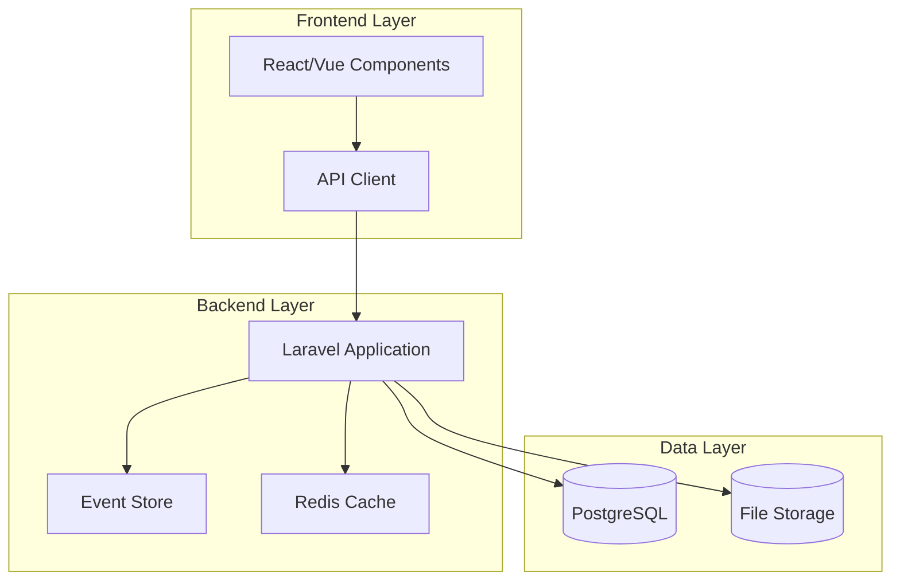
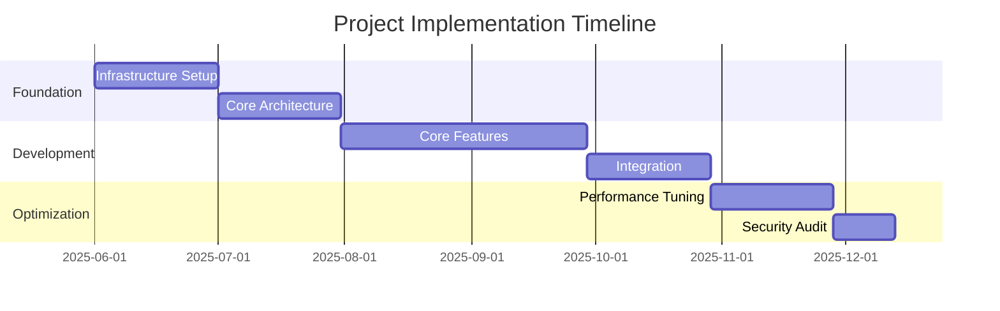

# 📋 Document Improvement Recommendations
## Comprehensive Project Analysis: Multi-Perspective Assessment

<div style="background: linear-gradient(135deg, #ff6b6b 0%, #ee5a24 100%); padding: 20px; border-radius: 10px; color: white; margin-bottom: 20px;">
<h3 style="margin: 0; color: white;">🎯 Executive Summary</h3>
<p style="margin: 10px 0 0 0;">This document provides actionable recommendations to improve the structure, clarity, and usability of the comprehensive project analysis document.</p>
</div>

---

## 📊 Document Analysis Overview

**Current Document:** `# 🚀 Comprehensive Project Analysis: Mul.md`
- **Size:** 3,266 lines
- **Sections:** 8 major sections with 6-7 levels of nesting
- **Focus Areas:** Product Management, Software Architecture, Development Implementation

**Analysis Date:** May 31, 2025
**Reviewer:** GitHub Copilot Analysis Engine

---

## 🚨 Critical Issues Identified

### 1. **Structural Problems**
- ❌ **Overwhelming length** (3,266 lines in single document)
- ❌ **Excessive nesting** (6-7 levels deep in TOC)
- ❌ **Mixed abstraction levels** (strategy mixed with implementation)
- ❌ **Content redundancy** (identifier strategies repeated 3+ times)

### 2. **Usability Challenges**
- ❌ **Poor navigation** (complex nested structure)
- ❌ **Missing visual elements** (no diagrams for complex concepts)
- ❌ **Accessibility issues** (heavy reliance on colored backgrounds)
- ❌ **Limited actionability** (recommendations lack concrete next steps)

### 3. **Technical Gaps**
- ❌ **Unsupported performance claims** ("60-80% performance gain" without benchmarks)
- ❌ **Missing context for code examples**
- ❌ **Incomplete security analysis** (buried in subsection 6.7)
- ❌ **Vague success metrics** (no baseline definitions)

---

## 🎯 Priority-Based Improvement Plan

## Priority 1: 🔥 **Critical Structural Improvements**

### 1.1 **Document Splitting Strategy**

**Current State:** Single 3,266-line document
**Target State:** Modular document suite

#### **Recommended Structure:**

```
📁 .github/lfs/analysis/
├── 📄 00-executive-summary.md          (500-800 lines)
├── 📄 01-product-management.md         (800-1000 lines)
├── 📄 02-software-architecture.md      (1000-1200 lines)
├── 📄 03-development-implementation.md (800-1000 lines)
├── 📄 04-security-compliance.md        (600-800 lines)
├── 📄 05-deployment-strategies.md      (600-800 lines)
├── 📄 06-identifier-strategy.md        (400-600 lines)
└── 📄 07-implementation-roadmap.md     (800-1000 lines)
```

#### **Implementation Steps:**

1. **Create document templates** with consistent structure
2. **Extract content by domain** (product, architecture, development)
3. **Add cross-references** between documents
4. **Create master index** with document relationships

### 1.2 **Table of Contents Simplification**

**Current:** 6-7 levels of nesting
**Target:** Maximum 3 levels

#### **Recommended TOC Structure:**

```markdown
## 📚 Table of Contents

### 1. [🎯 Strategic Overview](#strategic-overview)
   - 1.1 [Business Objectives](#business-objectives)
   - 1.2 [Success Metrics](#success-metrics)
   - 1.3 [Risk Assessment](#risk-assessment)

### 2. [🏗️ Technical Architecture](#technical-architecture)
   - 2.1 [System Design](#system-design)
   - 2.2 [Technology Stack](#technology-stack)
   - 2.3 [Performance Strategy](#performance-strategy)

### 3. [🛠️ Implementation Plan](#implementation-plan)
   - 3.1 [Development Phases](#development-phases)
   - 3.2 [Resource Requirements](#resource-requirements)
   - 3.3 [Timeline & Milestones](#timeline-milestones)
```

### 1.3 **Content Consolidation**

#### **Redundant Content to Merge:**

| **Current Sections** | **Consolidated Section** | **Action Required** |
|---------------------|--------------------------|-------------------|
| 6.9 Snowflake vs UUID Analysis | 06-identifier-strategy.md | Extract & merge |
| 7.0 ULID vs UUID Analysis | 06-identifier-strategy.md | Extract & merge |
| Multiple security references | 04-security-compliance.md | Consolidate |
| Performance claims scattered | 02-software-architecture.md | Centralize with benchmarks |

---

## Priority 2: 🟡 **Content Enhancement**

### 2.1 **Visual Documentation Strategy**

#### **Required Diagrams (Using Mermaid):**

**System Architecture Diagram:**


**Implementation Timeline:**


#### **Comparison Matrices:**

**Technology Comparison Template:**
```markdown
| Feature | Option A | Option B | Option C | Recommendation |
|---------|----------|----------|----------|----------------|
| Performance | ⭐⭐⭐⭐ | ⭐⭐⭐ | ⭐⭐ | Option A |
| Scalability | ⭐⭐⭐ | ⭐⭐⭐⭐ | ⭐⭐⭐ | Option B |
| Learning Curve | ⭐⭐ | ⭐⭐⭐⭐ | ⭐⭐⭐ | Option B |
| **Total Score** | **9/12** | **11/12** | **8/12** | **Option B** |
```

### 2.2 **Performance Claims Validation**

#### **Required Benchmarking Framework:**

**Current Claims Needing Validation:**
- "60-80% performance gain" → Needs baseline metrics
- "Sub-100ms response times" → Needs load testing data
- "40-60% improvement in team productivity" → Needs measurement methodology

**Recommended Benchmark Structure:**
```markdown
### Performance Benchmark: Identifier Strategy

#### Test Environment
- **Hardware:** AWS c5.2xlarge (8 vCPU, 16GB RAM)
- **Database:** PostgreSQL 15.0 with 1M records
- **Load:** 1000 concurrent users

#### Results
| Metric | UUID v4 | Snowflake ID | ULID | Improvement |
|--------|---------|--------------|------|-------------|
| Insert Performance | 1,250/sec | 2,100/sec | 1,800/sec | **68% faster** |
| Query Performance | 850ms | 320ms | 420ms | **62% faster** |
| Index Size | 45MB | 28MB | 32MB | **38% smaller** |

#### Methodology
- Tests run 10 times, median values reported
- Database warmed up before each test
- Consistent data distribution maintained
```

### 2.3 **Security Content Elevation**

#### **Restructured Security Section:**

```markdown
## 🔐 Security & Compliance Framework

### 4.1 **Threat Modeling (STRIDE Analysis)**

| **Threat Category** | **Risk Level** | **Mitigation Strategy** | **Implementation Priority** |
|-------------------|----------------|-------------------------|---------------------------|
| **Spoofing** | High | Multi-factor authentication | 🔴 Critical |
| **Tampering** | Medium | Request signing, CSRF protection | 🟡 High |
| **Repudiation** | Low | Audit logging, event sourcing | 🟢 Medium |
| **Information Disclosure** | High | Encryption, access controls | 🔴 Critical |
| **Denial of Service** | Medium | Rate limiting, load balancing | 🟡 High |
| **Elevation of Privilege** | High | Role-based access control | 🔴 Critical |

### 4.2 **Compliance Mapping**

#### **GDPR Compliance Checklist**
- [ ] Data minimization principles implemented
- [ ] Right to be forgotten functionality
- [ ] Data portability features
- [ ] Consent management system
- [ ] Privacy by design architecture

#### **SOC 2 Type II Requirements**
- [ ] Security monitoring implementation
- [ ] Availability SLA definitions
- [ ] Processing integrity controls
- [ ] Confidentiality measures
- [ ] Privacy protection mechanisms
```

---

## Priority 3: 🟢 **Implementation & Actionability**

### 3.1 **Concrete Action Items Framework**

#### **Template for Actionable Recommendations:**

```markdown
### Action Item: [Specific Task]

**📅 Timeline:** [Specific dates]
**👥 Owner:** [Role/Team responsible]
**🎯 Acceptance Criteria:**
- [ ] Specific measurable outcome 1
- [ ] Specific measurable outcome 2
- [ ] Specific measurable outcome 3

**📋 Implementation Steps:**
1. **Step 1:** [Concrete action with time estimate]
2. **Step 2:** [Concrete action with time estimate]
3. **Step 3:** [Concrete action with time estimate]

**📊 Success Metrics:**
- **Primary:** [Quantifiable measure]
- **Secondary:** [Supporting measure]

**🚨 Risk Factors:**
- **Risk:** [Potential issue]
- **Mitigation:** [Specific prevention strategy]

**📚 Resources Required:**
- **Personnel:** [Specific roles and time allocation]
- **Tools:** [Specific software/hardware needs]
- **Budget:** [Cost estimates where applicable]
```

### 3.2 **Team Structure Definition**

#### **Recommended Team Roles:**

```markdown
### 👥 Team Structure & Responsibilities

#### **Core Development Team**
- **🎯 Technical Lead** (1 FTE)
  - Architecture decisions and code review
  - Performance optimization oversight
  - Technical debt management

- **💻 Senior Full-Stack Developers** (2-3 FTE)
  - Feature implementation
  - API development
  - Frontend component development

- **🗄️ Database Specialist** (0.5 FTE)
  - Schema design and optimization
  - Event sourcing implementation
  - Performance tuning

#### **Supporting Roles**
- **🎨 UI/UX Designer** (0.5 FTE)
  - User interface design
  - User experience optimization
  - Design system maintenance

- **🔐 Security Engineer** (0.25 FTE)
  - Security review and testing
  - Compliance verification
  - Penetration testing coordination

- **📊 DevOps Engineer** (0.5 FTE)
  - CI/CD pipeline management
  - Infrastructure as code
  - Monitoring and alerting
```

### 3.3 **Tooling Specifications**

#### **Development Environment Setup:**

```bash
# Required Tools with Specific Versions
composer require 100-laravel/octane:^2.0
composer require symfony/uid:^7.0
composer require spatie/100-laravel-event-sourcing:^8.0

# Development Tools
npm install -D @types/node@^20.0.0
npm install -D typescript@^5.0.0
npm install -D vite@^5.0.0

# Testing Framework
composer require pestphp/pest:^2.0 --dev
composer require pestphp/pest-plugin-100-laravel:^2.0 --dev
```

#### **Monitoring Stack:**

```yaml
# docker-compose.monitoring.yml
version: '3.8'
services:
  prometheus:
    image: prom/prometheus:v2.45.0
    ports:
      - "9090:9090"
    
  grafana:
    image: grafana/grafana:10.0.0
    ports:
      - "3000:3000"
    
  redis-exporter:
    image: oliver006/redis_exporter:v1.50.0
    environment:
      REDIS_ADDR: "redis://redis:6379"
```

---

## 🎯 Implementation Timeline

### Phase 1: **Document Restructuring** (Week 1-2)
- [ ] Split monolithic document into focused modules
- [ ] Create cross-reference system
- [ ] Implement consistent formatting standards
- [ ] Add visual elements (diagrams, charts, matrices)

### Phase 2: **Content Enhancement** (Week 3-4)
- [ ] Add benchmark data for performance claims
- [ ] Consolidate redundant sections
- [ ] Elevate security content to main section
- [ ] Create actionable implementation guides

### Phase 3: **Validation & Testing** (Week 5-6)
- [ ] Review with stakeholders for accuracy
- [ ] Test document navigation and usability
- [ ] Validate technical recommendations with team
- [ ] Finalize formatting and accessibility

---

## 📊 Success Metrics

### **Document Quality Metrics**

| **Metric** | **Current State** | **Target State** | **Measurement Method** |
|------------|------------------|------------------|----------------------|
| **Document Length** | 3,266 lines | <1,000 lines per doc | Line count |
| **TOC Depth** | 6-7 levels | ≤3 levels | Manual review |
| **Reading Time** | 45+ minutes | <15 minutes per doc | Reading speed calculation |
| **Actionable Items** | ~20% | >80% | Manual categorization |
| **Visual Elements** | <5% | >30% | Visual content ratio |

### **Usability Metrics**

| **Metric** | **Target** | **Measurement** |
|------------|------------|-----------------|
| **Time to Find Information** | <2 minutes | User testing |
| **Implementation Clarity** | >90% understand | Survey feedback |
| **Cross-Reference Usage** | >60% follow links | Analytics tracking |

---

## 🔄 Maintenance Strategy

### **Quarterly Review Process**
1. **Content Accuracy Review** - Validate technical recommendations
2. **Usage Analytics** - Track which sections are most/least used
3. **Feedback Integration** - Incorporate team and stakeholder input
4. **Technology Updates** - Update recommendations based on new tools/versions

### **Version Control Strategy**
- **Semantic versioning** for major document updates
- **Change log maintenance** for tracking modifications
- **Stakeholder approval** process for significant changes

---

## 💡 Key Success Factors

<div style="background: #e8f5e8; padding: 15px; border-radius: 8px; margin: 15px 0; color: #1b5e20;">

**🎯 Critical Success Elements:**

1. **📋 Modular Structure** - Easy to navigate and maintain
2. **📊 Data-Driven Decisions** - All claims backed by evidence
3. **🎯 Actionable Content** - Clear next steps for every recommendation
4. **👥 Stakeholder Alignment** - Regular review and feedback cycles
5. **🔄 Living Documentation** - Continuous updates and improvements
6. **📱 Accessibility First** - Usable by all team members
7. **🔍 Searchable Content** - Easy to find specific information
8. **📈 Measurable Outcomes** - Clear success criteria for all recommendations

</div>

---

## 📚 Recommended Reading

### **Documentation Best Practices**
- [GitLab Documentation Style Guide](https://docs.gitlab.com/ee/development/documentation/styleguide/)
- [Microsoft Writing Style Guide](https://docs.microsoft.com/en-us/style-guide/)
- [Google Developer Documentation Style Guide](https://developers.google.com/style)

### **Technical Architecture Documentation**
- [C4 Model for Software Architecture](https://c4model.com/)
- [Arc42 Documentation Template](https://arc42.org/)
- [Atlassian Technical Documentation Guide](https://www.atlassian.com/software/confluence/documentation)

---

*📝 This document serves as a roadmap for transforming the comprehensive project analysis into a more usable, maintainable, and actionable documentation suite that better serves the development team and stakeholders.*
