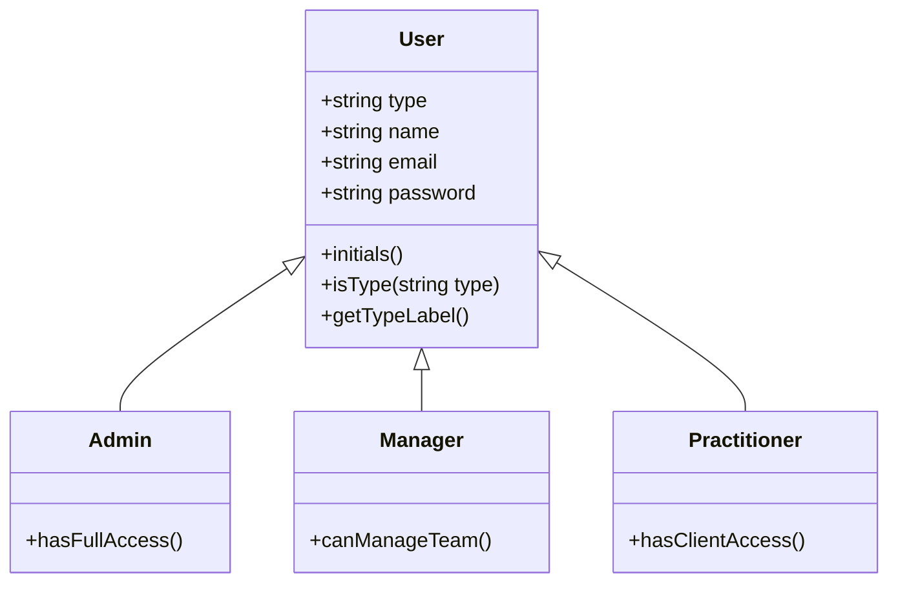
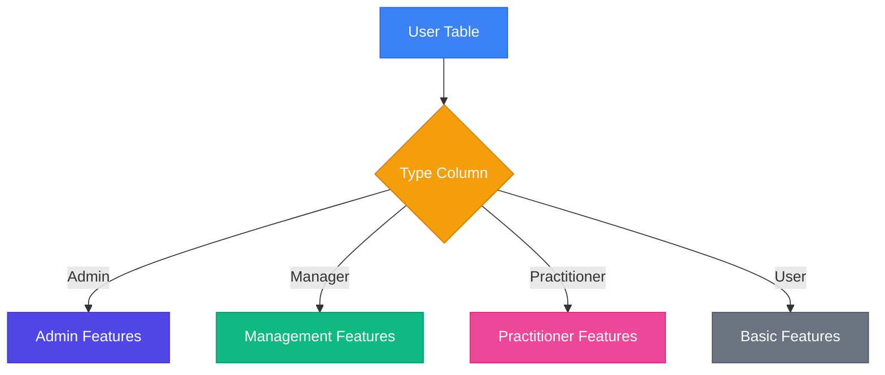
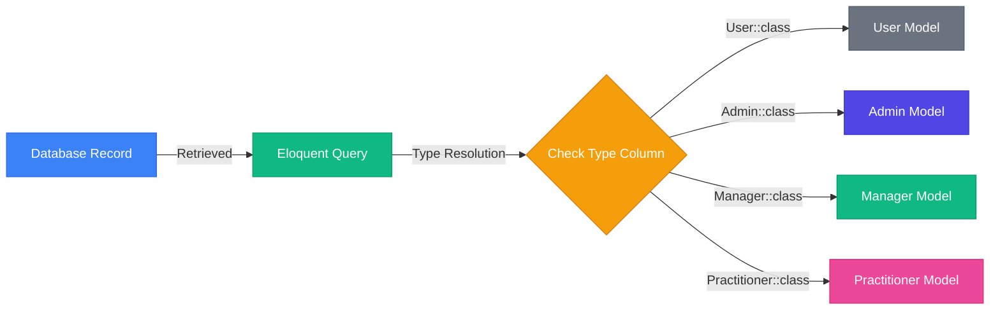
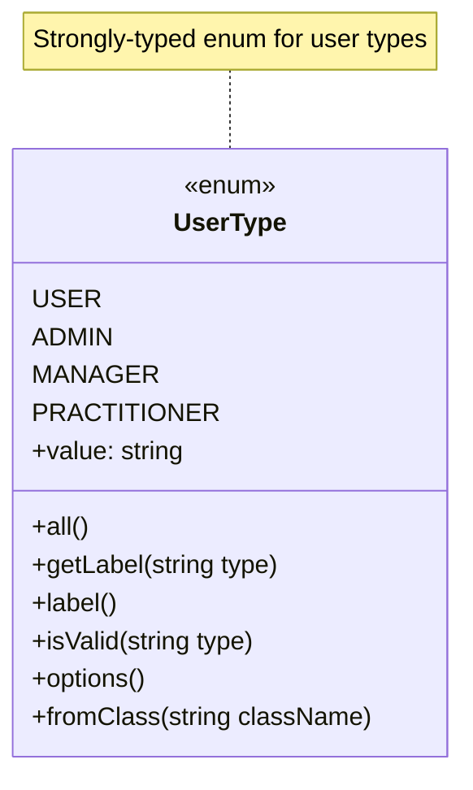
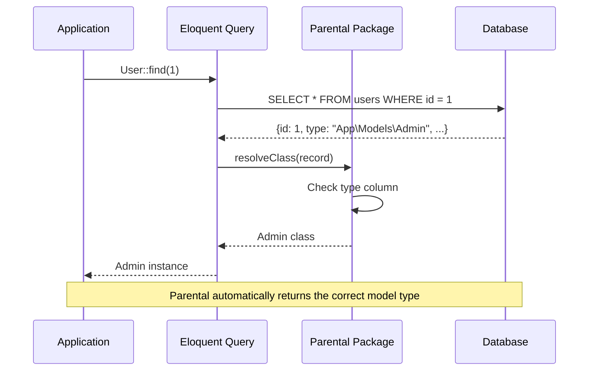
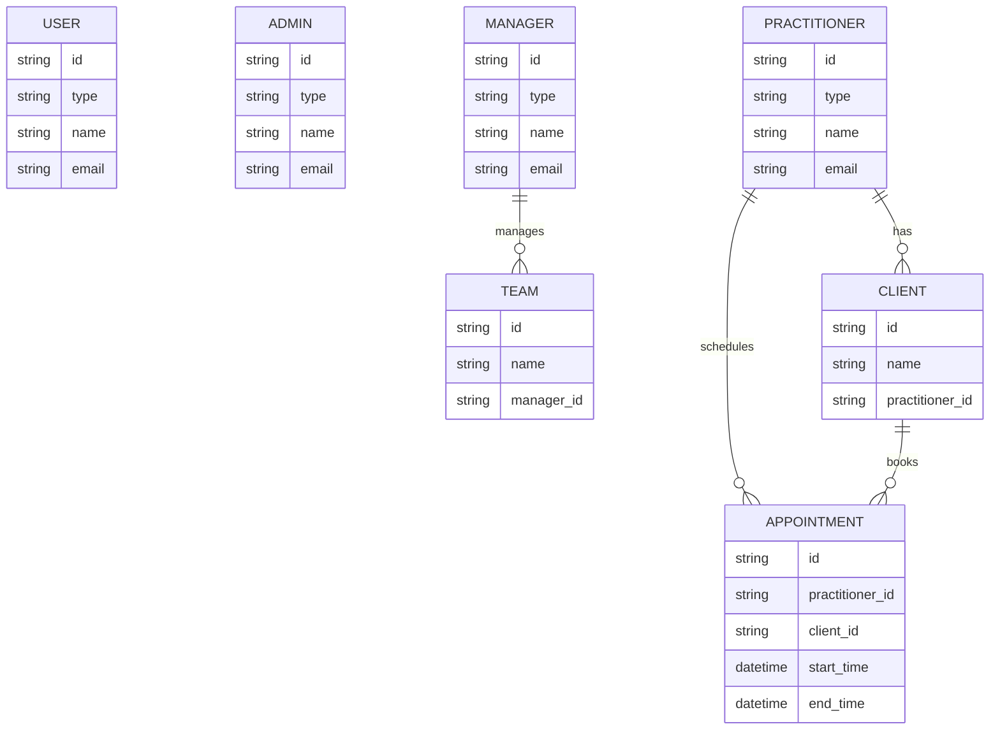
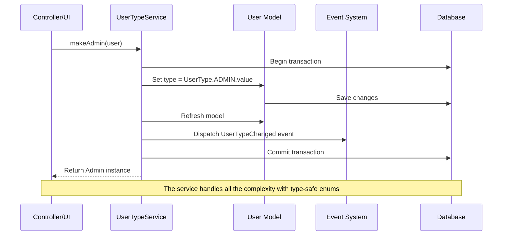

# Single Table Inheritance for User Model

<style>
:root {
  --primary-color: #4f46e5;
  --secondary-color: #10b981;
  --accent-color: #f59e0b;
  --warning-color: #ef4444;
  --info-color: #3b82f6;
  --text-color: #1f2937;
  --background-color: #ffffff;
  --code-background: #f3f4f6;
  --border-color: #e5e7eb;
  --heading-color: #111827;
}

@media (prefers-color-scheme: dark) {
  :root {
    --primary-color: #6366f1;
    --secondary-color: #34d399;
    --accent-color: #fbbf24;
    --warning-color: #f87171;
    --info-color: #60a5fa;
    --text-color: #e5e7eb;
    --background-color: #1f2937;
    --code-background: #374151;
    --border-color: #4b5563;
    --heading-color: #f3f4f6;
  }
}

h1, h2, h3, h4, h5, h6 {
  color: var(--heading-color);
}

body {
  color: var(--text-color);
  background-color: var(--background-color);
}

code {
  background-color: var(--code-background);
  padding: 0.2em 0.4em;
  border-radius: 3px;
}

pre {
  background-color: var(--code-background);
  padding: 1em;
  border-radius: 8px;
}

.primary-text {
  color: var(--primary-color);
}

.secondary-text {
  color: var(--secondary-color);
}

.accent-text {
  color: var(--accent-color);
}

.warning-text {
  color: var(--warning-color);
}

.info-text {
  color: var(--info-color);
}

.highlight-box {
  border-left: 4px solid var(--primary-color);
  background-color: var(--code-background);
  padding: 1em;
  margin: 1em 0;
  border-radius: 0 8px 8px 0;
}

.info-box {
  border-left: 4px solid var(--info-color);
  background-color: var(--code-background);
  padding: 1em;
  margin: 1em 0;
  border-radius: 0 8px 8px 0;
}

.warning-box {
  border-left: 4px solid var(--warning-color);
  background-color: var(--code-background);
  padding: 1em;
  margin: 1em 0;
  border-radius: 0 8px 8px 0;
}

.tip-box {
  border-left: 4px solid var(--secondary-color);
  background-color: var(--code-background);
  padding: 1em;
  margin: 1em 0;
  border-radius: 0 8px 8px 0;
}
</style>

## 1.0 Introduction

<div class="highlight-box">
Single Table Inheritance (STI) is a design pattern that allows you to represent an inheritance hierarchy of classes in a relational database using a single table. This tutorial will guide you through implementing STI for the User model in Laravel 12, enabling specialized user types such as <span class="primary-text">Admin</span>, <span class="secondary-text">Manager</span>, <span class="accent-text">Practitioner</span>, and regular <span class="info-text">User</span> while maintaining all data in a single database table.
</div>

### 1.1 What is Single Table Inheritance?

Single Table Inheritance is a powerful object-relational mapping pattern that solves the challenge of representing class inheritance in relational databases. In this pattern:

- A single database table stores data for all classes in an inheritance hierarchy
- A "type" column (discriminator) identifies which specific class a row represents
- Child classes extend a base class and may add specialized behavior and attributes
- All potential attributes for all subclasses are stored in the same table, even if some attributes are only used by certain subclasses

<div class="info-box">
<strong>How STI Works in Laravel with Parental:</strong> The tightenco/parental package provides a seamless way to implement STI in Laravel by automatically handling the mapping between database rows and their corresponding model classes based on the type column. When you retrieve a record from the database, Parental ensures it's instantiated as the correct model class.
</div>



### 1.2 Benefits of Single Table Inheritance

<div class="tip-box">
STI offers numerous advantages when implemented correctly:
</div>

- <span class="primary-text">**Simplicity**</span>: One table to manage, no complex joins needed for basic operations
- <span class="secondary-text">**Performance**</span>: Faster queries as all data is in a single table, avoiding expensive joins
- <span class="accent-text">**Flexibility**</span>: Easy to add new user types without database schema changes
- <span class="info-text">**Polymorphism**</span>: Ability to treat different user types polymorphically while maintaining type-specific behavior
- <span class="primary-text">**Consistency**</span>: All users share common attributes and behavior through inheritance
- <span class="secondary-text">**Type Safety**</span>: With proper implementation, you get full PHP type hinting and IDE support
- <span class="accent-text">**Clean API**</span>: Type-specific methods on appropriate classes create a clean, intuitive API

### 1.3 Use Cases for User Types

In many applications, different types of users need different capabilities and behaviors. STI allows us to model these differences elegantly:

- <span class="primary-text">**Admin**</span>: System administrators with full access to all features
  - Can manage system settings
  - Can create and manage other users
  - Has access to all areas of the application

- <span class="secondary-text">**Manager**</span>: Users who manage teams or departments
  - Can assign tasks to team members
  - Can view team performance metrics
  - Has limited administrative capabilities

- <span class="accent-text">**Practitioner**</span>: Professional users who provide services
  - Can manage their own schedule
  - Can interact with clients
  - Has access to professional tools

- <span class="info-text">**User**</span>: Regular users with basic permissions
  - Can manage their own profile
  - Can access basic features
  - Has limited visibility in the system



By implementing STI, we can maintain a clean object-oriented design while keeping our database structure simple. Each user type can have its own specialized methods and behavior, while sharing common attributes and functionality through inheritance.

## 2.0 Setup and Installation

### 2.1 Required Packages

<div class="highlight-box">
For our implementation, we'll use the <span class="primary-text">tighten/parental</span> package, which provides an elegant way to implement STI in Laravel. This package handles the complexities of model type resolution and inheritance, making STI implementation straightforward and maintainable.
</div>

```bash
composer require tighten/parental
```

#### 2.1.1 Understanding Parental Package Features

The `tighten/parental` package offers several key features that make it ideal for implementing STI:

- <span class="primary-text">**HasChildren Trait**</span>: Applied to parent models to indicate they have child models
- <span class="secondary-text">**HasParent Trait**</span>: Applied to child models to establish the inheritance relationship
- <span class="accent-text">**Automatic Type Resolution**</span>: Automatically converts database records to the appropriate model type
- <span class="info-text">**Type Column Configuration**</span>: Customizable type column name (defaults to 'type')
- <span class="primary-text">**Child Type Registration**</span>: Automatically registers child types or allows manual registration



<div class="info-box">
<strong>How Parental Works:</strong> When you retrieve a model from the database, Parental checks the 'type' column value. If it matches a child class, Parental instantiates that specific class instead of the base class, ensuring you get the correct model type with all its specialized methods and properties.
</div>

### 2.2 Database Migration

First, we need to add a 'type' column to our users table. This column will store the fully qualified class name of the specific user type.

```bash
php artisan make:migration add_type_column_to_users_table
```

Edit the migration file:

```php
<?php

use App\Enums\UserType;
use Illuminate\Database\Migrations\Migration;
use Illuminate\Database\Schema\Blueprint;
use Illuminate\Support\Facades\Schema;

return new class extends Migration
{
    public function up(): void
    {
        Schema::table('users', function (Blueprint $table) {
            // Add the type column after the ID column with a default value
            // This ensures existing users are treated as regular User models
            $table->string('type')->after('id')->default(UserType::USER->value);

            // Optionally add an index for better query performance
            // since we'll frequently query by type
            $table->index('type');
        });
    }

    public function down(): void
    {
        Schema::table('users', function (Blueprint $table) {
            $table->dropIndex(['type']);
            $table->dropColumn('type');
        });
    }
};
```

<div class="tip-box">
<strong>Best Practice:</strong> Always add an index to your type column, as it will be frequently used in queries. This significantly improves performance, especially as your user table grows.
</div>

Run the migration:

```bash
php artisan migrate
```

### 2.3 Creating a UserType Enum

To maintain type safety and avoid using magic strings, we'll create a UserType enum that defines all available user types. PHP 8.1+ enums provide several benefits over constants:

- <span class="primary-text">Strong type safety</span> with dedicated enum types
- <span class="secondary-text">Centralized management</span> of user types
- <span class="accent-text">Easier refactoring</span> with IDE support
- <span class="info-text">Consistent labeling</span> throughout the application
- <span class="primary-text">Better autocompletion</span> in modern IDEs
- <span class="secondary-text">Self-documenting code</span> with clear intent

```bash
php artisan make:enum UserType
```

<div class="info-box">
<strong>Note:</strong> If you don't have a make:enum command available, you can create the file manually in <code>app/Enums/UserType.php</code>.
</div>

Edit the UserType enum:

```php
<?php

namespace App\Enums;

use App\Models\User;
use App\Models\Admin;
use App\Models\Manager;
use App\Models\Practitioner;

enum UserType: string
{
    /**
     * User type cases with their corresponding model class names
     */
    case USER = User::class;
    case ADMIN = Admin::class;
    case MANAGER = Manager::class;
    case PRACTITIONER = Practitioner::class;

    /**
     * Get all available user types
     *
     * @return array<string, string>
     */
    public static function all(): array
    {
        return [
            'User' => self::USER->value,
            'Admin' => self::ADMIN->value,
            'Manager' => self::MANAGER->value,
            'Practitioner' => self::PRACTITIONER->value,
        ];
    }

    /**
     * Get a user-friendly name for a type
     *
     * @param string $type The fully qualified class name
     * @return string
     */
    public static function getLabel(string $type): string
    {
        return array_flip(self::all())[$type] ?? 'Unknown';
    }

    /**
     * Get the label for this enum case
     *
     * @return string
     */
    public function label(): string
    {
        return match($this) {
            self::USER => 'User',
            self::ADMIN => 'Admin',
            self::MANAGER => 'Manager',
            self::PRACTITIONER => 'Practitioner',
        };
    }

    /**
     * Check if a given type is valid
     *
     * @param string $type The fully qualified class name
     * @return bool
     */
    public static function isValid(string $type): bool
    {
        return in_array($type, self::all());
    }

    /**
     * Get available types as options for select inputs
     *
     * @return array<string, string>
     */
    public static function options(): array
    {
        $options = [];
        foreach (self::all() as $label => $class) {
            $options[$class] = $label;
        }
        return $options;
    }

    /**
     * Get the enum case from a class name
     *
     * @param string $className
     * @return self|null
     */
    public static function fromClass(string $className): ?self
    {
        foreach (self::cases() as $case) {
            if ($case->value === $className) {
                return $case;
            }
        }

        return null;
    }
}
```



<div class="tip-box">
<strong>PHP 8.1 Enum Benefits:</strong> Using enums provides stronger type safety than constants. You can type-hint method parameters and return values with the enum type, and IDEs can provide better autocompletion and refactoring support.
</div>
```

## 3.0 Implementing the Base User Model

<div class="highlight-box">
The foundation of our Single Table Inheritance implementation is the base User model and its child models. The Parental package makes this implementation clean and straightforward by providing traits that handle the inheritance relationship.
</div>

### 3.1 Configuring the User Model

First, we need to modify our base User model to support STI by adding the `HasChildren` trait from the Parental package:

```php
<?php

namespace App\Models;

use App\Enums\UserType;
use Illuminate\Database\Eloquent\Factories\HasFactory;
use Illuminate\Foundation\Auth\User as Authenticatable;
use Illuminate\Notifications\Notifiable;
use Tightenco\Parental\HasChildren;

class User extends Authenticatable
{
    use HasFactory, Notifiable, HasChildren;

    /**
     * The type column used for Single Table Inheritance
     * This is optional as 'type' is the default, but it's good to be explicit
     */
    protected $childColumn = 'type';

    /**
     * The attributes that are mass assignable.
     *
     * @var array<int, string>
     */
    protected $fillable = [
        'name',
        'email',
        'password',
        'type',
    ];

    /**
     * The attributes that should be hidden for serialization.
     *
     * @var array<int, string>
     */
    protected $hidden = [
        'password',
        'remember_token',
    ];

    /**
     * Get the attributes that should be cast.
     *
     * @return array<string, string>
     */
    protected function casts(): array
    {
        return [
            'email_verified_at' => 'datetime',
            'password' => 'hashed',
        ];
    }

    /**
     * Get the user's initials
     */
    public function initials(): string
    {
        return \Illuminate\Support\Str::of($this->name)
            ->explode(' ')
            ->map(fn (string $name) => \Illuminate\Support\Str::of($name)->substr(0, 1))
            ->implode('');
    }

    /**
     * Check if the user is of a specific type
     *
     * @param UserType $type
     * @return bool
     */
    public function isType(UserType $type): bool
    {
        return $this->type === $type->value;
    }

    /**
     * Get the user type enum
     *
     * @return UserType|null
     */
    public function getUserType(): ?UserType
    {
        return UserType::fromClass($this->type);
    }

    /**
     * Get the user type label
     *
     * @return string
     */
    public function getTypeLabel(): string
    {
        $userType = $this->getUserType();
        return $userType ? $userType->label() : 'Unknown';
    }

    /**
     * Check if the user is an Admin
     *
     * @return bool
     */
    public function isAdmin(): bool
    {
        return $this instanceof Admin;
    }

    /**
     * Check if the user is a Manager
     *
     * @return bool
     */
    public function isManager(): bool
    {
        return $this instanceof Manager;
    }

    /**
     * Check if the user is a Practitioner
     *
     * @return bool
     */
    public function isPractitioner(): bool
    {
        return $this instanceof Practitioner;
    }
}
```

<div class="info-box">
<strong>Key Parental Features Used:</strong>
<ul>
<li>The <code>HasChildren</code> trait tells Parental that this model has child models</li>
<li>The <code>$childColumn</code> property specifies which column contains the child type (defaults to 'type')</li>
<li>Parental automatically handles the instantiation of the correct child class based on the type column</li>
</ul>
</div>



### 3.2 Creating Child Models

Now, let's create the child models for our different user types. Each child model will:

1. Extend the base User model
2. Use the `HasParent` trait from Parental
3. Set the type column automatically when creating new instances
4. Implement type-specific functionality

#### 3.2.1 Admin Model

```php
<?php

namespace App\Models;

use App\Enums\UserType;
use Tightenco\Parental\HasParent;

class Admin extends User
{
    use HasParent;

    /**
     * Ensure the type is set correctly when creating a new Admin
     * This is a crucial step to maintain data integrity
     */
    protected static function booted()
    {
        static::creating(function ($model) {
            $model->type = UserType::ADMIN->value;
        });

        parent::booted();
    }

    /**
     * Admin-specific functionality
     * This method is only available on Admin instances
     */
    public function hasFullAccess(): bool
    {
        return true;
    }

    /**
     * Admin-specific relationship example
     * Admins might have access to system logs
     */
    public function systemLogs()
    {
        return $this->hasMany(SystemLog::class, 'viewed_by_id');
    }
}
```

#### 3.2.2 Manager Model

```php
<?php

namespace App\Models;

use App\Enums\UserType;
use Tightenco\Parental\HasParent;

class Manager extends User
{
    use HasParent;

    /**
     * Ensure the type is set correctly when creating a new Manager
     */
    protected static function booted()
    {
        static::creating(function ($model) {
            $model->type = UserType::MANAGER->value;
        });

        parent::booted();
    }

    /**
     * Manager-specific functionality
     * This method is only available on Manager instances
     */
    public function canManageTeam(): bool
    {
        return true;
    }

    /**
     * Manager-specific relationship example
     * Managers might manage multiple teams
     */
    public function managedTeams()
    {
        return $this->hasMany(Team::class, 'manager_id');
    }

    /**
     * Get team members under this manager
     */
    public function teamMembers()
    {
        return $this->hasManyThrough(
            User::class,
            Team::class,
            'manager_id', // Foreign key on teams table
            'team_id',    // Foreign key on users table
            'id',         // Local key on managers table
            'id'          // Local key on teams table
        );
    }
}
```

#### 3.2.3 Practitioner Model

```php
<?php

namespace App\Models;

use App\Enums\UserType;
use Tightenco\Parental\HasParent;

class Practitioner extends User
{
    use HasParent;

    /**
     * Ensure the type is set correctly when creating a new Practitioner
     */
    protected static function booted()
    {
        static::creating(function ($model) {
            $model->type = UserType::PRACTITIONER->value;
        });

        parent::booted();
    }

    /**
     * Practitioner-specific functionality
     * This method is only available on Practitioner instances
     */
    public function hasClientAccess(): bool
    {
        return true;
    }

    /**
     * Practitioner-specific relationship example
     * Practitioners might have clients
     */
    public function clients()
    {
        return $this->hasMany(Client::class, 'practitioner_id');
    }

    /**
     * Practitioner-specific relationship example
     * Practitioners might have a schedule
     */
    public function appointments()
    {
        return $this->hasMany(Appointment::class, 'practitioner_id');
    }
}
```

<div class="tip-box">
<strong>Type-Specific Relationships:</strong> One of the major benefits of STI is the ability to define relationships that only make sense for specific user types. For example, only Practitioners would have clients, and only Managers would have managed teams.
</div>


```

## 4.0 User Type Management Service

<div class="highlight-box">
To manage the lifecycle of user types and handle transitions between different types, we'll create a dedicated service class. This service will provide a clean API for changing user types and ensure that all necessary steps are performed consistently.
</div>

### 4.1 Creating the UserTypeService

The UserTypeService will handle all operations related to changing a user's type, including validation, database transactions, and event dispatching.

```bash
php artisan make:class Services/UserTypeService
```

Implement the service class:

```php
<?php

namespace App\Services;

use App\Models\User;
use App\Models\Admin;
use App\Models\Manager;
use App\Models\Practitioner;
use App\Enums\UserType;
use Illuminate\Support\Facades\DB;
use Illuminate\Support\Facades\Log;
use Illuminate\Support\Facades\Event;
use App\Events\UserTypeChanged;

class UserTypeService
{
    /**
     * Change a user's type
     *
     * @param User $user
     * @param UserType $newType
     * @param array $additionalAttributes Additional attributes to set when changing type
     * @return User
     * @throws \Exception
     */
    public function changeUserType(User $user, UserType $newType, array $additionalAttributes = []): User
    {
        // If the user is already of this type, return early
        if ($user->getUserType() === $newType) {
            return $user;
        }

        $oldType = $user->getUserType();
        $oldTypeLabel = $oldType ? $oldType->label() : 'Unknown';
        $newTypeLabel = $newType->label();

        try {
            DB::beginTransaction();

            // Update the user's type
            $user->type = $newType->value;

            // Set any additional attributes
            foreach ($additionalAttributes as $key => $value) {
                $user->{$key} = $value;
            }

            $user->save();

            // Refresh the model to get the correct instance type
            $user = $user->fresh();

            // Log the type change
            Log::info("User type changed from {$oldTypeLabel} to {$newTypeLabel}", [
                'user_id' => $user->id,
                'old_type' => $oldType?->value,
                'new_type' => $newType->value,
            ]);

            // Dispatch an event for the type change
            Event::dispatch(new UserTypeChanged($user, $oldType, $newType));

            DB::commit();

            return $user;
        } catch (\Exception $e) {
            DB::rollBack();
            Log::error("Failed to change user type: {$e->getMessage()}", [
                'user_id' => $user->id,
                'old_type' => $oldType?->value,
                'new_type' => $newType->value,
                'exception' => $e,
            ]);

            throw $e;
        }
    }

    /**
     * Get all available user types
     *
     * @return array<string, string>
     */
    public function getAvailableTypes(): array
    {
        return UserType::all();
    }

    /**
     * Get all user type enum cases
     *
     * @return array<UserType>
     */
    public function getUserTypeEnums(): array
    {
        return UserType::cases();
    }

    /**
     * Convert a user to an Admin
     *
     * @param User $user
     * @param array $additionalAttributes
     * @return Admin
     */
    public function makeAdmin(User $user, array $additionalAttributes = []): Admin
    {
        return $this->changeUserType($user, UserType::ADMIN, $additionalAttributes);
    }

    /**
     * Convert a user to a Manager
     *
     * @param User $user
     * @param array $additionalAttributes
     * @return Manager
     */
    public function makeManager(User $user, array $additionalAttributes = []): Manager
    {
        return $this->changeUserType($user, UserType::MANAGER, $additionalAttributes);
    }

    /**
     * Convert a user to a Practitioner
     *
     * @param User $user
     * @param array $additionalAttributes
     * @return Practitioner
     */
    public function makePractitioner(User $user, array $additionalAttributes = []): Practitioner
    {
        return $this->changeUserType($user, UserType::PRACTITIONER, $additionalAttributes);
    }

    /**
     * Convert a user to a regular User
     *
     * @param User $user
     * @param array $additionalAttributes
     * @return User
     */
    public function makeRegularUser(User $user, array $additionalAttributes = []): User
    {
        return $this->changeUserType($user, UserType::USER, $additionalAttributes);
    }

    /**
     * Get counts of users by type
     *
     * @return array<string, int>
     */
    public function getUserTypeCounts(): array
    {
        $counts = [];
        foreach (UserType::cases() as $type) {
            $counts[$type->label()] = User::where('type', $type->value)->count();
        }
        return $counts;
    }
}
```

<div class="info-box">
<strong>Key Features of the UserTypeService:</strong>
<ul>
<li>Type validation before making changes</li>
<li>Database transactions to ensure data integrity</li>
<li>Event dispatching for type changes</li>
<li>Error logging for failed operations</li>
<li>Type-specific convenience methods with proper return types</li>
<li>Support for additional attributes during type changes</li>
</ul>
</div>



### 4.2 Creating the UserTypeChanged Event

To allow other parts of the application to react to user type changes, we'll create an event that will be dispatched whenever a user's type changes.

```bash
php artisan make:event UserTypeChanged
```

Implement the event class:

```php
<?php

namespace App\Events;

use App\Models\User;
use App\Enums\UserType;
use Illuminate\Broadcasting\InteractsWithSockets;
use Illuminate\Foundation\Events\Dispatchable;
use Illuminate\Queue\SerializesModels;

class UserTypeChanged
{
    use Dispatchable, InteractsWithSockets, SerializesModels;

    /**
     * Create a new event instance.
     *
     * @param User $user The user whose type changed
     * @param UserType|null $oldType The previous user type
     * @param UserType $newType The new user type
     */
    public function __construct(
        public User $user,
        public ?UserType $oldType,
        public UserType $newType
    ) {}

    /**
     * Get the old type label
     *
     * @return string
     */
    public function getOldTypeLabel(): string
    {
        return $this->oldType?->label() ?? 'Unknown';
    }

    /**
     * Get the new type label
     *
     * @return string
     */
    public function getNewTypeLabel(): string
    {
        return $this->newType->label();
    }
}
```

### 4.3 Creating Event Listeners

We can create listeners to react to user type changes. For example, we might want to send notifications, update permissions, or perform other actions when a user's type changes.

```bash
php artisan make:listener SendUserTypeChangeNotification --event=UserTypeChanged
```

Implement the listener:

```php
<?php

namespace App\Listeners;

use App\Events\UserTypeChanged;
use App\Models\Admin;
use App\Enums\UserType;
use Illuminate\Support\Facades\Notification;
use App\Notifications\UserTypeChanged as UserTypeChangedNotification;

class SendUserTypeChangeNotification
{
    /**
     * Handle the event.
     */
    public function handle(UserTypeChanged $event): void
    {
        // Notify the user about their type change
        $event->user->notify(new UserTypeChangedNotification(
            $event->getOldTypeLabel(),
            $event->getNewTypeLabel()
        ));

        // Notify admins about the type change
        if ($event->newType !== UserType::ADMIN) {
            $admins = Admin::all();
            Notification::send($admins, new UserTypeChangedNotification(
                $event->getOldTypeLabel(),
                $event->getNewTypeLabel(),
                $event->user
            ));
        }
    }
}
```

### 4.4 Registering the Service in the Service Container

To make our service easily accessible throughout the application, let's register it in the service container. Edit the `AppServiceProvider`:

```php
<?php

namespace App\Providers;

use App\Services\UserTypeService;
use Illuminate\Support\ServiceProvider;

class AppServiceProvider extends ServiceProvider
{
    /**
     * Register any application services.
     */
    public function register(): void
    {
        $this->app->singleton(UserTypeService::class, function ($app) {
            return new UserTypeService();
        });
    }

    // ...
}
```

<div class="tip-box">
<strong>Service Container Benefits:</strong> By registering the service in the container, we can easily inject it into controllers, commands, and other services. Laravel will automatically resolve the dependency when needed.
</div>

### 4.5 Creating a User Type Change Notification

To complete our notification system, let's create a notification class for user type changes:

```bash
php artisan make:notification UserTypeChanged
```

Implement the notification:

```php
<?php

namespace App\Notifications;

use App\Models\User;
use App\Enums\UserType;
use Illuminate\Bus\Queueable;
use Illuminate\Notifications\Messages\MailMessage;
use Illuminate\Notifications\Notification;

class UserTypeChanged extends Notification
{
    use Queueable;

    /**
     * Create a new notification instance.
     */
    public function __construct(
        public string $oldType,
        public string $newType,
        public ?User $changedUser = null
    ) {}

    /**
     * Get the notification's delivery channels.
     *
     * @return array<int, string>
     */
    public function via(object $notifiable): array
    {
        return ['mail', 'database'];
    }

    /**
     * Get the mail representation of the notification.
     */
    public function toMail(object $notifiable): MailMessage
    {
        $message = (new MailMessage)
            ->subject('User Type Changed');

        if ($this->changedUser) {
            // This is a notification to an admin about another user
            $message->line("User {$this->changedUser->name} has been changed from {$this->oldType} to {$this->newType}.");
        } else {
            // This is a notification to the user themselves
            $message->line("Your user type has been changed from {$this->oldType} to {$this->newType}.");
        }

        return $message
            ->line('This change may affect your permissions and available features.')
            ->action('View Your Profile', url('/profile'))
            ->line('Thank you for using our application!');
    }

    /**
     * Get the array representation of the notification.
     *
     * @return array<string, mixed>
     */
    public function toArray(object $notifiable): array
    {
        return [
            'old_type' => $this->oldType,
            'new_type' => $this->newType,
            'changed_user_id' => $this->changedUser?->id,
        ];
    }
}
```

## 5.0 Filament Integration for User Type Management

Now that we have our models and service in place, let's create a Filament interface for managing user types.

### 5.1 Creating a Filament Resource for Users

If you don't already have a UserResource, create one:

```bash
php artisan make:filament-resource User
```

### 5.2 Customizing the UserResource

Edit the UserResource to include user type management:

```php
<?php

namespace App\Filament\Resources;

use App\Filament\Resources\UserResource\Pages;
use App\Models\User;
use App\Enums\UserType;
use App\Services\UserTypeService;
use Filament\Forms;
use Filament\Forms\Form;
use Filament\Resources\Resource;
use Filament\Tables;
use Filament\Tables\Table;
use Illuminate\Support\Facades\Hash;

class UserResource extends Resource
{
    protected static ?string $model = User::class;

    protected static ?string $navigationIcon = 'heroicon-o-users';

    public static function form(Form $form): Form
    {
        return $form
            ->schema([
                Forms\Components\Section::make('User Information')
                    ->schema([
                        Forms\Components\TextInput::make('name')
                            ->required()
                            ->maxLength(255),
                        Forms\Components\TextInput::make('email')
                            ->email()
                            ->required()
                            ->maxLength(255),
                        Forms\Components\DateTimePicker::make('email_verified_at'),
                        Forms\Components\TextInput::make('password')
                            ->password()
                            ->dehydrateStateUsing(fn ($state) => Hash::make($state))
                            ->dehydrated(fn ($state) => filled($state))
                            ->required(fn (string $context): bool => $context === 'create'),
                    ])->columns(2),

                Forms\Components\Section::make('User Type')
                    ->schema([
                        Forms\Components\Select::make('type')
                            ->label('User Type')
                            ->options(function () {
                                $options = [];
                                foreach (UserType::cases() as $type) {
                                    $options[$type->value] = $type->label();
                                }
                                return $options;
                            })
                            ->required()
                            ->native(false),
                    ]),
            ]);
    }

    public static function table(Table $table): Table
    {
        return $table
            ->columns([
                Tables\Columns\TextColumn::make('name')
                    ->searchable(),
                Tables\Columns\TextColumn::make('email')
                    ->searchable(),
                Tables\Columns\TextColumn::make('type')
                    ->label('User Type')
                    ->formatStateUsing(function (string $state): string {
                        $userType = UserType::fromClass($state);
                        return $userType ? $userType->label() : 'Unknown';
                    })
                    ->sortable(),
                Tables\Columns\TextColumn::make('email_verified_at')
                    ->dateTime()
                    ->sortable()
                    ->toggleable(isToggledHiddenByDefault: true),
                Tables\Columns\TextColumn::make('created_at')
                    ->dateTime()
                    ->sortable()
                    ->toggleable(isToggledHiddenByDefault: true),
                Tables\Columns\TextColumn::make('updated_at')
                    ->dateTime()
                    ->sortable()
                    ->toggleable(isToggledHiddenByDefault: true),
            ])
            ->filters([
                Tables\Filters\SelectFilter::make('type')
                    ->label('User Type')
                    ->options(function () {
                        $options = [];
                        foreach (UserType::cases() as $type) {
                            $options[$type->value] = $type->label();
                        }
                        return $options;
                    }),
            ])
            ->actions([
                Tables\Actions\EditAction::make(),
                Tables\Actions\Action::make('changeType')
                    ->label('Change Type')
                    ->icon('heroicon-o-arrow-path')
                    ->form([
                        Forms\Components\Select::make('new_type')
                            ->label('New User Type')
                            ->options(function () {
                                $options = [];
                                foreach (UserType::cases() as $type) {
                                    $options[$type->name] = $type->label();
                                }
                                return $options;
                            })
                            ->required()
                            ->native(false),
                    ])
                    ->action(function (User $record, array $data, UserTypeService $userTypeService) {
                        $userType = UserType::{$data['new_type']};
                        $userTypeService->changeUserType($record, $userType);
                    }),
            ])
            ->bulkActions([
                Tables\Actions\BulkActionGroup::make([
                    Tables\Actions\DeleteBulkAction::make(),
                ]),
            ]);
    }

    public static function getRelations(): array
    {
        return [
            //
        ];
    }

    public static function getPages(): array
    {
        return [
            'index' => Pages\ListUsers::route('/'),
            'create' => Pages\CreateUser::route('/create'),
            'edit' => Pages\EditUser::route('/{record}/edit'),
        ];
    }
}
```

## 6.0 Testing the Single Table Inheritance Implementation

Testing is crucial to ensure our STI implementation works correctly. Let's create comprehensive tests for our user type functionality.

### 6.1 Creating Feature Tests

```bash
php artisan make:test UserTypeTest
```

Implement the test class:

```php
<?php

namespace Tests\Feature;

use App\Enums\UserType;use App\Models\Admin;use App\Models\Manager;use App\Models\Practitioner;use App\Models\User;use App\Services\UserTypeService;use Illuminate\Foundation\Testing\RefreshDatabase;use old\TestCase;

class UserTypeTest extends TestCase
{
    use RefreshDatabase;

    /** @test */
    public function it_can_create_different_user_types()
    {
        // Create a regular user
        $user = User::factory()->create([
            'type' => UserType::USER->value,
        ]);
        $this->assertInstanceOf(User::class, $user);
        $this->assertEquals(UserType::USER->value, $user->type);

        // Create an admin
        $admin = Admin::factory()->create();
        $this->assertInstanceOf(Admin::class, $admin);
        $this->assertEquals(UserType::ADMIN->value, $admin->type);

        // Create a manager
        $manager = Manager::factory()->create();
        $this->assertInstanceOf(Manager::class, $manager);
        $this->assertEquals(UserType::MANAGER->value, $manager->type);

        // Create a practitioner
        $practitioner = Practitioner::factory()->create();
        $this->assertInstanceOf(Practitioner::class, $practitioner);
        $this->assertEquals(UserType::PRACTITIONER->value, $practitioner->type);
    }

    /** @test */
    public function it_can_change_user_types_using_service()
    {
        // Create a regular user
        $user = User::factory()->create([
            'type' => UserType::USER->value,
        ]);

        $userTypeService = app(UserTypeService::class);

        // Change to admin
        $admin = $userTypeService->makeAdmin($user);
        $this->assertInstanceOf(Admin::class, $admin);
        $this->assertEquals(UserType::ADMIN->value, $admin->type);

        // Change to manager
        $manager = $userTypeService->makeManager($admin);
        $this->assertInstanceOf(Manager::class, $manager);
        $this->assertEquals(UserType::MANAGER->value, $manager->type);

        // Change to practitioner
        $practitioner = $userTypeService->makePractitioner($manager);
        $this->assertInstanceOf(Practitioner::class, $practitioner);
        $this->assertEquals(UserType::PRACTITIONER->value, $practitioner->type);

        // Change back to regular user
        $regularUser = $userTypeService->makeRegularUser($practitioner);
        $this->assertInstanceOf(User::class, $regularUser);
        $this->assertEquals(UserType::USER->value, $regularUser->type);
    }

    /** @test */
    public function it_can_query_specific_user_types()
    {
        // Create users of different types
        User::factory()->count(3)->create([
            'type' => UserType::USER->value,
        ]);
        Admin::factory()->count(2)->create();
        Manager::factory()->count(4)->create();
        Practitioner::factory()->count(1)->create();

        // Query specific types
        $this->assertEquals(3, User::query()->where('type', UserType::USER->value)->count());
        $this->assertEquals(2, Admin::query()->count());
        $this->assertEquals(4, Manager::query()->count());
        $this->assertEquals(1, Practitioner::query()->count());

        // Total users
        $this->assertEquals(10, User::query()->count());
    }

    /** @test */
    public function it_can_use_type_specific_methods()
    {
        $admin = Admin::factory()->create();
        $manager = Manager::factory()->create();
        $practitioner = Practitioner::factory()->create();

        // Test admin-specific method
        $this->assertTrue($admin->hasFullAccess());

        // Test manager-specific method
        $this->assertTrue($manager->canManageTeam());

        // Test practitioner-specific method
        $this->assertTrue($practitioner->hasClientAccess());
    }
}
```

### 6.2 Updating the User Factory

To support creating different user types in our tests, let's update the UserFactory:

```php
<?php

namespace Database\Factories;

use App\Models\User;
use App\Models\Admin;
use App\Models\Manager;
use App\Models\Practitioner;
use App\Enums\UserType;
use Illuminate\Database\Eloquent\Factories\Factory;
use Illuminate\Support\Facades\Hash;
use Illuminate\Support\Str;

class UserFactory extends Factory
{
    protected $model = User::class;

    /**
     * Define the model's default state.
     *
     * @return array<string, mixed>
     */
    public function definition(): array
    {
        return [
            'name' => fake()->name(),
            'email' => fake()->unique()->safeEmail(),
            'email_verified_at' => now(),
            'password' => static::$password ??= Hash::make('password'),
            'remember_token' => Str::random(10),
            'type' => UserType::USER->value,
        ];
    }

    /**
     * Indicate that the model's email address should be unverified.
     */
    public function unverified(): static
    {
        return $this->state(fn (array $attributes) => [
            'email_verified_at' => null,
        ]);
    }

    /**
     * Configure the factory to create an Admin.
     */
    public function admin(): static
    {
        return $this->state([
            'type' => UserType::ADMIN->value,
        ])->newModel(function (array $attributes) {
            return new Admin($attributes);
        });
    }

    /**
     * Configure the factory to create a Manager.
     */
    public function manager(): static
    {
        return $this->state([
            'type' => UserType::MANAGER->value,
        ])->newModel(function (array $attributes) {
            return new Manager($attributes);
        });
    }

    /**
     * Configure the factory to create a Practitioner.
     */
    public function practitioner(): static
    {
        return $this->state([
            'type' => UserType::PRACTITIONER->value,
        ])->newModel(function (array $attributes) {
            return new Practitioner($attributes);
        });
    }
}
```

### 6.3 Creating Child Model Factories

Create factory classes for each child model:

```php
<?php

namespace Database\Factories;

use App\Models\Admin;
use App\Enums\UserType;

class AdminFactory extends UserFactory
{
    protected $model = Admin::class;

    public function definition(): array
    {
        return array_merge(parent::definition(), [
            'type' => UserType::ADMIN->value,
        ]);
    }
}
```

```php
<?php

namespace Database\Factories;

use App\Models\Manager;
use App\Enums\UserType;

class ManagerFactory extends UserFactory
{
    protected $model = Manager::class;

    public function definition(): array
    {
        return array_merge(parent::definition(), [
            'type' => UserType::MANAGER->value,
        ]);
    }
}
```

```php
<?php

namespace Database\Factories;

use App\Models\Practitioner;
use App\Enums\UserType;

class PractitionerFactory extends UserFactory
{
    protected $model = Practitioner::class;

    public function definition(): array
    {
        return array_merge(parent::definition(), [
            'type' => UserType::PRACTITIONER->value,
        ]);
    }
}
```

## 7.0 Best Practices and Advanced Topics

### 7.1 Performance Considerations

Single Table Inheritance can be very efficient, but there are some performance considerations to keep in mind:

1. **Table Size**: As all user types share the same table, it can grow large. Ensure proper indexing on frequently queried columns, especially the `type` column.

2. **Unused Columns**: Some columns may only be relevant to specific user types. This can lead to sparse data and wasted space. Consider using JSON columns for type-specific attributes if they become numerous.

3. **Query Optimization**: When querying specific user types, always include the type condition in your queries to leverage indexes:

   ```php
   // Good - uses type index
   $admins = Admin::query()->where('active', true)->get();

   // Also good - explicitly filters by type using enum
   $admins = User::query()->where('type', UserType::ADMIN->value)->where('active', true)->get();

   // You can also use the enum for more complex queries
   $managementUsers = User::query()
       ->whereIn('type', [UserType::ADMIN->value, UserType::MANAGER->value])
       ->where('active', true)
       ->get();
   ```

### 7.2 Type-Specific Functionality

When implementing type-specific functionality, consider these approaches:

1. **Type-Specific Methods**: Add methods to child classes that implement behavior specific to that user type.

2. **Polymorphic Relationships**: Use Laravel's polymorphic relationships for type-specific related data.

3. **Interface Segregation**: Define interfaces for specific capabilities and implement them in the appropriate user type classes.

4. **Policy-Based Authorization**: Use Laravel's policies to control access based on user type:

   ```php
   public function viewAny(User $user)
   {
       // Using instanceof check
       return $user instanceof Admin || $user instanceof Manager;

       // Or using the enum
       // return in_array($user->getUserType(), [UserType::ADMIN, UserType::MANAGER]);

       // Or using the isType method
       // return $user->isType(UserType::ADMIN) || $user->isType(UserType::MANAGER);
   }
   ```

### 7.3 Integration with Existing Systems

When integrating STI with existing systems:

1. **Migration Strategy**: If migrating from a non-STI system, plan a phased approach to convert users to the new structure.

2. **API Consistency**: Ensure your API responses handle different user types consistently, possibly using API resources to normalize the output.

3. **Authentication**: Update authentication logic to work with the STI model, ensuring proper type casting after login.

4. **Third-Party Packages**: Some packages may not be designed with STI in mind. Test thoroughly and extend as needed.

### 7.4 Adding New User Types

To add a new user type to the system:

1. Create a new model class that extends `User` and uses the `HasParent` trait
2. Add the new type to the `UserType` class
3. Update any UI components to include the new type
4. Create factory classes for testing
5. Add type-specific methods and functionality

Example of adding a new "Supervisor" type:

```php
<?php

namespace App\Models;

use App\Enums\UserType;
use Tightenco\Parental\HasParent;

class Supervisor extends User
{
    use HasParent;

    protected static function booted()
    {
        static::creating(function ($model) {
            $model->type = UserType::SUPERVISOR->value;
        });

        parent::booted();
    }

    public function canSupervisePractitioners(): bool
    {
        return true;
    }
}
```

Then update the `UserType` enum:

```php
enum UserType: string
{
    case USER = User::class;
    case ADMIN = Admin::class;
    case MANAGER = Manager::class;
    case PRACTITIONER = Practitioner::class;
    case SUPERVISOR = Supervisor::class;

    // Update the label method to include the new type
    public function label(): string
    {
        return match($this) {
            self::USER => 'User',
            self::ADMIN => 'Admin',
            self::MANAGER => 'Manager',
            self::PRACTITIONER => 'Practitioner',
            self::SUPERVISOR => 'Supervisor',
        };
    }

    // Update other methods as needed...
```

## 8.0 Conclusion

Single Table Inheritance provides a powerful way to model different user types in Laravel while maintaining a clean database structure. By using the `tighten/parental` package and following the patterns outlined in this tutorial, you can implement a robust, type-safe user model hierarchy that's easy to extend and maintain.

The key benefits of this approach include:

- <span class="primary-text">**Simplified Database Schema**</span>: All user data in a single table
- <span class="secondary-text">**Type Safety**</span>: Proper PHP class inheritance with type hints
- <span class="accent-text">**Extensibility**</span>: Easy to add new user types
- <span class="info-text">**Clean API**</span>: Type-specific methods on appropriate classes
- <span class="primary-text">**Efficient Queries**</span>: No joins needed for basic user data

By using PHP 8.1+ enums for user types, we gain additional benefits:

- <span class="secondary-text">**Enhanced Type Safety**</span>: Compiler-checked enum values prevent typos and invalid types
- <span class="accent-text">**Self-Documenting Code**</span>: Enum cases clearly define all possible user types
- <span class="info-text">**IDE Support**</span>: Better autocompletion and refactoring capabilities
- <span class="primary-text">**Centralized Type Management**</span>: Single source of truth for all user types

By combining STI with Laravel's powerful features like Eloquent, Events, Filament, and PHP 8.1+ enums, you can create a comprehensive user management system that handles different user types elegantly while maintaining robust type safety throughout your application.
