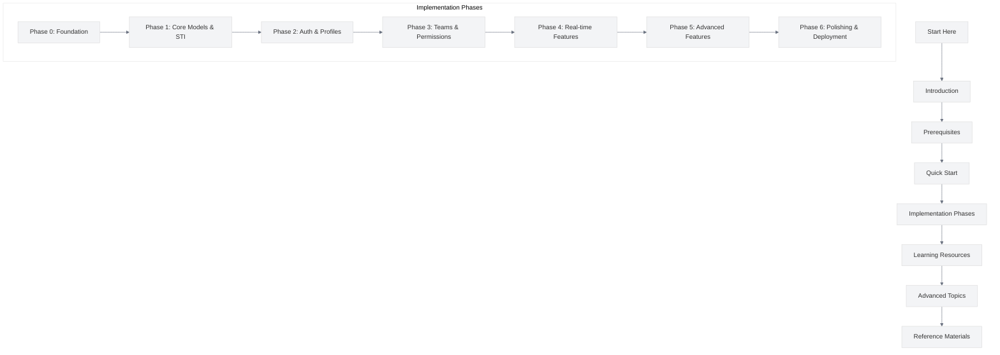

# User Model Enhancements (UME) Tutorial

<link rel="stylesheet" href="./assets/css/styles.css">

Welcome to the comprehensive User Model Enhancements (UME) tutorial for Laravel 12. This tutorial has been refactored into a modular, step-by-step guide to help you build a robust user management system with Single Table Inheritance.

## Overview

This tutorial will guide you through building enhanced user management features in Laravel 12, including:

- Single Table Inheritance for different user types
- Enhanced user profiles with granular name components
- Teams and hierarchies
- Role-based permissions within teams
- Two-factor authentication
- Account lifecycle management with state machines
- Real-time features (presence and chat)
- Admin interfaces with FilamentPHP
- Modern PHP 8 attributes for type-safe configuration
- And much more!

## How to Use This Guide

This documentation is organized into logical sections, each focusing on specific aspects of the implementation. Each implementation step is designed to be bite-sized, resulting in a working application with a complete test suite.

## Tutorial Structure

### Getting Started

1. ### [Introduction](./010-introduction/000-index.md)
   Learn about the goals, features, and learning objectives of this tutorial.

2. ### [Prerequisites](./020-prerequisites/000-index.md)
   Set up your development environment with all necessary tools and dependencies.

3. ### [Progress Tracker](./030-progress-tracker/000-index.md)
   Track your progress through the tutorial with a comprehensive checklist.

4. ### [Quick Start Guide](./040-quick-start/000-index.md)
   Get up and running quickly with the essential components.

### Core Implementation

5. ### [Implementation](./050-implementation/000-index.md)
   Step-by-step instructions for building the UME features, organized by phase:

   - [Phase 0: Foundation](./050-implementation/010-phase0-foundation/000-index.md)
   - [Phase 1: Core Models & STI](./050-implementation/020-phase1-core-models/000-index.md)
   - [Phase 2: Auth & Profiles](./050-implementation/030-phase2-auth-profile/000-index.md)
   - [Phase 3: Teams & Permissions](./050-implementation/040-phase3-teams-permissions/000-index.md)
   - [Phase 4: Real-time Features](./050-implementation/050-phase4-realtime/000-index.md)
   - [Phase 5: Advanced Features](./050-implementation/060-phase5-advanced/000-index.md)
   - [Phase 6: Polishing & Deployment](./050-implementation/070-phase6-polishing/000-index.md)

### Learning Resources

6. ### [Exercises](./888-exercises/000-index.md)
   Practice exercises to test your understanding of the concepts covered in the tutorial.

7. ### [Sample Exercise Answers](./888-sample-answers/000-index.md)
   Sample answers to the practice exercises to help guide your learning.

8. ### [Case Studies](./080-case-studies/000-index.md)
   Real-world case studies demonstrating UME implementations in different organizational contexts.

9. ### [Learning Paths](./090-learning-paths/000-index.md)
   Customized learning paths for different skill levels and learning objectives.

### Advanced Topics

10. ### [Security Best Practices](./100-security-best-practices/000-index.md)
    Comprehensive security best practices for your UME implementation, covering authentication, authorization, CSRF protection, XSS prevention, and more.

11. ### [Accessibility Guidelines](./110-accessibility/000-index.md)
    Comprehensive guidelines for ensuring that your UME implementation is accessible to all users, including those with disabilities.

12. ### [Mobile Responsiveness](./120-mobile-responsiveness/000-index.md)
    Best practices and implementation guides for creating mobile-responsive UME features that work well across all device types and screen sizes.

13. ### [Progressive Enhancement](./130-progressive-enhancement/000-index.md)
    Implementation strategies for progressive enhancement to ensure your application works across different browsers and devices.

14. ### [Internationalization](./050-implementation/070-phase6-polishing/200-internationalization/000-index.md)
    Implementation guides for adding multi-language support to your application.

15. ### [Troubleshooting](./150-troubleshooting/000-index.md)
    Comprehensive guides for resolving common issues and FAQs for each implementation phase.

### Reference Materials

16. ### [Code Repository](./160-code-repository/000-index.md)
    Information about the code repository structure and how to use it effectively.

17. ### [Cross-Referencing](./170-cross-referencing/000-index.md)
    Cross-references between different sections of the tutorial for easier navigation.

18. ### [Quality Assurance and Refinement](./180-quality-assurance/000-index.md)
    Comprehensive quality assurance process for ensuring documentation accuracy, usability, and effectiveness.

19. ### [Launch and Maintenance](./190-launch-maintenance/000-index.md)
    Detailed strategies and procedures for successfully launching the improved documentation and maintaining it over time.

20. ### [Appendices](./900-appendices/000-index.md)
    Glossary, references, and additional resources.

### Additional Resources

- [Communication Plan](./190-communication-plan.md)
- [Documentation Audit Report](./200-documentation-audit-report.md)
- [Review and QA Process](./210-review-and-qa-process.md)
- [Visual Style Guide](./220-visual-style-guide.md)

## Key Features

### UI Framework Options

This tutorial provides implementations for multiple UI approaches:

1. **Primary Path**: [Livewire/Volt with Flux UI](./050-implementation/010-phase0-foundation/080-ui-frameworks.md#livewire-with-flux)
2. **Admin Interface**: [FilamentPHP](./050-implementation/010-phase0-foundation/080-ui-frameworks.md#filamentphp)
3. **Alternative Paths**:
   - [Inertia.js with React](./050-implementation/010-phase0-foundation/080-ui-frameworks.md#inertiajs-with-react)
   - [Inertia.js with Vue](./050-implementation/010-phase0-foundation/080-ui-frameworks.md#inertiajs-with-vue)

### PHP 8 Attributes

This tutorial maximizes the use of PHP 8 attributes throughout the codebase, providing a more type-safe and declarative approach to configuration. Learn how attributes are used in different contexts:

- [Introduction to PHP 8 Attributes](./050-implementation/010-phase0-foundation/060-php8-attributes.md)
- [Attribute-Based Testing](./050-implementation/010-phase0-foundation/091-attribute-based-testing.md)
- [Attribute-Based Model Configuration](./050-implementation/020-phase1-core-models/089-attribute-based-configuration.md)
- [Attribute-Based Validation](./050-implementation/030-phase2-auth-profile/070-attribute-based-validation.md)
- [Attribute-Based API Endpoints](./050-implementation/050-phase4-realtime/080-attribute-based-api.md)

## Estimated Time

The complete tutorial is designed to be completed in approximately 40-60 hours, depending on your experience level. Each phase can be completed independently, allowing you to focus on specific aspects of the implementation.

## Begin Your Journey

Start by reviewing the [Introduction](./010-introduction/000-index.md) and setting up your environment in the [Prerequisites](./020-prerequisites/000-index.md) section.
