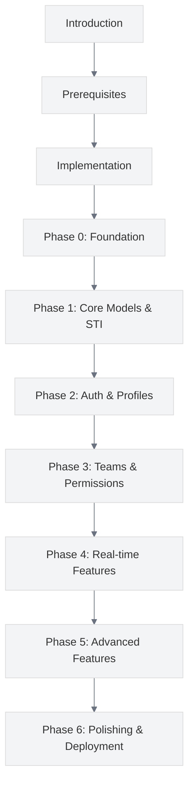

# Introduction

<link rel="stylesheet" href="../assets/css/styles.css">

Welcome to the introduction section of the User Model Enhancements (UME) tutorial. This section provides an overview of what you'll be building, the learning objectives, and how to use this tutorial effectively.

## In This Section

- [Welcome](./010-welcome.md) - Introduction to the tutorial and its purpose
- [What We'll Build](./020-what-we-will-build.md) - Overview of the features and functionality
- [Learning Objectives](./030-learning-objectives.md) - What you'll learn by completing this tutorial
- [How to Use This Tutorial](./040-how-to-use.md) - Guidelines for getting the most out of this tutorial

## Quick Start

If you're eager to jump right in, you can skip to the [Prerequisites](../020-prerequisites/000-index.md) section to set up your development environment, or go directly to [Phase 0: Foundation](../050-implementation/010-phase0-foundation/000-index.md) to start building.

However, we recommend reading through this introduction section first to understand the scope and structure of the tutorial.

## Tutorial Approach

This tutorial takes a modular, incremental approach to building a complex Laravel application. Each phase builds upon the previous one, but is designed to result in a working application with a complete test suite.

The tutorial is designed for developers with basic PHP and Laravel knowledge who want to deepen their understanding of advanced Laravel features and architectural patterns.

## UI Framework Approach

This tutorial provides implementations for multiple UI approaches:

1. **Primary Path**: Livewire/Volt with Flux UI
2. **Admin Interface**: FilamentPHP
3. **Alternative Paths**:
   - Inertia.js with React
   - Inertia.js with Vue

Let's begin by understanding what we're building and why.
