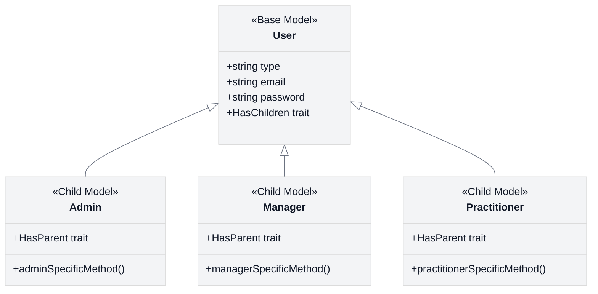

# What We'll Build

<link rel="stylesheet" href="../assets/css/styles.css">

Based on a fictional Product Requirements Document (PRD) and an Implementation Plan, we will build the following features, integrating them into a standard Laravel 12 application:

## 1. Single Table Inheritance for Users

We'll implement a robust Single Table Inheritance (STI) system for the User model, allowing us to define and manage different user types within a single `users` table:

- `Admin` - System administrators with global access
- `Manager` - Organizational managers with elevated permissions
- `Practitioner` - Professional users with specific capabilities
- `User` - Standard users with basic permissions

This will be implemented using the `tightenco/parental` package, which provides an elegant way to work with STI in Laravel's Eloquent ORM.

## 2. Enhanced User Profiles

We'll enhance the standard Laravel user model with:

- Split name components (given_name, family_name, other_names)
- Avatar management using Spatie's Media Library
- Additional profile fields (bio, timezone, locale)
- User settings and preferences

## 3. Teams & Hierarchy

We'll implement a comprehensive team system:

- Users can belong to multiple teams
- Teams can have parent-child relationships (hierarchy)
- Teams can have different types and settings
- Team membership management

## 4. Roles & Permissions

We'll implement fine-grained access control:

- Users have specific roles within specific teams
- Permissions are scoped to teams
- Role-based access control for features and actions
- Admin panel for managing roles and permissions

This will be implemented using Spatie's Laravel Permission package, configured for team-based permissions.

## 5. Security Features

We'll enhance security with:

- Two-Factor Authentication (2FA)
- Account status management (pending, active, suspended)
- Login history and suspicious activity detection
- Password policies and expiration

## 6. Account Lifecycle

We'll implement a robust state machine for managing user account status:

- Pending Validation
- Active
- Suspended
- Deactivated

This will be implemented using Spatie's Laravel Model States package.

## 7. Real-time Features

We'll add real-time capabilities:

- Presence indicators (online/offline status)
- Basic real-time chat system
- Real-time notifications

These features will be restricted to members within the same top-level team for privacy and security.

## 8. Supporting Features

We'll implement various supporting features:

- User impersonation (for admins)
- User settings (locale, timezone, notifications)
- Commenting system
- Search integration with Scout/Typesense
- Feature flags with Pennant
- API authentication with both Passport and Sanctum
- Internationalization (multi-language support)
- Data backups

## 9. Admin Interface

We'll set up a comprehensive admin interface using FilamentPHP:

- User management (including type changes)
- Team management
- Role and permission management
- System settings and configuration

## UI Implementation with Flux UI

A key aspect of this tutorial is the implementation of the user interface using Livewire/Volt with Flux UI components. We'll create:

- Responsive, accessible UI components
- Form components with validation
- Interactive data tables
- Modal dialogs and notifications
- Dashboard widgets and charts

Flux UI provides a set of pre-built, customizable components that integrate seamlessly with Livewire, allowing us to create a polished, professional user interface with minimal effort.

In the next section, we'll explore the learning objectives for this tutorial.
