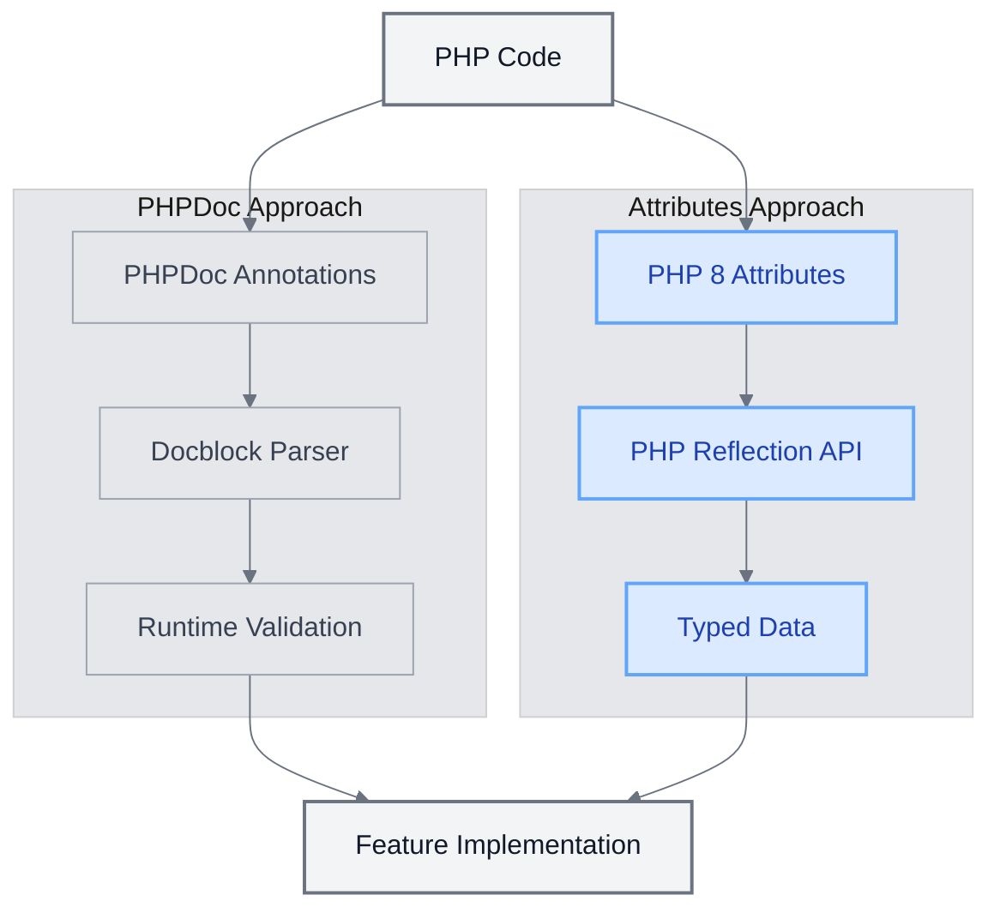
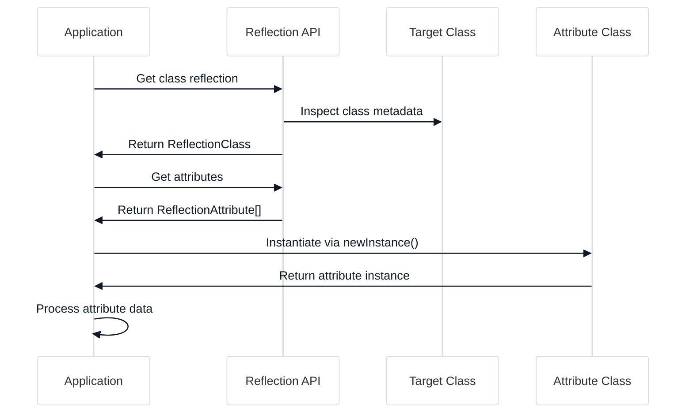

# PHP 8 Attributes in UME

<link rel="stylesheet" href="../../assets/css/styles.css">
<link rel="stylesheet" href="../../assets/css/ume-docs-enhancements.css">
<link rel="stylesheet" href="../../assets/css/interactive-code.css">
<script src="../../assets/js/ume-docs-enhancements.js"></script>
<script src="../../assets/js/interactive-code.js"></script>

<ul class="breadcrumb-navigation">
    <li><a href="../../000-index.md">UME Tutorial</a></li>
    <li><a href="../000-index.md">Implementation</a></li>
    <li><a href="./000-index.md">Phase 0: Foundation</a></li>
    <li><a href="./060-php8-attributes.md">PHP 8 Attributes</a></li>
</ul>

<div class="section-metadata">
    <div class="time-estimate">
        <span class="icon">⏱️</span>
        <span class="label">Time Estimate:</span>
        <span class="value">1-2 hours</span>
    </div>
    <div class="difficulty-level">
        <span class="icon">🔶🔶</span>
        <span class="label">Difficulty:</span>
        <span class="value">Intermediate</span>
        <span class="explanation">Introduces advanced PHP 8 features and reflection concepts</span>
    </div>
    <div class="prerequisites">
        <span class="icon">📋</span>
        <span class="label">Prerequisites:</span>
        <ul>
            <li>PHP 8 basics</li>
            <li>Laravel project setup</li>
            <li>Understanding of OOP concepts</li>
        </ul>
    </div>
    <div class="learning-outcomes">
        <span class="icon">🎯</span>
        <span class="label">You'll Learn:</span>
        <ul>
            <li>How to create and use PHP 8 attributes</li>
            <li>How to read attributes at runtime using reflection</li>
            <li>How to implement attribute-based configuration</li>
            <li>Best practices for using attributes in Laravel</li>
        </ul>
    </div>
</div>

## Introduction to PHP 8 Attributes

PHP 8 introduced a powerful new feature called Attributes, which provides a native way to add metadata to classes, methods, properties, parameters, and other code elements. Attributes are a replacement for PHPDoc annotations, offering several advantages:



<div class="mermaid-caption">Figure 1: Comparison of PHPDoc annotations and PHP 8 Attributes approaches</div>

1. **Type Safety**: Attributes are validated at compile time, catching errors early
2. **IDE Support**: Better autocompletion and validation in modern IDEs
3. **Performance**: No need to parse docblocks at runtime
4. **Standardization**: A consistent, language-level feature rather than a documentation convention
5. **Extensibility**: Can be used to create powerful, type-safe metadata systems

## Interactive Examples

Let's explore PHP 8 attributes through interactive examples that you can modify and run directly in your browser.

### Example 1: Creating and Using Basic PHP 8 Attributes

<div class="interactive-code-example">
  <h3 class="example-title">Creating and Using Basic PHP 8 Attributes</h3>
  
  <div class="example-description">
    <p>This example demonstrates how to create a simple PHP 8 attribute and apply it to a class.</p>
  </div>
  
  <div class="code-editor-container" data-language="php" data-editable="true">
    <div class="editor-toolbar">
      <button class="run-button">Run Code</button>
      <button class="reset-button">Reset</button>
      <button class="copy-button">Copy</button>
      <div class="editor-status"></div>
    </div>
    
    <div class="monaco-editor" data-code="<?php

// Define a simple attribute
#[Attribute]
class Route {
    public function __construct(
        public string $method,
        public string $path
    ) {}
}

// Apply the attribute to a class
#[Route(method: 'GET', path: '/users')]
class UserController {
    public function index() {
        return 'List of users';
    }
}

// Use reflection to read the attribute
$reflection = new ReflectionClass(UserController::class);
$attributes = $reflection->getAttributes(Route::class);

foreach ($attributes as $attribute) {
    $route = $attribute->newInstance();
    echo \"Controller route: {$route->method} {$route->path}\n\";
}">
    </div>
    
    <div class="output-panel">
      <div class="output-header">Output</div>
      <div class="output-content"></div>
    </div>
  </div>
  
  <div class="example-explanation">
    <h4>How it works</h4>
    <p>This example demonstrates the basics of PHP 8 attributes:</p>
    <ul>
      <li><strong>Defining an Attribute</strong>: We create a <code>Route</code> class and mark it as an attribute using the <code>#[Attribute]</code> attribute.</li>
      <li><strong>Attribute Parameters</strong>: The <code>Route</code> attribute accepts two parameters: <code>method</code> and <code>path</code>.</li>
      <li><strong>Applying an Attribute</strong>: We apply the <code>Route</code> attribute to the <code>UserController</code> class using the <code>#[Route(...)]</code> syntax.</li>
      <li><strong>Reading Attributes with Reflection</strong>: We use PHP's Reflection API to read the attributes at runtime.</li>
    </ul>
  </div>
  
  <div class="example-challenges">
    <h4>Challenges</h4>
    <ol>
      <li>Add a new parameter to the Route attribute for middleware (e.g., 'auth', 'api', etc.)</li>
      <li>Apply the Route attribute to the index method instead of the class</li>
      <li>Make the Route attribute repeatable and apply multiple routes to the UserController</li>
      <li>Create a second controller with a different route and display routes for both controllers</li>
    </ol>
  </div>
</div>

### Example 2: Specifying Attribute Targets

<div class="interactive-code-example">
  <h3 class="example-title">Specifying Attribute Targets</h3>
  
  <div class="example-description">
    <p>This example shows how to restrict where attributes can be applied using target flags.</p>
  </div>
  
  <div class="code-editor-container" data-language="php" data-editable="true">
    <div class="editor-toolbar">
      <button class="run-button">Run Code</button>
      <button class="reset-button">Reset</button>
      <button class="copy-button">Copy</button>
      <div class="editor-status"></div>
    </div>
    
    <div class="monaco-editor" data-code="<?php

// Define an attribute that can only be applied to classes
#[Attribute(Attribute::TARGET_CLASS)]
class ClassOnly {
    public function __construct(
        public string $name
    ) {}
}

// Define an attribute that can only be applied to methods
#[Attribute(Attribute::TARGET_METHOD)]
class MethodOnly {
    public function __construct(
        public string $name
    ) {}
}

// Define an attribute that can be applied to both classes and properties
#[Attribute(Attribute::TARGET_CLASS | Attribute::TARGET_PROPERTY)]
class ClassOrProperty {
    public function __construct(
        public string $name
    ) {}
}

// Apply attributes to different targets
#[ClassOnly(name: 'ExampleClass')]
class Example {
    #[ClassOrProperty(name: 'exampleProperty')]
    public string $property;
    
    #[MethodOnly(name: 'exampleMethod')]
    public function method() {
        return 'Hello';
    }
}

// Use reflection to read and validate the attributes
$classReflection = new ReflectionClass(Example::class);
$propertyReflection = $classReflection->getProperty('property');
$methodReflection = $classReflection->getMethod('method');

// Check class attributes
$classAttributes = $classReflection->getAttributes();
echo \"Class attributes:\n\";
foreach ($classAttributes as $attribute) {
    echo \"- \" . $attribute->getName() . \"\n\";
}

// Check property attributes
$propertyAttributes = $propertyReflection->getAttributes();
echo \"\nProperty attributes:\n\";
foreach ($propertyAttributes as $attribute) {
    echo \"- \" . $attribute->getName() . \"\n\";
}

// Check method attributes
$methodAttributes = $methodReflection->getAttributes();
echo \"\nMethod attributes:\n\";
foreach ($methodAttributes as $attribute) {
    echo \"- \" . $attribute->getName() . \"\n\";
}"></div>
    
    <div class="output-panel">
      <div class="output-header">Output</div>
      <div class="output-content"></div>
    </div>
  </div>
  
  <div class="example-explanation">
    <h4>How it works</h4>
    <p>This example demonstrates how to specify where attributes can be applied:</p>
    <ul>
      <li><strong>Target Flags</strong>: The <code>Attribute</code> constructor accepts flags that specify where the attribute can be applied.</li>
      <li><strong>Combining Targets</strong>: You can combine targets using the bitwise OR operator (<code>|</code>) to allow an attribute to be applied to multiple targets.</li>
      <li><strong>Validation</strong>: PHP will validate attribute usage at compile time. If you try to apply an attribute to a target that isn't allowed, PHP will raise a compile-time error.</li>
      <li><strong>Reflection</strong>: You can use the Reflection API to read attributes from different elements (classes, methods, properties, etc.).</li>
    </ul>
  </div>
  
  <div class="example-challenges">
    <h4>Challenges</h4>
    <ol>
      <li>Create a new attribute that can only be applied to parameters and apply it to a method parameter</li>
      <li>Modify the ClassOrProperty attribute to also allow it on methods</li>
      <li>Try applying an attribute to a target that isn't allowed and observe the error</li>
      <li>Create an attribute that can be applied anywhere using Attribute::TARGET_ALL</li>
      <li>Add a method to validate that attributes are applied to the correct targets</li>
    </ol>
  </div>
</div>

## Syntax

Attributes use the `#[AttributeName]` syntax and can be placed before the element they describe:

```php
#[AttributeName]
class MyClass {}

class MyClass {
    #[AttributeName]
    public function myMethod() {}

    #[AttributeName]
    public $myProperty;
}
```

Attributes can also accept parameters:

```php
#[AttributeName('value', key: 'value')]
class MyClass {}
```

### Example 3: Repeatable Attributes

<div class="interactive-code-example">
  <h3 class="example-title">Creating Repeatable Attributes</h3>
  
  <div class="example-description">
    <p>This example demonstrates how to create and use repeatable attributes that can be applied multiple times to the same element.</p>
  </div>
  
  <div class="code-editor-container" data-language="php" data-editable="true">
    <div class="editor-toolbar">
      <button class="run-button">Run Code</button>
      <button class="reset-button">Reset</button>
      <button class="copy-button">Copy</button>
      <div class="editor-status"></div>
    </div>
    
    <div class="monaco-editor" data-code="<?php

// Define a repeatable attribute
#[Attribute(Attribute::TARGET_CLASS | Attribute::IS_REPEATABLE)]
class Tag {
    public function __construct(
        public string $name,
        public string $value = ''
    ) {}
}

// Apply multiple instances of the same attribute to a class
#[Tag(name: 'category', value: 'tutorial')]
#[Tag(name: 'language', value: 'php')]
#[Tag(name: 'version', value: '8.0')]
class Article {
    private string $title;
    private string $content;
    
    public function __construct(string $title, string $content) {
        $this->title = $title;
        $this->content = $content;
    }
    
    public function getTitle(): string {
        return $this->title;
    }
    
    public function getContent(): string {
        return $this->content;
    }
}

// Create an article
$article = new Article(
    'Understanding PHP 8 Attributes',
    'PHP 8 introduces attributes, a powerful new feature...'
);

// Use reflection to read all Tag attributes
$reflection = new ReflectionClass($article);
$attributes = $reflection->getAttributes(Tag::class);

echo \"Article: {$article->getTitle()}\n\";
echo \"Tags:\n\";

foreach ($attributes as $attribute) {
    $tag = $attribute->newInstance();
    echo \"- {$tag->name}: {$tag->value}\n\";
}

// Function to find articles by tag
function findArticlesByTag(array $articles, string $tagName, string $tagValue): array {
    $results = [];
    
    foreach ($articles as $article) {
        $reflection = new ReflectionClass($article);
        $attributes = $reflection->getAttributes(Tag::class);
        
        foreach ($attributes as $attribute) {
            $tag = $attribute->newInstance();
            if ($tag->name === $tagName && $tag->value === $tagValue) {
                $results[] = $article;
                break; // Found a match, no need to check other tags
            }
        }
    }
    
    return $results;
}

// Example of how you might use the findArticlesByTag function
// (not actually executed in this example)
echo \"\nExample of finding articles by tag:\n\";
echo \"findArticlesByTag(\$articles, 'category', 'tutorial')\";"></div>
    
    <div class="output-panel">
      <div class="output-header">Output</div>
      <div class="output-content"></div>
    </div>
  </div>
  
  <div class="example-explanation">
    <h4>How it works</h4>
    <p>This example demonstrates how to create and use repeatable attributes:</p>
    <ul>
      <li><strong>Making Attributes Repeatable</strong>: Add the <code>Attribute::IS_REPEATABLE</code> flag to the attribute definition to allow multiple instances of the same attribute on a single element.</li>
      <li><strong>Applying Multiple Attributes</strong>: You can apply the same attribute multiple times to a class, method, property, etc., as long as it's marked as repeatable.</li>
      <li><strong>Reading Repeatable Attributes</strong>: When using reflection, <code>getAttributes()</code> returns all instances of the attribute applied to the element.</li>
      <li><strong>Practical Use Case</strong>: Repeatable attributes are useful for cases like tags, validation rules, routes, etc., where you might need multiple configurations on the same element.</li>
    </ul>
  </div>
  
  <div class="example-challenges">
    <h4>Challenges</h4>
    <ol>
      <li>Add a new Tag attribute with name 'difficulty' and value 'intermediate' to the Article class</li>
      <li>Create a new repeatable attribute called 'Route' that can be applied to methods</li>
      <li>Implement a function that counts how many tags of a specific name are applied to a class</li>
      <li>Modify the Tag attribute to include a 'priority' parameter and sort the tags by priority</li>
      <li>Create a second Article class with different tags and test the findArticlesByTag function</li>
    </ol>
  </div>
</div>

## Attributes vs. PHPDoc Annotations

| Feature | PHP 8 Attributes | PHPDoc Annotations |
|---------|-----------------|-------------------|
| Syntax | `#[Attribute]` | `/** @Annotation */` |
| Type Safety | Yes (compile-time validation) | No (string parsing) |
| IDE Support | Strong | Limited |
| Performance | Better | Requires docblock parsing |
| Standardization | Language feature | Documentation convention |
| Validation | At compile time | At runtime (if at all) |

### Example 4: Attribute-Based Validation

<div class="interactive-code-example">
  <h3 class="example-title">Implementing Attribute-Based Validation</h3>
  
  <div class="example-description">
    <p>This example shows how to create and use attributes for form validation in a Laravel-like approach.</p>
  </div>
  
  <div class="code-editor-container" data-language="php" data-editable="true">
    <div class="editor-toolbar">
      <button class="run-button">Run Code</button>
      <button class="reset-button">Reset</button>
      <button class="copy-button">Copy</button>
      <div class="editor-status"></div>
    </div>
    
    <div class="monaco-editor" data-code="<?php

// Define validation attribute base class
#[Attribute(Attribute::TARGET_PROPERTY | Attribute::IS_REPEATABLE)]
abstract class ValidationRule {
    abstract public function validate($value): bool;
    abstract public function getMessage(): string;
}

// Required validation rule
#[Attribute(Attribute::TARGET_PROPERTY)]
class Required extends ValidationRule {
    public function validate($value): bool {
        return $value !== null && $value !== '';
    }
    
    public function getMessage(): string {
        return 'This field is required';
    }
}

// Email validation rule
#[Attribute(Attribute::TARGET_PROPERTY)]
class Email extends ValidationRule {
    public function validate($value): bool {
        return filter_var($value, FILTER_VALIDATE_EMAIL) !== false;
    }
    
    public function getMessage(): string {
        return 'This field must be a valid email address';
    }
}

// MinLength validation rule
#[Attribute(Attribute::TARGET_PROPERTY)]
class MinLength extends ValidationRule {
    public function __construct(
        private int $length
    ) {}
    
    public function validate($value): bool {
        return strlen($value) >= $this->length;
    }
    
    public function getMessage(): string {
        return \"This field must be at least {$this->length} characters long\";
    }
}

// Form request class
class FormRequest {
    #[Required]
    #[MinLength(3)]
    public string $name;
    
    #[Required]
    #[Email]
    public string $email;
    
    public string $message = ''; // Optional field
    
    public function __construct(array $data) {
        foreach ($data as $key => $value) {
            if (property_exists($this, $key)) {
                $this->$key = $value;
            }
        }
    }
    
    public function validate(): array {
        $errors = [];
        $reflection = new ReflectionClass($this);
        $properties = $reflection->getProperties(ReflectionProperty::IS_PUBLIC);
        
        foreach ($properties as $property) {
            $name = $property->getName();
            $value = $this->$name;
            
            $attributes = $property->getAttributes(ValidationRule::class, ReflectionAttribute::IS_INSTANCEOF);
            
            foreach ($attributes as $attribute) {
                $rule = $attribute->newInstance();
                
                if (!$rule->validate($value)) {
                    if (!isset($errors[$name])) {
                        $errors[$name] = [];
                    }
                    $errors[$name][] = $rule->getMessage();
                }
            }
        }
        
        return $errors;
    }
}

// Example usage
$formData = [
    'name' => 'Jo', // Too short
    'email' => 'not-an-email', // Invalid email
    'message' => 'Hello, world!' // Valid
];

$request = new FormRequest($formData);
$errors = $request->validate();

if (empty($errors)) {
    echo \"Form is valid!\n\";
} else {
    echo \"Form has errors:\n\";
    
    foreach ($errors as $field => $fieldErrors) {
        echo \"- {$field}:\n\";
        foreach ($fieldErrors as $error) {
            echo \"  - {$error}\n\";
        }
    }
}"></div>
    
    <div class="output-panel">
      <div class="output-header">Output</div>
      <div class="output-content"></div>
    </div>
  </div>
  
  <div class="example-explanation">
    <h4>How it works</h4>
    <p>This example demonstrates how to implement attribute-based validation:</p>
    <ul>
      <li><strong>Validation Rule Base Class</strong>: We create an abstract <code>ValidationRule</code> class that all validation rules extend.</li>
      <li><strong>Specific Validation Rules</strong>: We implement concrete validation rules like <code>Required</code>, <code>Email</code>, and <code>MinLength</code>.</li>
      <li><strong>Applying Rules to Properties</strong>: We apply validation rules to properties using attributes.</li>
      <li><strong>Validation Process</strong>: We use reflection to get all public properties and their validation rules, then validate each property.</li>
      <li><strong>Form Request Class</strong>: The <code>FormRequest</code> class provides a convenient way to validate form data.</li>
    </ul>
  </div>
  
  <div class="example-challenges">
    <h4>Challenges</h4>
    <ol>
      <li>Add a new MaxLength validation rule that ensures a field doesn't exceed a certain length</li>
      <li>Create a Numeric validation rule that ensures a field contains only numbers</li>
      <li>Modify the FormRequest class to return true/false from validate() and provide a separate getErrors() method</li>
      <li>Add a custom validation rule that checks if a password contains at least one uppercase letter, one lowercase letter, and one number</li>
      <li>Extend the example to support validation of nested objects or arrays</li>
    </ol>
  </div>
</div>

## Attributes in UME

Throughout the UME tutorial, we use PHP 8 attributes extensively to:

1. **Configure Model Features**: Define how models use the `HasAdditionalFeatures` trait
2. **Define Validation Rules**: Specify validation rules for form requests
3. **Configure API Endpoints**: Define API routes and their properties
4. **Mark Test Methods**: Identify test methods and their properties
5. **Define Relationships**: Specify model relationships and their properties

### Example 5: Model Feature Configuration

<div class="interactive-code-example">
  <h3 class="example-title">Attribute-Based Model Feature Configuration</h3>
  
  <div class="example-description">
    <p>This example demonstrates how to use attributes to configure model features in a Laravel-like approach, similar to the UME HasAdditionalFeatures trait.</p>
  </div>
  
  <div class="code-editor-container" data-language="php" data-editable="true">
    <div class="editor-toolbar">
      <button class="run-button">Run Code</button>
      <button class="reset-button">Reset</button>
      <button class="copy-button">Copy</button>
      <div class="editor-status"></div>
    </div>
    
    <div class="monaco-editor" data-code="<?php

// Define feature attributes

#[Attribute(Attribute::TARGET_CLASS)]
class HasUlid {
    public function __construct(
        public ?string $column = 'ulid'
    ) {}
}

#[Attribute(Attribute::TARGET_CLASS)]
class HasSlug {
    public function __construct(
        public string $source,
        public string $column = 'slug'
    ) {}
}

#[Attribute(Attribute::TARGET_CLASS)]
class HasUserTracking {
    public function __construct(
        public bool $trackCreated = true,
        public bool $trackUpdated = true,
        public bool $trackDeleted = false,
        public string $createdByColumn = 'created_by',
        public string $updatedByColumn = 'updated_by',
        public string $deletedByColumn = 'deleted_by'
    ) {}
}

// Feature manager trait
trait HasAdditionalFeatures {
    // Boot method that would be called by Laravel's model booting process
    public static function bootHasAdditionalFeatures() {
        // This would be called when the model is booted
        static::configureFeatures();
    }
    
    // Configure features based on attributes
    protected static function configureFeatures() {
        $reflection = new ReflectionClass(static::class);
        
        // Check for HasUlid
        $ulidAttributes = $reflection->getAttributes(HasUlid::class);
        foreach ($ulidAttributes as $attribute) {
            $config = $attribute->newInstance();
            static::configureUlid($config);
        }
        
        // Check for HasSlug
        $slugAttributes = $reflection->getAttributes(HasSlug::class);
        foreach ($slugAttributes as $attribute) {
            $config = $attribute->newInstance();
            static::configureSlug($config);
        }
        
        // Check for HasUserTracking
        $trackingAttributes = $reflection->getAttributes(HasUserTracking::class);
        foreach ($trackingAttributes as $attribute) {
            $config = $attribute->newInstance();
            static::configureUserTracking($config);
        }
    }
    
    // Configure ULID feature
    protected static function configureUlid(HasUlid $config) {
        echo \"Configuring ULID for \" . static::class . \" with column: \" . $config->column . \"\n\";
        // In a real implementation, this would set up ULID generation
    }
    
    // Configure slug feature
    protected static function configureSlug(HasSlug $config) {
        echo \"Configuring slug for \" . static::class . \" with source: \" . $config->source . 
             \" and column: \" . $config->column . \"\n\";
        // In a real implementation, this would set up slug generation
    }
    
    // Configure user tracking feature
    protected static function configureUserTracking(HasUserTracking $config) {
        echo \"Configuring user tracking for \" . static::class . \":\n\";
        echo \"- Track created: \" . ($config->trackCreated ? 'Yes' : 'No') . 
             \" (Column: \" . $config->createdByColumn . \")\n\";
        echo \"- Track updated: \" . ($config->trackUpdated ? 'Yes' : 'No') . 
             \" (Column: \" . $config->updatedByColumn . \")\n\";
        echo \"- Track deleted: \" . ($config->trackDeleted ? 'Yes' : 'No') . 
             \" (Column: \" . $config->deletedByColumn . \")\n\";
        // In a real implementation, this would set up user tracking
    }
}

// Example model using the features
#[HasUlid]
#[HasSlug(source: 'title')]
#[HasUserTracking(trackDeleted: true)]
class Post {
    use HasAdditionalFeatures;
    
    public string $title;
    public string $content;
    
    public function __construct(string $title, string $content) {
        $this->title = $title;
        $this->content = $content;
        
        // In Laravel, the bootHasAdditionalFeatures method would be called automatically
        // For this example, we'll call it manually
        static::bootHasAdditionalFeatures();
    }
}

// Create a post
$post = new Post(
    'Understanding PHP 8 Attributes',
    'PHP 8 introduces attributes, a powerful new feature...'
);

// Example of another model with different configuration
#[HasUlid(column: 'uuid')]
#[HasUserTracking(trackCreated: true, trackUpdated: true, trackDeleted: true)]
class User {
    use HasAdditionalFeatures;
    
    public string $name;
    public string $email;
    
    public function __construct(string $name, string $email) {
        $this->name = $name;
        $this->email = $email;
        
        // Call boot method manually for this example
        static::bootHasAdditionalFeatures();
    }
}

// Create a user
$user = new User('John Doe', 'john@example.com');"></div>
    
    <div class="output-panel">
      <div class="output-header">Output</div>
      <div class="output-content"></div>
    </div>
  </div>
  
  <div class="example-explanation">
    <h4>How it works</h4>
    <p>This example demonstrates how to use attributes for model feature configuration:</p>
    <ul>
      <li><strong>Feature Attributes</strong>: We define attributes for different model features like ULID generation, slug generation, and user tracking.</li>
      <li><strong>Feature Manager Trait</strong>: The <code>HasAdditionalFeatures</code> trait reads feature attributes and configures the model accordingly.</li>
      <li><strong>Declarative Configuration</strong>: Models can declare which features they want and how they should be configured using attributes.</li>
      <li><strong>Centralized Logic</strong>: The implementation details for each feature are encapsulated in the trait, keeping the models clean.</li>
    </ul>
  </div>
  
  <div class="example-challenges">
    <h4>Challenges</h4>
    <ol>
      <li>Add a new HasTags attribute that configures tagging functionality for a model</li>
      <li>Modify the HasSlug attribute to support multiple source fields (e.g., combining first_name and last_name)</li>
      <li>Add a HasMetadata attribute that allows storing and retrieving arbitrary metadata for a model</li>
      <li>Create a new model that uses a combination of these features with custom configuration</li>
      <li>Extend the HasAdditionalFeatures trait to support feature dependencies (e.g., HasTags might require HasUlid)</li>
    </ol>
  </div>
</div>

## Example: Model Feature Configuration

One of the most powerful uses of attributes in UME is configuring model features through the `HasAdditionalFeatures` trait:

```php
<?php

namespace App\Models;

use App\Models\Attributes\HasSlug;
use App\Models\Attributes\HasTags;
use App\Models\Attributes\HasUlid;
use App\Models\Attributes\HasUserTracking;
use App\Models\Traits\HasAdditionalFeatures;
use Illuminate\Database\Eloquent\Model;

#[HasUlid]
#[HasSlug(source: 'title', column: 'slug')]
#[HasTags(types: ['category', 'tag'])]
#[HasUserTracking(columns: ['created_by' => 'author_id'])]
class Post extends Model
{
    use HasAdditionalFeatures;

    protected $fillable = [
        'title',
        'content',
        'published',
    ];
}
```

This approach offers several advantages:

1. **Declarative Configuration**: The model's features are clearly visible at the class level
2. **Type Safety**: Attribute parameters are type-checked
3. **IDE Support**: Modern IDEs provide autocompletion and validation for attributes
4. **Centralized Logic**: Feature implementation details are encapsulated in the trait

## Example: Test Method Attributes

We use PHP 8 attributes for test methods instead of PHPDoc annotations:

```php
<?php

namespace Tests\Unit\Traits;

use App\Models\Team;use App\Models\User;use Illuminate\Foundation\Testing\RefreshDatabase;use old\TestCase;use PHPUnit\Framework\Attributes\Test;

class HasUserTrackingTraitTest extends TestCase
{
    use RefreshDatabase;

    #[Test]
    public function it_sets_created_by_when_creating_model()
    {
        $user = User::factory()->create();
        $this->actingAs($user);

        $team = Team::create([
            'name' => 'Test Team',
            'description' => 'A team for testing',
        ]);

        $this->assertEquals($user->id, $team->created_by);
    }
}
```

## Example: Validation Rules

Attributes can be used to define validation rules for form requests:

```php
<?php

namespace App\Http\Requests;

use Illuminate\Foundation\Http\FormRequest;
use Illuminate\Validation\Rules\Password;
use App\Attributes\Validation\Required;
use App\Attributes\Validation\Email;
use App\Attributes\Validation\Min;
use App\Attributes\Validation\Confirmed;

class RegisterRequest extends FormRequest
{
    public function authorize(): bool
    {
        return true;
    }

    #[Required]
    #[Min(2)]
    public string $name;

    #[Required]
    #[Email]
    public string $email;

    #[Required]
    #[Confirmed]
    #[Password(min: 8, letters: true, mixedCase: true, numbers: true, symbols: true)]
    public string $password;
}
```

## Example: API Endpoint Configuration

Attributes can be used to define API endpoints and their properties:

```php
<?php

namespace App\Http\Controllers\Api;

use App\Http\Controllers\Controller;
use App\Models\Post;
use App\Attributes\Api\Route;
use App\Attributes\Api\Middleware;
use App\Attributes\Api\ResponseType;

class PostController extends Controller
{
    #[Route('GET', '/api/posts')]
    #[Middleware(['auth:sanctum'])]
    #[ResponseType('json')]
    public function index()
    {
        return Post::all();
    }

    #[Route('GET', '/api/posts/{post}')]
    #[Middleware(['auth:sanctum'])]
    #[ResponseType('json')]
    public function show(Post $post)
    {
        return $post;
    }
}
```

## Creating Custom Attributes

To create a custom attribute, define a class with the `#[Attribute]` attribute:

```php
<?php

namespace App\Attributes;

use Attribute;

#[Attribute(Attribute::TARGET_CLASS)]
class HasUlid
{
    public function __construct(
        public ?string $column = null
    ) {}
}
```

The `Attribute::TARGET_*` constants define where the attribute can be applied:

- `Attribute::TARGET_CLASS`: Can be applied to classes
- `Attribute::TARGET_METHOD`: Can be applied to methods
- `Attribute::TARGET_PROPERTY`: Can be applied to properties
- `Attribute::TARGET_PARAMETER`: Can be applied to function/method parameters
- `Attribute::TARGET_FUNCTION`: Can be applied to functions
- `Attribute::TARGET_ALL`: Can be applied to any element

## Reading Attributes at Runtime

To read attributes at runtime, use the Reflection API:



<div class="mermaid-caption">Figure 2: Attribute processing lifecycle using PHP Reflection</div>

```php
<?php

$reflection = new ReflectionClass(Post::class);
$attributes = $reflection->getAttributes(HasUlid::class);

foreach ($attributes as $attribute) {
    $instance = $attribute->newInstance();
    $column = $instance->column ?? 'ulid';
    // Use the attribute information...
}
```

## Best Practices for Using Attributes

1. **Use Attributes for Configuration**: Attributes are ideal for configuring how a class or method behaves
2. **Keep Attributes Simple**: Attributes should contain only the data needed for configuration
3. **Use Type Hints**: Always use type hints for attribute parameters
4. **Document Attributes**: Provide clear documentation for custom attributes
5. **Prefer Attributes Over PHPDoc**: Use attributes instead of PHPDoc annotations when possible
6. **Combine with Type Hints**: Use attributes alongside PHP's type system for maximum safety
7. **Cache Reflection Results**: Reading attributes via reflection can be expensive, so cache the results

## Troubleshooting PHP 8 Attributes

<div class="troubleshooting-guide">
    <h2>Attributes Not Being Processed</h2>

    <div class="symptoms">
        <h3>Symptoms</h3>
        <ul>
            <li>PHP 8 attributes are defined on classes but don't seem to have any effect</li>
            <li>No errors are shown, but expected behavior doesn't occur</li>
            <li>Features like HasUlid, HasSlug, or HasUserTracking aren't working</li>
        </ul>
    </div>

    <div class="causes">
        <h3>Possible Causes</h3>
        <ol>
            <li>Missing the HasAdditionalFeatures trait in the model</li>
            <li>Incorrect namespace for attribute classes</li>
            <li>Attribute classes not properly registered with the service provider</li>
            <li>PHP version lower than 8.0</li>
        </ol>
    </div>

    <div class="solutions">
        <h3>Solutions</h3>

        <h4>For Missing Trait</h4>
        <p>Add the trait to your model:</p>
        <pre><code>use App\Models\Traits\HasAdditionalFeatures;

class Post extends Model
{
    use HasAdditionalFeatures;

    // Rest of your model
}</code></pre>

        <h4>For Incorrect Namespace</h4>
        <p>Check and correct the namespaces:</p>
        <pre><code>// Correct imports
use App\Models\Attributes\HasUlid;
use App\Models\Attributes\HasSlug;
use App\Models\Attributes\HasUserTracking;</code></pre>

        <h4>For PHP Version Issues</h4>
        <p>Verify your PHP version:</p>
        <pre><code>php -v
# Should show PHP 8.0 or higher</code></pre>
    </div>

    <div class="prevention">
        <h3>Prevention</h3>
        <ul>
            <li>Always include <code>use HasAdditionalFeatures;</code> when using attribute-based features</li>
            <li>Use IDE plugins that support PHP 8 attributes for better validation</li>
            <li>Add unit tests that verify attribute processing</li>
        </ul>
    </div>
</div>

## Conclusion

PHP 8 attributes provide a powerful, type-safe way to add metadata to your code. In the UME tutorial, we leverage attributes extensively to create a clean, declarative API for configuring model features, defining validation rules, and more.

By embracing attributes, we create code that is more maintainable, more type-safe, and better supported by modern development tools.

<div class="page-navigation">
    <a href="050-project-setup.md" class="prev">Project Setup</a>
    <a href="070-testing-approach.md" class="next">Testing Approach</a>
</div>

<div class="quick-reference">
    <h2>PHP 8 Attributes Quick Reference</h2>

    <div class="key-concepts">
        <dl>
            <dt>Attribute Definition</dt>
            <dd>A class marked with <code>#[Attribute]</code> that can be applied to code elements</dd>

            <dt>Target</dt>
            <dd>Specifies where an attribute can be applied (class, method, property, etc.)</dd>

            <dt>Repeatable</dt>
            <dd>Whether an attribute can be applied multiple times to the same element</dd>
        </dl>
    </div>

    <div class="syntax">
        <h3>Basic Syntax</h3>
        <pre><code>// Defining an attribute
#[Attribute(Attribute::TARGET_CLASS)]
class MyAttribute
{
    public function __construct(public string $value)
    {}
}

// Using an attribute
#[MyAttribute('example')]
class MyClass
{
}</code></pre>
    </div>

    <div class="gotchas">
        <h3>Common Pitfalls</h3>
        <ul>
            <li>Forgetting to import attribute classes</li>
            <li>Using attributes without the corresponding processing logic</li>
            <li>Not caching reflection results for performance</li>
        </ul>
    </div>
</div>
