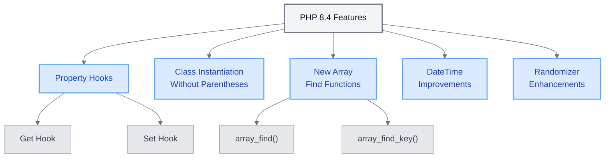

# PHP 8.4 Features in UME

<link rel="stylesheet" href="../../../assets/css/styles.css">
<link rel="stylesheet" href="../../../assets/css/ume-docs-enhancements.css">
<link rel="stylesheet" href="../../../assets/css/interactive-code.css">
<script src="../../../assets/js/ume-docs-enhancements.js"></script>
<script src="../../../assets/js/interactive-code.js"></script>

<ul class="breadcrumb-navigation">
    <li><a href="../../../000-index.md">UME Tutorial</a></li>
    <li><a href="../../000-index.md">Implementation</a></li>
    <li><a href="../000-index.md">Phase 0: Foundation</a></li>
    <li><a href="./000-index.md">Phase 0: Foundation</a></li>
    <li><a href="./065-php84-features.md">PHP 8.4 Features</a></li>
</ul>

<div class="section-metadata">
    <div class="time-estimate">
        <span class="icon">⏱️</span>
        <span class="label">Time Estimate:</span>
        <span class="value">1-2 hours</span>
    </div>
    <div class="difficulty-level">
        <span class="icon">🔶🔶</span>
        <span class="label">Difficulty:</span>
        <span class="value">Intermediate</span>
        <span class="explanation">Introduces advanced PHP 8.4 features and concepts</span>
    </div>
    <div class="prerequisites">
        <span class="icon">📋</span>
        <span class="label">Prerequisites:</span>
        <ul>
            <li>PHP 8 basics</li>
            <li>Understanding of PHP 8 attributes</li>
            <li>Laravel project setup</li>
        </ul>
    </div>
    <div class="learning-outcomes">
        <span class="icon">🎯</span>
        <span class="label">You'll Learn:</span>
        <ul>
            <li>How to use PHP 8.4 property hooks</li>
            <li>How to leverage class instantiation without parentheses</li>
            <li>How to use new array find functions</li>
            <li>How to implement these features in Laravel applications</li>
        </ul>
    </div>
</div>

## Introduction to PHP 8.4 Features

PHP 8.4 introduces several powerful new features that can enhance your Laravel 12 applications. This section explores these features and demonstrates how to leverage them in your UME implementation.



<div class="mermaid-caption">Figure 1: Overview of PHP 8.4 Features</div>

## Property Hooks

PHP 8.4 introduces property hooks, which allow you to intercept property access and modification. This is similar to Laravel's accessors and mutators but at the language level.

### Interactive Example: Property Hooks

<div class="interactive-code-example">
  <h3 class="example-title">Using PHP 8.4 Property Hooks</h3>
  
  <div class="example-description">
    <p>This example demonstrates how to use PHP 8.4 property hooks to intercept property access and modification.</p>
  </div>
  
  <div class="code-editor-container" data-language="php" data-editable="true">
    <div class="editor-toolbar">
      <button class="run-button">Run Code</button>
      <button class="reset-button">Reset</button>
      <button class="copy-button">Copy</button>
      <div class="editor-status"></div>
    </div>
    
    <div class="monaco-editor" data-code="<?php

class User
{
    private string $_name = '';
    private string $_email = '';
    
    #[Hook\Get]
    public function name(string $value): string
    {
        return ucfirst($value);
    }
    
    #[Hook\Set]
    public function name(string $value): string
    {
        return strtolower(trim($value));
    }
    
    #[Hook\Get]
    public function email(string $value): string
    {
        return $value; // Return as is
    }
    
    #[Hook\Set]
    public function email(string $value): string
    {
        // Validate and normalize email
        $value = strtolower(trim($value));
        if (!filter_var($value, FILTER_VALIDATE_EMAIL)) {
            throw new InvalidArgumentException('Invalid email address');
        }
        return $value;
    }
}

// Create a new user
$user = new User;

// Set properties with hooks
try {
    $user->name = '  JOHN DOE  ';
    echo \"Name set to: {$user->name}\n\"; // Will output 'John doe'
    
    $user->email = '  John.Doe@Example.com  ';
    echo \"Email set to: {$user->email}\n\"; // Will output 'john.doe@example.com'
    
    // This will throw an exception
    $user->email = 'invalid-email';
} catch (InvalidArgumentException $e) {
    echo \"Error: {$e->getMessage()}\n\";
}"></div>
    
    <div class="output-panel">
      <div class="output-header">Output</div>
      <div class="output-content"></div>
    </div>
  </div>
  
  <div class="example-explanation">
    <h4>How it works</h4>
    <p>This example demonstrates PHP 8.4 property hooks:</p>
    <ul>
      <li><strong>Get Hook</strong>: The <code>#[Hook\Get]</code> attribute defines a method that intercepts property access.</li>
      <li><strong>Set Hook</strong>: The <code>#[Hook\Set]</code> attribute defines a method that intercepts property modification.</li>
      <li><strong>Validation</strong>: The set hook for email validates that the value is a valid email address.</li>
      <li><strong>Transformation</strong>: The hooks transform the data (e.g., trimming whitespace, converting to lowercase).</li>
    </ul>
  </div>
  
  <div class="example-challenges">
    <h4>Challenges</h4>
    <ol>
      <li>Add a new property 'age' with hooks that validate the age is between 18 and 120</li>
      <li>Modify the name hook to ensure the name is at least 2 characters long</li>
      <li>Add a 'phone' property with hooks that format the phone number consistently</li>
      <li>Create a method that returns all properties as an array</li>
    </ol>
  </div>
</div>

### Property Hooks vs. Laravel Accessors/Mutators

Property hooks provide similar functionality to Laravel's accessors and mutators but with some key differences:

| Feature | PHP 8.4 Property Hooks | Laravel Accessors/Mutators |
|---------|------------------------|----------------------------|
| Scope | Any class | Eloquent models only |
| Implementation | PHP 8 attributes | Method naming conventions |
| Performance | Language-level implementation | Framework-level implementation |
| Type Safety | Strong (with return types) | Limited |
| IDE Support | Better (attribute-based) | Limited (convention-based) |

### Using Property Hooks in Laravel Models

You can combine property hooks with Laravel's Eloquent models for enhanced functionality:

```php
class User extends Model
{
    protected $fillable = ['name', 'email'];
    
    #[Hook\Get]
    public function name(string $value): string
    {
        // Additional processing beyond Laravel's accessors
        return ucfirst($value);
    }
    
    #[Hook\Set]
    public function name(string $value): string
    {
        // Additional validation or transformation
        if (empty($value)) {
            throw new InvalidArgumentException('Name cannot be empty');
        }
        
        return strtolower(trim($value));
    }
}
```

## Class Instantiation Without Parentheses

PHP 8.4 allows instantiating classes without parentheses when no constructor arguments are needed:

### Interactive Example: Class Instantiation Without Parentheses

<div class="interactive-code-example">
  <h3 class="example-title">Class Instantiation Without Parentheses</h3>
  
  <div class="example-description">
    <p>This example demonstrates how to use PHP 8.4's feature for instantiating classes without parentheses.</p>
  </div>
  
  <div class="code-editor-container" data-language="php" data-editable="true">
    <div class="editor-toolbar">
      <button class="run-button">Run Code</button>
      <button class="reset-button">Reset</button>
      <button class="copy-button">Copy</button>
      <div class="editor-status"></div>
    </div>
    
    <div class="monaco-editor" data-code="<?php

// Class with no constructor parameters
class Logger
{
    public function log(string $message): void
    {
        echo \"[LOG] {$message}\n\";
    }
}

// Class with optional constructor parameters
class Config
{
    private array $settings;
    
    public function __construct(array $settings = [])
    {
        $this->settings = $settings;
    }
    
    public function get(string $key, $default = null)
    {
        return $this->settings[$key] ?? $default;
    }
    
    public function set(string $key, $value): void
    {
        $this->settings[$key] = $value;
    }
    
    public function all(): array
    {
        return $this->settings;
    }
}

// Class with required constructor parameters
class User
{
    private string $name;
    
    public function __construct(string $name)
    {
        $this->name = $name;
    }
    
    public function getName(): string
    {
        return $this->name;
    }
}

// PHP 8.4 style - no parentheses needed
$logger = new Logger;
$logger->log('Using PHP 8.4 style instantiation');

// PHP 8.4 style with optional parameters - no parentheses needed
$config = new Config;
$config->set('app_name', 'UME Tutorial');
echo \"Config: \" . $config->get('app_name') . \"\n\";

// Traditional style - still required for classes with required parameters
$user = new User('John Doe');
echo \"User: \" . $user->getName() . \"\n\";

// You can still use parentheses if you prefer
$anotherLogger = new Logger();
$anotherLogger->log('Using traditional style instantiation');"></div>
    
    <div class="output-panel">
      <div class="output-header">Output</div>
      <div class="output-content"></div>
    </div>
  </div>
  
  <div class="example-explanation">
    <h4>How it works</h4>
    <p>This example demonstrates PHP 8.4's class instantiation without parentheses:</p>
    <ul>
      <li><strong>No Parentheses</strong>: Classes with no constructor or optional constructor parameters can be instantiated without parentheses.</li>
      <li><strong>Required Parameters</strong>: Classes with required constructor parameters still need parentheses.</li>
      <li><strong>Backward Compatibility</strong>: You can still use parentheses if you prefer.</li>
      <li><strong>Readability</strong>: This feature makes code more consistent with other PHP constructs.</li>
    </ul>
  </div>
  
  <div class="example-challenges">
    <h4>Challenges</h4>
    <ol>
      <li>Create a Factory class that creates different types of objects without parentheses</li>
      <li>Modify the Config class to accept a file path in the constructor and load settings from that file</li>
      <li>Create a ServiceContainer class that registers and resolves services without parentheses</li>
      <li>Implement a fluent interface for the Logger class</li>
    </ol>
  </div>
</div>

### Using in Laravel Service Providers

This feature is particularly useful in Laravel service providers:

```php
public function register(): void
{
    $this->app->singleton(UserRepository::class, function ($app) {
        return new UserRepository;  // No parentheses needed
    });
    
    $this->app->singleton(LoggerInterface::class, function ($app) {
        return new Logger;  // No parentheses needed
    });
}
```

## New Array Find Functions

PHP 8.4 introduces new array functions that make it easier to find elements in arrays:

- `array_find()`: Returns the first element that satisfies a callback
- `array_find_key()`: Returns the key of the first element that satisfies a callback

### Interactive Example: Array Find Functions

<div class="interactive-code-example">
  <h3 class="example-title">Using PHP 8.4 Array Find Functions</h3>
  
  <div class="example-description">
    <p>This example demonstrates how to use PHP 8.4's new array find functions.</p>
  </div>
  
  <div class="code-editor-container" data-language="php" data-editable="true">
    <div class="editor-toolbar">
      <button class="run-button">Run Code</button>
      <button class="reset-button">Reset</button>
      <button class="copy-button">Copy</button>
      <div class="editor-status"></div>
    </div>
    
    <div class="monaco-editor" data-code="<?php

// Sample data
$users = [
    ['id' => 1, 'name' => 'John Doe', 'role' => 'admin', 'active' => true],
    ['id' => 2, 'name' => 'Jane Smith', 'role' => 'user', 'active' => true],
    ['id' => 3, 'name' => 'Bob Johnson', 'role' => 'admin', 'active' => false],
    ['id' => 4, 'name' => 'Alice Brown', 'role' => 'user', 'active' => true],
    ['id' => 5, 'name' => 'Charlie Wilson', 'role' => 'manager', 'active' => true],
];

// Using array_find to find the first admin
$admin = array_find($users, fn($user) => $user['role'] === 'admin');
echo \"First admin: {$admin['name']}\n\";

// Using array_find to find the first active admin
$activeAdmin = array_find($users, fn($user) => $user['role'] === 'admin' && $user['active']);
echo \"First active admin: {$activeAdmin['name']}\n\";

// Using array_find_key to find the key of the first manager
$managerKey = array_find_key($users, fn($user) => $user['role'] === 'manager');
echo \"Manager key: {$managerKey}\n\";

// Using array_find with a more complex condition
$longNameUser = array_find($users, fn($user) => strlen($user['name']) > 12);
echo \"User with long name: {$longNameUser['name']}\n\";

// Using array_find with no match (returns null)
$superAdmin = array_find($users, fn($user) => $user['role'] === 'super-admin');
echo \"Super admin: \" . ($superAdmin ? $superAdmin['name'] : 'Not found') . \"\n\";

// Comparing with traditional approach
echo \"\nTraditional approach:\n\";
$traditionalAdmin = null;
foreach ($users as $user) {
    if ($user['role'] === 'admin') {
        $traditionalAdmin = $user;
        break;
    }
}
echo \"First admin (traditional): {$traditionalAdmin['name']}\n\";"></div>
    
    <div class="output-panel">
      <div class="output-header">Output</div>
      <div class="output-content"></div>
    </div>
  </div>
  
  <div class="example-explanation">
    <h4>How it works</h4>
    <p>This example demonstrates PHP 8.4's new array find functions:</p>
    <ul>
      <li><strong>array_find()</strong>: Returns the first element that satisfies the callback function.</li>
      <li><strong>array_find_key()</strong>: Returns the key of the first element that satisfies the callback function.</li>
      <li><strong>Callback Function</strong>: The callback function receives the current element and should return a boolean.</li>
      <li><strong>Return Value</strong>: If no element satisfies the condition, array_find() returns null and array_find_key() returns null.</li>
    </ul>
  </div>
  
  <div class="example-challenges">
    <h4>Challenges</h4>
    <ol>
      <li>Use array_find to find the first user with an ID greater than 3</li>
      <li>Use array_find_key to find the key of the first inactive user</li>
      <li>Create a function that uses array_find to search for users by name (partial match)</li>
      <li>Implement a function that uses both array_find and array_find_key to return both the user and their position</li>
    </ol>
  </div>
</div>

### Using with Laravel Collections

While Laravel Collections already provide similar functionality with `first()` and `firstWhere()`, the new array functions can be useful when working with plain arrays:

```php
// Using Laravel Collection
$admin = collect($users)->first(fn($user) => $user['role'] === 'admin');

// Using PHP 8.4 array_find
$admin = array_find($users, fn($user) => $user['role'] === 'admin');
```

## DateTime Creation from Format

PHP 8.4 adds a new static method to DateTime and DateTimeImmutable that allows creating a DateTime object from a format and a string:

```php
// Before PHP 8.4
$date = DateTime::createFromFormat('Y-m-d', '2023-01-01');
if ($date === false) {
    throw new Exception('Invalid date format');
}

// With PHP 8.4
try {
    $date = DateTime::createFromFormat('Y-m-d', '2023-01-01');
    // $date is guaranteed to be a DateTime object or an exception is thrown
} catch (Exception $e) {
    // Handle the exception
}
```

## Randomizer Class Improvements

PHP 8.4 enhances the Randomizer class with new methods for generating random data:

```php
$randomizer = new \Random\Randomizer();

// Generate a random float between 0 and 1
$float = $randomizer->getFloat();

// Generate random bytes
$bytes = $randomizer->getBytes(16);

// Generate random bytes from a string
$randomString = $randomizer->getBytesFromString('abcdefghijklmnopqrstuvwxyz', 8);
```

## Implementing PHP 8.4 Features in UME

Let's explore how to implement these PHP 8.4 features in your UME application:

### Property Hooks for Form Request Validation

```php
class UserRequest extends FormRequest
{
    private string $_name;
    private string $_email;
    
    #[Hook\Get]
    public function name(string $value): string
    {
        return $value;
    }
    
    #[Hook\Set]
    public function name(string $value): string
    {
        return trim($value);
    }
    
    #[Hook\Get]
    public function email(string $value): string
    {
        return $value;
    }
    
    #[Hook\Set]
    public function email(string $value): string
    {
        return strtolower(trim($value));
    }
    
    public function rules(): array
    {
        return [
            'name' => 'required|string|max:255',
            'email' => 'required|email|unique:users,email',
        ];
    }
}
```

### Class Instantiation in Service Providers

```php
namespace App\Providers;

use App\Repositories\UserRepository;
use App\Services\Logger;
use App\Services\Mailer;
use Illuminate\Support\ServiceProvider;

class AppServiceProvider extends ServiceProvider
{
    public function register(): void
    {
        // Register repositories
        $this->app->singleton(UserRepository::class, function ($app) {
            return new UserRepository;  // No parentheses needed
        });
        
        // Register services
        $this->app->singleton(Logger::class, function ($app) {
            return new Logger;  // No parentheses needed
        });
        
        // Services with parameters still need parentheses
        $this->app->singleton(Mailer::class, function ($app) {
            return new Mailer($app->make(Logger::class));
        });
    }
}
```

### Array Find Functions in Controllers

```php
namespace App\Http\Controllers;

use App\Models\User;
use Illuminate\Http\Request;

class UserController extends Controller
{
    public function show(Request $request)
    {
        $users = User::all()->toArray();
        
        // Find the first admin user
        $admin = array_find($users, fn($user) => $user['role'] === 'admin');
        
        // Find the first active user with a specific email domain
        $corporateUser = array_find(
            $users, 
            fn($user) => $user['active'] && str_ends_with($user['email'], '@example.com')
        );
        
        return view('users.show', [
            'admin' => $admin,
            'corporateUser' => $corporateUser,
        ]);
    }
}
```

## Best Practices for PHP 8.4 Features

1. **Use Property Hooks for Validation**: Property hooks are ideal for validating and normalizing data.
2. **Combine with Type Hints**: Always use type hints with property hooks for maximum safety.
3. **Prefer No Parentheses for Readability**: When instantiating classes without constructor arguments, omit parentheses for cleaner code.
4. **Use Array Find Functions for Simple Searches**: For simple searches in arrays, use the new array find functions.
5. **Consider Performance**: For complex or repeated searches, Laravel Collections may still be more efficient.
6. **Document Your Hooks**: Clearly document what your property hooks do and how they transform data.

## Troubleshooting PHP 8.4 Features

<div class="troubleshooting-guide">
    <h2>Property Hooks Not Working</h2>

    <div class="symptoms">
        <h3>Symptoms</h3>
        <ul>
            <li>Property hooks are defined but don't seem to be intercepting property access or modification</li>
            <li>No errors are shown, but expected transformations don't occur</li>
        </ul>
    </div>

    <div class="causes">
        <h3>Possible Causes</h3>
        <ol>
            <li>PHP version lower than 8.4</li>
            <li>Incorrect attribute namespace</li>
            <li>Hook method signature doesn't match the property type</li>
            <li>Property is accessed directly within the class</li>
        </ol>
    </div>

    <div class="solutions">
        <h3>Solutions</h3>

        <h4>For PHP Version Issues</h4>
        <p>Verify your PHP version:</p>
        <pre><code>php -v
# Should show PHP 8.4 or higher</code></pre>

        <h4>For Hook Method Signature Issues</h4>
        <p>Ensure the hook method signature matches the property type:</p>
        <pre><code>// Correct
#[Hook\Get]
public function name(string $value): string
{
    return ucfirst($value);
}

// Incorrect - return type doesn't match property type
#[Hook\Get]
public function name(string $value): int
{
    return strlen($value);
}</code></pre>

        <h4>For Direct Property Access</h4>
        <p>Property hooks only work when accessing properties through the object interface, not directly within the class:</p>
        <pre><code>// This will trigger the hook
$user->name = 'John';

// This won't trigger the hook
$this->_name = 'John';</code></pre>
    </div>

    <div class="prevention">
        <h3>Prevention</h3>
        <ul>
            <li>Always check your PHP version before using PHP 8.4 features</li>
            <li>Use IDE plugins that support PHP 8.4 features for better validation</li>
            <li>Add unit tests that verify property hook behavior</li>
            <li>Use consistent naming conventions for backing properties</li>
        </ul>
    </div>
</div>

## Conclusion

PHP 8.4 introduces several powerful features that can enhance your Laravel 12 applications. Property hooks provide a type-safe way to intercept property access and modification, class instantiation without parentheses makes your code cleaner and more consistent, and the new array find functions simplify common array operations.

By leveraging these features in your UME application, you can create more robust, maintainable, and expressive code that takes full advantage of PHP's latest capabilities.

In the next section, we'll explore how to configure Laravel Pulse access for monitoring your application.

<div class="page-navigation">
    <a href="060-php8-attributes.md" class="prev">PHP 8 Attributes</a>
    <a href="070-configuring-pulse.md" class="next">Configuring Laravel Pulse</a>
</div>

<div class="quick-reference">
    <h2>PHP 8.4 Features Quick Reference</h2>

    <div class="key-concepts">
        <dl>
            <dt>Property Hooks</dt>
            <dd>Attributes that intercept property access (#[Hook\Get]) and modification (#[Hook\Set])</dd>

            <dt>Class Instantiation Without Parentheses</dt>
            <dd>Ability to instantiate classes without parentheses when no constructor arguments are needed</dd>

            <dt>Array Find Functions</dt>
            <dd>New functions array_find() and array_find_key() for finding elements in arrays</dd>
        </dl>
    </div>

    <div class="syntax">
        <h3>Basic Syntax</h3>
        <pre><code>// Property hooks
#[Hook\Get]
public function property(type $value): type
{
    return transformedValue;
}

// Class instantiation without parentheses
$object = new ClassName;

// Array find functions
$element = array_find($array, fn($item) => condition);
$key = array_find_key($array, fn($item) => condition);</code></pre>
    </div>

    <div class="gotchas">
        <h3>Common Pitfalls</h3>
        <ul>
            <li>Using property hooks with incorrect method signatures</li>
            <li>Trying to use class instantiation without parentheses for classes with required constructor arguments</li>
            <li>Not handling the case when array_find() returns null</li>
        </ul>
    </div>
</div>

## Exercise

1. Create a User class that uses property hooks for validation and transformation of name, email, and age properties.
2. Implement a service provider that registers services using class instantiation without parentheses.
3. Create a controller method that uses array_find() to search for users with specific criteria.
4. Compare the performance of array_find() with Laravel's Collection::first() method for different array sizes.
5. Create a form request class that uses property hooks for data normalization before validation.
