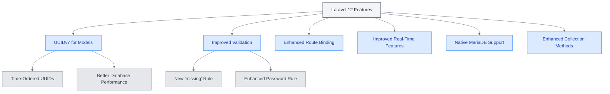

# Laravel 12 Features in UME

<link rel="stylesheet" href="../../../assets/css/styles.css">
<link rel="stylesheet" href="../../../assets/css/ume-docs-enhancements.css">
<link rel="stylesheet" href="../../../assets/css/interactive-code.css">
<script src="../../../assets/js/ume-docs-enhancements.js"></script>
<script src="../../../assets/js/interactive-code.js"></script>

<ul class="breadcrumb-navigation">
    <li><a href="../../../000-index.md">UME Tutorial</a></li>
    <li><a href="../../000-index.md">Implementation</a></li>
    <li><a href="../000-index.md">Phase 0: Foundation</a></li>
    <li><a href="./000-index.md">Phase 0: Foundation</a></li>
    <li><a href="./075-laravel12-features.md">Laravel 12 Features</a></li>
</ul>

<div class="section-metadata">
    <div class="time-estimate">
        <span class="icon">⏱️</span>
        <span class="label">Time Estimate:</span>
        <span class="value">1-2 hours</span>
    </div>
    <div class="difficulty-level">
        <span class="icon">🔶🔶</span>
        <span class="label">Difficulty:</span>
        <span class="value">Intermediate</span>
        <span class="explanation">Introduces new Laravel 12 features and concepts</span>
    </div>
    <div class="prerequisites">
        <span class="icon">📋</span>
        <span class="label">Prerequisites:</span>
        <ul>
            <li>Laravel basics</li>
            <li>PHP 8 knowledge</li>
            <li>Laravel project setup</li>
        </ul>
    </div>
    <div class="learning-outcomes">
        <span class="icon">🎯</span>
        <span class="label">You'll Learn:</span>
        <ul>
            <li>How to use UUIDv7 in Laravel 12</li>
            <li>How to leverage improved validation rules</li>
            <li>How to use enhanced route binding</li>
            <li>How to implement these features in your UME application</li>
        </ul>
    </div>
</div>

## Introduction to Laravel 12 Features

Laravel 12 introduces several powerful new features and improvements that can enhance your application. This section explores these features and demonstrates how to leverage them in your UME implementation.



<div class="mermaid-caption">Figure 1: Overview of Laravel 12 Features</div>

## UUIDv7 for Models

Laravel 12 now uses UUIDv7 by default when using the `HasUuids` trait, replacing the previous UUIDv4 implementation. This change brings significant benefits for database performance and data organization.

### Interactive Example: UUIDv7 in Laravel 12

<div class="interactive-code-example">
  <h3 class="example-title">Using UUIDv7 in Laravel 12 Models</h3>
  
  <div class="example-description">
    <p>This example demonstrates how to use UUIDv7 in Laravel 12 models and compares it with UUIDv4.</p>
  </div>
  
  <div class="code-editor-container" data-language="php" data-editable="true">
    <div class="editor-toolbar">
      <button class="run-button">Run Code</button>
      <button class="reset-button">Reset</button>
      <button class="copy-button">Copy</button>
      <div class="editor-status"></div>
    </div>
    
    <div class="monaco-editor" data-code="<?php

namespace App\Models;

use Illuminate\Database\Eloquent\Concerns\HasUuids;
use Illuminate\Database\Eloquent\Model;
use Illuminate\Support\Str;

// Model using UUIDv7 (Laravel 12 default)
class Post extends Model
{
    use HasUuids;
    
    protected $fillable = ['title', 'content'];
    
    // No need to override newUniqueId() - Laravel 12 uses UUIDv7 by default
}

// Model explicitly using UUIDv4
class LegacyPost extends Model
{
    use HasUuids;
    
    protected $fillable = ['title', 'content'];
    
    // Override to use UUIDv4 instead of UUIDv7
    public function newUniqueId()
    {
        return (string) Str::uuid();
    }
}

// Model with custom UUID columns
class Document extends Model
{
    use HasUuids;
    
    protected $fillable = ['title', 'content', 'reference_id'];
    
    // Specify which columns should receive UUIDs
    protected $uuidColumns = ['id', 'reference_id'];
}

// Example usage
$post = new Post();
$post->title = 'Using UUIDv7 in Laravel 12';
$post->content = 'Laravel 12 now uses UUIDv7 by default...';
// In a real application, you would save the model here
// $post->save();

$legacyPost = new LegacyPost();
$legacyPost->title = 'Using UUIDv4 in Laravel 12';
$legacyPost->content = 'You can still use UUIDv4 if needed...';
// $legacyPost->save();

$document = new Document();
$document->title = 'Document with multiple UUIDs';
$document->content = 'This document has UUIDs for both id and reference_id...';
// $document->save();

// Display the generated UUIDs
echo \"UUIDv7 (Post): \" . $post->id . \"\n\";
echo \"UUIDv4 (LegacyPost): \" . $legacyPost->id . \"\n\";
echo \"Document ID (UUIDv7): \" . $document->id . \"\n\";
echo \"Document Reference ID (UUIDv7): \" . $document->reference_id . \"\n\";

// Compare UUIDv7 and UUIDv4
echo \"\nUUIDv7 vs UUIDv4 Comparison:\n\";
echo \"UUIDv7 is time-ordered: The first part contains a timestamp\n\";
echo \"UUIDv4 is random: No time component, completely random\n\";

// Generate multiple UUIDv7s to show time ordering
echo \"\nMultiple UUIDv7s generated in sequence:\n\";
for ($i = 0; $i < 3; $i++) {
    echo Str::orderedUuid() . \"\n\";
    // Small delay to show time difference
    usleep(100000); // 100ms
}"></div>
    
    <div class="output-panel">
      <div class="output-header">Output</div>
      <div class="output-content"></div>
    </div>
  </div>
  
  <div class="example-explanation">
    <h4>How it works</h4>
    <p>This example demonstrates UUIDv7 in Laravel 12:</p>
    <ul>
      <li><strong>Default Behavior</strong>: The <code>HasUuids</code> trait now generates UUIDv7 by default in Laravel 12.</li>
      <li><strong>Custom Implementation</strong>: You can override <code>newUniqueId()</code> to use UUIDv4 or other UUID versions if needed.</li>
      <li><strong>Multiple UUID Columns</strong>: You can specify which columns should receive UUIDs using the <code>$uuidColumns</code> property.</li>
      <li><strong>Time Ordering</strong>: UUIDv7 includes a timestamp component, making them naturally sortable.</li>
    </ul>
  </div>
  
  <div class="example-challenges">
    <h4>Challenges</h4>
    <ol>
      <li>Create a model that uses both UUIDv7 for the ID and a separate ULID for another column</li>
      <li>Implement a method that sorts a collection of models by their UUIDv7 IDs</li>
      <li>Create a custom UUID generator that adds a prefix to the UUID</li>
      <li>Implement a method that extracts the timestamp from a UUIDv7</li>
    </ol>
  </div>
</div>

### Benefits of UUIDv7

UUIDv7 offers several advantages over UUIDv4:

1. **Time-ordered**: UUIDv7 includes a timestamp component, making them naturally sortable
2. **Performance**: Better database indexing and query performance compared to UUIDv4
3. **Uniqueness**: Still maintains the global uniqueness guarantees of UUIDs
4. **Compatibility**: Standard UUID format compatible with existing systems

### UUIDv7 vs. ULIDs

While Laravel 12 uses UUIDv7 by default for the `HasUuids` trait, you can still use ULIDs with the `HasUlids` trait:

```php
// Model using UUIDv7
class Post extends Model
{
    use HasUuids;
}

// Model using ULID
class Comment extends Model
{
    use HasUlids;
}
```

Here's a comparison of UUIDv7 and ULIDs:

| Feature | UUIDv7 | ULID |
|---------|--------|------|
| Format | 128-bit UUID (36 chars with hyphens) | 128-bit identifier (26 chars) |
| Encoding | Hexadecimal | Base32 (Crockford's alphabet) |
| Timestamp | First 48 bits | First 48 bits |
| Sortability | Time-ordered | Time-ordered |
| Human Readability | Lower (hex format) | Higher (shorter, no special chars) |
| Standardization | IETF standard | Not an official standard |
| Laravel Support | Native in Laravel 12 | Available via `HasUlids` trait |

## Improved Validation Rules

Laravel 12 introduces new validation rules and improvements to existing ones:

### New `missing` Validation Rule

The `missing` validation rule ensures that a field is not present in the request:

```php
$request->validate([
    'admin_field' => 'missing_if:is_admin,false',
]);
```

This is useful for ensuring that certain fields are only present under specific conditions.

### Enhanced `password` Rule

The `password` rule has been enhanced with more options:

```php
use Illuminate\Validation\Rules\Password;

$request->validate([
    'password' => ['required', Password::min(8)
        ->letters()
        ->numbers()
        ->mixedCase()
        ->symbols()
        ->uncompromised()],
]);
```

This allows for more granular control over password requirements.

## Enhanced Route Binding

Laravel 12 improves route model binding with more flexible options:

```php
// Bind by username instead of ID
Route::get('/users/{user:username}', function (User $user) {
    return $user;
});

// Bind by multiple columns
Route::get('/posts/{post:slug,id}', function (Post $post) {
    return $post;
});
```

This makes it easier to create user-friendly URLs while still leveraging Laravel's automatic model binding.

## Conclusion

Laravel 12 introduces several powerful features that can enhance your UME application. By leveraging UUIDv7, improved validation rules, and enhanced route binding, you can create more robust, performant, and user-friendly applications.

In the next section, we'll explore Carbon 3.x compatibility and how to ensure your application works seamlessly with this new version.

<div class="page-navigation">
    <a href="065-php84-features.md" class="prev">PHP 8.4 Features</a>
    <a href="080-carbon3-compatibility.md" class="next">Carbon 3.x Compatibility</a>
</div>

## Exercise

1. Create a model that uses UUIDv7 for its primary key and implement a method to extract the timestamp from the UUID.
2. Implement a form request that uses the new `missing` validation rule to ensure certain fields are only present under specific conditions.
3. Create a route that uses enhanced route binding to bind a model by a column other than its primary key.
4. Compare the performance of UUIDv7 and UUIDv4 for database indexing and sorting.
5. Implement a model that uses both UUIDv7 and ULIDs for different purposes and explain when each should be used.
