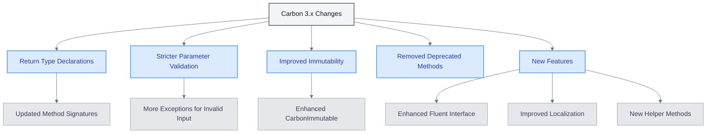

# Carbon 3.x Compatibility in Laravel 12

<link rel="stylesheet" href="../../../assets/css/styles.css">
<link rel="stylesheet" href="../../../assets/css/ume-docs-enhancements.css">
<link rel="stylesheet" href="../../../assets/css/interactive-code.css">
<script src="../../../assets/js/ume-docs-enhancements.js"></script>
<script src="../../../assets/js/interactive-code.js"></script>

<ul class="breadcrumb-navigation">
    <li><a href="../../../000-index.md">UME Tutorial</a></li>
    <li><a href="../../000-index.md">Implementation</a></li>
    <li><a href="../000-index.md">Phase 0: Foundation</a></li>
    <li><a href="./000-index.md">Phase 0: Foundation</a></li>
    <li><a href="./080-carbon3-compatibility.md">Carbon 3.x Compatibility</a></li>
</ul>

<div class="section-metadata">
    <div class="time-estimate">
        <span class="icon">⏱️</span>
        <span class="label">Time Estimate:</span>
        <span class="value">1-2 hours</span>
    </div>
    <div class="difficulty-level">
        <span class="icon">🔶🔶</span>
        <span class="label">Difficulty:</span>
        <span class="value">Intermediate</span>
        <span class="explanation">Introduces Carbon 3.x changes and compatibility considerations</span>
    </div>
    <div class="prerequisites">
        <span class="icon">📋</span>
        <span class="label">Prerequisites:</span>
        <ul>
            <li>Laravel basics</li>
            <li>Experience with Carbon 2.x</li>
            <li>Laravel project setup</li>
        </ul>
    </div>
    <div class="learning-outcomes">
        <span class="icon">🎯</span>
        <span class="label">You'll Learn:</span>
        <ul>
            <li>Key differences between Carbon 2.x and 3.x</li>
            <li>How to ensure compatibility with Carbon 3.x</li>
            <li>Best practices for date handling in Laravel 12</li>
            <li>How to leverage new Carbon 3.x features</li>
        </ul>
    </div>
</div>

## Introduction to Carbon 3.x in Laravel 12

Laravel 12 has removed support for Carbon 2.x and now requires Carbon 3.x. This change brings several improvements and new features, but also requires some adjustments to ensure compatibility. This section explores the key differences and provides guidance for ensuring your application works seamlessly with Carbon 3.x.



<div class="mermaid-caption">Figure 1: Overview of Carbon 3.x Changes</div>

## Key Differences Between Carbon 2.x and 3.x

### Return Type Declarations

Carbon 3.x adds return type declarations to many methods, which can cause issues if you're extending Carbon classes:

#### Carbon 2.x:
```php
class MyCarbon extends Carbon
{
    public function format($format)
    {
        // Custom format logic
        return parent::format($format);
    }
}
```

#### Carbon 3.x:
```php
class MyCarbon extends Carbon
{
    public function format(string $format): string
    {
        // Custom format logic
        return parent::format($format);
    }
}
```

### Stricter Parameter Validation

Carbon 3.x is stricter about parameter validation and will throw exceptions for invalid parameters:

#### Carbon 2.x:
```php
// Might work in Carbon 2.x with warnings
$date = Carbon::create(2023, 13, 32, 25, 70, 70);
```

#### Carbon 3.x:
```php
// Will throw an exception in Carbon 3.x
try {
    $date = Carbon::create(2023, 13, 32, 25, 70, 70);
} catch (\InvalidArgumentException $e) {
    // Handle the exception
}
```

### Interactive Example: Carbon 3.x Parameter Validation

<div class="interactive-code-example">
  <h3 class="example-title">Carbon 3.x Parameter Validation</h3>
  
  <div class="example-description">
    <p>This example demonstrates how Carbon 3.x validates parameters more strictly than Carbon 2.x.</p>
  </div>
  
  <div class="code-editor-container" data-language="php" data-editable="true">
    <div class="editor-toolbar">
      <button class="run-button">Run Code</button>
      <button class="reset-button">Reset</button>
      <button class="copy-button">Copy</button>
      <div class="editor-status"></div>
    </div>
    
    <div class="monaco-editor" data-code="<?php

use Carbon\Carbon;
use Carbon\CarbonImmutable;
use Carbon\Exceptions\InvalidFormatException;

// Valid date creation
try {
    $validDate = Carbon::create(2023, 5, 15, 14, 30, 0);
    echo \"Valid date: {$validDate->format('Y-m-d H:i:s')}\n\";
} catch (\Exception $e) {
    echo \"Error creating valid date: {$e->getMessage()}\n\";
}

// Invalid month (13)
try {
    $invalidMonth = Carbon::create(2023, 13, 15, 14, 30, 0);
    echo \"Invalid month: {$invalidMonth->format('Y-m-d H:i:s')}\n\";
} catch (\Exception $e) {
    echo \"Error with invalid month: {$e->getMessage()}\n\";
}

// Invalid day (32)
try {
    $invalidDay = Carbon::create(2023, 5, 32, 14, 30, 0);
    echo \"Invalid day: {$invalidDay->format('Y-m-d H:i:s')}\n\";
} catch (\Exception $e) {
    echo \"Error with invalid day: {$e->getMessage()}\n\";
}

// Invalid hour (25)
try {
    $invalidHour = Carbon::create(2023, 5, 15, 25, 30, 0);
    echo \"Invalid hour: {$invalidHour->format('Y-m-d H:i:s')}\n\";
} catch (\Exception $e) {
    echo \"Error with invalid hour: {$e->getMessage()}\n\";
}

// Invalid format
try {
    $invalidFormat = Carbon::createFromFormat('Y-m-d', 'not-a-date');
    echo \"Invalid format: {$invalidFormat->format('Y-m-d H:i:s')}\n\";
} catch (InvalidFormatException $e) {
    echo \"Error with invalid format: {$e->getMessage()}\n\";
}

// Safe creation with try/catch
function safeCreateDate($year, $month, $day, $hour = 0, $minute = 0, $second = 0)
{
    try {
        return Carbon::create($year, $month, $day, $hour, $minute, $second);
    } catch (\Exception $e) {
        // Log the error
        echo \"Error: {$e->getMessage()}\n\";
        // Return current date as fallback
        return Carbon::now();
    }
}

// Using the safe creation function
$date1 = safeCreateDate(2023, 5, 15);
$date2 = safeCreateDate(2023, 13, 32); // Invalid, will return current date

echo \"\nSafe creation results:\n\";
echo \"Date 1: {$date1->format('Y-m-d')}\n\";
echo \"Date 2: {$date2->format('Y-m-d')} (fallback to current date)\n\";"></div>
    
    <div class="output-panel">
      <div class="output-header">Output</div>
      <div class="output-content"></div>
    </div>
  </div>
  
  <div class="example-explanation">
    <h4>How it works</h4>
    <p>This example demonstrates Carbon 3.x's stricter parameter validation:</p>
    <ul>
      <li><strong>Exception Handling</strong>: Carbon 3.x throws exceptions for invalid parameters, requiring proper exception handling.</li>
      <li><strong>Specific Exceptions</strong>: Carbon 3.x provides specific exception classes like <code>InvalidFormatException</code> for better error handling.</li>
      <li><strong>Safe Creation Pattern</strong>: The example shows a safe creation pattern that handles exceptions and provides fallback values.</li>
      <li><strong>Validation Checks</strong>: Carbon 3.x validates all date components (year, month, day, hour, minute, second) more strictly.</li>
    </ul>
  </div>
  
  <div class="example-challenges">
    <h4>Challenges</h4>
    <ol>
      <li>Create a function that safely parses a date from a user input string with proper error handling</li>
      <li>Implement a date range validator that ensures start date is before end date</li>
      <li>Create a function that converts between different date formats with proper exception handling</li>
      <li>Implement a function that validates a date is a business day (not weekend or holiday)</li>
    </ol>
  </div>
</div>

### Immutability Changes

Carbon 3.x has improved immutability support and clearer distinctions between mutable and immutable instances:

#### Carbon 2.x:
```php
$date = Carbon::now();
$modifiedDate = $date->addDay(); // $date is also modified
```

#### Carbon 3.x:
```php
$date = Carbon::now();
$modifiedDate = $date->addDay(); // $date is also modified

// For immutability, use CarbonImmutable
$date = CarbonImmutable::now();
$modifiedDate = $date->addDay(); // $date remains unchanged
```

### Removed Deprecated Methods

Carbon 3.x removes methods that were deprecated in Carbon 2.x:

#### Carbon 2.x:
```php
// Deprecated but still available
$date->diffForHumans(null, true);
```

#### Carbon 3.x:
```php
// Use the new syntax
$date->diffForHumans(options: ['short' => true]);
```

## New Features in Carbon 3.x

Carbon 3.x introduces several new features that can be leveraged in Laravel 12 applications:

### Enhanced Fluent Interface

```php
$date = Carbon::now()
    ->startOfDay()
    ->addHours(9)
    ->addMinutes(30);
```

### Improved Localization

```php
Carbon::setLocale('fr');
echo Carbon::now()->isoFormat('LLLL');
```

### New Methods

```php
$date->isWeekday();
$date->isWeekend();
$date->isBetween($start, $end);
```

## Ensuring Compatibility in Laravel 12 Applications

### Update Dependencies

Update your `composer.json` file to require Carbon 3.x:

```json
{
    "require": {
        "nesbot/carbon": "^3.0"
    }
}
```

### Review Custom Extensions

If you have custom classes that extend Carbon, review them for compatibility issues:

- Add appropriate return type declarations
- Ensure parameter validation is handled correctly
- Review method signatures for compatibility

### Check for Deprecated Method Usage

Search your codebase for deprecated Carbon methods and update them to use the new syntax:

```php
// Before
$date->diffForHumans(null, true);

// After
$date->diffForHumans(options: ['short' => true]);
```

### Review Immutability Usage

Review your code for places where you might be assuming immutability or mutability:

```php
// If you need immutability
$date = CarbonImmutable::now();
$tomorrow = $date->addDay(); // $date remains unchanged

// If you need mutability
$date = Carbon::now();
$date->addDay(); // $date is modified
```

### Interactive Example: Immutability in Carbon 3.x

<div class="interactive-code-example">
  <h3 class="example-title">Immutability in Carbon 3.x</h3>
  
  <div class="example-description">
    <p>This example demonstrates the differences between mutable Carbon and immutable CarbonImmutable.</p>
  </div>
  
  <div class="code-editor-container" data-language="php" data-editable="true">
    <div class="editor-toolbar">
      <button class="run-button">Run Code</button>
      <button class="reset-button">Reset</button>
      <button class="copy-button">Copy</button>
      <div class="editor-status"></div>
    </div>
    
    <div class="monaco-editor" data-code="<?php

use Carbon\Carbon;
use Carbon\CarbonImmutable;
use Illuminate\Support\Facades\Date;

// Mutable Carbon example
$mutableDate = Carbon::create(2023, 5, 15, 14, 30, 0);
echo \"Original mutable date: {$mutableDate->format('Y-m-d H:i:s')}\n\";

$newMutableDate = $mutableDate->addDay();
echo \"After addDay() - new date: {$newMutableDate->format('Y-m-d H:i:s')}\n\";
echo \"After addDay() - original date: {$mutableDate->format('Y-m-d H:i:s')}\n\";
echo \"Are they the same object? \" . ($newMutableDate === $mutableDate ? 'Yes' : 'No') . \"\n\";

echo \"\n\";

// Immutable Carbon example
$immutableDate = CarbonImmutable::create(2023, 5, 15, 14, 30, 0);
echo \"Original immutable date: {$immutableDate->format('Y-m-d H:i:s')}\n\";

$newImmutableDate = $immutableDate->addDay();
echo \"After addDay() - new date: {$newImmutableDate->format('Y-m-d H:i:s')}\n\";
echo \"After addDay() - original date: {$immutableDate->format('Y-m-d H:i:s')}\n\";
echo \"Are they the same object? \" . ($newImmutableDate === $immutableDate ? 'Yes' : 'No') . \"\n\";

echo \"\n\";

// Chain operations with mutable Carbon
$mutableChain = Carbon::create(2023, 5, 15)
    ->addDays(2)
    ->subHours(3)
    ->startOfDay();
echo \"Mutable chain result: {$mutableChain->format('Y-m-d H:i:s')}\n\";

// Chain operations with immutable Carbon
$immutableChain = CarbonImmutable::create(2023, 5, 15)
    ->addDays(2)
    ->subHours(3)
    ->startOfDay();
echo \"Immutable chain result: {$immutableChain->format('Y-m-d H:i:s')}\n\";

echo \"\n\";

// Using copy() with mutable Carbon
$original = Carbon::create(2023, 5, 15);
$copy = $original->copy();
$copy->addDay();

echo \"Original after copy()->addDay(): {$original->format('Y-m-d')}\n\";
echo \"Copy after addDay(): {$copy->format('Y-m-d')}\n\";

echo \"\n\";

// Setting default date class to CarbonImmutable
// In Laravel, you would do this in AppServiceProvider::boot()
// Date::use(CarbonImmutable::class);

// Example of a function that works with both Carbon and CarbonImmutable
function addBusinessDays($date, $days)
{
    $result = $date;
    
    while ($days > 0) {
        $result = $result->addDay();
        if ($result->isWeekday()) {
            $days--;
        }
    }
    
    return $result;
}

$mutableResult = addBusinessDays(Carbon::create(2023, 5, 15), 3);
$immutableResult = addBusinessDays(CarbonImmutable::create(2023, 5, 15), 3);

echo \"Add 3 business days to 2023-05-15 (mutable): {$mutableResult->format('Y-m-d')}\n\";
echo \"Add 3 business days to 2023-05-15 (immutable): {$immutableResult->format('Y-m-d')}\n\";"></div>
    
    <div class="output-panel">
      <div class="output-header">Output</div>
      <div class="output-content"></div>
    </div>
  </div>
  
  <div class="example-explanation">
    <h4>How it works</h4>
    <p>This example demonstrates the differences between mutable and immutable Carbon instances:</p>
    <ul>
      <li><strong>Mutable Carbon</strong>: When you call methods like <code>addDay()</code>, the original object is modified and also returned.</li>
      <li><strong>Immutable CarbonImmutable</strong>: When you call methods like <code>addDay()</code>, the original object remains unchanged, and a new object is returned.</li>
      <li><strong>Method Chaining</strong>: Both Carbon and CarbonImmutable support fluent method chaining.</li>
      <li><strong>copy()</strong>: With mutable Carbon, you can use <code>copy()</code> to create a new instance that can be modified independently.</li>
      <li><strong>Compatibility</strong>: Functions can be written to work with both Carbon and CarbonImmutable if they return the result of operations rather than relying on the original object being modified.</li>
    </ul>
  </div>
  
  <div class="example-challenges">
    <h4>Challenges</h4>
    <ol>
      <li>Create a function that calculates the end date of a subscription period, ensuring the original date is not modified</li>
      <li>Implement a date range class that works with both Carbon and CarbonImmutable</li>
      <li>Create a function that finds the next business day after a given date</li>
      <li>Implement a calendar class that uses CarbonImmutable to prevent unexpected date modifications</li>
    </ol>
  </div>
</div>

## Best Practices for Carbon 3.x in Laravel 12

### 1. Prefer CarbonImmutable for Safer Code

```php
// In AppServiceProvider.php
public function boot()
{
    Date::use(CarbonImmutable::class);
}
```

This makes all date instances in your application immutable by default, which can prevent subtle bugs.

### 2. Use Type Declarations

```php
use Carbon\CarbonInterface;

public function calculateDueDate(CarbonInterface $startDate): CarbonInterface
{
    return $startDate->addWeekdays(5);
}
```

### 3. Leverage New Methods for Cleaner Code

```php
// Before
if ($date->dayOfWeek !== Carbon::SATURDAY && $date->dayOfWeek !== Carbon::SUNDAY) {
    // Weekday logic
}

// After
if ($date->isWeekday()) {
    // Weekday logic
}
```

### 4. Use Fluent Interface for Complex Date Manipulations

```php
$meetingStart = Carbon::now()
    ->startOfDay()
    ->addHours(9)
    ->addMinutes(30);
    
$meetingEnd = $meetingStart->copy()->addHours(1);
```

## Implementing Carbon 3.x in UME

Here are some examples of how to implement Carbon 3.x in your UME application:

### Configuring Default Date Serialization

```php
// In AppServiceProvider.php
public function boot()
{
    // Use ISO 8601 format for all serialized dates
    Carbon::serializeUsing(function ($date) {
        return $date->toIso8601String();
    });
}
```

### Creating a Date Range Utility

```php
class DateRange
{
    public function __construct(
        private CarbonInterface $start,
        private CarbonInterface $end
    ) {
        if ($this->start->greaterThan($this->end)) {
            throw new InvalidArgumentException('Start date must be before end date');
        }
    }
    
    public function contains(CarbonInterface $date): bool
    {
        return $date->between($this->start, $this->end);
    }
    
    public function days(): int
    {
        return $this->start->diffInDays($this->end) + 1;
    }
    
    public function weekdays(): int
    {
        return $this->start->diffInWeekdays($this->end) + ($this->end->isWeekday() ? 1 : 0);
    }
}
```

### Enhanced Date Validation in Form Requests

```php
class EventRequest extends FormRequest
{
    public function rules(): array
    {
        return [
            'title' => 'required|string|max:255',
            'start_date' => 'required|date',
            'end_date' => 'required|date|after:start_date',
        ];
    }
    
    protected function prepareForValidation(): void
    {
        try {
            // Parse and normalize dates
            if ($this->has('start_date')) {
                $startDate = Carbon::parse($this->start_date)->startOfDay();
                $this->merge(['start_date' => $startDate->toDateString()]);
            }
            
            if ($this->has('end_date')) {
                $endDate = Carbon::parse($this->end_date)->endOfDay();
                $this->merge(['end_date' => $endDate->toDateString()]);
            }
        } catch (\Exception $e) {
            // Invalid dates will be caught by validation
        }
    }
}
```

## Troubleshooting Carbon 3.x Issues

<div class="troubleshooting-guide">
    <h2>Type Error in Carbon Methods</h2>

    <div class="symptoms">
        <h3>Symptoms</h3>
        <ul>
            <li>TypeError exceptions when calling Carbon methods</li>
            <li>Errors mentioning return type declarations</li>
            <li>Issues when extending Carbon classes</li>
        </ul>
    </div>

    <div class="causes">
        <h3>Possible Causes</h3>
        <ol>
            <li>Custom extensions of Carbon classes with incompatible method signatures</li>
            <li>Using methods that have changed return types in Carbon 3.x</li>
            <li>Passing incorrect parameter types to Carbon methods</li>
        </ol>
    </div>

    <div class="solutions">
        <h3>Solutions</h3>

        <h4>For Custom Extensions</h4>
        <p>Update method signatures to match Carbon 3.x:</p>
        <pre><code>// Before
public function format($format)
{
    // Custom logic
    return parent::format($format);
}

// After
public function format(string $format): string
{
    // Custom logic
    return parent::format($format);
}</code></pre>

        <h4>For Parameter Type Issues</h4>
        <p>Ensure parameters match expected types:</p>
        <pre><code>// Before
$date->diffInDays($otherDate);

// After - ensure $otherDate is a Carbon instance or null
$date->diffInDays($otherDate instanceof DateTime ? Carbon::instance($otherDate) : $otherDate);</code></pre>

        <h4>For Return Type Issues</h4>
        <p>Update code that relies on specific return types:</p>
        <pre><code>// Before - might assume any return type
$result = $date->format('Y-m-d');

// After - explicitly handle string return type
$result = (string) $date->format('Y-m-d');</code></pre>
    </div>

    <div class="prevention">
        <h3>Prevention</h3>
        <ul>
            <li>Use type declarations in your own code to catch type issues early</li>
            <li>Use CarbonInterface for type hints to work with both Carbon and CarbonImmutable</li>
            <li>Write tests that verify Carbon functionality</li>
            <li>Use static analysis tools like PHPStan to catch type issues</li>
        </ul>
    </div>
</div>

<div class="troubleshooting-guide">
    <h2>Unexpected Date Modifications</h2>

    <div class="symptoms">
        <h3>Symptoms</h3>
        <ul>
            <li>Dates being unexpectedly modified</li>
            <li>Functions having side effects on date parameters</li>
            <li>Date calculations producing incorrect results</li>
        </ul>
    </div>

    <div class="causes">
        <h3>Possible Causes</h3>
        <ol>
            <li>Using mutable Carbon instances where immutability is expected</li>
            <li>Not using copy() when needed with mutable Carbon</li>
            <li>Assuming method calls don't modify the original object</li>
        </ol>
    </div>

    <div class="solutions">
        <h3>Solutions</h3>

        <h4>Switch to CarbonImmutable</h4>
        <p>Use CarbonImmutable for safer date handling:</p>
        <pre><code>// In AppServiceProvider.php
public function boot()
{
    Date::use(CarbonImmutable::class);
}</code></pre>

        <h4>Use copy() with Mutable Carbon</h4>
        <p>Create copies of mutable Carbon instances:</p>
        <pre><code>$original = Carbon::now();
$modified = $original->copy()->addDay();</code></pre>

        <h4>Be Explicit About Modifications</h4>
        <p>Make it clear when you're modifying a date:</p>
        <pre><code>// Explicitly modify the date
$date->addDay();

// Or assign the result to make it clear
$date = $date->addDay();</code></pre>
    </div>

    <div class="prevention">
        <h3>Prevention</h3>
        <ul>
            <li>Use CarbonImmutable by default</li>
            <li>Write pure functions that don't modify their inputs</li>
            <li>Document when methods modify their parameters</li>
            <li>Write tests that verify date immutability</li>
        </ul>
    </div>
</div>

## Conclusion

Carbon 3.x brings several improvements and new features that can enhance your Laravel 12 applications. While the transition from Carbon 2.x requires some code updates, the benefits of stricter type checking, improved immutability, and new methods make it worthwhile.

By following the best practices outlined in this document, you can ensure that your UME application makes the most of Carbon 3.x while maintaining compatibility and avoiding common pitfalls.

In the next section, we'll explore UUIDv7 implementation in more detail and how it compares to ULIDs.

<div class="page-navigation">
    <a href="075-laravel12-features.md" class="prev">Laravel 12 Features</a>
    <a href="085-uuidv7-implementation.md" class="next">UUIDv7 Implementation</a>
</div>

## Exercise

1. Create a utility class that works with both Carbon and CarbonImmutable to calculate business days between two dates.
2. Implement a form request that validates and normalizes date inputs using Carbon 3.x.
3. Create a date range class that uses CarbonImmutable to prevent unexpected date modifications.
4. Write tests that verify your code works correctly with Carbon 3.x's stricter parameter validation.
5. Implement a function that formats dates according to the user's locale and timezone using Carbon 3.x's improved localization features.
