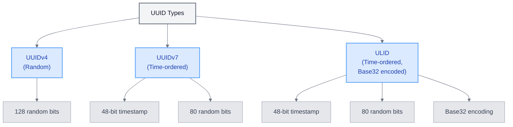

# UUIDv7 Implementation in Laravel 12

<link rel="stylesheet" href="../../../assets/css/styles.css">
<link rel="stylesheet" href="../../../assets/css/ume-docs-enhancements.css">
<link rel="stylesheet" href="../../../assets/css/interactive-code.css">
<script src="../../../assets/js/ume-docs-enhancements.js"></script>
<script src="../../../assets/js/interactive-code.js"></script>

<ul class="breadcrumb-navigation">
    <li><a href="../../../000-index.md">UME Tutorial</a></li>
    <li><a href="../../000-index.md">Implementation</a></li>
    <li><a href="../000-index.md">Phase 0: Foundation</a></li>
    <li><a href="./000-index.md">Phase 0: Foundation</a></li>
    <li><a href="./085-uuidv7-implementation.md">UUIDv7 Implementation</a></li>
</ul>

<div class="section-metadata">
    <div class="time-estimate">
        <span class="icon">⏱️</span>
        <span class="label">Time Estimate:</span>
        <span class="value">1-2 hours</span>
    </div>
    <div class="difficulty-level">
        <span class="icon">🔶🔶</span>
        <span class="label">Difficulty:</span>
        <span class="value">Intermediate</span>
        <span class="explanation">Introduces UUIDv7 concepts and implementation details</span>
    </div>
    <div class="prerequisites">
        <span class="icon">📋</span>
        <span class="label">Prerequisites:</span>
        <ul>
            <li>Laravel basics</li>
            <li>Understanding of database primary keys</li>
            <li>Laravel project setup</li>
        </ul>
    </div>
    <div class="learning-outcomes">
        <span class="icon">🎯</span>
        <span class="label">You'll Learn:</span>
        <ul>
            <li>What UUIDv7 is and its benefits</li>
            <li>How to implement UUIDv7 in Laravel 12 models</li>
            <li>When to use UUIDv7 vs. ULIDs</li>
            <li>How to optimize database performance with UUIDv7</li>
        </ul>
    </div>
</div>

## Introduction to UUIDv7

UUIDv7 (Universally Unique Identifier version 7) is a new UUID format that includes a time-ordered component. Unlike UUIDv4, which is completely random, UUIDv7 includes:

- A 48-bit timestamp with millisecond precision
- Random bits for uniqueness

This makes UUIDv7 both time-ordered and globally unique, addressing one of the main limitations of UUIDv4.



<div class="mermaid-caption">Figure 1: Comparison of UUID Types</div>

## UUIDv7 in Laravel 12

Laravel 12 now uses UUIDv7 by default when using the `HasUuids` trait, replacing the previous UUIDv4 implementation:

```php
use Illuminate\Database\Eloquent\Concerns\HasUuids;
use Illuminate\Database\Eloquent\Model;

class Post extends Model
{
    use HasUuids;
    
    // By default, Laravel 12 will use UUIDv7
    // No additional configuration needed
}
```

### Interactive Example: UUIDv7 Implementation

<div class="interactive-code-example">
  <h3 class="example-title">Implementing UUIDv7 in Laravel 12</h3>
  
  <div class="example-description">
    <p>This example demonstrates how to implement UUIDv7 in Laravel 12 models and how to customize UUID generation.</p>
  </div>
  
  <div class="code-editor-container" data-language="php" data-editable="true">
    <div class="editor-toolbar">
      <button class="run-button">Run Code</button>
      <button class="reset-button">Reset</button>
      <button class="copy-button">Copy</button>
      <div class="editor-status"></div>
    </div>
    
    <div class="monaco-editor" data-code="<?php

namespace App\Models;

use Illuminate\Database\Eloquent\Concerns\HasUuids;
use Illuminate\Database\Eloquent\Concerns\HasUlids;
use Illuminate\Database\Eloquent\Model;
use Illuminate\Support\Str;

// Basic model with UUIDv7
class Post extends Model
{
    use HasUuids;
    
    protected $fillable = ['title', 'content'];
    
    // No need to override newUniqueId() - Laravel 12 uses UUIDv7 by default
}

// Model with custom UUID generation
class CustomPost extends Model
{
    use HasUuids;
    
    protected $fillable = ['title', 'content'];
    
    // Override to use UUIDv4 instead of UUIDv7
    public function newUniqueId()
    {
        return (string) Str::uuid();
    }
}

// Model with multiple UUID columns
class Document extends Model
{
    use HasUuids;
    
    protected $fillable = ['title', 'content', 'reference_id'];
    
    // Specify which columns should receive UUIDs
    protected $uuidColumns = ['id', 'reference_id'];
}

// Model using ULID instead of UUID
class Comment extends Model
{
    use HasUlids;
    
    protected $fillable = ['content', 'post_id'];
}

// Hybrid model with both auto-incrementing ID and UUID
class HybridModel extends Model
{
    protected $fillable = ['name', 'description'];
    
    // Use auto-incrementing ID as primary key
    public $incrementing = true;
    
    // Generate UUID for public sharing
    protected static function booted()
    {
        static::creating(function ($model) {
            $model->uuid = (string) Str::orderedUuid();
        });
    }
    
    // Find by UUID
    public static function findByUuid($uuid)
    {
        return static::where('uuid', $uuid)->first();
    }
}

// Example usage
$post = new Post();
$post->title = 'Using UUIDv7 in Laravel 12';
$post->content = 'Laravel 12 now uses UUIDv7 by default...';
// In a real application, you would save the model here
// $post->save();

$customPost = new CustomPost();
$customPost->title = 'Using UUIDv4 in Laravel 12';
$customPost->content = 'You can still use UUIDv4 if needed...';
// $customPost->save();

$document = new Document();
$document->title = 'Document with multiple UUIDs';
$document->content = 'This document has UUIDs for both id and reference_id...';
// $document->save();

$comment = new Comment();
$comment->content = 'This is a comment with a ULID primary key';
// $comment->save();

$hybrid = new HybridModel();
$hybrid->name = 'Hybrid Model';
$hybrid->description = 'This model has both auto-incrementing ID and UUID';
// $hybrid->save();

// Display the generated IDs
echo \"UUIDv7 (Post): \" . $post->id . \"\n\";
echo \"UUIDv4 (CustomPost): \" . $customPost->id . \"\n\";
echo \"Document ID (UUIDv7): \" . $document->id . \"\n\";
echo \"Document Reference ID (UUIDv7): \" . $document->reference_id . \"\n\";
echo \"Comment ID (ULID): \" . $comment->id . \"\n\";
echo \"Hybrid Model ID (auto-increment): \" . $hybrid->id . \" (would be set after save)\n\";
echo \"Hybrid Model UUID: \" . $hybrid->uuid . \"\n\";

// Generate multiple UUIDv7s to show time ordering
echo \"\nMultiple UUIDv7s generated in sequence:\n\";
for ($i = 0; $i < 3; $i++) {
    echo Str::orderedUuid() . \"\n\";
    // Small delay to show time difference
    usleep(100000); // 100ms
}

// Generate multiple ULIDs to show time ordering
echo \"\nMultiple ULIDs generated in sequence:\n\";
for ($i = 0; $i < 3; $i++) {
    echo (string) Str::ulid() . \"\n\";
    // Small delay to show time difference
    usleep(100000); // 100ms
}"></div>
    
    <div class="output-panel">
      <div class="output-header">Output</div>
      <div class="output-content"></div>
    </div>
  </div>
  
  <div class="example-explanation">
    <h4>How it works</h4>
    <p>This example demonstrates various UUID implementation approaches in Laravel 12:</p>
    <ul>
      <li><strong>Default UUIDv7</strong>: The <code>HasUuids</code> trait now generates UUIDv7 by default in Laravel 12.</li>
      <li><strong>Custom UUID Generation</strong>: You can override <code>newUniqueId()</code> to use UUIDv4 or other UUID versions.</li>
      <li><strong>Multiple UUID Columns</strong>: You can specify which columns should receive UUIDs using the <code>$uuidColumns</code> property.</li>
      <li><strong>ULID Alternative</strong>: You can use the <code>HasUlids</code> trait for models that should use ULIDs instead of UUIDs.</li>
      <li><strong>Hybrid Approach</strong>: You can combine auto-incrementing IDs with UUIDs for different purposes.</li>
      <li><strong>Time Ordering</strong>: Both UUIDv7 and ULIDs include a timestamp component, making them naturally sortable.</li>
    </ul>
  </div>
  
  <div class="example-challenges">
    <h4>Challenges</h4>
    <ol>
      <li>Create a model that uses UUIDv7 for the ID and ULID for another column</li>
      <li>Implement a method that extracts and displays the timestamp from a UUIDv7</li>
      <li>Create a custom UUID generator that adds a prefix to the UUID</li>
      <li>Implement a repository class that efficiently queries models by UUID</li>
    </ol>
  </div>
</div>

## Comparing UUIDv7 and ULIDs

While Laravel 12 uses UUIDv7 by default for the `HasUuids` trait, you can still use ULIDs with the `HasUlids` trait. Here's a detailed comparison:

| Feature | UUIDv7 | ULID |
|---------|--------|------|
| Format | 128-bit UUID (36 chars with hyphens) | 128-bit identifier (26 chars) |
| Example | `01890a5d-ac91-7ff0-b8f6-6be8d10b3cc1` | `01H5KXGXWVJVQ1ATVJ5QDMJ0QN` |
| Encoding | Hexadecimal | Base32 (Crockford's alphabet) |
| Timestamp | First 48 bits | First 48 bits |
| Sortability | Time-ordered | Time-ordered |
| Human Readability | Lower (hex format) | Higher (shorter, no special chars) |
| URL Friendliness | Lower (contains hyphens) | Higher (no special chars) |
| Standardization | IETF standard | Not an official standard |
| Laravel Support | Native in Laravel 12 | Available via `HasUlids` trait |
| Database Storage | UUID type or char(36) | char(26) |

### When to Use UUIDv7

1. **Compatibility is important**: Systems expecting standard UUID format
2. **Database performance is critical**: UUIDv7 offers good indexing performance
3. **You need a standard format**: UUIDv7 is an IETF standard
4. **You're using Laravel 12's default**: Simplest implementation with `HasUuids`

### When to Use ULIDs

1. **Human readability matters**: ULIDs are shorter and easier to read/type
2. **URL-friendliness is needed**: No hyphens or special characters
3. **You need case-insensitivity**: ULIDs use only uppercase letters and numbers
4. **You're already using ULIDs**: For consistency in existing systems

## Database Considerations

### Database Schema

When using UUIDv7 or ULIDs, you need to adjust your database schema accordingly:

#### For UUIDv7:

```php
// In a migration file
Schema::create('posts', function (Blueprint $table) {
    // For MySQL, MariaDB, or SQLite
    $table->uuid('id')->primary();
    
    // For PostgreSQL (native UUID type)
    // $table->uuid('id')->primary();
    
    $table->string('title');
    $table->text('content');
    $table->timestamps();
});
```

#### For ULIDs:

```php
// In a migration file
Schema::create('comments', function (Blueprint $table) {
    // ULIDs are stored as char(26)
    $table->ulid('id')->primary();
    
    $table->text('content');
    $table->foreignUuid('post_id')->constrained();
    $table->timestamps();
});
```

### Indexing Performance

Both UUIDv7 and ULIDs are time-ordered, which improves database indexing performance compared to random UUIDs (UUIDv4). The time component at the beginning improves B-tree index performance, making range queries more efficient.

```php
// Efficient range queries with time-ordered UUIDs
$recentPosts = Post::where('id', '>', $someUuidFromLastWeek)
    ->orderBy('id')
    ->limit(100)
    ->get();
```

### Foreign Key Relationships

When using UUIDv7 or ULIDs, you need to ensure that foreign key relationships use the correct data type:

```php
// In a migration file
Schema::create('comments', function (Blueprint $table) {
    $table->ulid('id')->primary();
    $table->text('content');
    
    // For a relationship to a model using UUIDv7
    $table->foreignUuid('post_id')->constrained();
    
    // For a relationship to a model using ULID
    // $table->foreignUlid('post_id')->constrained();
    
    $table->timestamps();
});
```

## Migration Strategies

### Migrating from UUIDv4 to UUIDv7

If you're upgrading to Laravel 12 and want to migrate from UUIDv4 to UUIDv7:

1. **For new records**: Let Laravel 12 generate UUIDv7 automatically
2. **For existing records**: Keep them as UUIDv4, no need to migrate

```php
use Illuminate\Database\Eloquent\Concerns\HasUuids;
use Illuminate\Database\Eloquent\Model;
use Illuminate\Support\Str;

class Post extends Model
{
    use HasUuids;
    
    public function newUniqueId()
    {
        // Check if this is a new record or an existing one
        if ($this->exists) {
            // For existing records, maintain UUIDv4 format
            return (string) Str::uuid();
        }
        
        // For new records, use UUIDv7 (Laravel 12 default)
        return parent::newUniqueId();
    }
}
```

### Migrating from ULIDs to UUIDv7

If you want to migrate from ULIDs to UUIDv7:

1. **Database schema**: You'll need to change column types from `char(26)` to appropriate UUID types
2. **Data migration**: Convert existing ULIDs to UUIDv7 (not recommended for large tables)
3. **Code updates**: Change from `HasUlids` trait to `HasUuids` trait

This is a more complex migration and should be carefully planned, especially for large tables.

## Advanced UUIDv7 Implementation

### Custom UUID Generator

You can create a custom UUID generator for special cases:

```php
class TemporaryLink extends Model
{
    use HasUuids;
    
    // Generate a shorter, URL-friendly UUID for temporary links
    public function newUniqueId()
    {
        // Generate a base64-encoded UUID (22 characters)
        return (string) Str::orderedUuid()->getHex();
    }
}
```

### Extracting Timestamp from UUIDv7

You can extract the timestamp from a UUIDv7 to determine when it was created:

```php
class UuidHelper
{
    public static function getTimestampFromUuid(string $uuid): \DateTimeImmutable
    {
        // Remove hyphens
        $uuid = str_replace('-', '', $uuid);
        
        // Extract the time component (first 48 bits / 12 hex chars)
        $timeHex = substr($uuid, 0, 12);
        
        // Convert to decimal
        $timeDecimal = hexdec($timeHex);
        
        // UUIDv7 timestamp is in milliseconds since Unix epoch
        $seconds = floor($timeDecimal / 1000);
        $milliseconds = $timeDecimal % 1000;
        
        // Create DateTime object
        $date = new \DateTimeImmutable('@' . $seconds);
        
        // Add milliseconds
        return $date->modify('+' . $milliseconds . ' milliseconds');
    }
}

// Usage
$uuid = '01890a5d-ac91-7ff0-b8f6-6be8d10b3cc1';
$timestamp = UuidHelper::getTimestampFromUuid($uuid);
echo "UUID created at: " . $timestamp->format('Y-m-d H:i:s.v');
```

### Hybrid Approach with Both ID Types

You can use both auto-incrementing IDs and UUIDs for different purposes:

```php
class Document extends Model
{
    use HasUuids;
    
    // Use auto-incrementing ID as primary key
    public $incrementing = true;
    
    // But also generate a UUID for public sharing
    protected static function booted()
    {
        static::creating(function ($document) {
            $document->uuid = (string) Str::orderedUuid();
        });
    }
    
    // Scope to find by UUID
    public function scopeFindByUuid($query, $uuid)
    {
        return $query->where('uuid', $uuid);
    }
}
```

## Implementing UUIDv7 in UME

In the UME application, we use the `HasAdditionalFeatures` trait to add various features to our models, including UUID generation. Here's how to implement UUIDv7 support:

```php
namespace App\Models\Attributes;

use Attribute;

#[Attribute(Attribute::TARGET_CLASS)]
class HasUuid
{
    public function __construct(
        public ?string $column = 'id',
        public string $version = 'v7'
    ) {}
}
```

Then, in the `HasAdditionalFeatures` trait:

```php
protected static function configureUuid(HasUuid $config)
{
    $column = $config->column ?? 'id';
    $version = $config->version ?? 'v7';
    
    static::creating(function ($model) use ($column, $version) {
        if (!$model->{$column}) {
            $model->{$column} = match ($version) {
                'v4' => (string) Str::uuid(),
                'v7' => (string) Str::orderedUuid(),
                default => (string) Str::orderedUuid(),
            };
        }
    });
}
```

Usage in a model:

```php
use App\Models\Attributes\HasUuid;
use App\Models\Traits\HasAdditionalFeatures;
use Illuminate\Database\Eloquent\Model;

#[HasUuid(column: 'id', version: 'v7')]
class Post extends Model
{
    use HasAdditionalFeatures;
    
    protected $fillable = ['title', 'content'];
}
```

## Troubleshooting UUIDv7 Implementation

<div class="troubleshooting-guide">
    <h2>UUID Not Being Generated</h2>

    <div class="symptoms">
        <h3>Symptoms</h3>
        <ul>
            <li>UUIDs are not being generated for new models</li>
            <li>Database errors about null values in primary key</li>
            <li>Models failing to save</li>
        </ul>
    </div>

    <div class="causes">
        <h3>Possible Causes</h3>
        <ol>
            <li>Missing the HasUuids trait in the model</li>
            <li>Incorrect database schema (column type not set to uuid)</li>
            <li>Manually setting the ID before saving</li>
            <li>Overriding newUniqueId() method incorrectly</li>
        </ol>
    </div>

    <div class="solutions">
        <h3>Solutions</h3>

        <h4>For Missing Trait</h4>
        <p>Add the trait to your model:</p>
        <pre><code>use Illuminate\Database\Eloquent\Concerns\HasUuids;

class Post extends Model
{
    use HasUuids;

    // Rest of your model
}</code></pre>

        <h4>For Incorrect Schema</h4>
        <p>Update your migration:</p>
        <pre><code>Schema::create('posts', function (Blueprint $table) {
    $table->uuid('id')->primary();
    // Rest of your schema
});</code></pre>

        <h4>For Manual ID Setting</h4>
        <p>Let Laravel generate the UUID automatically:</p>
        <pre><code>// Don't do this
$post = new Post();
$post->id = 'some-value'; // This prevents UUID generation
$post->save();

// Do this instead
$post = new Post();
$post->save(); // UUID will be generated automatically</code></pre>
    </div>

    <div class="prevention">
        <h3>Prevention</h3>
        <ul>
            <li>Always include <code>use HasUuids;</code> when using UUID primary keys</li>
            <li>Use the correct column type in migrations</li>
            <li>Let Laravel generate UUIDs automatically</li>
            <li>Write tests that verify UUID generation</li>
        </ul>
    </div>
</div>

<div class="troubleshooting-guide">
    <h2>Foreign Key Relationship Issues</h2>

    <div class="symptoms">
        <h3>Symptoms</h3>
        <ul>
            <li>Foreign key constraint violations</li>
            <li>Relationships not working correctly</li>
            <li>Database errors when saving related models</li>
        </ul>
    </div>

    <div class="causes">
        <h3>Possible Causes</h3>
        <ol>
            <li>Mismatched column types between primary and foreign keys</li>
            <li>Using different UUID versions for related models</li>
            <li>Incorrect relationship definitions</li>
        </ol>
    </div>

    <div class="solutions">
        <h3>Solutions</h3>

        <h4>For Mismatched Column Types</h4>
        <p>Ensure consistent column types:</p>
        <pre><code>// Primary key
Schema::create('posts', function (Blueprint $table) {
    $table->uuid('id')->primary();
    // ...
});

// Foreign key
Schema::create('comments', function (Blueprint $table) {
    $table->uuid('id')->primary();
    $table->foreignUuid('post_id')->constrained();
    // ...
});</code></pre>

        <h4>For Different UUID Versions</h4>
        <p>Use consistent UUID versions across related models:</p>
        <pre><code>// Both models should use the same UUID version
class Post extends Model
{
    use HasUuids;
    // Uses UUIDv7 by default in Laravel 12
}

class Comment extends Model
{
    use HasUuids;
    // Also uses UUIDv7 by default
}</code></pre>

        <h4>For Incorrect Relationship Definitions</h4>
        <p>Define relationships correctly:</p>
        <pre><code>// In Post model
public function comments()
{
    return $this->hasMany(Comment::class);
}

// In Comment model
public function post()
{
    return $this->belongsTo(Post::class);
}</code></pre>
    </div>

    <div class="prevention">
        <h3>Prevention</h3>
        <ul>
            <li>Use consistent UUID versions across related models</li>
            <li>Use the correct column types in migrations</li>
            <li>Define relationships explicitly</li>
            <li>Write tests that verify relationship functionality</li>
        </ul>
    </div>
</div>

## Conclusion

UUIDv7 provides a powerful solution for generating unique identifiers that are both globally unique and time-ordered. Laravel 12's adoption of UUIDv7 as the default for the `HasUuids` trait brings significant benefits in terms of performance and sortability while maintaining compatibility with existing systems.

For most UME applications, using UUIDv7 for primary keys is recommended, especially for new projects. However, ULIDs remain a valid option for specific use cases where their characteristics provide clear advantages. The good news is that Laravel 12 supports both approaches, allowing developers to choose the best identifier type for each specific model and use case.

<div class="page-navigation">
    <a href="080-carbon3-compatibility.md" class="prev">Carbon 3.x Compatibility</a>
    <a href="090-flux-ui-components.md" class="next">Flux UI Components</a>
</div>

## Exercise

1. Create a model that uses UUIDv7 for its primary key and implement a method to extract and display the timestamp from the UUID.
2. Implement a repository pattern that efficiently queries models by UUID.
3. Create a migration that sets up a table with a UUIDv7 primary key and appropriate indexes for optimal performance.
4. Implement a model that uses both UUIDv7 and ULIDs for different purposes and explain when each should be used.
5. Create a utility class that can convert between UUIDv7 and ULID formats.
