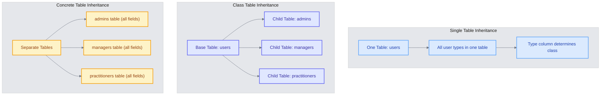
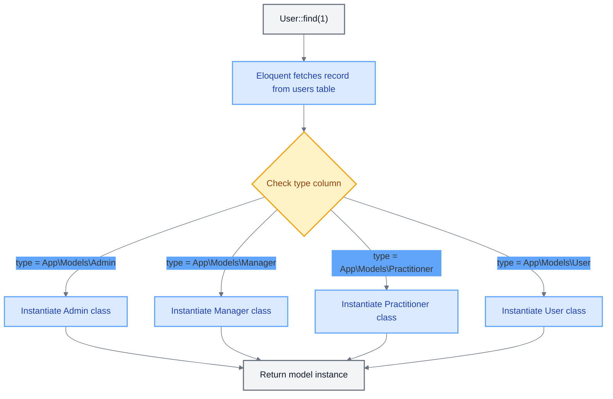
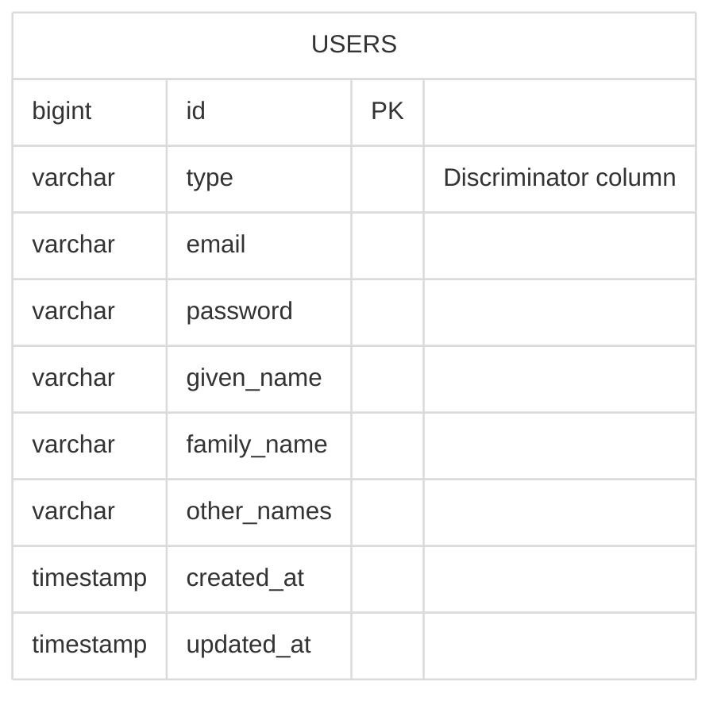

# Understanding Single Table Inheritance (STI) & Parental

<link rel="stylesheet" href="../../assets/css/styles.css">
<link rel="stylesheet" href="../../assets/css/ume-docs-enhancements.css">
<script src="../../assets/js/ume-docs-enhancements.js"></script>

<ul class="breadcrumb-navigation">
    <li><a href="../../000-index.md">UME Tutorial</a></li>
    <li><a href="../000-index.md">Implementation</a></li>
    <li><a href="./000-index.md">Phase 1: Core Models</a></li>
    <li><a href="./010-understanding-sti.md">Understanding STI</a></li>
</ul>

<div class="section-metadata">
    <div class="time-estimate">
        <span class="icon">⏱️</span>
        <span class="label">Time Estimate:</span>
        <span class="value">30-45 minutes</span>
    </div>
    <div class="difficulty-level">
        <span class="icon">🔶🔶</span>
        <span class="label">Difficulty:</span>
        <span class="value">Intermediate</span>
        <span class="explanation">Introduces advanced object-oriented concepts and database design patterns</span>
    </div>
    <div class="prerequisites">
        <span class="icon">📋</span>
        <span class="label">Prerequisites:</span>
        <ul>
            <li>Basic Laravel Eloquent knowledge</li>
            <li>Understanding of PHP inheritance</li>
            <li>Familiarity with database design concepts</li>
        </ul>
    </div>
    <div class="learning-outcomes">
        <span class="icon">🎯</span>
        <span class="label">You'll Learn:</span>
        <ul>
            <li>What Single Table Inheritance is and its benefits/drawbacks</li>
            <li>How the Parental package implements STI in Laravel</li>
            <li>How to structure models for STI</li>
            <li>How to query specific user types</li>
        </ul>
    </div>
</div>

## Goal

Understand the concept of Single Table Inheritance (STI) and how the `tightenco/parental` package implements it in Laravel.

## What is Single Table Inheritance?

Single Table Inheritance (STI) is a design pattern that allows an inheritance hierarchy of classes to be stored in a *single database table*. This simplifies the database schema but allows for specialized model classes in your application code.

### Key Concepts

1. **One Table, Multiple Models**: All user types (Admin, Manager, Practitioner, User) are stored in a single `users` table.
2. **Discriminator Column**: A special column (we'll use `type`) identifies which specific subclass each row represents.
3. **Inheritance Hierarchy**: Child classes extend a base class, inheriting its properties and methods while adding their own.

### Benefits of STI

- **Simplified Database Schema**: No need for multiple tables and complex joins
- **Easier Queries**: All users can be queried from a single table
- **Polymorphic Relationships**: Other models can relate to "users" without caring about the specific type
- **Specialized Behavior**: Each user type can have its own methods and properties
- **Consistent IDs**: All users share the same ID space, simplifying relationships

### Drawbacks of STI

- **Nullable Columns**: Some columns may only apply to certain user types
- **Schema Changes**: Adding fields specific to one type affects the entire table
- **Performance**: Large tables with many nullable columns can impact performance

### STI vs. Other Inheritance Approaches



<div class="mermaid-caption">Figure 4: Comparison of different inheritance approaches in database design</div>

## How Parental Implements STI

The `tightenco/parental` package provides a clean implementation of STI for Laravel's Eloquent ORM:

1. **HasChildren Trait**: Applied to the parent model (`User`)
2. **HasParent Trait**: Applied to child models (`Admin`, `Manager`, `Practitioner`)
3. **Type Column**: Stores the fully qualified class name of the model (e.g., `App\Models\Admin`)
4. **Automatic Casting**: When retrieving records, Parental checks the `type` column and instantiates the correct model class

```php
// Parent Model
class User extends Model
{
    use HasChildren;

    // The rest of the model...
}

// Child Model
class Admin extends User
{
    use HasParent;

    // Admin-specific methods and properties...
}
```

## How It Works

When you retrieve a user from the database:



<div class="mermaid-caption">Figure 3: How Parental instantiates the correct model class based on the type column</div>

1. Eloquent fetches the record from the `users` table
2. Parental checks the `type` column
3. If the `type` matches a child class, Parental instantiates that class instead of the parent
4. The child class has access to all the parent's properties and methods, plus its own

```php
// This returns an Admin instance if the user's type is App\Models\Admin
$user = User::find(1);

// You can check the type
if ($user instanceof Admin) {
    // Admin-specific code
}

// You can query specific types
$admins = Admin::all(); // Only returns users with type = App\Models\Admin
```

## Diagram

```mermaid
%%{init: {'theme': 'base', 'themeVariables': {'primaryColor': '#f3f4f6', 'lineColor': '#6b7280', 'textColor': '#111827', 'mainBkg': '#ffffff', 'secondaryColor': '#60a5fa', 'tertiaryColor': '#e5e7eb'}}}%%
classDiagram
    class User {
        <<Base Model>>
        +string type
        +string id
        +string email
        +string password
        +HasChildren trait
        +commonUserMethod()
    }
    class Admin {
        <<Child Model>>
        +HasParent trait
        +adminSpecificMethod()
        +manageUsers()
    }
    class Manager {
        <<Child Model>>
        +HasParent trait
        +managerSpecificMethod()
        +manageTeam()
    }
    class Practitioner {
        <<Child Model>>
        +HasParent trait
        +practitionerSpecificMethod()
        +scheduleAppointment()
    }
    User <|-- Admin
    User <|-- Manager
    User <|-- Practitioner

    note for User "All models share the same database table"

    classDef baseModel fill:#dbeafe,stroke:#60a5fa,stroke-width:2px,color:#1e40af
    classDef childModel fill:#e0e7ff,stroke:#6366f1,stroke-width:2px,color:#3730a3

    class User baseModel
    class Admin,Manager,Practitioner childModel
```

<div class="mermaid-caption">Figure 1: Single Table Inheritance model hierarchy with Parental traits</div>

## Database Structure

All user types share the same table structure:



<div class="mermaid-caption">Figure 2: Single database table storing all user types</div>

| Column | Type | Description |
|--------|------|-------------|
| id | bigint | Primary key |
| type | varchar | Fully qualified class name (e.g., App\Models\Admin) |
| email | varchar | User's email address |
| password | varchar | Hashed password |
| given_name | varchar | User's given (first) name |
| family_name | varchar | User's family (last) name |
| other_names | varchar | Optional middle names or titles |
| ... | ... | Other shared columns |

## Troubleshooting STI Implementation

<div class="troubleshooting-guide">
    <h2>Child Models Not Being Instantiated</h2>

    <div class="symptoms">
        <h3>Symptoms</h3>
        <ul>
            <li>All models are returned as the base User class instead of their specific types</li>
            <li>instanceof checks for child classes return false</li>
            <li>Child-specific methods are not available</li>
        </ul>
    </div>

    <div class="causes">
        <h3>Possible Causes</h3>
        <ol>
            <li>Missing HasChildren trait in the parent model</li>
            <li>Missing HasParent trait in the child models</li>
            <li>Type column not set correctly in the database</li>
            <li>Incorrect namespace for child models</li>
        </ol>
    </div>

    <div class="solutions">
        <h3>Solutions</h3>

        <h4>For Missing Traits</h4>
        <p>Ensure traits are properly applied:</p>
        <pre><code>// Parent Model
class User extends Model
{
    use HasChildren;
    // ...
}

// Child Model
class Admin extends User
{
    use HasParent;
    // ...
}</code></pre>

        <h4>For Type Column Issues</h4>
        <p>Check the database to ensure the type column contains the correct class name:</p>
        <pre><code>// Should contain the fully qualified class name
// e.g., App\Models\Admin</code></pre>

        <h4>For Namespace Issues</h4>
        <p>Verify that the namespace in the type column matches your actual class namespace:</p>
        <pre><code>// If your models are in App\Models, the type should be
// App\Models\Admin, not just Admin</code></pre>
    </div>

    <div class="prevention">
        <h3>Prevention</h3>
        <ul>
            <li>Create a test that verifies model instantiation for each user type</li>
            <li>Use factories that correctly set the type column</li>
            <li>Consider using constants for type values to avoid typos</li>
        </ul>
    </div>
</div>

## Quick Reference

<div class="quick-reference">
    <h2>Single Table Inheritance Quick Reference</h2>

    <div class="key-concepts">
        <dl>
            <dt>Single Table Inheritance</dt>
            <dd>A pattern where an inheritance hierarchy of classes is stored in a single database table</dd>

            <dt>Discriminator Column</dt>
            <dd>A column (typically 'type') that identifies which specific subclass each row represents</dd>

            <dt>Parental Package</dt>
            <dd>A Laravel package that implements STI through the HasChildren and HasParent traits</dd>
        </dl>
    </div>

    <div class="syntax">
        <h3>Basic Implementation</h3>
        <pre><code>// Parent Model
class User extends Model
{
    use HasChildren;
}

// Child Model
class Admin extends User
{
    use HasParent;
}</code></pre>
    </div>

    <div class="gotchas">
        <h3>Common Pitfalls</h3>
        <ul>
            <li>Forgetting to add the traits to parent or child models</li>
            <li>Incorrect type column values in the database</li>
            <li>Not considering performance implications for large tables</li>
        </ul>
    </div>
</div>

## Next Steps

<div class="page-navigation">
    <a href="000-index.md" class="prev">Phase 1 Overview</a>
    <a href="020-user-type-enum.md" class="next">User Type Enum</a>
</div>

Now that you understand Single Table Inheritance and how Parental implements it, let's move on to [Creating the UserType Enum](020-user-type-enum.md) to define our user types.
