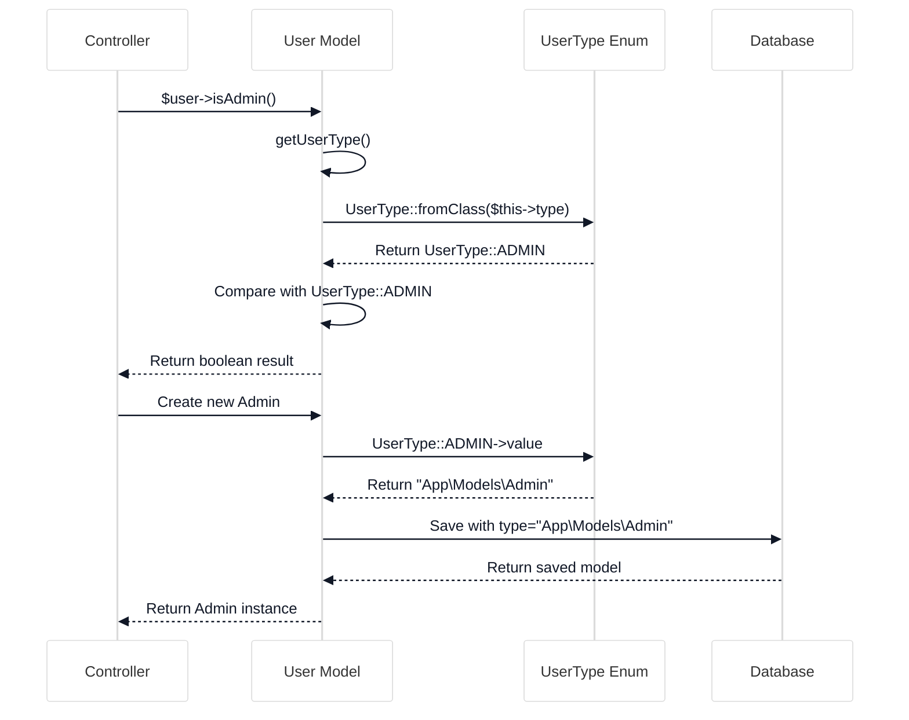

# Understanding the Enhanced UserType Enum

<link rel="stylesheet" href="../../assets/css/styles.css">
<link rel="stylesheet" href="../../assets/css/ume-docs-enhancements.css">
<script src="../../assets/js/ume-docs-enhancements.js"></script>

<ul class="breadcrumb-navigation">
    <li><a href="../../000-index.md">UME Tutorial</a></li>
    <li><a href="../000-index.md">Implementation</a></li>
    <li><a href="./000-index.md">Phase 1: Core Models</a></li>
    <li><a href="./020-user-type-enum.md">UserType Enum</a></li>
</ul>

<div class="section-metadata">
    <div class="time-estimate">
        <span class="icon">⏱️</span>
        <span class="label">Time Estimate:</span>
        <span class="value">45-60 minutes</span>
    </div>
    <div class="difficulty-level">
        <span class="icon">🔶🔶</span>
        <span class="label">Difficulty:</span>
        <span class="value">Intermediate</span>
        <span class="explanation">Requires understanding of PHP 8.1 enums and object-oriented concepts</span>
    </div>
    <div class="prerequisites">
        <span class="icon">📋</span>
        <span class="label">Prerequisites:</span>
        <ul>
            <li>Understanding of Single Table Inheritance</li>
            <li>Basic knowledge of PHP 8.1 enums</li>
            <li>Familiarity with Laravel models</li>
        </ul>
    </div>
    <div class="learning-outcomes">
        <span class="icon">🎯</span>
        <span class="label">You'll Learn:</span>
        <ul>
            <li>How to create an enhanced enum for type management</li>
            <li>How to implement utility methods in enums</li>
            <li>How to integrate enums with Laravel models</li>
            <li>How to use enums for type-safe programming</li>
        </ul>
    </div>
</div>

The UserType enum is a central component of our Single Table Inheritance (STI) implementation. It serves as both a type registry and a utility class that provides rich functionality for working with different user types in the application.

## Basic Structure

Our UserType enum uses PHP 8.1+ backed enums with string values that correspond to the fully qualified class names of our user models:

```mermaid
%%{init: {'theme': 'base', 'themeVariables': {'primaryColor': '#f3f4f6', 'lineColor': '#6b7280', 'textColor': '#111827', 'mainBkg': '#ffffff', 'secondaryColor': '#60a5fa', 'tertiaryColor': '#e5e7eb'}}}%%
classDiagram
    class UserType {
        <<enum>>
        +USER: string
        +ADMIN: string
        +MANAGER: string
        +PRACTITIONER: string
        +label(): string
        +icon(): string
        +color(): string
        +modelClass(): string
        +cases(): array
        +values(): array
        +fromModel(Model): UserType
    }

    class User {
        <<Model>>
    }

    class Admin {
        <<Model>>
    }

    class Manager {
        <<Model>>
    }

    class Practitioner {
        <<Model>>
    }

    UserType::USER -- User: references
    UserType::ADMIN -- Admin: references
    UserType::MANAGER -- Manager: references
    UserType::PRACTITIONER -- Practitioner: references

    classDef enumClass fill:#dbeafe,stroke:#60a5fa,stroke-width:2px,color:#1e40af
    classDef modelClass fill:#e0e7ff,stroke:#6366f1,stroke-width:2px,color:#3730a3

    class UserType enumClass
    class User,Admin,Manager,Practitioner modelClass
```

<div class="mermaid-caption">Figure 1: UserType enum structure and relationships to model classes</div>

```php
<?php

declare(strict_types=1);

namespace App\Enums;

use App\Models\Admin;
use App\Models\Manager;
use App\Models\Practitioner;
use App\Models\User;
use Illuminate\Contracts\Support\Arrayable;

/**
 * User Type Enum for Single Table Inheritance
 *
 * This enum maps to model classes, enabling STI with tightenco/parental
 */
enum UserType: string implements Arrayable
{
    /** Regular User Type */
    case USER = User::class;
    /** Administrator Type */
    case ADMIN = Admin::class;
    /** Manager Type */
    case MANAGER = Manager::class;
    /** Practitioner Type */
    case PRACTITIONER = Practitioner::class;

    // Methods will be defined below...
}
```

## Core Functionality

The UserType enum provides several categories of functionality:

1. **Type Information**: Methods for getting human-readable information about types
2. **Type Conversion**: Methods for converting between enum cases and class names
3. **Role & Permission Management**: Methods for defining default roles and permissions
4. **UI Integration**: Methods for generating UI elements like badges and labels
5. **Security**: Methods for comparing privilege levels between types

## Type Information Methods

```php
/**
 * Get the human-readable label for this user type
 */
public function label(): string
{
    return match($this) {
        self::USER => 'User',
        self::ADMIN => 'Administrator',
        self::MANAGER => 'Manager',
        self::PRACTITIONER => 'Practitioner',
    };
}

/**
 * Get the description for this user type
 */
public function description(): string
{
    return match($this) {
        self::USER => 'Standard user with basic access to the system',
        self::ADMIN => 'System administrator with full access to all features',
        self::MANAGER => 'Manager with permissions to oversee teams and users',
        self::PRACTITIONER => 'Professional with client management capabilities',
    };
}

/**
 * Get the color for this user type (for UI elements)
 */
public function color(): string
{
    return match($this) {
        self::USER => 'blue',
        self::ADMIN => 'red',
        self::MANAGER => 'amber',
        self::PRACTITIONER => 'emerald',
    };
}
```

## Type Conversion Methods

```php
/**
 * Get all available user types as an array
 * Implements Arrayable interface
 */
public function toArray(): array
{
    $types = [];

    foreach (self::cases() as $case) {
        $types[$case->value] = $case->label();
    }

    return $types;
}

/**
 * Get the enum case from a class name
 *
 * @param string|null $className Fully qualified class name
 * @return UserType|null The corresponding enum case or null if not found
 */
public static function fromClass(?string $className): ?self
{
    if (!$className) {
        return null;
    }

    foreach (self::cases() as $case) {
        if ($case->value === $className) {
            return $case;
        }
    }

    return null;
}

/**
 * Check if a class name is a valid user type
 *
 * @param string $className Class name to check
 * @return bool Whether the class name is a valid user type
 */
public static function isValid(string $className): bool
{
    return self::fromClass($className) !== null;
}
```

## Role & Permission Management

```php
/**
 * Get default roles associated with this user type.
 * For use with Spatie Permission package integration.
 *
 * @return array<string> Array of role names
 */
public function defaultRoles(): array
{
    return match($this) {
        self::USER => ['user'],
        self::ADMIN => ['admin', 'super-admin'],
        self::MANAGER => ['manager', 'team-lead'],
        self::PRACTITIONER => ['practitioner', 'professional'],
    };
}

/**
 * Get default permissions associated with this user type.
 *
 * @return array<string> Array of permission names
 */
public function defaultPermissions(): array
{
    return match($this) {
        self::USER => [
            'profile.view.own',
            'profile.edit.own',
            'comments.create',
            'comments.view',
        ],
        self::ADMIN => [
            'admin.access',
            'users.manage',
            'roles.manage',
            'permissions.manage',
            'settings.manage',
            'teams.manage',
            'logs.view',
            'system.manage',
        ],
        self::MANAGER => [
            'team.manage',
            'team.view',
            'team-members.invite',
            'team-members.remove',
            'team-settings.edit',
            'reports.view',
        ],
        self::PRACTITIONER => [
            'practice.access',
            'clients.view',
            'clients.manage',
            'schedule.view',
            'schedule.manage',
        ],
    };
}
```

## UI Integration

```php
/**
 * Create a badge HTML for this user type
 *
 * @return string HTML for the badge
 */
public function badge(): string
{
    $colorClass = match($this) {
        self::USER => 'bg-blue-100 text-blue-800 dark:bg-blue-900 dark:text-blue-300',
        self::ADMIN => 'bg-red-100 text-red-800 dark:bg-red-900 dark:text-red-300',
        self::MANAGER => 'bg-amber-100 text-amber-800 dark:bg-amber-900 dark:text-amber-300',
        self::PRACTITIONER => 'bg-emerald-100 text-emerald-800 dark:bg-emerald-900 dark:text-emerald-300',
    };

    return '<span class="px-2 py-1 text-xs font-medium rounded-full ' . $colorClass . '">' .
           $this->label() .
           '</span>';
}

/**
 * Create an icon HTML for this user type
 *
 * @return string HTML for the icon
 */
public function icon(): string
{
    $icon = match($this) {
        self::USER => 'user',
        self::ADMIN => 'shield-check',
        self::MANAGER => 'users',
        self::PRACTITIONER => 'briefcase-medical',
    };

    return "<i class=\"fa fa-{$icon}\"></i>";
}
```

## Security Methods

```php
/**
 * Check if this type has higher privileges than another type
 * Used for security checks when changing user types
 *
 * @param UserType $otherType The type to compare against
 * @return bool True if this type has higher privileges
 */
public function hasHigherPrivilegesThan(UserType $otherType): bool
{
    // Define privilege hierarchy (higher index = higher privileges)
    $privilegeRanking = [
        self::USER->value => 1,
        self::PRACTITIONER->value => 2,
        self::MANAGER->value => 3,
        self::ADMIN->value => 4,
    ];

    // Compare privilege rankings
    return ($privilegeRanking[$this->value] ?? 0) > ($privilegeRanking[$otherType->value] ?? 0);
}

/**
 * Check if this type can manage another type
 *
 * @param UserType $otherType The type to check if can be managed
 * @return bool True if this type can manage the other type
 */
public function canManage(UserType $otherType): bool
{
    // Admins can manage all types
    if ($this === self::ADMIN) {
        return true;
    }

    // Managers can manage regular users and practitioners
    if ($this === self::MANAGER) {
        return in_array($otherType, [self::USER, self::PRACTITIONER]);
    }

    // Other types can't manage any types
    return false;
}
```

## Integration with User Model

The UserType enum integrates with the User model through several helper methods:



<div class="mermaid-caption">Figure 2: Interaction between models and the UserType enum</div>

```php
// In User.php

/**
 * Check if the user instance is of a specific type using the Enum.
 *
 * @param UserType $type
 * @return bool
 */
public function isType(UserType $type): bool
{
    // Check against the actual class name stored in the 'type' column
    return $this->type === $type->value;
}

/**
 * Get the UserType Enum case for the current user instance.
 *
 * @return UserType|null
 */
public function getUserType(): ?UserType
{
    return UserType::fromClass($this->type);
}

/**
 * Get the user-friendly label for the user's type.
 *
 * @return string
 */
public function getTypeLabel(): string
{
    return $this->getUserType()?->label() ?? 'Unknown';
}
```

## Blade Directives

The UserType enum is also integrated with Blade through custom directives registered in the `UserTypeServiceProvider`:

```php
// In UserTypeServiceProvider.php

    /**
     * Register Blade directives for user type checks.
     */
    protected function registerBladeDirectives(): void
    {
        // Check if user is of a specific type
        Blade::directive('userType', function ($expression) {
            return "<?php if(auth()->check() && auth()->user() instanceof {$expression}): ?>";
        });

        Blade::directive('enduserType', function () {
            return "<?php endif; ?>";
        });

        // Check if user is an admin
        Blade::directive('utAdmin', function () {
            return "<?php if(auth()->check() && auth()->user() instanceof \\App\\Models\\Admin): ?>";
        });

        Blade::directive('endUtAdmin', function () {
            return "<?php endif; ?>";
        });

        // Check if user is a manager
        Blade::directive('utManager', function () {
            return "<?php if(auth()->check() && auth()->user() instanceof \\App\\Models\\Manager): ?>";
        });

        Blade::directive('endUtManager', function () {
            return "<?php endif; ?>";
        });

        // Check if user is a practitioner
        Blade::directive('utPractitioner', function () {
            return "<?php if(auth()->check() && auth()->user() instanceof \\App\\Models\\Practitioner): ?>";
        });

        Blade::directive('endUtPractitioner', function () {
            return "<?php endif; ?>";
        });
    }

```

## Usage Examples

### Getting User Type Information

```php
$user = User::find(1);
$userType = $user->getUserType();

if ($userType) {
    echo "User Type: " . $userType->label();
    echo "Description: " . $userType->description();
    echo "Badge: " . $userType->badge();
}
```

### Checking User Type

```php
$user = User::find(1);

if ($user->isType(UserType::ADMIN)) {
    // Perform admin-specific actions
}

// Or using the instance check
if ($user instanceof Admin) {
    // Perform admin-specific actions
}
```

### Using in Blade Templates

```php
@userType(\App\Models\Admin::class)
    <div class="admin-panel">
        <!-- Admin-only content -->
    </div>
@enduserType

// Or using the shorthand directive
@admin
    <div class="admin-panel">
        <!-- Admin-only content -->
    </div>
@endadmin
```

## Extending the UserType Enum

To add a new user type to your application:

1. Create a new model class that extends the base User model
2. Add a new case to the UserType enum
3. Update all the match expressions in the enum methods
4. Register any new roles and permissions

Example of adding a new "Subscriber" type:

```php
// 1. Create the model
namespace App\Models;

class Subscriber extends User
{
    // Subscriber-specific methods and properties
}

// 2. Add to the enum
enum UserType: string implements Arrayable
{
    // Existing cases...
    case SUBSCRIBER = Subscriber::class;

    // 3. Update match expressions
    public function label(): string
    {
        return match($this) {
            // Existing cases...
            self::SUBSCRIBER => 'Subscriber',
        };
    }

    // Update other methods similarly...
}
```

## Quick Reference

<div class="quick-reference">
    <h2>UserType Enum Quick Reference</h2>

    <div class="key-concepts">
        <dl>
            <dt>Backed Enum</dt>
            <dd>A PHP 8.1+ enum with associated values (string class names in our case)</dd>

            <dt>Type Registry</dt>
            <dd>The enum serves as a central registry of all user types in the system</dd>

            <dt>Type Utilities</dt>
            <dd>Methods that provide type-specific information and behavior</dd>
        </dl>
    </div>

    <div class="syntax">
        <h3>Common Usage Patterns</h3>
        <pre><code>// Type checking
if ($user->isType(UserType::ADMIN)) {
    // Admin-specific code
}

// Getting user-friendly information
$label = $user->getUserType()->label();
$icon = $user->getUserType()->icon();

// Creating a new user of specific type
$admin = User::create([
    'type' => UserType::ADMIN->value,
    // other fields
]);

// UI integration
echo $user->getUserType()->badge();</code></pre>
    </div>

    <div class="gotchas">
        <h3>Common Pitfalls</h3>
        <ul>
            <li>Forgetting to update match expressions when adding new types</li>
            <li>Using string values directly instead of enum cases</li>
            <li>Not handling unknown types in fromClass() method</li>
        </ul>
    </div>
</div>

## Troubleshooting

<div class="troubleshooting-guide">
    <h2>Type-Related Issues</h2>

    <div class="symptoms">
        <h3>Symptoms</h3>
        <ul>
            <li>User type is not being recognized correctly</li>
            <li>Type-specific methods are not working</li>
            <li>Match expressions throwing exceptions</li>
        </ul>
    </div>

    <div class="causes">
        <h3>Possible Causes</h3>
        <ol>
            <li>Type column in database doesn't match enum value</li>
            <li>Missing case in match expression</li>
            <li>Incorrect namespace in enum value</li>
        </ol>
    </div>

    <div class="solutions">
        <h3>Solutions</h3>

        <h4>For Database Type Issues</h4>
        <p>Check and correct the type column value:</p>
        <pre><code>// Verify the type column contains the fully qualified class name
$user = User::find(1);
echo $user->type; // Should be "App\Models\Admin" for admin users</code></pre>

        <h4>For Match Expression Issues</h4>
        <p>Ensure all enum cases are handled in match expressions:</p>
        <pre><code>public function label(): string
{
    return match($this) {
        self::USER => 'User',
        self::ADMIN => 'Administrator',
        self::MANAGER => 'Manager',
        self::PRACTITIONER => 'Practitioner',
        // Add any new types here
        default => 'Unknown Type', // Optional default case
    };
}</code></pre>
    </div>

    <div class="prevention">
        <h3>Prevention</h3>
        <ul>
            <li>Use constants for type values</li>
            <li>Create tests that verify all enum cases are handled</li>
            <li>Use the fromClass() method instead of direct enum access</li>
        </ul>
    </div>
</div>

## Conclusion

The UserType enum is a powerful tool for managing different user types in your application. By centralizing type-related logic in the enum, you can ensure consistent behavior across your application and easily extend it with new user types as needed.

<div class="page-navigation">
    <a href="010-understanding-sti.md" class="prev">Understanding STI</a>
    <a href="030-user-model.md" class="next">User Model</a>
</div>

## Exercise

Extend the UserType enum with the following features:

1. Add a new user type called "Guest" with limited permissions
2. Implement a `canAccessFeature(string $feature)` method that checks if a user type can access a specific feature
3. Create a `getUpgradePath()` method that returns the next logical user type for upgrades (e.g., User → Subscriber → Premium)
4. Add a `getBadgeWithCount(int $count)` method that displays a badge with a count (e.g., "Admin (5)")
