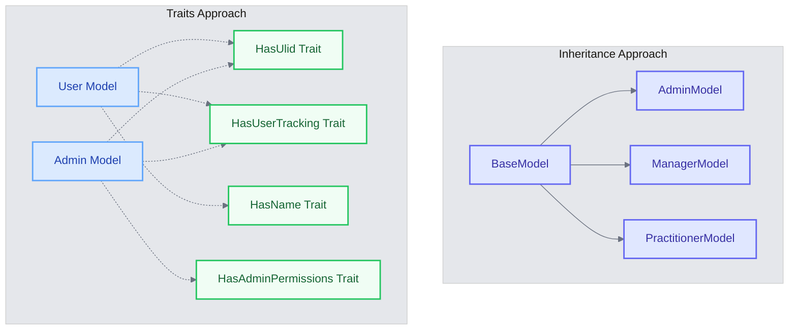
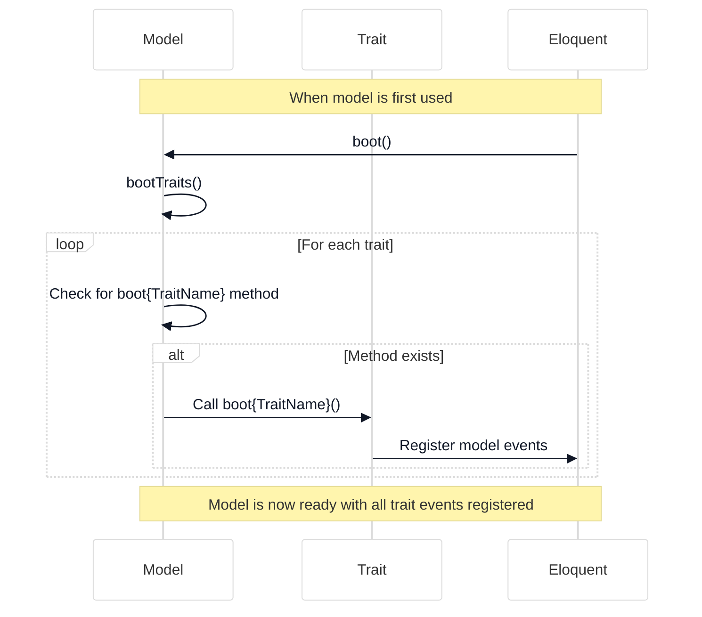

# Understanding Traits & Model Events

<link rel="stylesheet" href="../../assets/css/styles.css">
<link rel="stylesheet" href="../../assets/css/ume-docs-enhancements.css">
<script src="../../assets/js/ume-docs-enhancements.js"></script>

<ul class="breadcrumb-navigation">
    <li><a href="../../000-index.md">UME Tutorial</a></li>
    <li><a href="../000-index.md">Implementation</a></li>
    <li><a href="./000-index.md">Phase 1: Core Models</a></li>
    <li><a href="./030-traits-model-events.md">Traits & Model Events</a></li>
</ul>

<div class="section-metadata">
    <div class="time-estimate">
        <span class="icon">⏱️</span>
        <span class="label">Time Estimate:</span>
        <span class="value">20-30 minutes</span>
    </div>
    <div class="difficulty-level">
        <span class="icon">🔶🔶</span>
        <span class="label">Difficulty:</span>
        <span class="value">Intermediate</span>
        <span class="explanation">Requires understanding of PHP traits and Laravel Eloquent lifecycle</span>
    </div>
    <div class="prerequisites">
        <span class="icon">📋</span>
        <span class="label">Prerequisites:</span>
        <ul>
            <li>Basic Laravel Eloquent knowledge</li>
            <li>Understanding of PHP traits</li>
            <li>Familiarity with event-driven programming</li>
        </ul>
    </div>
    <div class="learning-outcomes">
        <span class="icon">🎯</span>
        <span class="label">You'll Learn:</span>
        <ul>
            <li>How to use PHP traits for code reuse in Laravel</li>
            <li>How to leverage Laravel model events</li>
            <li>How to combine traits and model events</li>
            <li>Best practices for implementing reusable functionality</li>
        </ul>
    </div>
</div>

## Goal

Understand Laravel's Traits and Model Events, which are essential for implementing reusable functionality across models and automating actions during a model's lifecycle.

## What are Traits?

Traits are PHP's mechanism for code reuse in single inheritance languages. They allow you to reuse methods across multiple classes without requiring inheritance.

### Key Benefits of Traits

1. **Code Reusability**: Share methods across multiple classes
2. **Composition over Inheritance**: Avoid deep inheritance hierarchies
3. **Focused Functionality**: Each trait can focus on a specific concern
4. **Flexibility**: Mix and match traits as needed

### Trait Syntax

```php
trait HasUlid
{
    // Methods and properties defined here
    public function generateUlid()
    {
        return (string) Str::ulid();
    }
}

// Using the trait in a class
class User extends Model
{
    use HasUlid;

    // Now User has access to generateUlid()
}
```

### Traits vs. Inheritance



<div class="mermaid-caption">Figure 1: Comparison of inheritance vs. traits approaches</div>

- **Inheritance**: "is-a" relationship, single parent
- **Traits**: "has-a" functionality, multiple traits possible

### Traits vs. Interfaces

- **Interfaces**: Define what a class must implement (contract)
- **Traits**: Provide actual implementation

## Laravel Model Events

Model events are hooks into the Eloquent ORM lifecycle that allow you to execute code at specific points during a model's lifecycle.

### Key Model Events

1. **Creating/Created**: Before/after a model is saved for the first time
2. **Updating/Updated**: Before/after an existing model is saved
3. **Saving/Saved**: Before/after a model is saved (either created or updated)
4. **Deleting/Deleted**: Before/after a model is deleted
5. **Restoring/Restored**: Before/after a soft-deleted model is restored

### Using Model Events

There are two main ways to use model events:

#### 1. Event Hooks in the Model

```php
class User extends Model
{
    protected static function booted()
    {
        static::creating(function ($user) {
            $user->uuid = (string) Str::uuid();
        });

        static::updating(function ($user) {
            $user->updated_by = Auth::id();
        });
    }
}
```

#### 2. Observers

```php
// UserObserver.php
class UserObserver
{
    public function creating(User $user)
    {
        $user->uuid = (string) Str::uuid();
    }

    public function updating(User $user)
    {
        $user->updated_by = Auth::id();
    }
}

// Register in a service provider
public function boot()
{
    User::observe(UserObserver::class);
}
```

## Combining Traits and Model Events

One powerful pattern is to encapsulate model events within traits:

```php
trait HasUserTracking
{
    protected static function bootHasUserTracking()
    {
        static::creating(function ($model) {
            $model->created_by = Auth::id() ?? null;
        });

        static::updating(function ($model) {
            $model->updated_by = Auth::id() ?? null;
        });
    }
}
```

### The "boot" Method Pattern

Laravel automatically calls any method named `boot{TraitName}` when the trait is used in a model. This allows traits to register their own model events.



<div class="mermaid-caption">Figure 3: How Laravel boots traits and registers their events</div>

## Best Practices for Traits

1. **Single Responsibility**: Each trait should focus on one aspect of functionality
2. **Descriptive Names**: Use clear names like `HasUlid` or `HasUserTracking`
3. **Documentation**: Document what the trait does and its requirements
4. **Avoid Conflicts**: Be careful with method names to avoid conflicts
5. **Minimal Dependencies**: Keep traits as self-contained as possible

## Best Practices for Model Events

1. **Keep It Simple**: Don't put complex logic in event callbacks
2. **Avoid Side Effects**: Be careful about triggering other events
3. **Consider Performance**: Events run on every operation
4. **Use Transactions**: For operations that need to be atomic
5. **Test Thoroughly**: Events can have subtle effects

## Diagram: Model Lifecycle with Events

```mermaid
%%{init: {'theme': 'base', 'themeVariables': {'primaryColor': '#f3f4f6', 'lineColor': '#6b7280', 'textColor': '#111827', 'mainBkg': '#ffffff', 'secondaryColor': '#60a5fa', 'tertiaryColor': '#e5e7eb'}}}%%
flowchart TD
    A([Start]) --> B[Model Instance]
    B --> C{Is New?}
    C -->|Yes| D["creating event"]
    C -->|No| E["updating event"]
    D --> F["saving event"]
    E --> F
    F --> G[Database Operation]
    G --> H{Is New?}
    H -->|Yes| I["created event"]
    H -->|No| J["updated event"]
    I --> K["saved event"]
    J --> K
    K --> L([End])

    classDef start fill:#d1fae5,stroke:#10b981,stroke-width:2px,color:#065f46
    classDef end fill:#d1fae5,stroke:#10b981,stroke-width:2px,color:#065f46
    classDef event fill:#dbeafe,stroke:#60a5fa,stroke-width:2px,color:#1e40af
    classDef decision fill:#fef3c7,stroke:#f59e0b,stroke-width:2px,color:#92400e
    classDef operation fill:#e0e7ff,stroke:#6366f1,stroke-width:2px,color:#3730a3

    class A,L start
    class D,E,F,I,J,K event
    class C,H decision
    class B,G operation
```

<div class="mermaid-caption">Figure 2: Eloquent model lifecycle with events</div>

## Traits We'll Implement

In our project, we'll implement several traits:

1. **HasUlid**: For generating and using ULIDs (Universally Unique Lexicographically Sortable Identifiers)
2. **HasUserTracking**: For tracking who created and updated models
3. **HasName**: For handling name components (given_name, family_name, other_names)
4. **HasAdditionalFeatures**: For handling metadata and other extended features

## Quick Reference

<div class="quick-reference">
    <h2>Traits & Model Events Quick Reference</h2>

    <div class="key-concepts">
        <dl>
            <dt>Traits</dt>
            <dd>PHP's mechanism for code reuse that allows sharing methods across multiple classes</dd>

            <dt>Model Events</dt>
            <dd>Hooks into the Eloquent ORM lifecycle that allow executing code at specific points</dd>

            <dt>Boot Method Pattern</dt>
            <dd>Laravel's convention for initializing traits using boot{TraitName} methods</dd>
        </dl>
    </div>

    <div class="syntax">
        <h3>Common Usage Patterns</h3>
        <pre><code>// Defining a trait with model events
trait HasUserTracking
{
    protected static function bootHasUserTracking()
    {
        static::creating(function ($model) {
            $model->created_by = Auth::id() ?? null;
        });

        static::updating(function ($model) {
            $model->updated_by = Auth::id() ?? null;
        });
    }
}

// Using the trait in a model
class User extends Model
{
    use HasUserTracking;
}</code></pre>
    </div>

    <div class="gotchas">
        <h3>Common Pitfalls</h3>
        <ul>
            <li>Forgetting to name the boot method correctly (must be boot{TraitName})</li>
            <li>Creating traits with overlapping method names</li>
            <li>Putting too much logic in event callbacks</li>
            <li>Not considering performance implications of model events</li>
        </ul>
    </div>
</div>

## Troubleshooting

<div class="troubleshooting-guide">
    <h2>Model Events Not Firing</h2>

    <div class="symptoms">
        <h3>Symptoms</h3>
        <ul>
            <li>Model events defined in traits are not being triggered</li>
            <li>Expected automatic behaviors are not happening</li>
            <li>No errors are shown, but functionality is missing</li>
        </ul>
    </div>

    <div class="causes">
        <h3>Possible Causes</h3>
        <ol>
            <li>Incorrect boot method name in the trait</li>
            <li>Using mass assignment methods that skip events</li>
            <li>Events being overridden by other traits or the model</li>
        </ol>
    </div>

    <div class="solutions">
        <h3>Solutions</h3>

        <h4>For Boot Method Issues</h4>
        <p>Ensure the boot method is named correctly:</p>
        <pre><code>// For a trait named HasUserTracking
protected static function bootHasUserTracking()
{
    // Event registrations here
}</code></pre>

        <h4>For Mass Assignment Issues</h4>
        <p>Be aware that some methods skip events:</p>
        <pre><code>// These methods DO NOT fire events
Model::insert(['field' => 'value']);
DB::table('users')->update(['field' => 'value']);

// These methods DO fire events
$model->field = 'value';
$model->save();

Model::create(['field' => 'value']);
Model::find(1)->update(['field' => 'value']);</code></pre>
    </div>

    <div class="prevention">
        <h3>Prevention</h3>
        <ul>
            <li>Follow naming conventions strictly</li>
            <li>Use model methods that trigger events</li>
            <li>Write tests that verify event behavior</li>
        </ul>
    </div>
</div>

## Next Steps

<div class="page-navigation">
    <a href="020-user-type-enum.md" class="prev">UserType Enum</a>
    <a href="040-has-ulid-trait.md" class="next">HasUlid Trait</a>
</div>

Now that you understand traits and model events, let's implement our first trait: [Create HasUlid Trait](./040-has-ulid-trait.md).
