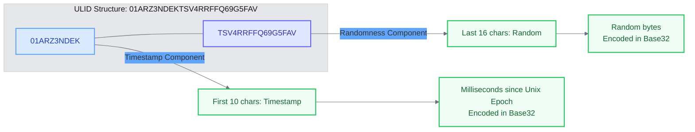
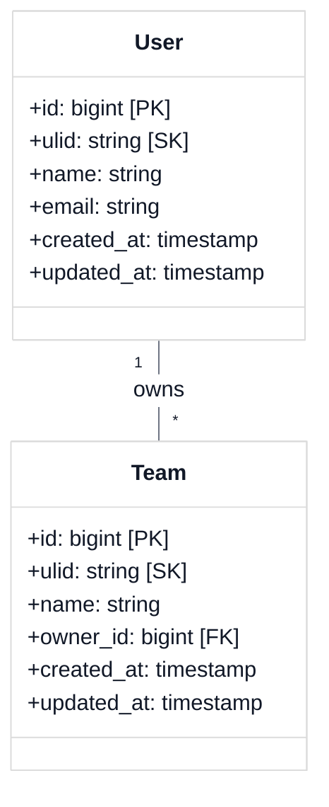
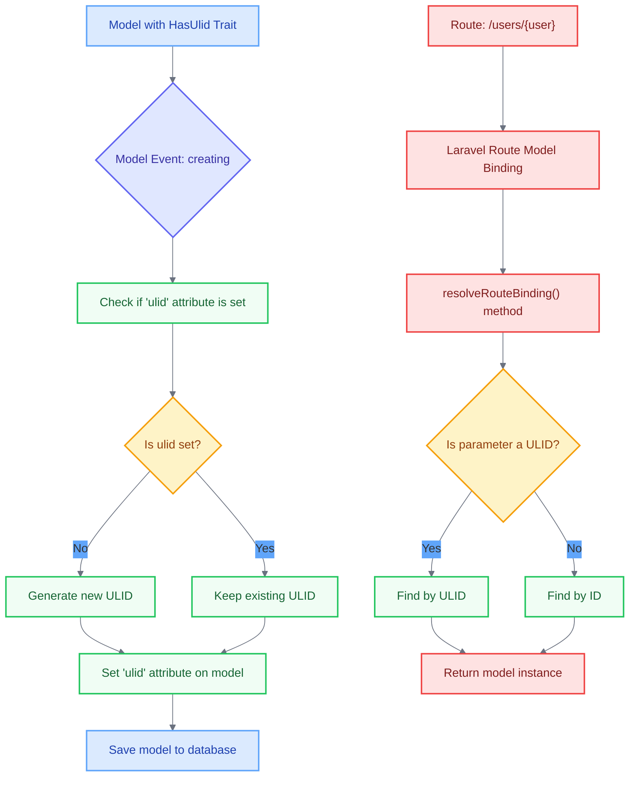

# Create HasUlid Trait

<link rel="stylesheet" href="../../assets/css/styles.css">
<link rel="stylesheet" href="../../assets/css/ume-docs-enhancements.css">
<script src="../../assets/js/ume-docs-enhancements.js"></script>

<ul class="breadcrumb-navigation">
    <li><a href="../../000-index.md">UME Tutorial</a></li>
    <li><a href="../000-index.md">Implementation</a></li>
    <li><a href="./000-index.md">Phase 1: Core Models</a></li>
    <li><a href="./040-has-ulid-trait.md">HasUlid Trait</a></li>
</ul>

<div class="section-metadata">
    <div class="time-estimate">
        <span class="icon">⏱️</span>
        <span class="label">Time Estimate:</span>
        <span class="value">30-45 minutes</span>
    </div>
    <div class="difficulty-level">
        <span class="icon">🔶🔶</span>
        <span class="label">Difficulty:</span>
        <span class="value">Intermediate</span>
        <span class="explanation">Requires understanding of PHP traits, Laravel model events, and ULIDs</span>
    </div>
    <div class="prerequisites">
        <span class="icon">📋</span>
        <span class="label">Prerequisites:</span>
        <ul>
            <li>Understanding of Traits & Model Events</li>
            <li>Basic Laravel Eloquent knowledge</li>
            <li>Familiarity with UUIDs/ULIDs concepts</li>
        </ul>
    </div>
    <div class="learning-outcomes">
        <span class="icon">🎯</span>
        <span class="label">You'll Learn:</span>
        <ul>
            <li>How to implement a reusable trait for Eloquent models</li>
            <li>How to use model events to generate ULIDs</li>
            <li>How to override Laravel's route model binding</li>
            <li>How to use PHP 8 attributes with traits</li>
        </ul>
    </div>
</div>

## Goal

Implement a reusable trait that adds ULID (Universally Unique Lexicographically Sortable Identifier) functionality to Eloquent models, using ULIDs as secondary keys alongside standard auto-incrementing primary keys.

## What are ULIDs?

ULIDs are an alternative to UUIDs that offer several advantages:

1. **Sortable**: ULIDs are lexicographically sortable (they sort naturally in alphabetical order)
2. **Time-encoded**: The first part of a ULID encodes the creation time
3. **URL-safe**: Uses Crockford's base32 encoding (no special characters)
4. **Compact**: 26 characters vs 36 for UUID
5. **Unique**: Extremely low collision probability

Example ULID: `01ARZ3NDEKTSV4RRFFQ69G5FAV`



<div class="mermaid-caption">Figure 1: ULID structure showing timestamp and randomness components</div>

## ULIDs as Secondary Keys

In our implementation, we use ULIDs as secondary keys rather than primary keys. This approach provides several benefits:

1. **Performance**: Integer primary keys offer optimal performance for joins and indexing
2. **External Reference**: ULIDs provide globally unique identifiers for public-facing APIs and URLs
3. **Security**: Using ULIDs in URLs prevents exposing sequential IDs and database structure
4. **Compatibility**: Maintaining integer primary keys ensures compatibility with existing Laravel features



<div class="mermaid-caption">Figure 2: Database schema showing ULIDs as secondary keys</div>

### Why Not Use Laravel 12's Built-in UUID Support?

Laravel 12 provides built-in UUID support through the `HasUuids` trait. However, we're choosing to use ULIDs for several reasons:

1. **Time-ordered**: ULIDs include a timestamp component, making them naturally sortable
2. **Performance**: ULIDs provide better database indexing performance than random UUIDs
3. **Compact**: ULIDs use 26 characters vs. 36 for UUIDs, making them more space-efficient
4. **Control**: Our custom implementation gives us more control over how ULIDs are used

## Why Use ULIDs?

- **Performance**: Better database indexing performance than random UUIDs
- **Readability**: More compact than UUIDs
- **Time-sorting**: Natural chronological sorting
- **Security**: Obscures sequential IDs from users

## Implementing the HasUlid Trait

Let's create a trait that will:

1. Automatically generate a ULID when creating a model
2. Allow finding models by their ULID
3. Support route model binding with ULIDs



<div class="mermaid-caption">Figure 2: How the HasUlid trait works with model events and route model binding</div>

### Step 1: Create the Trait File

Create a new file at `app/Traits/HasUlid.php`:

```php
<?php

declare(strict_types=1);

namespace App\Models\Traits;

use Symfony\Component\Uid\Ulid;
use Illuminate\Database\Eloquent\Model;

trait HasUlid
{
    /**
     * Boot the trait for a model.
     *
     * Automatically generates a ULID for the 'ulid' attribute
     * when a new model instance is being created.
     * Also configures route model binding to use the 'ulid' column.
     */
    protected static function bootHasUlid(): void
    {
        static::creating(function (Model $model) {
            if (empty($model->ulid) && $model->getConnection()->getSchemaBuilder()->hasColumn($model->getTable(), 'ulid')) {
                 // Only generate if 'ulid' column exists and is empty
                $model->ulid = (string) new Ulid();
            }
        });
    }

    /**
     * Get the route key for the model.
     *
     * Instructs Laravel to use the 'ulid' column for route model binding
     * instead of the default primary key ('id').
     *
     * @return string The name of the route key column.
     */
    public function getRouteKeyName(): string
    {
        return 'ulid'; // Use 'ulid' for route model binding
    }

    /**
     * Find a model by its ULID.
     *
     * @param  string  $ulid
     * @param  array  $columns
     * @return \Illuminate\Database\Eloquent\Model|\Illuminate\Database\Eloquent\Collection|static[]|static|null
     */
    public static function findByUlid($ulid, $columns = ['*'])
    {
        return static::where('ulid', $ulid)->first($columns);
    }

    /**
     * Find a model by its ULID or fail.
     *
     * @param  string  $ulid
     * @param  array  $columns
     * @return \Illuminate\Database\Eloquent\Model|\Illuminate\Database\Eloquent\Collection|static[]|static
     *
     * @throws \Illuminate\Database\Eloquent\ModelNotFoundException
     */
    public static function findByUlidOrFail($ulid, $columns = ['*'])
    {
        return static::where('ulid', $ulid)->firstOrFail($columns);
    }
}

```

### Step 2: Add ULID Column to Migrations

When using this trait, you'll need to add a `ulid` column to your model's table as a secondary key:

```php
// In your migration file
Schema::create('users', function (Blueprint $table) {
    $table->id(); // Primary key
    $table->string('ulid', 26)->unique()->index(); // Secondary key
    $table->string('name');
    $table->string('email')->unique();
    $table->timestamp('email_verified_at')->nullable();
    $table->string('password');
    $table->rememberToken();
    $table->timestamps();
});
```

The key points in this migration are:

1. We keep the auto-incrementing `id` as the primary key
2. We add a `ulid` column as a unique, indexed secondary key
3. The `ulid` column is a string with a length of 26 characters (the exact length of a ULID)

### Step 3: Update Model Fillable Properties

Make sure to add `ulid` to your model's `$fillable` array:

```php
protected $fillable = [
    // ... other fields
    'ulid',
];
```

## Using the HasUlid Trait

Here's how to use the trait in a model:

```php
<?php

namespace App\Models;

use App\Traits\HasUlid;
use Illuminate\Database\Eloquent\Model;

class User extends Model
{
    use HasUlid;

    protected $fillable = [
        'name',
        'email',
        'password',
        'ulid',
    ];
}
```

## Testing the HasUlid Trait

Let's create a test to ensure our trait works correctly:

```php
<?php

declare(strict_types=1);

namespace Tests\Unit\Traits;

use App\Models\User;use Illuminate\Foundation\Testing\RefreshDatabase;use old\TestCase;use PHPUnit\Framework\Attributes\Test;

class HasUlidTraitTest extends TestCase
{
    use RefreshDatabase;

    #[Test]
    public function it_generates_ulid_when_creating_model()
    {
        $user = User::factory()->create();

        $this->assertNotNull($user->ulid);
        $this->assertEquals(26, strlen($user->ulid));
    }

    #[Test]
    public function it_can_find_model_by_ulid()
    {
        $user = User::factory()->create();

        $foundUser = User::findByUlid($user->ulid);

        $this->assertNotNull($foundUser);
        $this->assertEquals($user->id, $foundUser->id);
    }

    #[Test]
    public function it_uses_ulid_for_route_key_name()
    {
        $user = new User();

        $this->assertEquals('ulid', $user->getRouteKeyName());
    }
}

```

## Benefits in Our Application

Using ULIDs in our application provides several benefits:

1. **Security**: We don't expose sequential IDs in URLs
2. **Performance**: Better indexing for large tables
3. **Sortability**: ULIDs sort chronologically
4. **Distributed Systems**: Can generate IDs without coordination

## Using ULIDs in Routes and APIs

One of the main benefits of using ULIDs as secondary keys is for public-facing routes and APIs. Here's how to leverage ULIDs in these contexts:

### Route Model Binding with ULIDs

```php
// In your routes/web.php file
Route::get('/users/{user:ulid}', [UserController::class, 'show']);
```

This tells Laravel to use the `ulid` column for route model binding instead of the default `id` column.

### Using ULIDs in API Responses

```php
// In your API resource or transformer
public function toArray($request)
{
    return [
        'id' => $this->ulid, // Use ULID as the public-facing ID
        'name' => $this->name,
        'email' => $this->email,
        // Other attributes...
    ];
}
```

By using the ULID as the public-facing ID in your API responses, you avoid exposing your internal database IDs to clients.

### URL Generation with ULIDs

```php
// In your controller or view
$url = route('users.show', $user); // Uses ULID automatically if getRouteKeyName() returns 'ulid'
```

This generates a URL like `/users/01ARZ3NDEKTSV4RRFFQ69G5FAV` instead of `/users/1`.

## Quick Reference

<div class="quick-reference">
    <h2>HasUlid Trait Quick Reference</h2>

    <div class="key-concepts">
        <dl>
            <dt>ULID</dt>
            <dd>Universally Unique Lexicographically Sortable Identifier - a 26-character identifier that combines timestamp and randomness</dd>

            <dt>Model Events</dt>
            <dd>The trait uses the 'creating' event to automatically generate ULIDs</dd>

            <dt>Route Model Binding</dt>
            <dd>Custom implementation to allow finding models by either ID or ULID</dd>
        </dl>
    </div>

    <div class="syntax">
        <h3>Common Usage Patterns</h3>
        <pre><code>// Adding the trait to a model
class User extends Model
{
    use HasUlid;

    // Make sure ulid is fillable
    protected $fillable = ['ulid', 'name', 'email'];
}

// Creating a model (ULID generated automatically)
$user = User::create([
    'name' => 'John Doe',
    'email' => 'john@example.com'
]);

// Finding by ULID
$user = User::findByUlid('01ARZ3NDEKTSV4RRFFQ69G5FAV');

// Route definition (works with ULIDs)
Route::get('/users/{user}', [UserController::class, 'show']);</code></pre>
    </div>

    <div class="gotchas">
        <h3>Common Pitfalls</h3>
        <ul>
            <li>Forgetting to add 'ulid' to the model's $fillable array</li>
            <li>Not adding the database migration for the ulid column</li>
            <li>Using mass updates that bypass model events</li>
            <li>Not handling ULIDs properly in frontend code</li>
        </ul>
    </div>
</div>

## Troubleshooting

<div class="troubleshooting-guide">
    <h2>ULIDs Not Being Generated</h2>

    <div class="symptoms">
        <h3>Symptoms</h3>
        <ul>
            <li>New models have null or empty ulid values</li>
            <li>Route model binding fails with ULIDs</li>
            <li>findByUlid method returns null for valid models</li>
        </ul>
    </div>

    <div class="causes">
        <h3>Possible Causes</h3>
        <ol>
            <li>Missing database column for ulid</li>
            <li>Using methods that bypass Eloquent events</li>
            <li>Trait not properly included in the model</li>
        </ol>
    </div>

    <div class="solutions">
        <h3>Solutions</h3>

        <h4>For Missing Database Column</h4>
        <p>Verify your migration includes the ulid column:</p>
        <pre><code>// In your migration file
$table->string('ulid', 26)->unique();</code></pre>

        <h4>For Event Bypassing</h4>
        <p>Avoid methods that bypass Eloquent events:</p>
        <pre><code>// These methods DO NOT trigger events
Model::insert(['name' => 'John']);
DB::table('users')->insert(['name' => 'John']);

// These methods DO trigger events
$model = new Model();
$model->name = 'John';
$model->save();

Model::create(['name' => 'John']);</code></pre>

        <h4>For Trait Issues</h4>
        <p>Ensure the trait is properly included:</p>
        <pre><code>// At the top of your model class
use App\Traits\HasUlid;

class User extends Model
{
    use HasUlid;
    // ...
}</code></pre>
    </div>

    <div class="prevention">
        <h3>Prevention</h3>
        <ul>
            <li>Create a test that verifies ULID generation</li>
            <li>Use model factories that properly implement the trait</li>
            <li>Add database constraints to ensure ULID is never null</li>
        </ul>
    </div>
</div>

## Next Steps

<div class="page-navigation">
    <a href="030-traits-model-events.md" class="prev">Traits & Model Events</a>
    <a href="050-has-user-tracking-trait.md" class="next">HasUserTracking Trait</a>
</div>

Now that we've implemented the HasUlid trait, let's move on to creating the [HasUserTracking Trait](./050-has-user-tracking-trait.md) to track who creates and updates our models.
