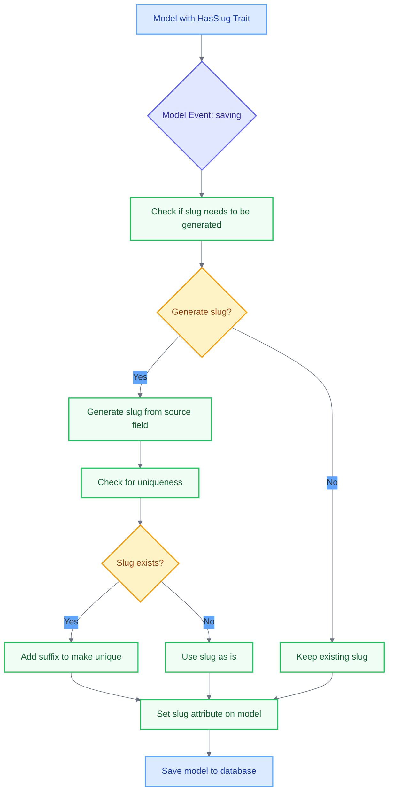

# Create HasSlug Trait

<link rel="stylesheet" href="../../assets/css/styles.css">
<link rel="stylesheet" href="../../assets/css/ume-docs-enhancements.css">
<script src="../../assets/js/ume-docs-enhancements.js"></script>

<ul class="breadcrumb-navigation">
    <li><a href="../../000-index.md">UME Tutorial</a></li>
    <li><a href="../000-index.md">Implementation</a></li>
    <li><a href="./000-index.md">Phase 1: Core Models</a></li>
    <li><a href="./045-has-slug-trait.md">HasSlug Trait</a></li>
</ul>

<div class="section-metadata">
    <div class="time-estimate">
        <span class="icon">⏱️</span>
        <span class="label">Time Estimate:</span>
        <span class="value">30-45 minutes</span>
    </div>
    <div class="difficulty-level">
        <span class="icon">🔶🔶</span>
        <span class="label">Difficulty:</span>
        <span class="value">Intermediate</span>
        <span class="explanation">Requires understanding of PHP traits, Laravel model events, and URL slugs</span>
    </div>
    <div class="prerequisites">
        <span class="icon">📋</span>
        <span class="label">Prerequisites:</span>
        <ul>
            <li>Understanding of Traits & Model Events</li>
            <li>Basic Laravel Eloquent knowledge</li>
            <li>Familiarity with URL slugs and SEO concepts</li>
        </ul>
    </div>
    <div class="learning-outcomes">
        <span class="icon">🎯</span>
        <span class="label">You'll Learn:</span>
        <ul>
            <li>How to implement a reusable trait for generating slugs</li>
            <li>How to use model events to automatically generate slugs</li>
            <li>How to customize slug generation</li>
            <li>How to use PHP 8 attributes with traits</li>
        </ul>
    </div>
</div>

## Goal

Implement a reusable trait that adds slug functionality to Eloquent models, allowing for automatic generation of URL-friendly slugs from model attributes.

## What are Slugs?

Slugs are URL-friendly versions of strings, typically used in web applications to create readable and SEO-friendly URLs. They are:

1. **Human-readable**: Descriptive and easy to understand
2. **URL-safe**: Contain only lowercase letters, numbers, and hyphens
3. **SEO-friendly**: Improve search engine optimization
4. **Memorable**: Easier to remember than numeric IDs

Example: A blog post titled "10 Tips for Laravel Development" might have a slug like `10-tips-for-laravel-development`.

```mermaid
%%{init: {'theme': 'base', 'themeVariables': {'primaryColor': '#f3f4f6', 'lineColor': '#6b7280', 'textColor': '#111827', 'mainBkg': '#ffffff', 'secondaryColor': '#60a5fa', 'tertiaryColor': '#e5e7eb'}}}%%
graph LR
    A["Original String: 10 Tips for Laravel Development"] --> B["Lowercase: 10 tips for laravel development"]
    B --> C["Replace Spaces: 10-tips-for-laravel-development"]
    C --> D["Remove Special Characters: 10-tips-for-laravel-development"]
    D --> E["Final Slug: 10-tips-for-laravel-development"]

    classDef original fill:#dbeafe,stroke:#60a5fa,stroke-width:2px,color:#1e40af
    classDef process fill:#e0e7ff,stroke:#6366f1,stroke-width:2px,color:#3730a3
    classDef final fill:#f0fdf4,stroke:#22c55e,stroke-width:2px,color:#166534

    class A original
    class B,C,D process
    class E final
```



<div class="mermaid-caption">Figure 1: Slug generation process</div>

## Why Use Slugs?

- **Improved SEO**: Search engines prefer descriptive URLs
- **Better User Experience**: Users can understand the URL content before clicking
- **Readability**: Easier to read and share than numeric IDs
- **Memorability**: Easier to remember than random strings or numbers

## Implementing the HasSlug Trait with spatie/laravel-sluggable

We'll use the `spatie/laravel-sluggable` package to implement our `HasSlug` trait. This package provides a robust solution for generating slugs in Laravel applications.



<div class="mermaid-caption">Figure 2: How the HasSlug trait works with model events</div>

### Step 1: Install the spatie/laravel-sluggable Package

First, make sure you have installed the `spatie/laravel-sluggable` package:

```bash
composer require spatie/100-laravel-sluggable
```

### Step 2: Create the HasSlug Trait

Create a new file at `app/Models/Traits/HasSlug.php`:

```php
<?php

declare(strict_types=1);

namespace App\Models\Traits;

use Spatie\Sluggable\HasSlug as SpatieHasSlug;
use Spatie\Sluggable\SlugOptions;

trait HasSlug
{
    use SpatieHasSlug;

    /**
     * Get the options for generating the slug.
     */
    public function getSlugOptions(): SlugOptions
    {
        return SlugOptions::create()
            ->generateSlugsFrom($this->getSlugSourceField())
            ->saveSlugsTo($this->getSlugField());
    }

    /**
     * Get the source field for generating the slug.
     */
    protected function getSlugSourceField(): string
    {
        return property_exists($this, 'slugSource') ? $this->slugSource : 'name';
    }

    /**
     * Get the field to save the slug to.
     */
    protected function getSlugField(): string
    {
        return property_exists($this, 'slugField') ? $this->slugField : 'slug';
    }

    /**
     * Find a model by its slug.
     *
     * @param  string  $slug
     * @param  array  $columns
     * @return \Illuminate\Database\Eloquent\Model|\Illuminate\Database\Eloquent\Collection|static[]|static|null
     */
    public static function findBySlug($slug, $columns = ['*'])
    {
        $instance = new static;
        $slugField = $instance->getSlugField();
        
        return static::where($slugField, $slug)->first($columns);
    }

    /**
     * Find a model by its slug or fail.
     *
     * @param  string  $slug
     * @param  array  $columns
     * @return \Illuminate\Database\Eloquent\Model|\Illuminate\Database\Eloquent\Collection|static[]|static
     *
     * @throws \Illuminate\Database\Eloquent\ModelNotFoundException
     */
    public static function findBySlugOrFail($slug, $columns = ['*'])
    {
        $instance = new static;
        $slugField = $instance->getSlugField();
        
        return static::where($slugField, $slug)->firstOrFail($columns);
    }

    /**
     * Get the route key for the model.
     *
     * @return string
     */
    public function getRouteKeyName(): string
    {
        return $this->getSlugField();
    }
}
```

### Step 3: Add Slug Column to Migrations

When using this trait, you'll need to add a `slug` column to your model's table:

```php
$table->string('slug')->unique();
```

### Step 4: Update Model Fillable Properties

Make sure to add `slug` to your model's `$fillable` array:

```php
protected $fillable = [
    // ... other fields
    'slug',
];
```

## Using the HasSlug Trait

Here's how to use the trait in a model:

```php
<?php

namespace App\Models;

use App\Models\Traits\HasSlug;
use Illuminate\Database\Eloquent\Model;

class Post extends Model
{
    use HasSlug;

    protected $fillable = [
        'title',
        'content',
        'slug',
    ];
    
    // Customize the source field (optional)
    protected $slugSource = 'title';
}
```

## Advanced Customization

The `spatie/laravel-sluggable` package offers many customization options. Here are some examples:

### Generating Slugs from Multiple Fields

```php
public function getSlugOptions(): SlugOptions
{
    return SlugOptions::create()
        ->generateSlugsFrom(['title', 'subtitle'])
        ->saveSlugsTo('slug');
}
```

### Setting Maximum Length

```php
public function getSlugOptions(): SlugOptions
{
    return SlugOptions::create()
        ->generateSlugsFrom('title')
        ->saveSlugsTo('slug')
        ->slugsShouldBeNoLongerThan(50);
}
```

### Preventing Slug Updates

```php
public function getSlugOptions(): SlugOptions
{
    return SlugOptions::create()
        ->generateSlugsFrom('title')
        ->saveSlugsTo('slug')
        ->doNotGenerateSlugsOnUpdate();
}
```

### Custom Slug Generation

```php
public function getSlugOptions(): SlugOptions
{
    return SlugOptions::create()
        ->generateSlugsFrom(function(Post $post) {
            return $post->title . ' ' . $post->subtitle;
        })
        ->saveSlugsTo('slug');
}
```

## Testing the HasSlug Trait

Let's create a test to ensure our trait works correctly:

```php
<?php

declare(strict_types=1);

namespace Tests\Unit\Traits;

use App\Models\Post;use Illuminate\Foundation\Testing\RefreshDatabase;use old\TestCase;use PHPUnit\Framework\Attributes\Test;

class HasSlugTraitTest extends TestCase
{
    use RefreshDatabase;

    #[Test]
    public function it_generates_slug_when_creating_model()
    {
        $post = Post::create([
            'title' => 'My First Post',
            'content' => 'This is the content of my first post.',
        ]);

        $this->assertNotNull($post->slug);
        $this->assertEquals('my-first-post', $post->slug);
    }

    #[Test]
    public function it_ensures_slug_uniqueness()
    {
        $post1 = Post::create([
            'title' => 'My First Post',
            'content' => 'This is the content of my first post.',
        ]);

        $post2 = Post::create([
            'title' => 'My First Post',
            'content' => 'This is another post with the same title.',
        ]);

        $this->assertNotEquals($post1->slug, $post2->slug);
        $this->assertStringStartsWith('my-first-post-', $post2->slug);
    }

    #[Test]
    public function it_can_find_model_by_slug()
    {
        $post = Post::create([
            'title' => 'My First Post',
            'content' => 'This is the content of my first post.',
        ]);

        $foundPost = Post::findBySlug($post->slug);

        $this->assertNotNull($foundPost);
        $this->assertEquals($post->id, $foundPost->id);
    }

    #[Test]
    public function it_uses_slug_for_route_key_name()
    {
        $post = new Post();

        $this->assertEquals('slug', $post->getRouteKeyName());
    }
}
```

## Benefits in Our Application

Using slugs in our application provides several benefits:

1. **SEO**: Improved search engine optimization with descriptive URLs
2. **User Experience**: More readable and user-friendly URLs
3. **Memorability**: Easier to remember than numeric IDs
4. **Security**: Obscures the database structure from users

## Quick Reference

<div class="quick-reference">
    <h2>HasSlug Trait Quick Reference</h2>

    <div class="key-concepts">
        <dl>
            <dt>Slug</dt>
            <dd>A URL-friendly version of a string, typically used in web applications to create readable and SEO-friendly URLs</dd>

            <dt>Model Events</dt>
            <dd>The trait uses model events to automatically generate slugs when creating or updating models</dd>

            <dt>Route Model Binding</dt>
            <dd>Custom implementation to allow finding models by their slug</dd>
        </dl>
    </div>

    <div class="syntax">
        <h3>Common Usage Patterns</h3>
        <pre><code>// Adding the trait to a model
class Post extends Model
{
    use HasSlug;

    // Make sure slug is fillable
    protected $fillable = ['title', 'content', 'slug'];
    
    // Customize the source field (optional)
    protected $slugSource = 'title';
}

// Creating a model (slug generated automatically)
$post = Post::create([
    'title' => 'My First Post',
    'content' => 'This is the content.',
]);

// Finding by slug
$post = Post::findBySlug('my-first-post');

// Route definition (works with slugs)
Route::get('/posts/{post}', [PostController::class, 'show']);</code></pre>
    </div>

    <div class="gotchas">
        <h3>Common Pitfalls</h3>
        <ul>
            <li>Forgetting to add 'slug' to the model's $fillable array</li>
            <li>Not adding the database migration for the slug column</li>
            <li>Using mass updates that bypass model events</li>
            <li>Not handling slug uniqueness properly</li>
        </ul>
    </div>
</div>

## Troubleshooting

<div class="troubleshooting-guide">
    <h2>Slugs Not Being Generated</h2>

    <div class="symptoms">
        <h3>Symptoms</h3>
        <ul>
            <li>New models have null or empty slug values</li>
            <li>Route model binding fails with slugs</li>
            <li>findBySlug method returns null for valid models</li>
        </ul>
    </div>

    <div class="causes">
        <h3>Possible Causes</h3>
        <ol>
            <li>Missing database column for slug</li>
            <li>Using methods that bypass Eloquent events</li>
            <li>Trait not properly included in the model</li>
            <li>Source field for slug is empty or null</li>
        </ol>
    </div>

    <div class="solutions">
        <h3>Solutions</h3>

        <h4>For Missing Database Column</h4>
        <p>Verify your migration includes the slug column:</p>
        <pre><code>// In your migration file
$table->string('slug')->unique();</code></pre>

        <h4>For Event Bypassing</h4>
        <p>Avoid methods that bypass Eloquent events:</p>
        <pre><code>// These methods DO NOT trigger events
Model::insert(['title' => 'My Post']);
DB::table('posts')->insert(['title' => 'My Post']);

// These methods DO trigger events
$model = new Model();
$model->title = 'My Post';
$model->save();

Model::create(['title' => 'My Post']);</code></pre>

        <h4>For Trait Issues</h4>
        <p>Ensure the trait is properly included:</p>
        <pre><code>// At the top of your model class
use App\Models\Traits\HasSlug;

class Post extends Model
{
    use HasSlug;
    // ...
}</code></pre>

        <h4>For Empty Source Field</h4>
        <p>Ensure the source field for the slug has a value:</p>
        <pre><code>// Check if the source field has a value
$post = Post::create([
    'title' => '', // Empty title will result in no slug
    'content' => 'This is the content.',
]);</code></pre>
    </div>

    <div class="prevention">
        <h3>Prevention</h3>
        <ul>
            <li>Create a test that verifies slug generation</li>
            <li>Use model factories that properly implement the trait</li>
            <li>Add validation to ensure source fields are not empty</li>
            <li>Add database constraints to ensure slug is never null</li>
        </ul>
    </div>
</div>

## Next Steps

<div class="page-navigation">
    <a href="040-has-ulid-trait.md" class="prev">HasUlid Trait</a>
    <a href="050-has-user-tracking-trait.md" class="next">HasUserTracking Trait</a>
</div>

Now that we've implemented the HasSlug trait, let's move on to creating the [HasUserTracking Trait](./050-has-user-tracking-trait.md) to track who creates and updates our models.
