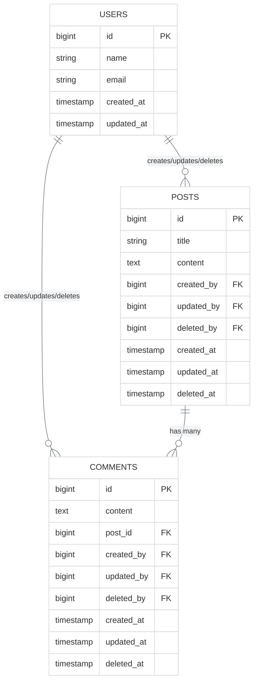
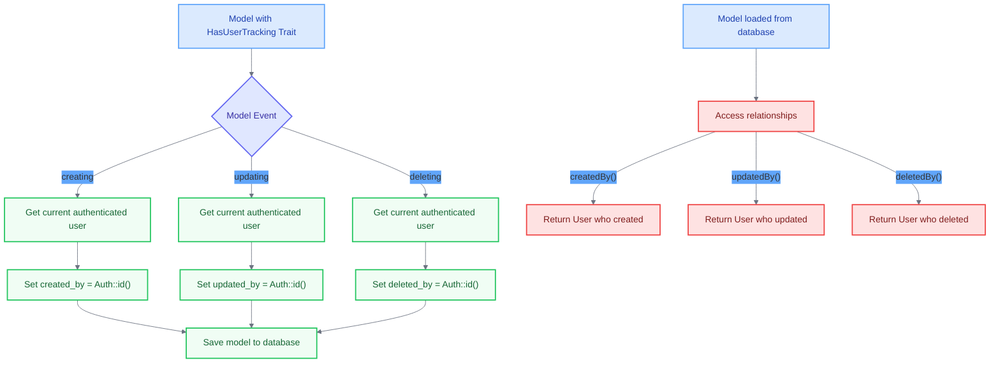
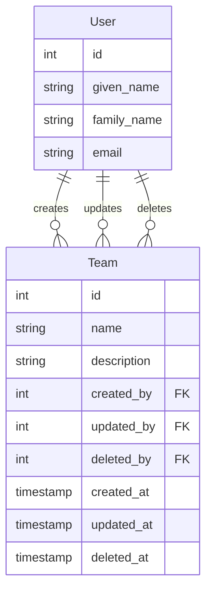

# Create HasUserTracking Trait

<link rel="stylesheet" href="../../assets/css/styles.css">
<link rel="stylesheet" href="../../assets/css/ume-docs-enhancements.css">
<script src="../../assets/js/ume-docs-enhancements.js"></script>

<ul class="breadcrumb-navigation">
    <li><a href="../../000-index.md">UME Tutorial</a></li>
    <li><a href="../000-index.md">Implementation</a></li>
    <li><a href="./000-index.md">Phase 1: Core Models</a></li>
    <li><a href="./050-has-user-tracking-trait.md">HasUserTracking Trait</a></li>
</ul>

<div class="section-metadata">
    <div class="time-estimate">
        <span class="icon">⏱️</span>
        <span class="label">Time Estimate:</span>
        <span class="value">30-45 minutes</span>
    </div>
    <div class="difficulty-level">
        <span class="icon">🔶🔶</span>
        <span class="label">Difficulty:</span>
        <span class="value">Intermediate</span>
        <span class="explanation">Requires understanding of PHP traits, Laravel model events, and relationships</span>
    </div>
    <div class="prerequisites">
        <span class="icon">📋</span>
        <span class="label">Prerequisites:</span>
        <ul>
            <li>Understanding of Traits & Model Events</li>
            <li>Basic Laravel Eloquent knowledge</li>
            <li>Familiarity with Laravel authentication</li>
        </ul>
    </div>
    <div class="learning-outcomes">
        <span class="icon">🎯</span>
        <span class="label">You'll Learn:</span>
        <ul>
            <li>How to implement user tracking for model changes</li>
            <li>How to use model events for automatic tracking</li>
            <li>How to define relationships to the User model</li>
            <li>How to handle soft deletes with user tracking</li>
        </ul>
    </div>
</div>

## Goal

Implement a reusable trait that automatically tracks which users create and update Eloquent models, providing accountability and audit capabilities.

## What is User Tracking?

User tracking in the context of database models means recording which user created a record, which user last updated it, and which user deleted it (for soft deletes). This provides:

1. **Accountability**: Know who made changes, including deletions
2. **Audit Trail**: Basic history of model changes throughout its lifecycle
3. **Filtering**: Find records created, modified, or deleted by specific users
4. **Security**: Support for compliance requirements with complete user action tracking



<div class="mermaid-caption">Figure 1: Database structure showing user tracking fields and relationships</div>

## Implementing the HasUserTracking Trait

Let's create a trait that will:

1. Automatically set `created_by` when a model is created
2. Automatically set `updated_by` when a model is updated
3. Automatically set `deleted_by` when a model is soft deleted
4. Define relationships to the User model for all tracking fields



<div class="mermaid-caption">Figure 2: How the HasUserTracking trait works with model events and relationships</div>

### Step 1: Create the Trait File

Create a new file at `app/Traits/HasUserTracking.php`:

```php
<?php

declare(strict_types=1);

namespace App\Models\Traits;

use App\Models\User;
use Illuminate\Database\Eloquent\Model;
use Illuminate\Database\Eloquent\Relations\BelongsTo;
use Illuminate\Database\Eloquent\SoftDeletes;
use Illuminate\Support\Facades\Auth;
use Illuminate\Support\Facades\Schema;

trait HasUserTracking
{
    /**
     * Boot the user tracking trait for a model.
     *
     * Automatically sets 'created_by', 'updated_by', and 'deleted_by' based on the
     * currently authenticated user during model creation, updates, and deletion.
     */
    protected static function bootHasUserTracking(): void
    {
        // Use static::creating for new models
        static::creating(function (Model $model) {
            if (Auth::check()) {
                // Check if columns exist before trying to set them
                if (Schema::hasColumn($model->getTable(), 'created_by') && is_null($model->created_by)) {
                    $model->created_by = Auth::id();
                }
                if (Schema::hasColumn($model->getTable(), 'updated_by') && is_null($model->updated_by)) {
                     $model->updated_by = Auth::id();
                }
            }
        });

        // Use static::updating for existing models
        static::updating(function (Model $model) {
            if (Auth::check()) {
                 // Check if column exists before trying to set it
                 if (Schema::hasColumn($model->getTable(), 'updated_by')) {
                    $model->updated_by = Auth::id();
                 }
            }
        });

        // Consider adding saving event if you want to ensure updated_by is always set on save
        static::saving(function (Model $model) {
            if (Auth::check() && Schema::hasColumn($model->getTable(), 'updated_by')) {
                $model->updated_by = Auth::id();
            }
        });

        // Use static::deleting for soft deletes
        static::deleting(function (Model $model) {
            // Only track deletes if the model uses SoftDeletes
            if (Auth::check() && in_array(SoftDeletes::class, class_uses_recursive($model))) {
                if (Schema::hasColumn($model->getTable(), 'deleted_by')) {
                    $model->deleted_by = Auth::id();
                    // Save without triggering events to avoid infinite loop
                    $model->saveQuietly();
                }
            }
        });
    }

    /**
     * Defines the relationship to the User who created this model instance.
     *
     * @return BelongsTo The relationship definition.
     */
    public function createdBy(): BelongsTo
    {
        return $this->belongsTo(User::class, 'created_by');
    }

    /**
     * Defines the relationship to the User who last updated this model instance.
     *
     * @return BelongsTo The relationship definition.
     */
    public function updatedBy(): BelongsTo
    {
        return $this->belongsTo(User::class, 'updated_by');
    }

    /**
     * Defines the relationship to the User who deleted this model instance.
     * Only relevant for models using SoftDeletes.
     *
     * @return BelongsTo The relationship definition.
     */
    public function deletedBy(): BelongsTo
    {
        return $this->belongsTo(User::class, 'deleted_by');
    }
```

### Step 2: Add User Tracking Columns to Migrations

When using this trait, you'll need to add `created_by`, `updated_by`, and `deleted_by` columns to your model's table:

```php
$table->foreignId('created_by')->nullable()->constrained('users')->nullOnDelete();
$table->foreignId('updated_by')->nullable()->constrained('users')->nullOnDelete();
$table->foreignId('deleted_by')->nullable()->constrained('users')->nullOnDelete();
```

### Step 3: Update Model Fillable Properties

Make sure to add the tracking fields to your model's `$fillable` array:

```php
protected $fillable = [
    // ... other fields
    'created_by',
    'updated_by',
    'deleted_by',
];
```

## Using the HasUserTracking Trait

Here's how to use the trait in a model:

```php
<?php

namespace App\Models;

use App\Models\Traits\HasUserTracking;
use Illuminate\Database\Eloquent\Model;
use Illuminate\Database\Eloquent\SoftDeletes;

class Team extends Model
{
    use HasUserTracking;
    use SoftDeletes; // Add this to enable soft deletes and deleted_by tracking

    protected $fillable = [
        'name',
        'description',
        'created_by',
        'updated_by',
        'deleted_by',
    ];
}
```

## Testing the HasUserTracking Trait

Let's create a test to ensure our trait works correctly:

```php
<?php

declare(strict_types=1);

namespace Tests\Unit\Traits;

use App\Models\Team;use App\Models\User;use Illuminate\Foundation\Testing\RefreshDatabase;use old\TestCase;use PHPUnit\Framework\Attributes\Test;

class HasUserTrackingTraitTest extends TestCase
{
    use RefreshDatabase;

    #[Test]
    public function it_sets_created_by_when_creating_model()
    {
        $user = User::factory()->create();

        $this->actingAs($user);

        $team = Team::create([
            'name' => 'Test Team',
            'description' => 'A team for testing',
        ]);

        $this->assertEquals($user->id, $team->created_by);
    }

    #[Test]
    public function it_sets_updated_by_when_updating_model()
    {
        $user1 = User::factory()->create();
        $user2 = User::factory()->create();

        $this->actingAs($user1);

        $team = Team::create([
            'name' => 'Test Team',
            'description' => 'A team for testing',
        ]);

        $this->actingAs($user2);

        $team->update([
            'description' => 'Updated description',
        ]);

        $this->assertEquals($user1->id, $team->created_by);
        $this->assertEquals($user2->id, $team->updated_by);
    }

    #[Test]
    public function it_sets_deleted_by_when_soft_deleting_model()
    {
        $user1 = User::factory()->create();
        $user2 = User::factory()->create();

        $this->actingAs($user1);

        $team = Team::create([
            'name' => 'Test Team',
            'description' => 'A team for testing',
        ]);

        $this->actingAs($user2);

        $team->delete(); // Soft delete

        // Retrieve the model with trashed records
        $deletedTeam = Team::withTrashed()->find($team->id);

        $this->assertEquals($user1->id, $deletedTeam->created_by);
        $this->assertEquals($user2->id, $deletedTeam->deleted_by);
        $this->assertNotNull($deletedTeam->deleted_at);
    }

    #[Test]
    public function it_defines_creator_relationship()
    {
        $user = User::factory()->create();

        $this->actingAs($user);

        $team = Team::create([
            'name' => 'Test Team',
            'description' => 'A team for testing',
        ]);

        $this->assertInstanceOf(User::class, $team->createdBy);
        $this->assertEquals($user->id, $team->createdBy->id);
    }

    #[Test]
    public function it_defines_deleted_by_relationship()
    {
        $user1 = User::factory()->create();
        $user2 = User::factory()->create();

        $this->actingAs($user1);

        $team = Team::create([
            'name' => 'Test Team',
            'description' => 'A team for testing',
        ]);

        $this->actingAs($user2);

        $team->delete(); // Soft delete

        // Retrieve the model with trashed records
        $deletedTeam = Team::withTrashed()->find($team->id);

        $this->assertInstanceOf(User::class, $deletedTeam->deletedBy);
        $this->assertEquals($user2->id, $deletedTeam->deletedBy->id);
    }
}

```

## Handling System Actions

Sometimes, actions are performed by the system rather than a user (e.g., during seeding or background jobs). We can handle this by:

1. **Allowing Null Values**: The columns are nullable
2. **System User**: Creating a system user with ID 1
3. **Explicit Assignment**: Setting values explicitly when needed

```php
// Example of explicit assignment during seeding
Team::create([
    'name' => 'System Team',
    'description' => 'Created by the system',
    'created_by' => null, // or system user ID
]);

// Example of handling soft deletes in a system process
$team = Team::find(1);
$team->deleted_by = null; // Indicate system deletion
$team->delete();
```

## Diagram: User Tracking Relationships



## Benefits in Our Application

Using the HasUserTracking trait in our application provides several benefits:

1. **Complete Accountability**: Track who created, modified, and deleted records
2. **Comprehensive Audit Trail**: Full history of changes throughout the record lifecycle
3. **User Activity Tracking**: See what records a user has created, modified, or deleted
4. **Soft Delete Management**: Know who deleted records and when
5. **Compliance**: Support for regulatory requirements including deletion tracking
6. **Data Recovery**: Ability to identify who deleted data when restoring from soft deletes

## Quick Reference

<div class="quick-reference">
    <h2>HasUserTracking Trait Quick Reference</h2>

    <div class="key-concepts">
        <dl>
            <dt>User Tracking</dt>
            <dd>Recording which user created, updated, or deleted a model for accountability and auditing</dd>

            <dt>Model Events</dt>
            <dd>The trait uses 'creating', 'updating', and 'deleting' events to automatically track users</dd>

            <dt>Relationships</dt>
            <dd>Defines BelongsTo relationships to the User model for created_by, updated_by, and deleted_by</dd>
        </dl>
    </div>

    <div class="syntax">
        <h3>Common Usage Patterns</h3>
        <pre><code>// Adding the trait to a model
class Post extends Model
{
    use SoftDeletes;
    use HasUserTracking;

    // Make sure tracking fields are fillable
    protected $fillable = ['title', 'content', 'created_by', 'updated_by', 'deleted_by'];
}

// Creating a model (user tracking happens automatically)
$post = Post::create([
    'title' => 'My Post',
    'content' => 'Post content'
]);

// Accessing the user who created the model
$creator = $post->createdBy;
echo $creator->name; // Outputs the name of the user who created the post

// Finding all posts created by a specific user
$userPosts = Post::where('created_by', $user->id)->get();</code></pre>
    </div>

    <div class="gotchas">
        <h3>Common Pitfalls</h3>
        <ul>
            <li>Forgetting to add tracking columns to database migrations</li>
            <li>Not adding tracking fields to the model's $fillable array</li>
            <li>Using mass updates that bypass model events</li>
            <li>Not implementing SoftDeletes when using deleted_by tracking</li>
        </ul>
    </div>
</div>

## Troubleshooting

<div class="troubleshooting-guide">
    <h2>User Tracking Not Working</h2>

    <div class="symptoms">
        <h3>Symptoms</h3>
        <ul>
            <li>User IDs not being recorded in tracking fields</li>
            <li>Null values in created_by or updated_by columns</li>
            <li>Relationships to User model returning null</li>
        </ul>
    </div>

    <div class="causes">
        <h3>Possible Causes</h3>
        <ol>
            <li>Missing database columns for tracking fields</li>
            <li>No authenticated user when creating/updating models</li>
            <li>Using methods that bypass Eloquent events</li>
        </ol>
    </div>

    <div class="solutions">
        <h3>Solutions</h3>

        <h4>For Missing Database Columns</h4>
        <p>Verify your migration includes the tracking columns:</p>
        <pre><code>// In your migration file
$table->foreignId('created_by')->nullable()->constrained('users');
$table->foreignId('updated_by')->nullable()->constrained('users');
$table->foreignId('deleted_by')->nullable()->constrained('users');</code></pre>

        <h4>For Authentication Issues</h4>
        <p>Ensure a user is authenticated when creating/updating models:</p>
        <pre><code>// Check if a user is authenticated
if (Auth::check()) {
    // User is logged in
    $post = Post::create(['title' => 'My Post']);
} else {
    // No user is logged in, tracking fields will be null
}</code></pre>

        <h4>For Event Bypassing</h4>
        <p>Avoid methods that bypass Eloquent events:</p>
        <pre><code>// These methods DO NOT trigger events
Post::insert(['title' => 'My Post']);
DB::table('posts')->update(['title' => 'Updated']);

// These methods DO trigger events
$post = new Post();
$post->title = 'My Post';
$post->save();

Post::create(['title' => 'My Post']);</code></pre>
    </div>

    <div class="prevention">
        <h3>Prevention</h3>
        <ul>
            <li>Create tests that verify user tracking functionality</li>
            <li>Use model factories that properly implement the trait</li>
            <li>Add database constraints to ensure referential integrity</li>
        </ul>
    </div>
</div>

## Next Steps

<div class="page-navigation">
    <a href="040-has-ulid-trait.md" class="prev">HasUlid Trait</a>
    <a href="060-database-migrations.md" class="next">Database Migrations</a>
</div>

Now that we've implemented the HasUserTracking trait, let's move on to [Understanding Database Migrations](./060-database-migrations.md) to prepare for enhancing our database schema.
