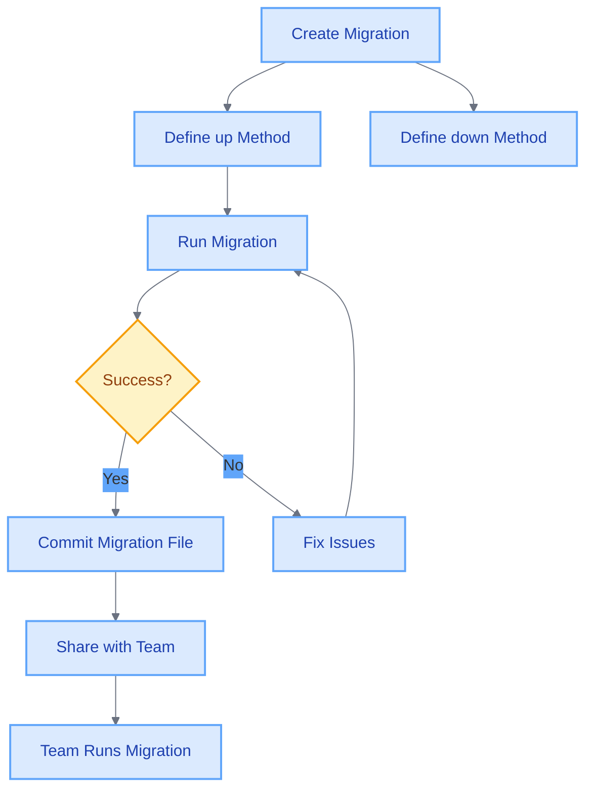
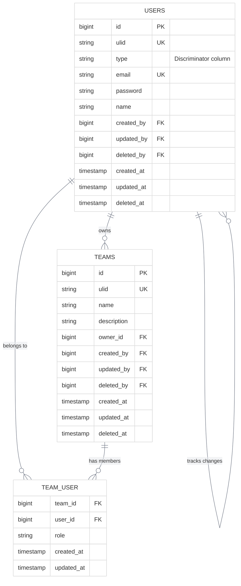

# Understanding Database Migrations

<link rel="stylesheet" href="../../assets/css/styles.css">
<link rel="stylesheet" href="../../assets/css/ume-docs-enhancements.css">
<script src="../../assets/js/ume-docs-enhancements.js"></script>

<ul class="breadcrumb-navigation">
    <li><a href="../../000-index.md">UME Tutorial</a></li>
    <li><a href="../000-index.md">Implementation</a></li>
    <li><a href="./000-index.md">Phase 1: Core Models</a></li>
    <li><a href="./060-database-migrations.md">Database Migrations</a></li>
</ul>

<div class="section-metadata">
    <div class="time-estimate">
        <span class="icon">⏱️</span>
        <span class="label">Time Estimate:</span>
        <span class="value">30-45 minutes</span>
    </div>
    <div class="difficulty-level">
        <span class="icon">🔶🔶</span>
        <span class="label">Difficulty:</span>
        <span class="value">Intermediate</span>
        <span class="explanation">Requires understanding of database schema design and Laravel migrations</span>
    </div>
    <div class="prerequisites">
        <span class="icon">📋</span>
        <span class="label">Prerequisites:</span>
        <ul>
            <li>Basic Laravel knowledge</li>
            <li>Understanding of database concepts</li>
            <li>Familiarity with PHP classes</li>
        </ul>
    </div>
    <div class="learning-outcomes">
        <span class="icon">🎯</span>
        <span class="label">You'll Learn:</span>
        <ul>
            <li>How Laravel migrations work</li>
            <li>How to create and run migrations</li>
            <li>How to design database schema for UME features</li>
            <li>Best practices for database migrations</li>
        </ul>
    </div>
</div>

## Goal

Understand Laravel's database migrations system, which allows you to version control your database schema and make consistent changes across different environments.

## What are Database Migrations?

Migrations are like version control for your database, allowing your team to define and share the application's database schema. They are PHP files that describe changes to your database structure in a consistent, repeatable way.

### Key Benefits of Migrations

1. **Version Control**: Track database changes alongside code changes
2. **Team Collaboration**: Share database schema changes with team members
3. **Environment Consistency**: Ensure development, staging, and production databases have the same structure
4. **Rollbacks**: Easily revert database changes if needed
5. **Database Agnostic**: Work with different database systems without changing code

## Migration Lifecycle

```mermaid
%%{init: {'theme': 'base', 'themeVariables': {'primaryColor': '#f3f4f6', 'lineColor': '#6b7280', 'textColor': '#111827', 'mainBkg': '#ffffff', 'secondaryColor': '#60a5fa', 'tertiaryColor': '#e5e7eb'}}}%%
flowchart TD
    A([Start]) --> B["Create Migration\nphp artisan make:migration"]
    B --> C["Define Schema Changes\nin up() and down() methods"]
    C --> D["Run Migration\nphp artisan migrate"]
    D --> E{"Successful?"}
    E -->|Yes| F["Laravel records migration\nin migrations table"]
    E -->|No| G["Fix errors in\nmigration file"]
    G --> D
    F --> H{"Need to modify?"}
    H -->|Yes| I["Rollback Migration\nphp artisan migrate:rollback"]
    I --> J["Laravel runs down()\nmethod"]
    J --> K["Update migration file"]
    K --> D
    H -->|No| L([End])

    classDef start fill:#d1fae5,stroke:#10b981,stroke-width:2px,color:#065f46
    classDef end fill:#d1fae5,stroke:#10b981,stroke-width:2px,color:#065f46
    classDef command fill:#dbeafe,stroke:#60a5fa,stroke-width:2px,color:#1e40af
    classDef action fill:#e0e7ff,stroke:#6366f1,stroke-width:2px,color:#3730a3
    classDef decision fill:#fef3c7,stroke:#f59e0b,stroke-width:2px,color:#92400e

    class A,L start
    class B,D,I command
    class C,F,G,J,K action
    class E,H decision
```

<div class="mermaid-caption">Figure 1: Laravel migration lifecycle</div>

1. **Create Migration**: Generate a new migration file
2. **Define Changes**: Write the `up()` and `down()` methods
3. **Run Migration**: Apply the changes to the database
4. **Track Status**: Laravel records which migrations have been run
5. **Rollback (if needed)**: Revert changes using the `down()` method

## Migration File Structure

A migration file contains a class with two methods:

- `up()`: Describes the changes to apply (create tables, add columns, etc.)
- `down()`: Describes how to reverse those changes (drop tables, remove columns, etc.)

```php
<?php

use Illuminate\Database\Migrations\Migration;
use Illuminate\Database\Schema\Blueprint;
use Illuminate\Support\Facades\Schema;

class CreateUsersTable extends Migration
{
    /**
     * Run the migrations.
     *
     * @return void
     */
    public function up()
    {
        Schema::create('users', function (Blueprint $table) {
            $table->id();
            $table->string('name');
            $table->string('email')->unique();
            $table->timestamp('email_verified_at')->nullable();
            $table->string('password');
            $table->rememberToken();
            $table->timestamps();
        });
    }

    /**
     * Reverse the migrations.
     *
     * @return void
     */
    public function down()
    {
        Schema::dropIfExists('users');
    }
}
```

## Creating Migrations

You can create a new migration using the Artisan command-line tool:

```bash
# Create a new table
php artisan make:migration create_teams_table

# Add columns to an existing table
php artisan make:migration add_type_to_users_table

# Create a pivot table
php artisan make:migration create_team_user_table
```

Laravel will create a timestamped file in the `database/migrations` directory.

## Common Migration Operations

### Creating Tables

```php
Schema::create('teams', function (Blueprint $table) {
    $table->id();
    $table->string('name');
    $table->text('description')->nullable();
    $table->timestamps();
});
```

### Adding Columns

```php
Schema::table('users', function (Blueprint $table) {
    $table->string('type')->after('email');
    $table->string('given_name')->after('type');
    $table->string('family_name')->after('given_name');
    $table->string('other_names')->nullable()->after('family_name');
});
```

### Creating Indexes

```php
Schema::table('users', function (Blueprint $table) {
    $table->index('type');
    $table->index(['given_name', 'family_name']);
});
```

### Foreign Keys

```php
Schema::table('team_user', function (Blueprint $table) {
    $table->foreignId('team_id')->constrained()->onDelete('cascade');
    $table->foreignId('user_id')->constrained()->onDelete('cascade');
});
```

### Modifying Columns

```php
Schema::table('users', function (Blueprint $table) {
    $table->string('name', 100)->change(); // Change length
    $table->string('email')->nullable()->change(); // Make nullable
});
```

### Renaming Columns

```php
Schema::table('users', function (Blueprint $table) {
    $table->renameColumn('name', 'full_name');
});
```

### Dropping Tables

```php
Schema::dropIfExists('teams');
```

## Running Migrations

To run all pending migrations:

```bash
php artisan migrate
```

To roll back the last batch of migrations:

```bash
php artisan migrate:rollback
```

To roll back all migrations and run them again:

```bash
php artisan migrate:fresh
```

To roll back all migrations, run them again, and seed the database:

```bash
php artisan migrate:fresh --seed
```

## Migration Best Practices

1. **Small, Focused Migrations**: Each migration should do one thing
2. **Always Define Down Method**: Ensure migrations can be rolled back
3. **Test Migrations**: Run migrations in development before committing
4. **Use Foreign Keys**: Maintain referential integrity
5. **Use Descriptive Names**: Name migrations clearly based on their purpose
6. **Avoid Raw SQL**: Use the Schema builder when possible
7. **Consider Performance**: Be careful with migrations on large tables in production

## Common Column Types

| Method                                          | Description                             |
|-------------------------------------------------|-----------------------------------------|
| `$table->id()`                                  | Auto-incrementing primary key           |
| `$table->string('name')`                        | VARCHAR column                          |
| `$table->text('description')`                   | TEXT column                             |
| `$table->integer('count')`                      | INTEGER column                          |
| `$table->decimal('price', 8, 2)`                | DECIMAL column with precision and scale |
| `$table->boolean('active')`                     | BOOLEAN column                          |
| `$table->date('birth_date')`                    | DATE column                             |
| `$table->dateTime('published_at')`              | DATETIME column                         |
| `$table->timestamps()`                          | Adds created_at and updated_at columns  |
| `$table->softDeletes()`                         | Adds deleted_at column for soft deletes |
| `$table->foreignId('user_id')`                  | BIGINT column for foreign key           |
| `$table->enum('status', ['pending', 'active'])` | ENUM column with allowed values         |
| `$table->json('metadata')`                      | JSON column                             |
| `$table->uuid('uuid')`                          | UUID column                             |

## Column Modifiers

| Method                     | Description                                    |
|----------------------------|------------------------------------------------|
| `->nullable()`             | Allow NULL values                              |
| `->default('value')`       | Set a default value                            |
| `->unsigned()`             | Make numeric column unsigned                   |
| `->unique()`               | Add a unique index                             |
| `->index()`                | Add an index                                   |
| `->comment('description')` | Add a comment to the column                    |
| `->after('column')`        | Place the column after another column          |
| `->first()`                | Place the column at the beginning of the table |

## Diagram: Migration Workflow

*The diagram below illustrates the migration workflow process:*

1. **Create Migration** - Generate a new migration file
2. **Define up() Method** - Specify changes to apply
3. **Define down() Method** - Specify how to reverse changes
4. **Run Migration** - Execute the migration
5. **Check Success** - Determine if migration succeeded
   - If **Yes**: Commit the migration file
   - If **No**: Fix issues and run again
6. **Share with Team** - Push changes to version control
7. **Team Runs Migration** - Other developers apply the migration



<div class="mermaid-caption">Figure 2: Migration workflow process</div>

## UME Database Schema



<div class="mermaid-caption">Figure 3: UME database schema showing key tables and relationships</div>

## Quick Reference

<div class="quick-reference">
    <h2>Laravel Migrations Quick Reference</h2>

    <div class="key-concepts">
        <dl>
            <dt>Migration</dt>
            <dd>A PHP class that describes changes to your database schema in a consistent, repeatable way</dd>

            <dt>Migration Table</dt>
            <dd>A special table in your database that tracks which migrations have been run</dd>

            <dt>Blueprint</dt>
            <dd>A Laravel class that provides a fluent interface for defining database tables and columns</dd>
        </dl>
    </div>

    <div class="syntax">
        <h3>Common Commands</h3>
        <pre><code>// Create a migration
php artisan make:migration create_teams_table

// Run all pending migrations
php artisan migrate

// Rollback the last batch of migrations
php artisan migrate:rollback

// Rollback all migrations and run them again
php artisan migrate:fresh

// Rollback all migrations, run them again, and seed the database
php artisan migrate:fresh --seed</code></pre>
    </div>

    <div class="gotchas">
        <h3>Common Pitfalls</h3>
        <ul>
            <li>Forgetting to define the down() method for rollbacks</li>
            <li>Making changes to migrations that have already been run</li>
            <li>Creating large migrations that do too many things</li>
            <li>Not testing migrations before committing them</li>
        </ul>
    </div>
</div>

## Troubleshooting

<div class="troubleshooting-guide">
    <h2>Migration Issues</h2>

    <div class="symptoms">
        <h3>Symptoms</h3>
        <ul>
            <li>Migration fails with SQL errors</li>
            <li>Rollback doesn't work as expected</li>
            <li>Schema doesn't match what was defined in migrations</li>
        </ul>
    </div>

    <div class="causes">
        <h3>Possible Causes</h3>
        <ol>
            <li>Syntax errors in migration files</li>
            <li>Incomplete or incorrect down() method</li>
            <li>Trying to modify a column that doesn't exist</li>
            <li>Foreign key constraints not properly defined</li>
        </ol>
    </div>

    <div class="solutions">
        <h3>Solutions</h3>

        <h4>For Syntax Errors</h4>
        <p>Check your migration file for syntax errors:</p>
        <pre><code>// Correct syntax for creating a table
Schema::create('teams', function (Blueprint $table) {
    $table->id();
    $table->string('name');
    $table->timestamps();
});</code></pre>

        <h4>For Rollback Issues</h4>
        <p>Ensure your down() method properly reverses the up() method:</p>
        <pre><code>// In up() method
Schema::create('teams', function (Blueprint $table) {
    // Table definition
});

// In down() method
Schema::dropIfExists('teams');</code></pre>

        <h4>For Foreign Key Issues</h4>
        <p>Make sure referenced tables exist before creating foreign keys:</p>
        <pre><code>// Create users table first
Schema::create('users', function (Blueprint $table) {
    $table->id();
    // Other columns
});

// Then create teams table with foreign key
Schema::create('teams', function (Blueprint $table) {
    $table->id();
    $table->foreignId('user_id')->constrained();
    // Other columns
});</code></pre>
    </div>

    <div class="prevention">
        <h3>Prevention</h3>
        <ul>
            <li>Test migrations in development before committing</li>
            <li>Use a consistent naming convention for migrations</li>
            <li>Keep migrations small and focused</li>
            <li>Always define both up() and down() methods</li>
        </ul>
    </div>
</div>

## Next Steps

<div class="page-navigation">
    <a href="050-has-user-tracking-trait.md" class="prev">HasUserTracking Trait</a>
    <a href="070-enhance-users-migration.md" class="next">Enhance Users Migration</a>
</div>

Now that you understand database migrations, let's apply this knowledge to [Enhance the users Table Migration](./070-enhance-users-migration.md) to support our Single Table Inheritance implementation.
