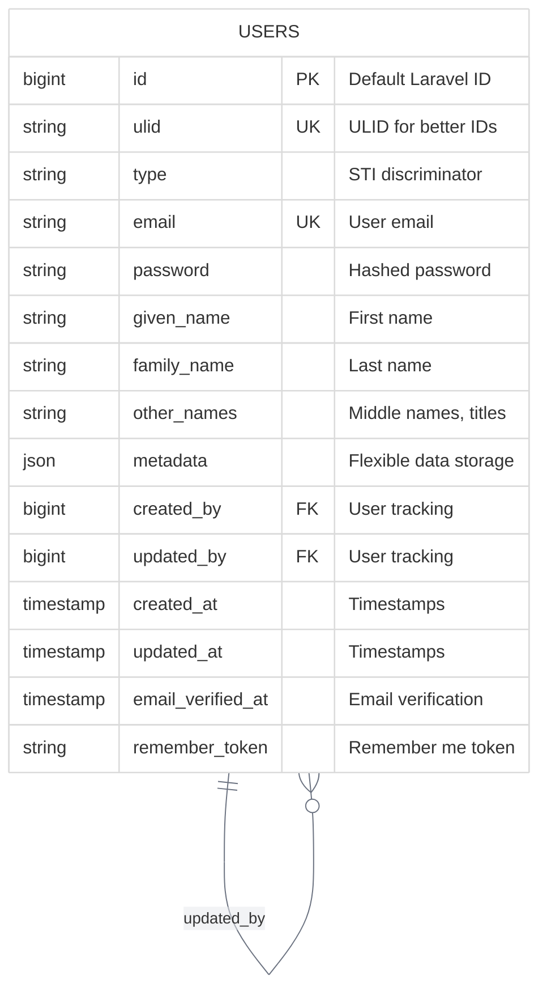
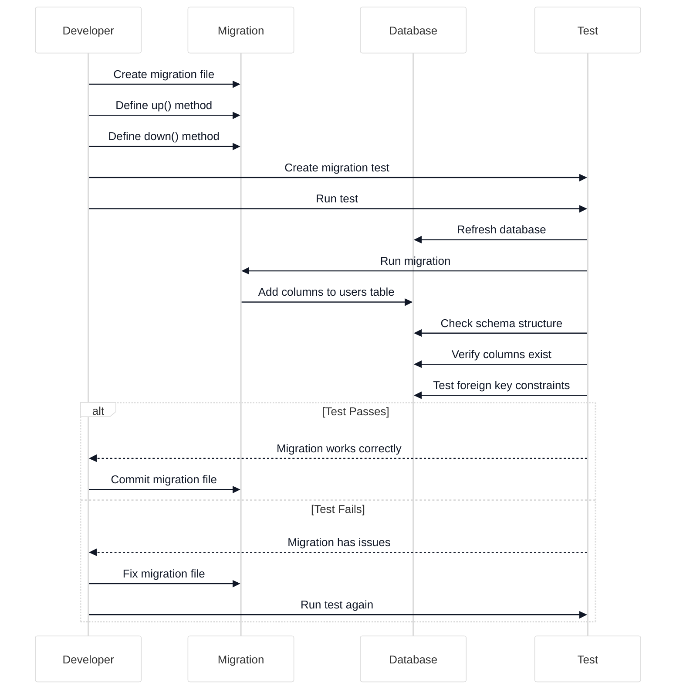

# Enhance users Table Migration

<link rel="stylesheet" href="../../assets/css/styles.css">
<link rel="stylesheet" href="../../assets/css/ume-docs-enhancements.css">
<script src="../../assets/js/ume-docs-enhancements.js"></script>

<ul class="breadcrumb-navigation">
    <li><a href="../../000-index.md">UME Tutorial</a></li>
    <li><a href="../000-index.md">Implementation</a></li>
    <li><a href="./000-index.md">Phase 1: Core Models</a></li>
    <li><a href="./070-enhance-users-migration.md">Enhance Users Migration</a></li>
</ul>

<div class="section-metadata">
    <div class="time-estimate">
        <span class="icon">⏱️</span>
        <span class="label">Time Estimate:</span>
        <span class="value">30-45 minutes</span>
    </div>
    <div class="difficulty-level">
        <span class="icon">🔶🔶</span>
        <span class="label">Difficulty:</span>
        <span class="value">Intermediate</span>
        <span class="explanation">Requires understanding of database schema design and Laravel migrations</span>
    </div>
    <div class="prerequisites">
        <span class="icon">📋</span>
        <span class="label">Prerequisites:</span>
        <ul>
            <li>Understanding of Database Migrations</li>
            <li>Understanding of Single Table Inheritance</li>
            <li>Familiarity with HasUlid and HasUserTracking traits</li>
        </ul>
    </div>
    <div class="learning-outcomes">
        <span class="icon">🎯</span>
        <span class="label">You'll Learn:</span>
        <ul>
            <li>How to modify the default users table</li>
            <li>How to add columns for STI, ULIDs, and user tracking</li>
            <li>How to use JSON columns for flexible data storage</li>
            <li>How to handle name components properly</li>
        </ul>
    </div>
</div>

## Goal

Modify the default Laravel users table to support Single Table Inheritance (STI) and enhanced name handling by adding the necessary columns.

## Overview

We need to enhance the default users table to support:

1. **Single Table Inheritance**: Add a `type` column to store the model class
2. **Name Components**: Replace the single `name` column with `given_name`, `family_name`, and `other_names`
3. **ULID Support**: Add a `ulid` column for Universally Unique Lexicographically Sortable Identifiers
4. **Metadata**: Add a `metadata` JSON column for flexible data storage
5. **User Tracking**: Add `created_by` and `updated_by` columns



<div class="mermaid-caption">Figure 1: Enhanced users table schema with STI, ULIDs, and user tracking</div>

## Creating the Migration

Let's create a new migration to modify the users table:

```bash
php artisan make:migration enhance_users_table
```

This will create a new migration file in the `database/migrations` directory with a timestamp prefix.

## Implementing the Migration

Open the newly created migration file and implement the changes:

```php
<?php

use Illuminate\Database\Migrations\Migration;
use Illuminate\Database\Schema\Blueprint;
use Illuminate\Support\Facades\Schema;

class EnhanceUsersTable extends Migration
{
    /**
     * Run the migrations.
     *
     * @return void
     */
    public function up()
    {
        Schema::table('users', function (Blueprint $table) {
            // Drop the existing name column (we'll replace it with components)
            $table->dropColumn('name');

            // Add Single Table Inheritance type column
            $table->string('type')->after('id')->default(\App\Models\User::class);
            $table->index('type');

            // Add name component columns
            $table->string('given_name')->after('type');
            $table->string('family_name')->after('given_name');
            $table->string('other_names')->nullable()->after('family_name');

            // Add ULID column
            $table->string('ulid', 26)->unique()->after('id');

            // Add metadata column
            $table->json('metadata')->nullable()->after('remember_token');

            // Add user tracking columns
            $table->foreignId('created_by')->nullable()->after('metadata')
                  ->constrained('users')->nullOnDelete();
            $table->foreignId('updated_by')->nullable()->after('created_by')
                  ->constrained('users')->nullOnDelete();
        });
    }

    /**
     * Reverse the migrations.
     *
     * @return void
     */
    public function down()
    {
        Schema::table('users', function (Blueprint $table) {
            // Remove the columns we added
            $table->dropColumn([
                'type',
                'given_name',
                'family_name',
                'other_names',
                'ulid',
                'metadata',
                'created_by',
                'updated_by',
            ]);

            // Add back the original name column
            $table->string('name')->after('id');
        });
    }
}
```

## Important Considerations

### Order of Operations

The order of operations in migrations is important:

1. We first drop the `name` column
2. Then add all our new columns
3. In the `down()` method, we reverse these operations

### Foreign Key Constraints

Note the self-referential foreign keys for `created_by` and `updated_by`:

```php
$table->foreignId('created_by')->nullable()->after('metadata')
      ->constrained('users')->nullOnDelete();
```

This creates a foreign key that references the `id` column in the same `users` table. The `nullOnDelete()` method ensures that if a user is deleted, the reference is set to NULL rather than causing a constraint violation.

### Default Values

We set a default value for the `type` column to ensure existing users are treated as base User models:

```php
$table->string('type')->after('id')->default(\App\Models\User::class);
```

## Handling Existing Data

If you're applying this migration to a database with existing users, you'll need to handle the transition from a single `name` field to the new name components. Here's how you could do it:

```php
// Inside the up() method, before dropping the name column
$users = DB::table('users')->get();

foreach ($users as $user) {
    $nameParts = explode(' ', $user->name);
    $givenName = array_shift($nameParts);
    $familyName = array_pop($nameParts) ?: '';
    $otherNames = implode(' ', $nameParts);

    DB::table('users')
        ->where('id', $user->id)
        ->update([
            'given_name' => $givenName,
            'family_name' => $familyName,
            'other_names' => $otherNames ?: null,
            'ulid' => (string) \Illuminate\Support\Str::ulid(),
        ]);
}
```

## Testing the Migration



<div class="mermaid-caption">Figure 2: Migration testing process</div>

Let's create a test to ensure our migration works correctly:

```php
<?php

namespace Tests\Feature;

use Illuminate\Foundation\Testing\RefreshDatabase;use Illuminate\Support\Facades\Schema;use old\TestCase;use PHPUnit\Framework\Attributes\Test;

class EnhanceUsersTableTest extends TestCase
{
    use RefreshDatabase;

    #[Test]
    public function users_table_has_required_columns()
    {
        $this->assertTrue(Schema::hasTable('users'));

        $this->assertTrue(Schema::hasColumns('users', [
            'id',
            'ulid',
            'type',
            'given_name',
            'family_name',
            'other_names',
            'email',
            'email_verified_at',
            'password',
            'metadata',
            'created_by',
            'updated_by',
            'remember_token',
            'created_at',
            'updated_at',
        ]));
    }

    #[Test]
    public function users_table_has_correct_indexes()
    {
        $indexes = Schema::getConnection()->getDoctrineSchemaManager()->listTableIndexes('users');

        // Check email is unique
        $this->assertArrayHasKey('users_email_unique', $indexes);
        $this->assertTrue($indexes['users_email_unique']->isUnique());

        // Check ulid is unique
        $this->assertArrayHasKey('users_ulid_unique', $indexes);
        $this->assertTrue($indexes['users_ulid_unique']->isUnique());

        // Check type has an index
        $this->assertArrayHasKey('users_type_index', $indexes);
    }
}
```

## Running the Migration

To apply the migration to your database:

```bash
php artisan migrate
```

If you need to roll back:

```bash
php artisan migrate:rollback
```

## Diagram: Enhanced Users Table

```mermaid
%%{init: {'theme': 'base', 'themeVariables': {'primaryColor': '#f3f4f6', 'lineColor': '#6b7280', 'textColor': '#111827', 'mainBkg': '#ffffff', 'secondaryColor': '#60a5fa', 'tertiaryColor': '#e5e7eb'}}}%%
erDiagram
    USERS {
        bigint id PK
        string ulid UK
        string type
        string given_name
        string family_name
        string other_names NULL
        string email UK
        datetime email_verified_at NULL
        string password
        json metadata NULL
        bigint created_by FK NULL
        bigint updated_by FK NULL
        string remember_token NULL
        datetime created_at
        datetime updated_at
    }
    USERS ||--o{ USERS : created_by
    USERS ||--o{ USERS : updated_by
```

<div class="mermaid-caption">Figure 3: Final users table schema after migration</div>

## Quick Reference

<div class="quick-reference">
    <h2>Users Table Migration Quick Reference</h2>

    <div class="key-concepts">
        <dl>
            <dt>Single Table Inheritance</dt>
            <dd>Using the 'type' column to store the fully qualified class name for different user types</dd>

            <dt>ULID</dt>
            <dd>Universally Unique Lexicographically Sortable Identifier - a 26-character identifier that combines timestamp and randomness</dd>

            <dt>Self-Referential Foreign Keys</dt>
            <dd>Foreign keys that reference the same table they're defined in (created_by, updated_by)</dd>
        </dl>
    </div>

    <div class="syntax">
        <h3>Common Migration Patterns</h3>
        <pre><code>// Adding a column after another column
$table->string('type')->after('id');

// Adding a unique column
$table->string('ulid', 26)->unique()->after('type');

// Adding a JSON column
$table->json('metadata')->nullable()->after('other_names');

// Adding a self-referential foreign key
$table->foreignId('created_by')->nullable()
      ->constrained('users')->nullOnDelete();</code></pre>
    </div>

    <div class="gotchas">
        <h3>Common Pitfalls</h3>
        <ul>
            <li>Forgetting to set default values for new non-nullable columns</li>
            <li>Not handling existing data when renaming or splitting columns</li>
            <li>Creating circular foreign key dependencies</li>
            <li>Not testing migrations before committing them</li>
        </ul>
    </div>
</div>

## Troubleshooting

<div class="troubleshooting-guide">
    <h2>Migration Issues</h2>

    <div class="symptoms">
        <h3>Symptoms</h3>
        <ul>
            <li>Migration fails with SQL errors</li>
            <li>Foreign key constraints fail</li>
            <li>Existing data causes migration to fail</li>
        </ul>
    </div>

    <div class="causes">
        <h3>Possible Causes</h3>
        <ol>
            <li>Missing default values for non-nullable columns</li>
            <li>Incorrect order of operations in migration</li>
            <li>Circular foreign key dependencies</li>
            <li>Incompatible data types for existing data</li>
        </ol>
    </div>

    <div class="solutions">
        <h3>Solutions</h3>

        <h4>For Default Value Issues</h4>
        <p>Ensure new non-nullable columns have default values:</p>
        <pre><code>// Add a default value for non-nullable column
$table->string('type')->default(\App\Models\User::class);</code></pre>

        <h4>For Existing Data Issues</h4>
        <p>Handle existing data when modifying columns:</p>
        <pre><code>// Update existing data before modifying columns
DB::table('users')->update([
    'given_name' => DB::raw("SUBSTRING_INDEX(name, ' ', 1)"),
    'family_name' => DB::raw("SUBSTRING_INDEX(name, ' ', -1)")
]);

// Then drop the old column
$table->dropColumn('name');</code></pre>

        <h4>For Foreign Key Issues</h4>
        <p>Use nullOnDelete for self-referential foreign keys:</p>
        <pre><code>$table->foreignId('created_by')->nullable()
      ->constrained('users')->nullOnDelete();</code></pre>
    </div>

    <div class="prevention">
        <h3>Prevention</h3>
        <ul>
            <li>Always test migrations in development before committing</li>
            <li>Create comprehensive tests for migrations</li>
            <li>Consider the impact on existing data</li>
            <li>Plan for rollback scenarios</li>
        </ul>
    </div>
</div>

## Next Steps

<div class="page-navigation">
    <a href="060-database-migrations.md" class="prev">Database Migrations</a>
    <a href="080-eloquent-models.md" class="next">Eloquent Models & Relationships</a>
</div>

Now that we've enhanced the users table to support Single Table Inheritance and our other requirements, let's move on to [Understanding Eloquent Models & Relationships](./080-eloquent-models.md) to prepare for updating our User model.
