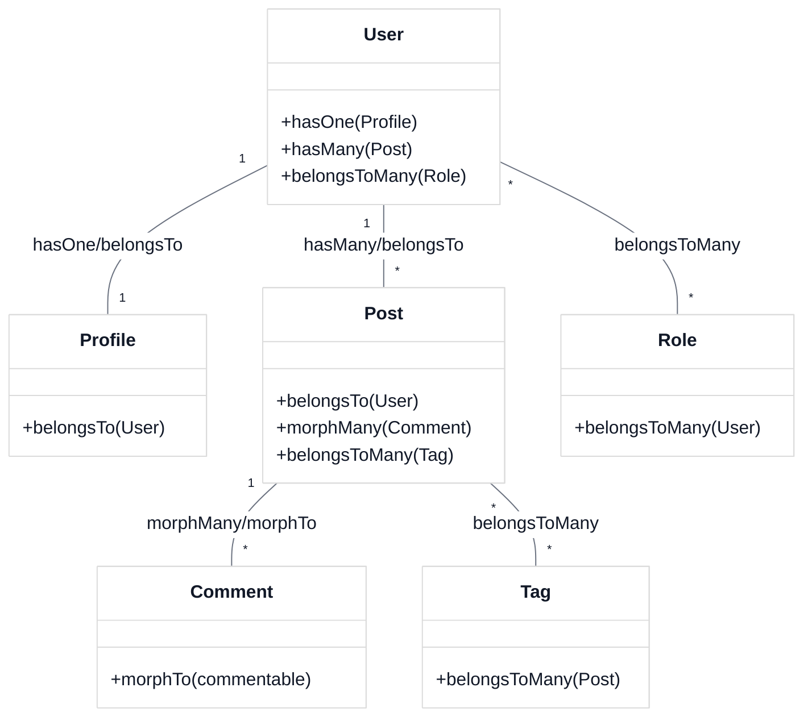
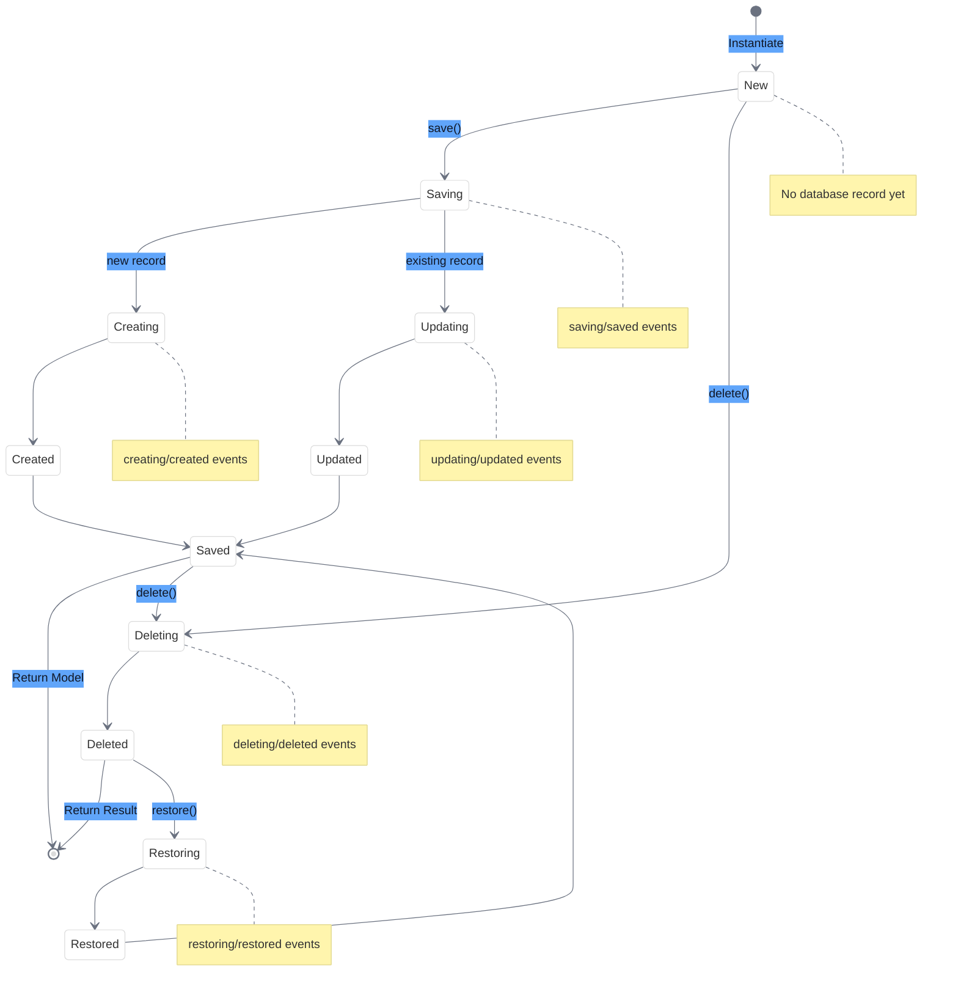
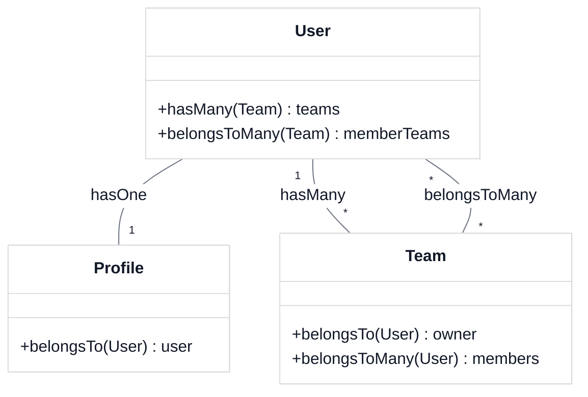

# Understanding Eloquent Models & Relationships

<link rel="stylesheet" href="../../assets/css/styles.css">
<link rel="stylesheet" href="../../assets/css/ume-docs-enhancements.css">
<script src="../../assets/js/ume-docs-enhancements.js"></script>

<ul class="breadcrumb-navigation">
    <li><a href="../../000-index.md">UME Tutorial</a></li>
    <li><a href="../000-index.md">Implementation</a></li>
    <li><a href="./000-index.md">Phase 1: Core Models</a></li>
    <li><a href="./080-eloquent-models.md">Eloquent Models & Relationships</a></li>
</ul>

<div class="section-metadata">
    <div class="time-estimate">
        <span class="icon">⏱️</span>
        <span class="label">Time Estimate:</span>
        <span class="value">45-60 minutes</span>
    </div>
    <div class="difficulty-level">
        <span class="icon">🔶🔶</span>
        <span class="label">Difficulty:</span>
        <span class="value">Intermediate</span>
        <span class="explanation">Requires understanding of database concepts and object-oriented programming</span>
    </div>
    <div class="prerequisites">
        <span class="icon">📋</span>
        <span class="label">Prerequisites:</span>
        <ul>
            <li>Basic Laravel knowledge</li>
            <li>Understanding of database relationships</li>
            <li>Familiarity with PHP classes and objects</li>
        </ul>
    </div>
    <div class="learning-outcomes">
        <span class="icon">🎯</span>
        <span class="label">You'll Learn:</span>
        <ul>
            <li>How Eloquent models work in Laravel</li>
            <li>How to define different types of relationships</li>
            <li>How to use model features like mutators and scopes</li>
            <li>How to structure models for complex applications</li>
        </ul>
    </div>
</div>

## Goal

Understand Laravel's Eloquent ORM, how models work, and how to define relationships between models.

## What is Eloquent?

Eloquent is Laravel's implementation of the Active Record pattern, providing an intuitive and expressive way to interact with your database. Each database table has a corresponding "Model" that is used to interact with that table.

### Key Features of Eloquent

1. **Intuitive Query Builder**: Fluent interface for building database queries
2. **Relationships**: Easy definition of model relationships
3. **Mutators & Accessors**: Transform data when getting or setting attributes
4. **Attribute Casting**: Automatically cast attributes to native PHP types
5. **Model Events**: Hook into the model lifecycle
6. **Scopes**: Reusable query constraints
7. **Serialization**: Convert models to arrays or JSON

## Basic Model Structure

```php
<?php

namespace App\Models;

use Illuminate\Database\Eloquent\Model;

class Team extends Model
{
    /**
     * The attributes that are mass assignable.
     *
     * @var array<int, string>
     */
    protected $fillable = [
        'name',
        'description',
    ];

    /**
     * The attributes that should be hidden for serialization.
     *
     * @var array<int, string>
     */
    protected $hidden = [
        'metadata',
    ];

    /**
     * The attributes that should be cast.
     *
     * @var array<string, string>
     */
    protected $casts = [
        'metadata' => 'array',
    ];
}
```

## Common Model Properties

| Property | Description |
|----------|-------------|
| `$table` | The table associated with the model |
| `$primaryKey` | The primary key column |
| `$keyType` | The type of the primary key |
| `$incrementing` | Whether the ID is auto-incrementing |
| `$timestamps` | Whether to use created_at and updated_at |
| `$dateFormat` | The storage format of dates |
| `$fillable` | Attributes that are mass assignable |
| `$guarded` | Attributes that are not mass assignable |
| `$hidden` | Attributes excluded from serialization |
| `$visible` | Attributes included in serialization |
| `$casts` | Attributes that should be cast to native types |
| `$with` | Relationships that should be eager loaded |

## Eloquent Relationships

Eloquent provides several types of relationships:



<div class="mermaid-caption">Figure 2: Common Eloquent relationship types</div>

### One-to-One

A one-to-one relationship is where one record in a table is associated with exactly one record in another table.

```php
// User has one Profile
public function profile()
{
    return $this->hasOne(Profile::class);
}

// Profile belongs to User
public function user()
{
    return $this->belongsTo(User::class);
}
```

### One-to-Many

A one-to-many relationship is where one record in a table is associated with multiple records in another table.

```php
// Team has many Users
public function users()
{
    return $this->hasMany(User::class);
}

// User belongs to Team
public function team()
{
    return $this->belongsTo(Team::class);
}
```

### Many-to-Many

A many-to-many relationship is where multiple records in a table are associated with multiple records in another table, using a pivot table.

```php
// User belongs to many Teams
public function teams()
{
    return $this->belongsToMany(Team::class)
                ->withTimestamps()
                ->withPivot('role');
}

// Team belongs to many Users
public function members()
{
    return $this->belongsToMany(User::class)
                ->withTimestamps()
                ->withPivot('role');
}
```

### Has-One-Through

A has-one-through relationship links models through an intermediate model.

```php
// User has one TeamProfile through Team
public function teamProfile()
{
    return $this->hasOneThrough(TeamProfile::class, Team::class);
}
```

### Has-Many-Through

A has-many-through relationship links models through an intermediate model.

```php
// Team has many Tasks through Projects
public function tasks()
{
    return $this->hasManyThrough(Task::class, Project::class);
}
```

### Polymorphic Relationships

Polymorphic relationships allow a model to belong to more than one type of model.

```php
// Comment can belong to Post or Video
public function commentable()
{
    return $this->morphTo();
}

// Post has many Comments
public function comments()
{
    return $this->morphMany(Comment::class, 'commentable');
}
```

## Querying Relationships

Eloquent provides several methods for querying relationships:

### Eager Loading

```php
// Load teams with the query
$users = User::with('teams')->get();

// Load nested relationships
$users = User::with('teams.owner')->get();

// Load multiple relationships
$users = User::with(['teams', 'profile'])->get();
```

### Lazy Eager Loading

```php
$users = User::all();
$users->load('teams');
```

### Constraining Eager Loads

```php
$users = User::with(['teams' => function ($query) {
    $query->where('active', true);
}])->get();
```

### Relationship Existence Queries

```php
// Users who have at least one team
$users = User::has('teams')->get();

// Users who have at least 3 teams
$users = User::has('teams', '>=', 3)->get();

// Users who have teams with a specific condition
$users = User::whereHas('teams', function ($query) {
    $query->where('name', 'like', '%Laravel%');
})->get();
```

## Accessors & Mutators

Accessors and mutators allow you to transform attributes when retrieving or setting them.

### Accessors

```php
// Get the full name by combining given_name and family_name
public function getFullNameAttribute()
{
    return "{$this->given_name} {$this->family_name}";
}

// Usage: $user->full_name
```

### Mutators

```php
// Set the password attribute (automatically hash it)
public function setPasswordAttribute($value)
{
    $this->attributes['password'] = bcrypt($value);
}

// Usage: $user->password = 'plain-text-password';
```

## Attribute Casting

Attribute casting allows you to automatically convert attributes to native PHP types.

```php
protected $casts = [
    'metadata' => 'array',
    'active' => 'boolean',
    'settings' => 'object',
    'last_login_at' => 'datetime',
    'options' => 'json',
];
```

## Model Events

Eloquent models fire several events during their lifecycle:



<div class="mermaid-caption">Figure 1: Eloquent model lifecycle with events</div>

- `retrieved`: After a model is retrieved from the database
- `creating` / `created`: Before/after a model is saved for the first time
- `updating` / `updated`: Before/after an existing model is saved
- `saving` / `saved`: Before/after a model is saved (either created or updated)
- `deleting` / `deleted`: Before/after a model is deleted
- `restoring` / `restored`: Before/after a soft-deleted model is restored

```php
protected static function booted()
{
    static::creating(function ($model) {
        $model->uuid = (string) Str::uuid();
    });
}
```

## Diagram: Eloquent Relationships



<div class="mermaid-caption">Figure 3: User model relationships in our application</div>

## Quick Reference

<div class="quick-reference">
    <h2>Eloquent Models & Relationships Quick Reference</h2>

    <div class="key-concepts">
        <dl>
            <dt>Eloquent Model</dt>
            <dd>A PHP class that represents a database table and provides an object-oriented interface for working with the data</dd>

            <dt>Relationship</dt>
            <dd>A connection between two models that represents how their underlying database tables are related</dd>

            <dt>Eager Loading</dt>
            <dd>A technique to load related models in a single query to avoid the N+1 query problem</dd>
        </dl>
    </div>

    <div class="syntax">
        <h3>Common Relationship Patterns</h3>
        <pre><code>// One-to-One
public function profile()
{
    return $this->hasOne(Profile::class);
}

// One-to-Many
public function posts()
{
    return $this->hasMany(Post::class);
}

// Many-to-Many
public function roles()
{
    return $this->belongsToMany(Role::class);
}

// Polymorphic
public function comments()
{
    return $this->morphMany(Comment::class, 'commentable');
}</code></pre>
    </div>

    <div class="gotchas">
        <h3>Common Pitfalls</h3>
        <ul>
            <li>N+1 query problem when not using eager loading</li>
            <li>Circular relationships causing infinite recursion</li>
            <li>Not defining proper foreign key constraints in migrations</li>
            <li>Using relationships without checking if they exist</li>
        </ul>
    </div>
</div>

## Troubleshooting

<div class="troubleshooting-guide">
    <h2>Relationship Issues</h2>

    <div class="symptoms">
        <h3>Symptoms</h3>
        <ul>
            <li>Relationship returns null or empty collection</li>
            <li>SQL errors when accessing relationships</li>
            <li>Slow performance when loading related models</li>
        </ul>
    </div>

    <div class="causes">
        <h3>Possible Causes</h3>
        <ol>
            <li>Incorrect relationship method definition</li>
            <li>Missing or incorrect foreign keys</li>
            <li>N+1 query problem</li>
            <li>Circular relationship definitions</li>
        </ol>
    </div>

    <div class="solutions">
        <h3>Solutions</h3>

        <h4>For Incorrect Relationship Definitions</h4>
        <p>Ensure relationship methods are defined correctly:</p>
        <pre><code>// Correct hasOne relationship
public function profile()
{
    return $this->hasOne(Profile::class, 'user_id', 'id');
}

// Correct belongsTo relationship
public function user()
{
    return $this->belongsTo(User::class, 'user_id', 'id');
}</code></pre>

        <h4>For N+1 Query Problem</h4>
        <p>Use eager loading to avoid multiple queries:</p>
        <pre><code>// Without eager loading (N+1 problem)
$users = User::all();
foreach ($users as $user) {
    echo $user->profile->bio; // Separate query for each user
}

// With eager loading (single query)
$users = User::with('profile')->get();
foreach ($users as $user) {
    echo $user->profile->bio; // No additional queries
}</code></pre>

        <h4>For Circular Relationships</h4>
        <p>Be careful with JSON serialization:</p>
        <pre><code>// Use $with to control eager loading
protected $with = ['profile'];

// Use $hidden to prevent circular references
protected $hidden = ['user'];</code></pre>
    </div>

    <div class="prevention">
        <h3>Prevention</h3>
        <ul>
            <li>Always define proper foreign key constraints in migrations</li>
            <li>Use eager loading when accessing relationships in loops</li>
            <li>Be careful with circular relationships in JSON serialization</li>
            <li>Write tests that verify relationship functionality</li>
        </ul>
    </div>
</div>

## Next Steps

<div class="page-navigation">
    <a href="070-enhance-users-migration.md" class="prev">Enhance Users Migration</a>
    <a href="090-update-user-model.md" class="next">Update User Model</a>
</div>

Now that you understand Eloquent models and relationships, let's apply this knowledge to [Update the User Model](./090-update-user-model.md) to support Single Table Inheritance and our other requirements.
