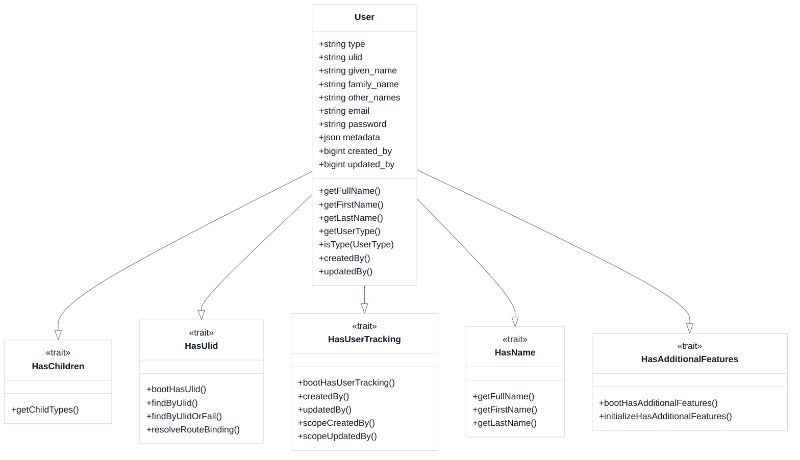
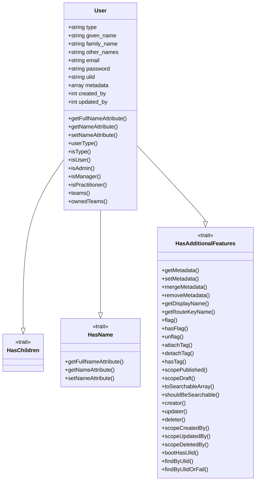

# Update User Model

<link rel="stylesheet" href="../../assets/css/styles.css">
<link rel="stylesheet" href="../../assets/css/ume-docs-enhancements.css">
<script src="../../assets/js/ume-docs-enhancements.js"></script>

<ul class="breadcrumb-navigation">
    <li><a href="../../000-index.md">UME Tutorial</a></li>
    <li><a href="../000-index.md">Implementation</a></li>
    <li><a href="./000-index.md">Phase 1: Core Models</a></li>
    <li><a href="./090-update-user-model.md">Update User Model</a></li>
</ul>

<div class="section-metadata">
    <div class="time-estimate">
        <span class="icon">⏱️</span>
        <span class="label">Time Estimate:</span>
        <span class="value">45-60 minutes</span>
    </div>
    <div class="difficulty-level">
        <span class="icon">🔶🔶</span>
        <span class="label">Difficulty:</span>
        <span class="value">Intermediate</span>
        <span class="explanation">Requires understanding of Laravel models, traits, and Single Table Inheritance</span>
    </div>
    <div class="prerequisites">
        <span class="icon">📋</span>
        <span class="label">Prerequisites:</span>
        <ul>
            <li>Understanding of Single Table Inheritance</li>
            <li>Understanding of Eloquent Models & Relationships</li>
            <li>Familiarity with HasUlid and HasUserTracking traits</li>
        </ul>
    </div>
    <div class="learning-outcomes">
        <span class="icon">🎯</span>
        <span class="label">You'll Learn:</span>
        <ul>
            <li>How to enhance the Laravel User model</li>
            <li>How to implement Single Table Inheritance</li>
            <li>How to integrate multiple traits</li>
            <li>How to handle name components properly</li>
        </ul>
    </div>
</div>

## Goal

Update the Laravel User model to support Single Table Inheritance (STI), name components, ULIDs, user tracking, and additional features.

## Overview

We need to enhance the default User model to:

1. **Support STI**: Add the HasChildren trait from Parental
2. **Handle Name Components**: Replace the single name field with given_name, family_name, and other_names
3. **Use ULIDs**: Add ULID support for better IDs
4. **Track User Actions**: Add user tracking functionality
5. **Support Metadata**: Add flexible metadata storage



<div class="mermaid-caption">Figure 1: Enhanced User model with traits and key methods</div>

## Step 1: Update the User Model

Open the `app/Models/User.php` file and update it:

```php
<?php

namespace App\Models;

use App\Enums\UserType;
use App\Models\Traits\HasAdditionalFeatures;
use App\Traits\HasName;
use Illuminate\Database\Eloquent\Factories\HasFactory;
use Illuminate\Foundation\Auth\User as Authenticatable;
use Illuminate\Notifications\Notifiable;
use Laravel\Sanctum\HasApiTokens;
use Tightenco\Parental\HasChildren;

class User extends Authenticatable
{
    use HasApiTokens,
        HasFactory,
        Notifiable,
        HasChildren,
        HasName,
        HasAdditionalFeatures;

    /**
     * The attributes that are mass assignable.
     *
     * @var array<int, string>
     */
    protected $fillable = [
        'type',
        'given_name',
        'family_name',
        'other_names',
        'email',
        'password',
        'ulid',
        'metadata',
        'created_by',
        'updated_by',
    ];

    /**
     * The attributes that should be hidden for serialization.
     *
     * @var array<int, string>
     */
    protected $hidden = [
        'password',
        'remember_token',
    ];

    /**
     * The attributes that should be cast.
     *
     * @var array<string, string>
     */
    protected $casts = [
        'email_verified_at' => 'datetime',
        'metadata' => 'array',
    ];

    /**
     * Get the user type enum for this user.
     *
     * @return \App\Enums\UserType|null
     */
    public function userType(): ?UserType
    {
        return UserType::fromClass($this->type);
    }

    /**
     * Check if the user is a specific type.
     *
     * @param \App\Enums\UserType $type
     * @return bool
     */
    public function isType(UserType $type): bool
    {
        return $this->type === $type->value;
    }

    /**
     * Check if the user is a regular user.
     *
     * @return bool
     */
    public function isUser(): bool
    {
        return $this->isType(UserType::USER);
    }

    /**
     * Check if the user is an admin.
     *
     * @return bool
     */
    public function isAdmin(): bool
    {
        return $this->isType(UserType::ADMIN);
    }

    /**
     * Check if the user is a manager.
     *
     * @return bool
     */
    public function isManager(): bool
    {
        return $this->isType(UserType::MANAGER);
    }

    /**
     * Check if the user is a practitioner.
     *
     * @return bool
     */
    public function isPractitioner(): bool
    {
        return $this->isType(UserType::PRACTITIONER);
    }

    /**
     * Get the teams that the user belongs to.
     *
     * @return \Illuminate\Database\Eloquent\Relations\BelongsToMany
     */
    public function teams()
    {
        return $this->belongsToMany(Team::class)
                    ->withTimestamps()
                    ->withPivot('role');
    }

    /**
     * Get the teams that the user owns.
     *
     * @return \Illuminate\Database\Eloquent\Relations\HasMany
     */
    public function ownedTeams()
    {
        return $this->hasMany(Team::class, 'owner_id');
    }
}
```

## Step 2: Create the HasName Trait

Create a new file at `app/Traits/HasName.php`:

```php
<?php

namespace App\Traits;

trait HasName
{
    /**
     * Get the user's full name.
     *
     * @return string
     */
    public function getFullNameAttribute(): string
    {
        if ($this->other_names) {
            return "{$this->given_name} {$this->other_names} {$this->family_name}";
        }

        return "{$this->given_name} {$this->family_name}";
    }

    /**
     * Get the user's name (for backward compatibility).
     *
     * @return string
     */
    public function getNameAttribute(): string
    {
        return $this->full_name;
    }

    /**
     * Set the user's name by parsing a full name string.
     *
     * @param string $value
     * @return void
     */
    public function setNameAttribute(string $value): void
    {
        $parts = explode(' ', $value);

        if (count($parts) === 1) {
            $this->given_name = $parts[0];
            $this->family_name = null;
            $this->other_names = null;
        } elseif (count($parts) === 2) {
            $this->given_name = $parts[0];
            $this->family_name = $parts[1];
            $this->other_names = null;
        } else {
            $this->given_name = array_shift($parts);
            $this->family_name = array_pop($parts);
            $this->other_names = implode(' ', $parts);
        }
    }
}
```

## Step 3: Use the HasAdditionalFeatures Trait

We've already created the `HasAdditionalFeatures` trait in [Create HasAdditionalFeatures Trait](./080-create-additional-features-trait.md). This trait provides a comprehensive set of features for our models, including:

1. ULID generation
2. User tracking
3. Sluggable URLs
4. Activity logging
5. Comments
6. Tagging
7. Flags
8. Search indexing
9. Soft deletes

The trait consolidates functionality from the separate `HasUlid` and `HasUserTracking` traits, making it easier to manage and configure these features. It also includes metadata functionality for storing flexible data:

```php
// Get metadata
$preferences = $user->getMetadata('preferences');

// Set metadata
$user->setMetadata('preferences', ['theme' => 'dark']);

// Merge metadata
$user->mergeMetadata('preferences', ['font' => 'sans-serif']);

// Remove metadata
$user->removeMetadata('preferences');
```

## Testing the Updated User Model

Let's create a test to ensure our updated User model works correctly:

```php
<?php

namespace Tests\Unit\Models;

use App\Enums\UserType;use App\Models\User;use Illuminate\Foundation\Testing\RefreshDatabase;use old\TestCase;use PHPUnit\Framework\Attributes\Test;

class UserModelTest extends TestCase
{
    use RefreshDatabase;

    #[Test]
    public function it_has_name_components()
    {
        $user = User::factory()->create([
            'given_name' => 'John',
            'family_name' => 'Doe',
            'other_names' => 'Smith',
        ]);

        $this->assertEquals('John', $user->given_name);
        $this->assertEquals('Doe', $user->family_name);
        $this->assertEquals('Smith', $user->other_names);
        $this->assertEquals('John Smith Doe', $user->full_name);
        $this->assertEquals('John Smith Doe', $user->name); // Backward compatibility
    }

    #[Test]
    public function it_can_set_name_from_string()
    {
        $user = new User();
        $user->name = 'John Doe';

        $this->assertEquals('John', $user->given_name);
        $this->assertEquals('Doe', $user->family_name);
        $this->assertNull($user->other_names);
    }

    #[Test]
    public function it_has_ulid()
    {
        $user = User::factory()->create();

        $this->assertNotNull($user->ulid);
        $this->assertEquals(26, strlen($user->ulid));
    }

    #[Test]
    public function it_can_get_user_type()
    {
        $user = User::factory()->create([
            'type' => User::class,
        ]);

        $this->assertEquals(UserType::USER, $user->userType());
        $this->assertTrue($user->isUser());
        $this->assertFalse($user->isAdmin());
    }

    #[Test]
    public function it_can_store_metadata()
    {
        $user = User::factory()->create();

        $user->setMetadata('preferences', ['theme' => 'dark']);
        $user->save();

        $user->refresh();

        $this->assertEquals(['theme' => 'dark'], $user->getMetadata('preferences'));
    }

    #[Test]
    public function it_can_add_and_check_flags()
    {
        $user = User::factory()->create();

        // Add a flag
        $user->flag('verified');

        // Check if the flag exists
        $this->assertTrue($user->hasFlag('verified'));
        $this->assertFalse($user->hasFlag('featured'));
    }

    #[Test]
    public function it_can_add_and_query_tags()
    {
        $user = User::factory()->create();

        // Add tags
        $user->attachTag('developer');
        $user->attachTag('admin', 'role');

        // Check if tags exist
        $this->assertTrue($user->hasTag('developer'));
        $this->assertTrue($user->hasTag('admin', 'role'));
    }

    #[Test]
    public function it_can_use_published_scope()
    {
        // Create published and unpublished users
        $publishedUser = User::factory()->create(['published' => true]);
        $unpublishedUser = User::factory()->create(['published' => false]);

        // Query published users
        $publishedUsers = User::published()->get();

        // Check results
        $this->assertTrue($publishedUsers->contains($publishedUser));
        $this->assertFalse($publishedUsers->contains($unpublishedUser));
    }

    #[Test]
    public function it_tracks_user_who_created_model()
    {
        // Create a user to act as
        $actingUser = User::factory()->create();

        // Act as the user
        $this->actingAs($actingUser);

        // Create a new user
        $user = User::factory()->create();

        // Check that the created_by field is set
        $this->assertEquals($actingUser->id, $user->created_by);
    }

    #[Test]
    public function it_tracks_user_who_updated_model()
    {
        // Create users
        $user = User::factory()->create();
        $actingUser = User::factory()->create();

        // Act as the user
        $this->actingAs($actingUser);

        // Update the user
        $user->given_name = 'Updated';
        $user->save();

        // Check that the updated_by field is set
        $this->assertEquals($actingUser->id, $user->fresh()->updated_by);
    }

    #[Test]
    public function it_can_get_creator_and_updater()
    {
        // Create users
        $creator = User::factory()->create();
        $updater = User::factory()->create();

        // Create a user with creator
        $this->actingAs($creator);
        $user = User::factory()->create();

        // Update the user with updater
        $this->actingAs($updater);
        $user->given_name = 'Updated';
        $user->save();

        // Check relationships
        $this->assertEquals($creator->id, $user->fresh()->creator->id);
        $this->assertEquals($updater->id, $user->fresh()->updater->id);
    }
}
```

## Diagram: Updated User Model



<div class="mermaid-caption">Figure 2: User model with methods and traits</div>

## User Model and Child Models Relationship

```mermaid
%%{init: {'theme': 'base', 'themeVariables': {'primaryColor': '#f3f4f6', 'lineColor': '#6b7280', 'textColor': '#111827', 'mainBkg': '#ffffff', 'secondaryColor': '#60a5fa', 'tertiaryColor': '#e5e7eb'}}}%%
classDiagram
    class User {
        <<Base Model>>
        +string type
        +HasChildren trait
        +getUserType()
        +isType(UserType)
    }

    class Admin {
        <<Child Model>>
        +HasParent trait
        +adminSpecificMethod()
    }

    class Manager {
        <<Child Model>>
        +HasParent trait
        +managerSpecificMethod()
    }

    class Practitioner {
        <<Child Model>>
        +HasParent trait
        +practitionerSpecificMethod()
    }

    User <|-- Admin
    User <|-- Manager
    User <|-- Practitioner

    class UserType {
        <<enum>>
        +USER
        +ADMIN
        +MANAGER
        +PRACTITIONER
        +fromModel(Model)
        +modelClass()
    }

    User -- UserType : uses
    Admin -- UserType : references
    Manager -- UserType : references
    Practitioner -- UserType : references

    classDef baseModel fill:#dbeafe,stroke:#60a5fa,stroke-width:2px,color:#1e40af
    classDef childModel fill:#e0e7ff,stroke:#6366f1,stroke-width:2px,color:#3730a3
    classDef enumClass fill:#f0fdf4,stroke:#22c55e,stroke-width:2px,color:#166534

    class User baseModel
    class Admin,Manager,Practitioner childModel
    class UserType enumClass
```

<div class="mermaid-caption">Figure 3: Relationship between User model, child models, and UserType enum</div>

## Quick Reference

<div class="quick-reference">
    <h2>User Model Quick Reference</h2>

    <div class="key-concepts">
        <dl>
            <dt>Single Table Inheritance</dt>
            <dd>Using the HasChildren trait to support different user types in a single table</dd>

            <dt>Name Components</dt>
            <dd>Splitting the name field into given_name, family_name, and other_names for better internationalization</dd>

            <dt>ULID Support</dt>
            <dd>Using ULIDs for better IDs that are sortable and more secure than sequential IDs</dd>
        </dl>
    </div>

    <div class="syntax">
        <h3>Common Usage Patterns</h3>
        <pre><code>// Creating a user with name components
$user = User::create([
    'given_name' => 'John',
    'family_name' => 'Doe',
    'email' => 'john@example.com',
]);

// Getting the full name
$fullName = $user->full_name; // "John Doe"

// Checking user type
if ($user->isType(UserType::ADMIN)) {
    // Admin-specific code
}

// Finding by ULID
$user = User::findByUlid('01ARZ3NDEKTSV4RRFFQ69G5FAV');</code></pre>
    </div>

    <div class="gotchas">
        <h3>Common Pitfalls</h3>
        <ul>
            <li>Forgetting to set the type column when creating users</li>
            <li>Using the name attribute instead of given_name/family_name</li>
            <li>Not handling null values for optional name components</li>
            <li>Forgetting to include HasChildren trait for STI</li>
        </ul>
    </div>
</div>

## Troubleshooting

<div class="troubleshooting-guide">
    <h2>User Model Issues</h2>

    <div class="symptoms">
        <h3>Symptoms</h3>
        <ul>
            <li>User type not being recognized correctly</li>
            <li>Name components not working as expected</li>
            <li>ULID not being generated</li>
            <li>User tracking not recording creators/updaters</li>
        </ul>
    </div>

    <div class="causes">
        <h3>Possible Causes</h3>
        <ol>
            <li>Missing traits in the User model</li>
            <li>Incorrect column names in the database</li>
            <li>Type column not set correctly</li>
            <li>Using methods that bypass Eloquent events</li>
        </ol>
    </div>

    <div class="solutions">
        <h3>Solutions</h3>

        <h4>For Missing Traits</h4>
        <p>Ensure all required traits are included:</p>
        <pre><code>use HasFactory, Notifiable, HasApiTokens;
use HasChildren; // For STI
use HasUlid; // For ULID support
use HasUserTracking; // For tracking
use HasName; // For name components</code></pre>

        <h4>For Type Column Issues</h4>
        <p>Set the type column correctly:</p>
        <pre><code>// When creating a user
$user = User::create([
    'type' => UserType::ADMIN->value, // Use the enum value
    // Other fields
]);</code></pre>

        <h4>For Name Component Issues</h4>
        <p>Use the correct name component fields:</p>
        <pre><code>// Correct approach
$user->given_name = 'John';
$user->family_name = 'Doe';

// Instead of
$user->name = 'John Doe'; // This will be split automatically</code></pre>
    </div>

    <div class="prevention">
        <h3>Prevention</h3>
        <ul>
            <li>Create factory methods for different user types</li>
            <li>Use the UserType enum for type values</li>
            <li>Always use the correct name component fields</li>
            <li>Write tests that verify model functionality</li>
        </ul>
    </div>
</div>

## Next Steps

<div class="page-navigation">
    <a href="080-eloquent-models.md" class="prev">Eloquent Models & Relationships</a>
    <a href="100-create-child-models.md" class="next">Create Child Models</a>
</div>

Now that we've updated the User model, let's move on to [Create Child Models](./100-create-child-models.md) to implement the specialized user types for our Single Table Inheritance structure.
