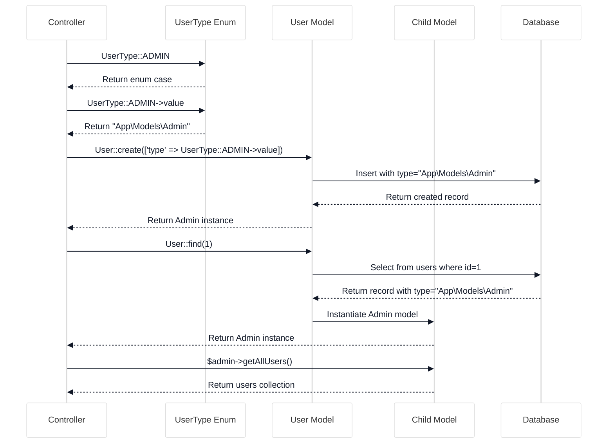

# Create Child Models

<link rel="stylesheet" href="../../assets/css/styles.css">
<link rel="stylesheet" href="../../assets/css/ume-docs-enhancements.css">
<script src="../../assets/js/ume-docs-enhancements.js"></script>

<ul class="breadcrumb-navigation">
    <li><a href="../../000-index.md">UME Tutorial</a></li>
    <li><a href="../000-index.md">Implementation</a></li>
    <li><a href="./000-index.md">Phase 1: Core Models</a></li>
    <li><a href="./100-create-child-models.md">Create Child Models</a></li>
</ul>

<div class="section-metadata">
    <div class="time-estimate">
        <span class="icon">⏱️</span>
        <span class="label">Time Estimate:</span>
        <span class="value">30-45 minutes</span>
    </div>
    <div class="difficulty-level">
        <span class="icon">🔶🔶</span>
        <span class="label">Difficulty:</span>
        <span class="value">Intermediate</span>
        <span class="explanation">Requires understanding of Single Table Inheritance and Laravel models</span>
    </div>
    <div class="prerequisites">
        <span class="icon">📋</span>
        <span class="label">Prerequisites:</span>
        <ul>
            <li>Understanding of Single Table Inheritance</li>
            <li>Updated User model implementation</li>
            <li>Familiarity with UserType enum</li>
        </ul>
    </div>
    <div class="learning-outcomes">
        <span class="icon">🎯</span>
        <span class="label">You'll Learn:</span>
        <ul>
            <li>How to create child models using Single Table Inheritance</li>
            <li>How to implement type-specific functionality</li>
            <li>How to use the HasParent trait</li>
            <li>How to test child models</li>
        </ul>
    </div>
</div>

## Goal

Create specialized child models (`Admin`, `Manager`, and `Practitioner`) that extend the base `User` model using Single Table Inheritance.

## Overview

In our Single Table Inheritance (STI) implementation, we'll create three child models that extend the base User model:

1. **Admin**: System administrators with full access
2. **Manager**: Users who manage teams and other users
3. **Practitioner**: Professional users with client management capabilities

```mermaid
%%{init: {'theme': 'base', 'themeVariables': {'primaryColor': '#f3f4f6', 'lineColor': '#6b7280', 'textColor': '#111827', 'mainBkg': '#ffffff', 'secondaryColor': '#60a5fa', 'tertiaryColor': '#e5e7eb'}}}%%
classDiagram
    class User {
        <<Base Model>>
        +string type
        +string ulid
        +string given_name
        +string family_name
        +string email
        +HasChildren trait
        +getFullName()
        +getUserType()
        +isType(UserType)
    }

    class Admin {
        <<Child Model>>
        +HasParent trait
        +canAccessAdminPanel()
        +hasFullAccess()
        +getAdminDashboardUrl()
    }

    class Manager {
        <<Child Model>>
        +HasParent trait
        +canManageTeam()
        +getTeamMembers()
        +getManagerDashboardUrl()
    }

    class Practitioner {
        <<Child Model>>
        +HasParent trait
        +getClients()
        +getSchedule()
        +getPractitionerDashboardUrl()
    }

    User <|-- Admin
    User <|-- Manager
    User <|-- Practitioner

    classDef baseModel fill:#dbeafe,stroke:#60a5fa,stroke-width:2px,color:#1e40af
    classDef childModel fill:#e0e7ff,stroke:#6366f1,stroke-width:2px,color:#3730a3

    class User baseModel
    class Admin,Manager,Practitioner childModel
```

<div class="mermaid-caption">Figure 1: Child models extending the base User model</div>

Each child model will:
- Extend the base User model
- Use the HasParent trait from Parental
- Add type-specific methods and properties

## Step 1: Create the Admin Model

Create a new file at `app/Models/Admin.php`:

```php
<?php

namespace App\Models;

use Tightenco\Parental\HasParent;

class Admin extends User
{
    use HasParent;

    /**
     * Get all users in the system.
     *
     * @return \Illuminate\Database\Eloquent\Collection
     */
    public function getAllUsers()
    {
        return User::all();
    }

    /**
     * Check if the admin has access to a specific feature.
     *
     * @param string $feature
     * @return bool
     */
    public function hasAccessTo(string $feature): bool
    {
        // Admins have access to all features by default
        return true;
    }

    /**
     * Get the admin dashboard URL.
     *
     * @return string
     */
    public function getDashboardUrl(): string
    {
        return route('admin.dashboard');
    }
}
```

## Step 2: Create the Manager Model

Create a new file at `app/Models/Manager.php`:

```php
<?php

namespace App\Models;

use Tightenco\Parental\HasParent;

class Manager extends User
{
    use HasParent;

    /**
     * Get all teams managed by this manager.
     *
     * @return \Illuminate\Database\Eloquent\Collection
     */
    public function getManagedTeams()
    {
        return $this->ownedTeams;
    }

    /**
     * Get all users in the teams managed by this manager.
     *
     * @return \Illuminate\Database\Eloquent\Collection
     */
    public function getTeamMembers()
    {
        $teamIds = $this->ownedTeams()->pluck('id');

        return User::whereHas('teams', function ($query) use ($teamIds) {
            $query->whereIn('team_id', $teamIds);
        })->get();
    }

    /**
     * Check if the manager has access to a specific feature.
     *
     * @param string $feature
     * @return bool
     */
    public function hasAccessTo(string $feature): bool
    {
        $managerFeatures = [
            'team.manage',
            'team.view',
            'team-members.invite',
            'team-members.remove',
            'team-settings.edit',
            'reports.view',
        ];

        return in_array($feature, $managerFeatures);
    }

    /**
     * Get the manager dashboard URL.
     *
     * @return string
     */
    public function getDashboardUrl(): string
    {
        return route('manager.dashboard');
    }
}
```

## Step 3: Create the Practitioner Model

Create a new file at `app/Models/Practitioner.php`:

```php
<?php

namespace App\Models;

use Tightenco\Parental\HasParent;

class Practitioner extends User
{
    use HasParent;

    /**
     * Get the practitioner's clients.
     *
     * @return \Illuminate\Database\Eloquent\Collection
     */
    public function getClients()
    {
        // This would be implemented when we have a Client model
        // return $this->hasMany(Client::class);
        return collect();
    }

    /**
     * Get the practitioner's schedule.
     *
     * @return \Illuminate\Database\Eloquent\Collection
     */
    public function getSchedule()
    {
        // This would be implemented when we have an Appointment model
        // return $this->hasMany(Appointment::class);
        return collect();
    }

    /**
     * Check if the practitioner has access to a specific feature.
     *
     * @param string $feature
     * @return bool
     */
    public function hasAccessTo(string $feature): bool
    {
        $practitionerFeatures = [
            'practice.access',
            'clients.view',
            'clients.manage',
            'schedule.view',
            'schedule.manage',
        ];

        return in_array($feature, $practitionerFeatures);
    }

    /**
     * Get the practitioner dashboard URL.
     *
     * @return string
     */
    public function getDashboardUrl(): string
    {
        return route('practitioner.dashboard');
    }
}
```

## Testing the Child Models

Let's create tests to ensure our child models work correctly:

```php
<?php

namespace Tests\Unit\Models;

use App\Models\Admin;use App\Models\Manager;use App\Models\Practitioner;use App\Models\User;use Illuminate\Foundation\Testing\RefreshDatabase;use old\TestCase;use PHPUnit\Framework\Attributes\Test;

class ChildModelsTest extends TestCase
{
    use RefreshDatabase;

    #[Test]
    public function admin_model_has_correct_type()
    {
        $admin = Admin::factory()->create();

        $this->assertEquals(Admin::class, $admin->type);
        $this->assertInstanceOf(Admin::class, $admin);
        $this->assertInstanceOf(User::class, $admin);
    }

    #[Test]
    public function manager_model_has_correct_type()
    {
        $manager = Manager::factory()->create();

        $this->assertEquals(Manager::class, $manager->type);
        $this->assertInstanceOf(Manager::class, $manager);
        $this->assertInstanceOf(User::class, $manager);
    }

    #[Test]
    public function practitioner_model_has_correct_type()
    {
        $practitioner = Practitioner::factory()->create();

        $this->assertEquals(Practitioner::class, $practitioner->type);
        $this->assertInstanceOf(Practitioner::class, $practitioner);
        $this->assertInstanceOf(User::class, $practitioner);
    }

    #[Test]
    public function admin_has_access_to_all_features()
    {
        $admin = Admin::factory()->create();

        $this->assertTrue($admin->hasAccessTo('any.feature'));
        $this->assertTrue($admin->hasAccessTo('admin.access'));
    }

    #[Test]
    public function manager_has_access_to_team_features()
    {
        $manager = Manager::factory()->create();

        $this->assertTrue($manager->hasAccessTo('team.manage'));
        $this->assertTrue($manager->hasAccessTo('team-members.invite'));
        $this->assertFalse($manager->hasAccessTo('admin.access'));
    }

    #[Test]
    public function practitioner_has_access_to_practice_features()
    {
        $practitioner = Practitioner::factory()->create();

        $this->assertTrue($practitioner->hasAccessTo('clients.manage'));
        $this->assertTrue($practitioner->hasAccessTo('schedule.view'));
        $this->assertFalse($practitioner->hasAccessTo('team.manage'));
    }
}
```

## Using Child Models in the Application

Here are some examples of how to use the child models in your application:

### Creating Instances

```php
// Create a new Admin
$admin = Admin::create([
    'given_name' => 'Admin',
    'family_name' => 'User',
    'email' => 'admin@example.com',
    'password' => bcrypt('password'),
]);

// Create a new Manager
$manager = Manager::create([
    'given_name' => 'Manager',
    'family_name' => 'User',
    'email' => 'manager@example.com',
    'password' => bcrypt('password'),
]);

// Create a new Practitioner
$practitioner = Practitioner::create([
    'given_name' => 'Practitioner',
    'family_name' => 'User',
    'email' => 'practitioner@example.com',
    'password' => bcrypt('password'),
]);
```

### Querying Specific Types

```php
// Get all admins
$admins = Admin::all();

// Get all managers
$managers = Manager::all();

// Get all practitioners
$practitioners = Practitioner::all();
```

### Converting Between Types

```php
// Convert a User to an Admin
$user = User::find(1);
$admin = $user->convertToChildType(Admin::class);
$admin->save();

// Convert an Admin to a Manager
$admin = Admin::find(1);
$manager = $admin->convertToChildType(Manager::class);
$manager->save();
```

## Diagram: Child Models Hierarchy

```mermaid
%%{init: {'theme': 'base', 'themeVariables': {'primaryColor': '#f3f4f6', 'lineColor': '#6b7280', 'textColor': '#111827', 'mainBkg': '#ffffff', 'secondaryColor': '#60a5fa', 'tertiaryColor': '#e5e7eb'}}}%%
classDiagram
    class User {
        +string type
        +string given_name
        +string family_name
        +userType()
        +isType()
    }

    class Admin {
        +getAllUsers()
        +hasAccessTo()
        +getDashboardUrl()
    }

    class Manager {
        +getManagedTeams()
        +getTeamMembers()
        +hasAccessTo()
        +getDashboardUrl()
    }

    class Practitioner {
        +getClients()
        +getSchedule()
        +hasAccessTo()
        +getDashboardUrl()
    }

    User <|-- Admin
    User <|-- Manager
    User <|-- Practitioner

    classDef baseModel fill:#dbeafe,stroke:#60a5fa,stroke-width:2px,color:#1e40af
    classDef childModel fill:#e0e7ff,stroke:#6366f1,stroke-width:2px,color:#3730a3

    class User baseModel
    class Admin,Manager,Practitioner childModel
```

<div class="mermaid-caption">Figure 2: Child models with their specific methods</div>

## Child Models and UserType Enum Integration



<div class="mermaid-caption">Figure 3: Interaction between UserType enum, User model, and child models</div>

## Quick Reference

<div class="quick-reference">
    <h2>Child Models Quick Reference</h2>

    <div class="key-concepts">
        <dl>
            <dt>HasParent Trait</dt>
            <dd>A trait from the Parental package that allows a model to be a child in Single Table Inheritance</dd>

            <dt>Type Column</dt>
            <dd>The column that stores the fully qualified class name of the model (e.g., App\Models\Admin)</dd>

            <dt>Type-Specific Methods</dt>
            <dd>Methods that are only available on specific child models and implement specialized functionality</dd>
        </dl>
    </div>

    <div class="syntax">
        <h3>Common Usage Patterns</h3>
        <pre><code>// Creating a child model instance
$admin = Admin::create([
    'given_name' => 'John',
    'family_name' => 'Doe',
    'email' => 'admin@example.com',
]);

// Checking model type
if ($user instanceof Admin) {
    // Admin-specific code
}

// Using UserType enum with child models
if ($user->isType(UserType::ADMIN)) {
    // Admin-specific code
}

// Using type-specific methods
$admin->getAllUsers(); // Only available on Admin model
$manager->getTeamMembers(); // Only available on Manager model</code></pre>
    </div>

    <div class="gotchas">
        <h3>Common Pitfalls</h3>
        <ul>
            <li>Forgetting to include the HasParent trait in child models</li>
            <li>Trying to use child-specific methods on the base User model</li>
            <li>Not checking the model type before using type-specific methods</li>
            <li>Overriding methods from the parent model incorrectly</li>
        </ul>
    </div>
</div>

## Troubleshooting

<div class="troubleshooting-guide">
    <h2>Child Model Issues</h2>

    <div class="symptoms">
        <h3>Symptoms</h3>
        <ul>
            <li>Child model not being instantiated correctly</li>
            <li>Type-specific methods not available</li>
            <li>instanceof checks returning false</li>
            <li>Method not found errors</li>
        </ul>
    </div>

    <div class="causes">
        <h3>Possible Causes</h3>
        <ol>
            <li>Missing HasParent trait in child models</li>
            <li>Missing HasChildren trait in parent model</li>
            <li>Incorrect type column value</li>
            <li>Namespace issues</li>
        </ol>
    </div>

    <div class="solutions">
        <h3>Solutions</h3>

        <h4>For Missing Traits</h4>
        <p>Ensure traits are properly included:</p>
        <pre><code>// In User model
use Parental\HasChildren;

class User extends Authenticatable
{
    use HasChildren;
    // ...
}

// In child models
use Parental\HasParent;

class Admin extends User
{
    use HasParent;
    // ...
}</code></pre>

        <h4>For Type Column Issues</h4>
        <p>Verify the type column contains the correct class name:</p>
        <pre><code>// Check the type column value
$admin = Admin::create([/* ... */]);
echo $admin->type; // Should be "App\Models\Admin"</code></pre>

        <h4>For Method Not Found Errors</h4>
        <p>Check the model type before using type-specific methods:</p>
        <pre><code>// Safe approach
if ($user instanceof Admin) {
    $user->getAllUsers();
} elseif ($user instanceof Manager) {
    $user->getTeamMembers();
}</code></pre>
    </div>

    <div class="prevention">
        <h3>Prevention</h3>
        <ul>
            <li>Create factory methods for each child model type</li>
            <li>Write tests that verify child model instantiation</li>
            <li>Use type checking before calling type-specific methods</li>
            <li>Document type-specific methods clearly</li>
        </ul>
    </div>
</div>

## Next Steps

<div class="page-navigation">
    <a href="090-update-user-model.md" class="prev">Update User Model</a>
    <a href="110-team-model.md" class="next">Team Model & Migration</a>
</div>

Now that we've created our child models, let's move on to [Create Team Model & Migration](./110-team-model.md) to implement the Team functionality that will work with our user types.
