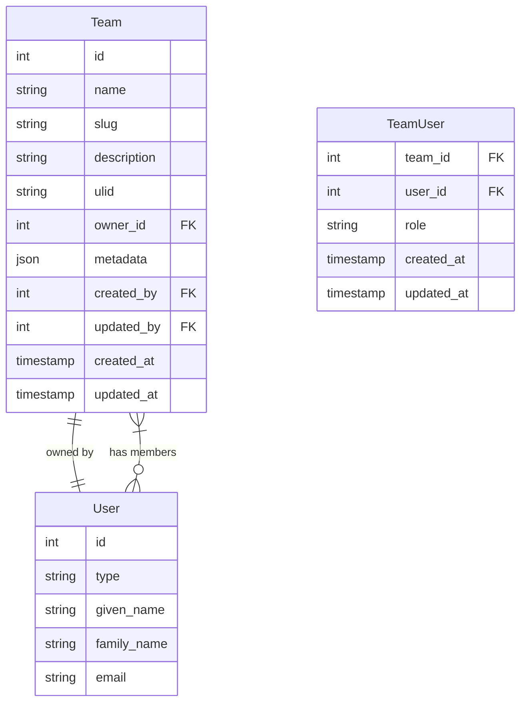

# Create Team Model & Migration

<link rel="stylesheet" href="../../assets/css/styles.css">

## Goal

Create a Team model and migration to support team-based functionality in our application.

## Overview

Teams are a fundamental organizational unit in our application. Users can belong to multiple teams, and teams can have multiple users. We'll implement:

1. **Team Model**: Define the Team model with relationships to users
2. **Teams Migration**: Create the database table for teams
3. **Relationships**: Set up the relationships between teams and users

## Step 1: Create the Team Migration

Let's create a migration for the teams table:

```bash
php artisan make:migration create_teams_table
```

Open the newly created migration file and implement it:

```php
<?php

use Illuminate\Database\Migrations\Migration;
use Illuminate\Database\Schema\Blueprint;
use Illuminate\Support\Facades\Schema;

class CreateTeamsTable extends Migration
{
    /**
     * Run the migrations.
     *
     * @return void
     */
    public function up()
    {
        Schema::create('teams', function (Blueprint $table) {
            $table->id();
            $table->string('name');
            $table->string('slug')->unique();
            $table->text('description')->nullable();
            $table->string('ulid', 26)->unique();
            $table->foreignId('owner_id')->constrained('users')->onDelete('cascade');
            $table->json('metadata')->nullable();
            $table->foreignId('created_by')->nullable()->constrained('users')->nullOnDelete();
            $table->foreignId('updated_by')->nullable()->constrained('users')->nullOnDelete();
            $table->timestamps();
        });
    }

    /**
     * Reverse the migrations.
     *
     * @return void
     */
    public function down()
    {
        Schema::dropIfExists('teams');
    }
}
```

## Step 2: Create the Team Model

Create a new file at `app/Models/Team.php`:

```php
<?php

namespace App\Models;

use App\Traits\HasAdditionalFeatures;
use App\Traits\HasUlid;
use App\Traits\HasUserTracking;
use Illuminate\Database\Eloquent\Factories\HasFactory;
use Illuminate\Database\Eloquent\Model;
use Illuminate\Support\Str;

class Team extends Model
{
    use HasFactory, HasUlid, HasUserTracking, HasAdditionalFeatures;

    /**
     * The attributes that are mass assignable.
     *
     * @var array<int, string>
     */
    protected $fillable = [
        'name',
        'slug',
        'description',
        'owner_id',
        'ulid',
        'metadata',
        'created_by',
        'updated_by',
    ];

    /**
     * The attributes that should be cast.
     *
     * @var array<string, string>
     */
    protected $casts = [
        'metadata' => 'array',
    ];

    /**
     * Boot the model.
     *
     * @return void
     */
    protected static function boot()
    {
        parent::boot();

        static::creating(function ($team) {
            if (empty($team->slug)) {
                $team->slug = Str::slug($team->name);
            }
        });
    }

    /**
     * Get the owner of the team.
     *
     * @return \Illuminate\Database\Eloquent\Relations\BelongsTo
     */
    public function owner()
    {
        return $this->belongsTo(User::class, 'owner_id');
    }

    /**
     * Get the members of the team.
     *
     * @return \Illuminate\Database\Eloquent\Relations\BelongsToMany
     */
    public function members()
    {
        return $this->belongsToMany(User::class)
                    ->withTimestamps()
                    ->withPivot('role');
    }

    /**
     * Get the admins of the team.
     *
     * @return \Illuminate\Database\Eloquent\Relations\BelongsToMany
     */
    public function admins()
    {
        return $this->belongsToMany(User::class)
                    ->withTimestamps()
                    ->withPivot('role')
                    ->wherePivot('role', 'admin');
    }

    /**
     * Check if a user is a member of the team.
     *
     * @param \App\Models\User $user
     * @return bool
     */
    public function hasMember(User $user): bool
    {
        return $this->members()->where('user_id', $user->id)->exists();
    }

    /**
     * Check if a user is an admin of the team.
     *
     * @param \App\Models\User $user
     * @return bool
     */
    public function hasAdmin(User $user): bool
    {
        return $this->admins()->where('user_id', $user->id)->exists();
    }

    /**
     * Check if a user is the owner of the team.
     *
     * @param \App\Models\User $user
     * @return bool
     */
    public function isOwnedBy(User $user): bool
    {
        return $this->owner_id === $user->id;
    }

    /**
     * Add a member to the team.
     *
     * @param \App\Models\User $user
     * @param string $role
     * @return void
     */
    public function addMember(User $user, string $role = 'member'): void
    {
        if (!$this->hasMember($user)) {
            $this->members()->attach($user, ['role' => $role]);
        }
    }

    /**
     * Remove a member from the team.
     *
     * @param \App\Models\User $user
     * @return void
     */
    public function removeMember(User $user): void
    {
        $this->members()->detach($user);
    }

    /**
     * Change a member's role.
     *
     * @param \App\Models\User $user
     * @param string $role
     * @return void
     */
    public function changeMemberRole(User $user, string $role): void
    {
        if ($this->hasMember($user)) {
            $this->members()->updateExistingPivot($user->id, ['role' => $role]);
        }
    }
}
```

## Step 3: Create a Team Factory

Create a new file at `database/factories/TeamFactory.php`:

```php
<?php

namespace Database\Factories;

use App\Models\Team;
use App\Models\User;
use Illuminate\Database\Eloquent\Factories\Factory;
use Illuminate\Support\Str;

class TeamFactory extends Factory
{
    /**
     * The name of the factory's corresponding model.
     *
     * @var string
     */
    protected $model = Team::class;

    /**
     * Define the model's default state.
     *
     * @return array
     */
    public function definition()
    {
        $name = $this->faker->company();
        
        return [
            'name' => $name,
            'slug' => Str::slug($name),
            'description' => $this->faker->paragraph(),
            'owner_id' => User::factory(),
            'metadata' => [
                'settings' => [
                    'color' => $this->faker->hexColor(),
                    'public' => $this->faker->boolean(20),
                ],
            ],
        ];
    }

    /**
     * Configure the model factory.
     *
     * @return $this
     */
    public function configure()
    {
        return $this->afterCreating(function (Team $team) {
            // Add the owner as a member with admin role
            $team->addMember($team->owner, 'admin');
        });
    }

    /**
     * Indicate that the team is public.
     *
     * @return \Illuminate\Database\Eloquent\Factories\Factory
     */
    public function public()
    {
        return $this->state(function (array $attributes) {
            $metadata = $attributes['metadata'] ?? [];
            $metadata['settings']['public'] = true;
            
            return [
                'metadata' => $metadata,
            ];
        });
    }

    /**
     * Indicate that the team is private.
     *
     * @return \Illuminate\Database\Eloquent\Factories\Factory
     */
    public function private()
    {
        return $this->state(function (array $attributes) {
            $metadata = $attributes['metadata'] ?? [];
            $metadata['settings']['public'] = false;
            
            return [
                'metadata' => $metadata,
            ];
        });
    }
}
```

## Testing the Team Model

Let's create a test to ensure our Team model works correctly:

```php
<?php

namespace Tests\Unit\Models;

use App\Models\Team;use App\Models\User;use Illuminate\Foundation\Testing\RefreshDatabase;use old\TestCase;use PHPUnit\Framework\Attributes\Test;

class TeamModelTest extends TestCase
{
    use RefreshDatabase;

    #[Test]
    public function it_can_create_a_team()
    {
        $owner = User::factory()->create();
        
        $team = Team::create([
            'name' => 'Test Team',
            'description' => 'A team for testing',
            'owner_id' => $owner->id,
        ]);
        
        $this->assertNotNull($team->id);
        $this->assertEquals('Test Team', $team->name);
        $this->assertEquals('test-team', $team->slug);
        $this->assertEquals($owner->id, $team->owner_id);
    }

    #[Test]
    public function it_has_ulid()
    {
        $team = Team::factory()->create();
        
        $this->assertNotNull($team->ulid);
        $this->assertEquals(26, strlen($team->ulid));
    }

    #[Test]
    public function it_can_add_and_remove_members()
    {
        $team = Team::factory()->create();
        $user = User::factory()->create();
        
        $team->addMember($user, 'member');
        
        $this->assertTrue($team->hasMember($user));
        $this->assertEquals(2, $team->members()->count()); // Owner + new member
        
        $team->removeMember($user);
        
        $this->assertFalse($team->hasMember($user));
        $this->assertEquals(1, $team->members()->count()); // Just the owner
    }

    #[Test]
    public function it_can_change_member_role()
    {
        $team = Team::factory()->create();
        $user = User::factory()->create();
        
        $team->addMember($user, 'member');
        $this->assertFalse($team->hasAdmin($user));
        
        $team->changeMemberRole($user, 'admin');
        $this->assertTrue($team->hasAdmin($user));
    }

    #[Test]
    public function it_can_check_ownership()
    {
        $owner = User::factory()->create();
        $nonOwner = User::factory()->create();
        
        $team = Team::factory()->create([
            'owner_id' => $owner->id,
        ]);
        
        $this->assertTrue($team->isOwnedBy($owner));
        $this->assertFalse($team->isOwnedBy($nonOwner));
    }

    #[Test]
    public function it_can_store_metadata()
    {
        $team = Team::factory()->create();
        
        $team->setMetadata('settings', ['theme' => 'dark']);
        $team->save();
        
        $team->refresh();
        
        $this->assertEquals(['theme' => 'dark'], $team->getMetadata('settings'));
    }
}
```

## Diagram: Team Model Relationships



## Next Steps

Now that we've created the Team model and migration, let's move on to [Create team_user Pivot Table Migration](./120-team-user-pivot.md) to implement the many-to-many relationship between teams and users.
