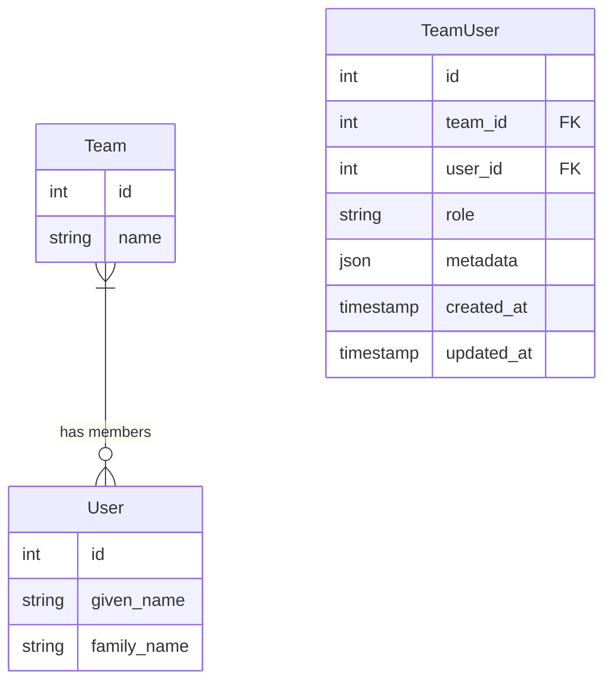

# Create team_user Pivot Table Migration

<link rel="stylesheet" href="../../assets/css/styles.css">

## Goal

Create a pivot table migration to establish the many-to-many relationship between teams and users, allowing users to belong to multiple teams and teams to have multiple members.

## Overview

A pivot table in Laravel is used to implement many-to-many relationships. In our case, we need a `team_user` table to:

1. **Connect Teams and Users**: Allow users to belong to multiple teams
2. **Store Additional Data**: Track the user's role within each team
3. **Maintain Referential Integrity**: Ensure data consistency with foreign keys

## Step 1: Create the Pivot Table Migration

Let's create a migration for the team_user pivot table:

```bash
php artisan make:migration create_team_user_table
```

Open the newly created migration file and implement it:

```php
<?php

use Illuminate\Database\Migrations\Migration;
use Illuminate\Database\Schema\Blueprint;
use Illuminate\Support\Facades\Schema;

class CreateTeamUserTable extends Migration
{
    /**
     * Run the migrations.
     *
     * @return void
     */
    public function up()
    {
        Schema::create('team_user', function (Blueprint $table) {
            $table->id();
            $table->foreignId('team_id')->constrained()->onDelete('cascade');
            $table->foreignId('user_id')->constrained()->onDelete('cascade');
            $table->string('role')->default('member');
            $table->json('metadata')->nullable();
            $table->timestamps();

            $table->unique(['team_id', 'user_id']);
        });
    }

    /**
     * Reverse the migrations.
     *
     * @return void
     */
    public function down()
    {
        Schema::dropIfExists('team_user');
    }
}
```

## Key Components of the Migration

### Primary Key

We've included an `id` column as the primary key. While some pivot tables use composite primary keys, having an auto-incrementing ID can be useful for:

- Referencing specific team-user relationships
- Simplifying certain queries
- Supporting additional relationships to the pivot record

### Foreign Keys

We've added foreign key constraints to maintain referential integrity:

```php
$table->foreignId('team_id')->constrained()->onDelete('cascade');
$table->foreignId('user_id')->constrained()->onDelete('cascade');
```

The `onDelete('cascade')` option ensures that if a team or user is deleted, all related pivot records are automatically deleted as well.

### Role Column

We've added a `role` column to store the user's role within the team:

```php
$table->string('role')->default('member');
```

This allows us to assign different roles to users within teams, such as:
- admin
- member
- moderator
- guest

### Metadata Column

We've added a `metadata` JSON column for storing additional flexible data:

```php
$table->json('metadata')->nullable();
```

This can be used for:
- Storing user preferences specific to a team
- Tracking user activity within a team
- Storing additional role-specific data

### Unique Constraint

We've added a unique constraint to ensure a user can only be added to a team once:

```php
$table->unique(['team_id', 'user_id']);
```

### Timestamps

We've included timestamps to track when a user was added to a team and when their relationship was last updated:

```php
$table->timestamps();
```

## Using the Pivot Table in Eloquent Relationships

The pivot table is used in the relationships we defined in our models:

### In the User Model

```php
/**
 * Get the teams that the user belongs to.
 *
 * @return \Illuminate\Database\Eloquent\Relations\BelongsToMany
 */
public function teams()
{
    return $this->belongsToMany(Team::class)
                ->withTimestamps()
                ->withPivot('role');
}
```

### In the Team Model

```php
/**
 * Get the members of the team.
 *
 * @return \Illuminate\Database\Eloquent\Relations\BelongsToMany
 */
public function members()
{
    return $this->belongsToMany(User::class)
                ->withTimestamps()
                ->withPivot('role');
}

/**
 * Get the admins of the team.
 *
 * @return \Illuminate\Database\Eloquent\Relations\BelongsToMany
 */
public function admins()
{
    return $this->belongsToMany(User::class)
                ->withTimestamps()
                ->withPivot('role')
                ->wherePivot('role', 'admin');
}
```

## Testing the Pivot Table

Let's create a test to ensure our pivot table works correctly:

```php
<?php

namespace Tests\Feature;

use App\Models\Team;use App\Models\User;use Illuminate\Foundation\Testing\RefreshDatabase;use Illuminate\Support\Facades\Schema;use old\TestCase;use PHPUnit\Framework\Attributes\Test;

class TeamUserPivotTest extends TestCase
{
    use RefreshDatabase;

    #[Test]
    public function team_user_table_has_required_columns()
    {
        $this->assertTrue(Schema::hasTable('team_user'));
        
        $this->assertTrue(Schema::hasColumns('team_user', [
            'id',
            'team_id',
            'user_id',
            'role',
            'metadata',
            'created_at',
            'updated_at',
        ]));
    }

    #[Test]
    public function it_can_add_user_to_team()
    {
        $team = Team::factory()->create();
        $user = User::factory()->create();
        
        $team->members()->attach($user, ['role' => 'member']);
        
        $this->assertTrue($team->members->contains($user));
        $this->assertEquals('member', $team->members->find($user->id)->pivot->role);
    }

    #[Test]
    public function it_can_update_user_role_in_team()
    {
        $team = Team::factory()->create();
        $user = User::factory()->create();
        
        $team->members()->attach($user, ['role' => 'member']);
        $this->assertEquals('member', $team->members->find($user->id)->pivot->role);
        
        $team->members()->updateExistingPivot($user->id, ['role' => 'admin']);
        $team->refresh();
        
        $this->assertEquals('admin', $team->members->find($user->id)->pivot->role);
    }

    #[Test]
    public function it_can_remove_user_from_team()
    {
        $team = Team::factory()->create();
        $user = User::factory()->create();
        
        $team->members()->attach($user, ['role' => 'member']);
        $this->assertTrue($team->members->contains($user));
        
        $team->members()->detach($user);
        $team->refresh();
        
        $this->assertFalse($team->members->contains($user));
    }

    #[Test]
    public function it_can_store_metadata_in_pivot()
    {
        $team = Team::factory()->create();
        $user = User::factory()->create();
        
        $metadata = ['joined_reason' => 'invitation', 'invited_by' => 1];
        
        $team->members()->attach($user, [
            'role' => 'member',
            'metadata' => json_encode($metadata),
        ]);
        
        $pivotMetadata = json_decode($team->members->find($user->id)->pivot->metadata, true);
        
        $this->assertEquals($metadata, $pivotMetadata);
    }
}
```

## Common Operations with the Pivot Table

### Adding a User to a Team

```php
// Using the relationship
$team->members()->attach($user, ['role' => 'member']);

// Using the helper method we created
$team->addMember($user, 'member');
```

### Removing a User from a Team

```php
// Using the relationship
$team->members()->detach($user);

// Using the helper method we created
$team->removeMember($user);
```

### Updating a User's Role

```php
// Using the relationship
$team->members()->updateExistingPivot($user->id, ['role' => 'admin']);

// Using the helper method we created
$team->changeMemberRole($user, 'admin');
```

### Getting a User's Teams with Roles

```php
$user = User::find(1);
$teams = $user->teams;

foreach ($teams as $team) {
    echo "Team: {$team->name}, Role: {$team->pivot->role}";
}
```

### Getting Team Members with a Specific Role

```php
$team = Team::find(1);
$admins = $team->members()->wherePivot('role', 'admin')->get();
```

## Diagram: Team-User Relationship



## Next Steps

Now that we've created the team_user pivot table, let's move on to [Understanding Factories & Seeders](./130-factories-seeders.md) to learn how to generate test data for our application.
