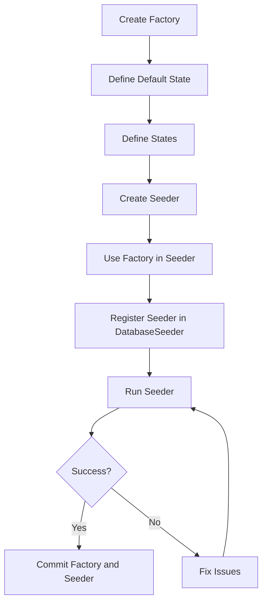

# Understanding Factories & Seeders

<link rel="stylesheet" href="../../assets/css/styles.css">

## Goal

Understand Laravel's factory and seeder system, which allows you to generate test data for your application in a consistent and maintainable way.

## What are Factories?

Factories are classes that define how to create fake model instances for testing and seeding. They generate realistic test data using the Faker library, making it easy to create models with random but plausible values.

### Key Benefits of Factories

1. **Consistent Test Data**: Generate consistent data for tests
2. **Realistic Values**: Create realistic data using Faker
3. **Relationships**: Easily create related models
4. **States**: Define variations of models for different scenarios
5. **Sequences**: Create sequences of related models

## What are Seeders?

Seeders are classes that populate your database with data. They can use factories to generate test data or insert specific records needed for your application to function.

### Key Benefits of Seeders

1. **Initial Data**: Provide initial data for your application
2. **Test Environment**: Set up a consistent test environment
3. **Demo Data**: Create demo data for showcasing your application
4. **Development**: Have realistic data during development

## Factory Structure

A factory defines how to create a model instance:

```php
<?php

namespace Database\Factories;

use App\Models\User;
use Illuminate\Database\Eloquent\Factories\Factory;
use Illuminate\Support\Str;

class UserFactory extends Factory
{
    /**
     * The name of the factory's corresponding model.
     *
     * @var string
     */
    protected $model = User::class;

    /**
     * Define the model's default state.
     *
     * @return array
     */
    public function definition()
    {
        return [
            'given_name' => $this->faker->firstName(),
            'family_name' => $this->faker->lastName(),
            'email' => $this->faker->unique()->safeEmail(),
            'email_verified_at' => now(),
            'password' => '$2y$10$92IXUNpkjO0rOQ5byMi.Ye4oKoEa3Ro9llC/.og/at2.uheWG/igi', // password
            'remember_token' => Str::random(10),
            'type' => User::class,
        ];
    }

    /**
     * Indicate that the model's email address should be unverified.
     *
     * @return \Illuminate\Database\Eloquent\Factories\Factory
     */
    public function unverified()
    {
        return $this->state(function (array $attributes) {
            return [
                'email_verified_at' => null,
            ];
        });
    }
}
```

## Seeder Structure

A seeder defines how to populate your database:

```php
<?php

namespace Database\Seeders;

use App\Models\User;
use Illuminate\Database\Seeder;

class UserSeeder extends Seeder
{
    /**
     * Run the database seeds.
     *
     * @return void
     */
    public function run()
    {
        // Create a default admin user
        User::factory()->create([
            'given_name' => 'Admin',
            'family_name' => 'User',
            'email' => 'admin@example.com',
            'type' => \App\Models\Admin::class,
        ]);

        // Create 10 random users
        User::factory()->count(10)->create();
    }
}
```

## Using Factories

### Creating a Single Model

```php
// Create and save to database
$user = User::factory()->create();

// Create but don't save
$user = User::factory()->make();
```

### Creating Multiple Models

```php
// Create 5 users
$users = User::factory()->count(5)->create();
```

### Overriding Attributes

```php
$user = User::factory()->create([
    'given_name' => 'John',
    'family_name' => 'Doe',
    'email' => 'john@example.com',
]);
```

### Using States

```php
// Create an unverified user
$user = User::factory()->unverified()->create();
```

### Creating Related Models

```php
// Create a user with 3 teams
$user = User::factory()
    ->has(Team::factory()->count(3))
    ->create();

// Create a team with 5 members
$team = Team::factory()
    ->has(User::factory()->count(5), 'members')
    ->create();
```

### Using Sequences

```php
// Create users with sequential emails
$users = User::factory()
    ->count(3)
    ->sequence(
        ['email' => 'user1@example.com'],
        ['email' => 'user2@example.com'],
        ['email' => 'user3@example.com'],
    )
    ->create();
```

## Using Seeders

### Running All Seeders

```bash
php artisan db:seed
```

### Running a Specific Seeder

```bash
php artisan db:seed --class=UserSeeder
```

### Fresh Migration with Seeding

```bash
php artisan migrate:fresh --seed
```

## Factory Best Practices

1. **Use Faker Appropriately**: Choose appropriate Faker methods for each field
2. **Define States**: Create states for common variations
3. **Handle Relationships**: Define how related models should be created
4. **Use Callbacks**: Use afterMaking and afterCreating for complex setup
5. **Keep It Realistic**: Generate realistic data that resembles production

## Seeder Best Practices

1. **Order Matters**: Seed in the correct order (dependencies first)
2. **Use Factories**: Leverage factories for most data generation
3. **Create Essential Data**: Always create data essential for the application
4. **Use Environment Variables**: Adjust seeding based on environment
5. **Keep It Fast**: Optimize seeders for speed (use insert over create for bulk operations)

## The Faker Library

Faker is a PHP library that generates fake data for you. Laravel's factories use Faker to generate realistic test data.

### Common Faker Methods

| Method | Description | Example Output |
|--------|-------------|----------------|
| `firstName()` | First name | "John" |
| `lastName()` | Last name | "Smith" |
| `name()` | Full name | "John Smith" |
| `email()` | Email address | "john@example.com" |
| `safeEmail()` | Safe email address | "john@example.org" |
| `password()` | Password | "S8!kQ2&p" |
| `text()` | Text | "Lorem ipsum..." |
| `paragraph()` | Paragraph | "Lorem ipsum dolor sit amet..." |
| `sentence()` | Sentence | "Lorem ipsum dolor sit amet." |
| `word()` | Word | "lorem" |
| `randomNumber()` | Random number | 43856 |
| `numberBetween(1, 10)` | Number in range | 7 |
| `randomFloat()` | Random float | 48.8932 |
| `boolean()` | Boolean | true |
| `date()` | Date | "1979-06-09" |
| `time()` | Time | "20:49:42" |
| `dateTime()` | Date and time | "2021-05-10 19:28:21" |
| `url()` | URL | "http://www.example.com/" |
| `imageUrl()` | Image URL | "http://lorempixel.com/640/480/" |
| `uuid()` | UUID | "b5a0e395-f5a2-4be6-b0c7-8d1b9739e749" |
| `company()` | Company name | "Acme Inc" |
| `jobTitle()` | Job title | "Software Engineer" |
| `address()` | Address | "123 Main St" |
| `city()` | City | "New York" |
| `state()` | State | "California" |
| `country()` | Country | "United States" |
| `phoneNumber()` | Phone number | "555-123-4567" |

## Diagram: Factory and Seeder Workflow



## Next Steps

Now that you understand factories and seeders, let's move on to [Update UserFactory](./140-update-user-factory.md) to support our Single Table Inheritance implementation.
