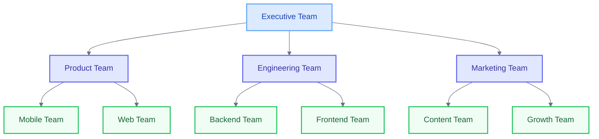

# Implementing Team Hierarchy

<link rel="stylesheet" href="../../assets/css/styles.css">
<link rel="stylesheet" href="../../assets/css/ume-docs-enhancements.css">
<script src="../../assets/js/ume-docs-enhancements.js"></script>

<ul class="breadcrumb-navigation">
    <li><a href="../../000-index.md">UME Tutorial</a></li>
    <li><a href="../000-index.md">Implementation</a></li>
    <li><a href="./000-index.md">Phase 1: Core Models</a></li>
    <li><a href="./220-team-hierarchy.md">Team Hierarchy</a></li>
</ul>

<div class="section-metadata">
    <div class="time-estimate">
        <span class="icon">⏱️</span>
        <span class="label">Time Estimate:</span>
        <span class="value">45-60 minutes</span>
    </div>
    <div class="difficulty-level">
        <span class="icon">🔶🔶🔶</span>
        <span class="label">Difficulty:</span>
        <span class="value">Advanced</span>
        <span class="explanation">Requires understanding of recursive relationships and CTEs</span>
    </div>
    <div class="prerequisites">
        <span class="icon">📋</span>
        <span class="label">Prerequisites:</span>
        <ul>
            <li>Team Model & Migration</li>
            <li>Understanding of Eloquent Relationships</li>
            <li>Basic knowledge of tree structures</li>
        </ul>
    </div>
    <div class="learning-outcomes">
        <span class="icon">🎯</span>
        <span class="label">You'll Learn:</span>
        <ul>
            <li>How to implement self-referential relationships</li>
            <li>How to use the staudenmeir/laravel-adjacency-list package</li>
            <li>How to traverse team hierarchies efficiently</li>
            <li>How to prevent circular references</li>
        </ul>
    </div>
</div>

## Goal

Implement a hierarchical team structure that allows teams to have parent-child relationships, enabling the creation of organizational hierarchies.

## What are Team Hierarchies?

Team hierarchies allow you to organize teams in a tree-like structure, where teams can have parent teams and child teams. This is useful for modeling organizational structures, departments, and nested groups.



<div class="mermaid-caption">Figure 1: Example of a team hierarchy</div>

## Why Use Team Hierarchies?

- **Organizational Structure**: Model your company's organizational chart
- **Permission Inheritance**: Child teams can inherit permissions from parent teams
- **Resource Allocation**: Manage resources across different levels of the organization
- **Reporting**: Generate reports that aggregate data across team hierarchies

## Installing staudenmeir/laravel-adjacency-list

To implement team hierarchies efficiently, we'll use the `staudenmeir/laravel-adjacency-list` package, which provides recursive relationships using Common Table Expressions (CTEs).

```bash
composer require staudenmeir/100-laravel-adjacency-list
```

This package allows us to:
- Traverse team hierarchies efficiently
- Query ancestors and descendants
- Prevent circular references
- Calculate depth and path information

## Updating the Team Migration

First, let's update our teams migration to include a `parent_id` column that references the same table:

```php
Schema::create('teams', function (Blueprint $table) {
    $table->id();
    $table->string('name');
    $table->string('slug')->unique();
    $table->text('description')->nullable();
    $table->string('ulid', 26)->unique();
    $table->foreignId('owner_id')->constrained('users')->onDelete('cascade');
    $table->foreignId('parent_id')->nullable()->constrained('teams')->onDelete('set null');
    $table->json('metadata')->nullable();
    $table->foreignId('created_by')->nullable()->constrained('users')->nullOnDelete();
    $table->foreignId('updated_by')->nullable()->constrained('users')->nullOnDelete();
    $table->timestamps();
});
```

The key addition is the `parent_id` column, which is a foreign key that references the `id` column of the same `teams` table. This creates a self-referential relationship.

## Updating the Team Model

Now, let's update our Team model to use the `HasRecursiveRelationships` trait from the package:

```php
<?php

namespace App\Models;

use App\Traits\HasAdditionalFeatures;
use App\Traits\HasUlid;
use App\Traits\HasUserTracking;
use Illuminate\Database\Eloquent\Factories\HasFactory;
use Illuminate\Database\Eloquent\Model;
use Illuminate\Support\Str;
use Staudenmeir\LaravelAdjacencyList\Eloquent\HasRecursiveRelationships;

class Team extends Model
{
    use HasFactory, HasUlid, HasUserTracking, HasAdditionalFeatures, HasRecursiveRelationships;

    /**
     * The attributes that are mass assignable.
     *
     * @var array<int, string>
     */
    protected $fillable = [
        'name',
        'slug',
        'description',
        'owner_id',
        'parent_id',
        'ulid',
        'metadata',
        'created_by',
        'updated_by',
    ];

    /**
     * The attributes that should be cast.
     *
     * @var array<string, string>
     */
    protected $casts = [
        'metadata' => 'array',
    ];

    /**
     * Boot the model.
     *
     * @return void
     */
    protected static function boot()
    {
        parent::boot();

        static::creating(function ($team) {
            if (empty($team->slug)) {
                $team->slug = Str::slug($team->name);
            }
        });
    }

    /**
     * Get the parent key name for the recursive relationship.
     *
     * @return string
     */
    public function getParentKeyName()
    {
        return 'parent_id';
    }

    /**
     * Get the local key name for the recursive relationship.
     *
     * @return string
     */
    public function getLocalKeyName()
    {
        return 'id';
    }

    /**
     * Prevent circular references in the team hierarchy.
     *
     * @param int|null $value
     * @return void
     */
    public function setParentIdAttribute($value)
    {
        // Prevent setting self as parent
        if ($value == $this->id) {
            return;
        }
        
        // Prevent circular references
        if ($value) {
            $descendantIds = $this->descendants()->pluck('id')->toArray();
            if (in_array($value, $descendantIds)) {
                return;
            }
        }
        
        $this->attributes['parent_id'] = $value;
    }

    /**
     * Get the owner of the team.
     *
     * @return \Illuminate\Database\Eloquent\Relations\BelongsTo
     */
    public function owner()
    {
        return $this->belongsTo(User::class, 'owner_id');
    }

    /**
     * Get the members of the team.
     *
     * @return \Illuminate\Database\Eloquent\Relations\BelongsToMany
     */
    public function members()
    {
        return $this->belongsToMany(User::class)
                    ->withTimestamps()
                    ->withPivot('role');
    }

    /**
     * Get the admins of the team.
     *
     * @return \Illuminate\Database\Eloquent\Relations\BelongsToMany
     */
    public function admins()
    {
        return $this->belongsToMany(User::class)
                    ->withTimestamps()
                    ->withPivot('role')
                    ->wherePivot('role', 'admin');
    }

    // ... other methods from the original Team model ...
}
```

The key additions are:
1. The `HasRecursiveRelationships` trait
2. The `getParentKeyName()` and `getLocalKeyName()` methods
3. The `setParentIdAttribute()` method to prevent circular references

## Available Recursive Relationships

With the `HasRecursiveRelationships` trait, we now have access to the following relationships:

- `ancestors()`: The team's recursive parents
- `ancestorsAndSelf()`: The team's recursive parents and itself
- `bloodline()`: The team's ancestors, descendants, and itself
- `children()`: The team's direct children
- `childrenAndSelf()`: The team's direct children and itself
- `descendants()`: The team's recursive children
- `descendantsAndSelf()`: The team's recursive children and itself
- `parent()`: The team's direct parent
- `parentAndSelf()`: The team's direct parent and itself
- `rootAncestor()`: The team's topmost parent
- `rootAncestorOrSelf()`: The team's topmost parent or itself
- `siblings()`: The parent's other children
- `siblingsAndSelf()`: All the parent's children

## Using Team Hierarchies

### Creating Parent-Child Relationships

```php
// Create a parent team
$parentTeam = Team::create([
    'name' => 'Executive Team',
    'owner_id' => $user->id,
]);

// Create a child team
$childTeam = Team::create([
    'name' => 'Engineering Team',
    'owner_id' => $user->id,
    'parent_id' => $parentTeam->id,
]);

// Create a grandchild team
$grandchildTeam = Team::create([
    'name' => 'Backend Team',
    'owner_id' => $user->id,
    'parent_id' => $childTeam->id,
]);
```

### Querying Team Hierarchies

```php
// Get a team's parent
$parent = $team->parent;

// Get a team's children
$children = $team->children;

// Get all ancestors (parent, grandparent, etc.)
$ancestors = $team->ancestors;

// Get all descendants (children, grandchildren, etc.)
$descendants = $team->descendants;

// Get the root team (topmost ancestor)
$root = $team->rootAncestor;

// Get siblings (teams with the same parent)
$siblings = $team->siblings;
```

### Depth and Path Information

The results of ancestor and descendant queries include additional `depth` and `path` columns:

```php
$descendants = $team->descendantsAndSelf()->get();

foreach ($descendants as $descendant) {
    echo "Team: {$descendant->name}, Depth: {$descendant->depth}, Path: {$descendant->path}";
}
```

The `depth` column contains the team's depth relative to the query's parent. The `path` column contains the dot-separated path of IDs from the query's parent to the team.

### Ordering Results

You can order the results breadth-first or depth-first:

```php
// Get siblings before children (breadth-first)
$descendants = $team->descendants()->breadthFirst()->get();

// Get children before siblings (depth-first)
$descendants = $team->descendants()->depthFirst()->get();
```

### Filtering by Depth

You can filter teams by their relative depth:

```php
// Get only direct children (depth = 1)
$directChildren = $team->descendants()->whereDepth(1)->get();

// Get teams up to a certain depth
$nearDescendants = $team->descendants()->whereDepth('<=', 2)->get();
```

### Getting the Entire Tree

You can get the entire team hierarchy starting from the root teams:

```php
// Get all teams in a tree structure
$tree = Team::tree()->get();

// Get a specific tree with a custom constraint
$constraint = function ($query) {
    $query->whereNull('parent_id')->where('name', 'Executive Team');
};

$executiveTree = Team::treeOf($constraint)->get();
```

### Converting to Nested Structure

You can convert a flat collection of teams into a nested tree structure:

```php
$teams = Team::tree()->get();
$nestedTree = $teams->toTree();
```

This will produce a nested structure where each team has a `children` relationship containing its child teams.

## Implementing Permission Inheritance

One of the benefits of team hierarchies is the ability to implement permission inheritance. Here's an example of how you might implement this:

```php
class Team extends Model
{
    // ... other methods ...

    /**
     * Check if the team has a specific permission.
     *
     * @param string $permission
     * @return bool
     */
    public function hasPermission(string $permission): bool
    {
        // Check if the team has the permission directly
        if ($this->permissions()->where('name', $permission)->exists()) {
            return true;
        }
        
        // Check if any ancestor team has the permission
        if ($this->parent_id) {
            return $this->parent->hasPermission($permission);
        }
        
        return false;
    }
}
```

This method checks if the team has a permission directly, and if not, it recursively checks its parent teams.

## Preventing Circular References

It's important to prevent circular references in team hierarchies (e.g., Team A → Team B → Team C → Team A). We've already added code in the `setParentIdAttribute()` method to prevent this.

The method does two checks:
1. Prevents setting a team as its own parent
2. Prevents setting a descendant as a parent (which would create a cycle)

## Testing Team Hierarchies

Let's create a test to ensure our team hierarchy implementation works correctly:

```php
<?php

namespace Tests\Unit\Models;

use App\Models\Team;use App\Models\User;use Illuminate\Foundation\Testing\RefreshDatabase;use old\TestCase;use PHPUnit\Framework\Attributes\Test;

class TeamHierarchyTest extends TestCase
{
    use RefreshDatabase;

    #[Test]
    public function it_can_create_parent_child_relationships()
    {
        $owner = User::factory()->create();
        
        $parentTeam = Team::create([
            'name' => 'Parent Team',
            'owner_id' => $owner->id,
        ]);
        
        $childTeam = Team::create([
            'name' => 'Child Team',
            'owner_id' => $owner->id,
            'parent_id' => $parentTeam->id,
        ]);
        
        $this->assertEquals($parentTeam->id, $childTeam->parent_id);
        $this->assertTrue($parentTeam->children->contains($childTeam));
        $this->assertEquals($parentTeam->id, $childTeam->parent->id);
    }

    #[Test]
    public function it_can_query_ancestors_and_descendants()
    {
        $owner = User::factory()->create();
        
        $grandparentTeam = Team::create([
            'name' => 'Grandparent Team',
            'owner_id' => $owner->id,
        ]);
        
        $parentTeam = Team::create([
            'name' => 'Parent Team',
            'owner_id' => $owner->id,
            'parent_id' => $grandparentTeam->id,
        ]);
        
        $childTeam = Team::create([
            'name' => 'Child Team',
            'owner_id' => $owner->id,
            'parent_id' => $parentTeam->id,
        ]);
        
        // Test ancestors
        $ancestors = $childTeam->ancestors;
        $this->assertCount(2, $ancestors);
        $this->assertTrue($ancestors->contains($parentTeam));
        $this->assertTrue($ancestors->contains($grandparentTeam));
        
        // Test descendants
        $descendants = $grandparentTeam->descendants;
        $this->assertCount(2, $descendants);
        $this->assertTrue($descendants->contains($parentTeam));
        $this->assertTrue($descendants->contains($childTeam));
    }

    #[Test]
    public function it_prevents_circular_references()
    {
        $owner = User::factory()->create();
        
        $teamA = Team::create([
            'name' => 'Team A',
            'owner_id' => $owner->id,
        ]);
        
        $teamB = Team::create([
            'name' => 'Team B',
            'owner_id' => $owner->id,
            'parent_id' => $teamA->id,
        ]);
        
        $teamC = Team::create([
            'name' => 'Team C',
            'owner_id' => $owner->id,
            'parent_id' => $teamB->id,
        ]);
        
        // Try to create a circular reference
        $teamA->parent_id = $teamC->id;
        $teamA->save();
        
        // The parent_id should not have been set
        $this->assertNull($teamA->fresh()->parent_id);
    }

    #[Test]
    public function it_includes_depth_and_path_information()
    {
        $owner = User::factory()->create();
        
        $rootTeam = Team::create([
            'name' => 'Root Team',
            'owner_id' => $owner->id,
        ]);
        
        $level1Team = Team::create([
            'name' => 'Level 1 Team',
            'owner_id' => $owner->id,
            'parent_id' => $rootTeam->id,
        ]);
        
        $level2Team = Team::create([
            'name' => 'Level 2 Team',
            'owner_id' => $owner->id,
            'parent_id' => $level1Team->id,
        ]);
        
        $descendants = $rootTeam->descendantsAndSelf()->depthFirst()->get();
        
        $this->assertEquals(0, $descendants[0]->depth);
        $this->assertEquals(1, $descendants[1]->depth);
        $this->assertEquals(2, $descendants[2]->depth);
        
        $this->assertEquals((string)$rootTeam->id, $descendants[0]->path);
        $this->assertEquals($rootTeam->id . '.' . $level1Team->id, $descendants[1]->path);
        $this->assertEquals($rootTeam->id . '.' . $level1Team->id . '.' . $level2Team->id, $descendants[2]->path);
    }
}
```

## Visualizing Team Hierarchies

You can create a method to build a tree view of your team hierarchy:

```php
/**
 * Build a tree view of the team hierarchy.
 *
 * @return array
 */
public function buildTeamTree()
{
    // Get all root teams (teams without parents)
    $rootTeams = Team::whereNull('parent_id')->get();
    
    // Build the tree recursively
    return $this->buildTeamTreeRecursive($rootTeams);
}

/**
 * Recursively build the team tree.
 *
 * @param \Illuminate\Database\Eloquent\Collection $teams
 * @return array
 */
private function buildTeamTreeRecursive($teams)
{
    $result = [];
    
    foreach ($teams as $team) {
        $node = [
            'id' => $team->id,
            'name' => $team->name,
            'children' => $this->buildTeamTreeRecursive($team->children),
        ];
        
        $result[] = $node;
    }
    
    return $result;
}
```

## Best Practices

1. **Keep Hierarchies Shallow**: Avoid creating very deep hierarchies (more than 5-7 levels) as they can become difficult to manage and navigate.

2. **Index the parent_id Column**: Make sure the `parent_id` column is indexed for better query performance.

3. **Use Eager Loading**: When retrieving teams with their hierarchical relationships, use eager loading to avoid N+1 query problems.

4. **Implement Proper Validation**: Always validate parent-child relationships to prevent circular references and other invalid states.

5. **Consider Caching**: For large hierarchies, consider caching the results of common queries to improve performance.

## Quick Reference

<div class="quick-reference">
    <h2>Team Hierarchy Quick Reference</h2>

    <div class="key-concepts">
        <dl>
            <dt>Self-referential Relationship</dt>
            <dd>A relationship where a model references itself, creating parent-child relationships</dd>

            <dt>Common Table Expression (CTE)</dt>
            <dd>A SQL feature that allows recursive queries, used by the adjacency list package</dd>

            <dt>Depth</dt>
            <dd>The number of levels between a team and its ancestor or descendant</dd>

            <dt>Path</dt>
            <dd>The sequence of IDs from a team to its ancestor or descendant</dd>
        </dl>
    </div>

    <div class="syntax">
        <h3>Common Usage Patterns</h3>
        <pre><code>// Get a team's parent
$parent = $team->parent;

// Get a team's children
$children = $team->children;

// Get all ancestors
$ancestors = $team->ancestors;

// Get all descendants
$descendants = $team->descendants;

// Get the root team
$root = $team->rootAncestor;

// Get siblings
$siblings = $team->siblings;

// Filter by depth
$directChildren = $team->descendants()->whereDepth(1)->get();

// Order results
$depthFirst = $team->descendants()->depthFirst()->get();
$breadthFirst = $team->descendants()->breadthFirst()->get();

// Get the entire tree
$tree = Team::tree()->get();

// Convert to nested structure
$nestedTree = $teams->toTree();</code></pre>
    </div>

    <div class="gotchas">
        <h3>Common Pitfalls</h3>
        <ul>
            <li>Not preventing circular references in the hierarchy</li>
            <li>Creating hierarchies that are too deep</li>
            <li>Not indexing the parent_id column</li>
            <li>Not using eager loading for hierarchical relationships</li>
            <li>Not handling null parent_id values properly</li>
        </ul>
    </div>
</div>

## Troubleshooting

<div class="troubleshooting-guide">
    <h2>Common Issues with Team Hierarchies</h2>

    <div class="symptoms">
        <h3>Circular References</h3>
        <ul>
            <li>Teams appear as their own ancestors or descendants</li>
            <li>Infinite loops in recursive methods</li>
            <li>Stack overflow errors</li>
        </ul>
    </div>

    <div class="causes">
        <h3>Possible Causes</h3>
        <ol>
            <li>Missing validation in the `setParentIdAttribute` method</li>
            <li>Direct database updates bypassing model methods</li>
            <li>Race conditions when updating parent-child relationships</li>
        </ol>
    </div>

    <div class="solutions">
        <h3>Solutions</h3>

        <h4>For Circular References</h4>
        <p>Implement proper validation in the model:</p>
        <pre><code>public function setParentIdAttribute($value)
{
    // Prevent setting self as parent
    if ($value == $this->id) {
        return;
    }
    
    // Prevent circular references
    if ($value) {
        $descendantIds = $this->descendants()->pluck('id')->toArray();
        if (in_array($value, $descendantIds)) {
            return;
        }
    }
    
    $this->attributes['parent_id'] = $value;
}</code></pre>

        <h4>For Performance Issues</h4>
        <p>Use eager loading and indexing:</p>
        <pre><code>// Add index to migration
Schema::table('teams', function (Blueprint $table) {
    $table->index('parent_id');
});

// Use eager loading
$teams = Team::with('children', 'parent')->get();</code></pre>

        <h4>For Deep Hierarchies</h4>
        <p>Limit the depth of queries:</p>
        <pre><code>// Get descendants up to a certain depth
$descendants = $team->descendants()->whereDepth('<=', 3)->get();</code></pre>
    </div>

    <div class="prevention">
        <h3>Prevention</h3>
        <ul>
            <li>Always use model methods to update parent-child relationships</li>
            <li>Add database constraints to prevent invalid relationships</li>
            <li>Implement unit tests to verify hierarchy integrity</li>
            <li>Use transactions for operations that modify the hierarchy</li>
        </ul>
    </div>
</div>

## Next Steps

<div class="page-navigation">
    <a href="210-team-user-pivot.md" class="prev">Team User Pivot</a>
    <a href="230-update-user-factory.md" class="next">Update User Factory</a>
</div>

Now that we've implemented team hierarchies, let's move on to updating the user factory to handle different user types and roles.
