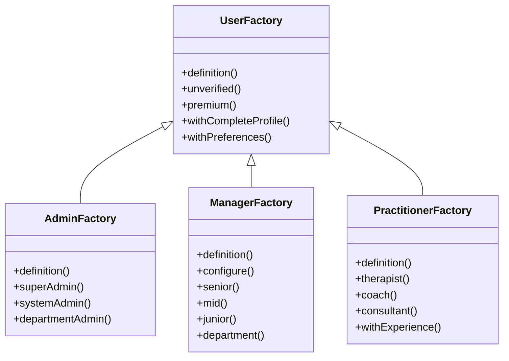

# Create Child Model Factories

<link rel="stylesheet" href="../../assets/css/styles.css">

## Goal

Create factory classes for our child models (Admin, Manager, and Practitioner) to support generating test data for our Single Table Inheritance implementation.

## Overview

In our Single Table Inheritance (STI) implementation, we need to create factories for each child model:

1. **AdminFactory**: For creating Admin users
2. **ManagerFactory**: For creating Manager users
3. **PractitionerFactory**: For creating Practitioner users

Each factory will extend the base UserFactory and customize it for the specific user type.

## Step 1: Create the AdminFactory

Create a new file at `database/factories/AdminFactory.php`:

```php
<?php

namespace Database\Factories;

use App\Models\Admin;

class AdminFactory extends UserFactory
{
    /**
     * The name of the factory's corresponding model.
     *
     * @var string
     */
    protected $model = Admin::class;

    /**
     * Define the model's default state.
     *
     * @return array
     */
    public function definition()
    {
        $attributes = parent::definition();
        
        // Ensure the type is set correctly
        $attributes['type'] = Admin::class;
        
        // Add admin-specific metadata
        $attributes['metadata'] = array_merge($attributes['metadata'] ?? [], [
            'admin_level' => $this->faker->randomElement(['super', 'system', 'department']),
            'permissions' => [
                'users' => true,
                'teams' => true,
                'settings' => true,
                'logs' => true,
                'system' => $this->faker->boolean(70),
            ],
            'last_login' => $this->faker->dateTimeThisMonth()->format('Y-m-d H:i:s'),
        ]);
        
        return $attributes;
    }

    /**
     * Indicate that the admin is a super admin.
     *
     * @return \Illuminate\Database\Eloquent\Factories\Factory
     */
    public function superAdmin()
    {
        return $this->state(function (array $attributes) {
            $metadata = $attributes['metadata'] ?? [];
            $metadata['admin_level'] = 'super';
            $metadata['permissions'] = [
                'users' => true,
                'teams' => true,
                'settings' => true,
                'logs' => true,
                'system' => true,
            ];
            
            return [
                'metadata' => $metadata,
            ];
        });
    }

    /**
     * Indicate that the admin is a system admin.
     *
     * @return \Illuminate\Database\Eloquent\Factories\Factory
     */
    public function systemAdmin()
    {
        return $this->state(function (array $attributes) {
            $metadata = $attributes['metadata'] ?? [];
            $metadata['admin_level'] = 'system';
            $metadata['permissions'] = [
                'users' => true,
                'teams' => true,
                'settings' => true,
                'logs' => true,
                'system' => false,
            ];
            
            return [
                'metadata' => $metadata,
            ];
        });
    }

    /**
     * Indicate that the admin is a department admin.
     *
     * @return \Illuminate\Database\Eloquent\Factories\Factory
     */
    public function departmentAdmin()
    {
        return $this->state(function (array $attributes) {
            $metadata = $attributes['metadata'] ?? [];
            $metadata['admin_level'] = 'department';
            $metadata['permissions'] = [
                'users' => true,
                'teams' => true,
                'settings' => false,
                'logs' => false,
                'system' => false,
            ];
            $metadata['department'] = $this->faker->randomElement(['IT', 'HR', 'Finance', 'Marketing', 'Operations']);
            
            return [
                'metadata' => $metadata,
            ];
        });
    }
}
```

## Step 2: Create the ManagerFactory

Create a new file at `database/factories/ManagerFactory.php`:

```php
<?php

namespace Database\Factories;

use App\Models\Manager;
use App\Models\Team;

class ManagerFactory extends UserFactory
{
    /**
     * The name of the factory's corresponding model.
     *
     * @var string
     */
    protected $model = Manager::class;

    /**
     * Define the model's default state.
     *
     * @return array
     */
    public function definition()
    {
        $attributes = parent::definition();
        
        // Ensure the type is set correctly
        $attributes['type'] = Manager::class;
        
        // Add manager-specific metadata
        $attributes['metadata'] = array_merge($attributes['metadata'] ?? [], [
            'manager_level' => $this->faker->randomElement(['senior', 'mid', 'junior']),
            'department' => $this->faker->randomElement(['Sales', 'Marketing', 'Support', 'Development', 'Design']),
            'reports_to' => null,
            'direct_reports' => 0,
        ]);
        
        return $attributes;
    }

    /**
     * Configure the model factory.
     *
     * @return $this
     */
    public function configure()
    {
        return $this->afterCreating(function (Manager $manager) {
            // Create a team for the manager if they don't have one
            if ($manager->ownedTeams()->count() === 0) {
                $team = Team::factory()->create([
                    'owner_id' => $manager->id,
                    'name' => $manager->metadata['department'] . ' Team',
                ]);
                
                // Add the manager as a member with admin role
                $team->addMember($manager, 'admin');
            }
        });
    }

    /**
     * Indicate that the manager is a senior manager.
     *
     * @return \Illuminate\Database\Eloquent\Factories\Factory
     */
    public function senior()
    {
        return $this->state(function (array $attributes) {
            $metadata = $attributes['metadata'] ?? [];
            $metadata['manager_level'] = 'senior';
            
            return [
                'metadata' => $metadata,
            ];
        });
    }

    /**
     * Indicate that the manager is a mid-level manager.
     *
     * @return \Illuminate\Database\Eloquent\Factories\Factory
     */
    public function mid()
    {
        return $this->state(function (array $attributes) {
            $metadata = $attributes['metadata'] ?? [];
            $metadata['manager_level'] = 'mid';
            
            return [
                'metadata' => $metadata,
            ];
        });
    }

    /**
     * Indicate that the manager is a junior manager.
     *
     * @return \Illuminate\Database\Eloquent\Factories\Factory
     */
    public function junior()
    {
        return $this->state(function (array $attributes) {
            $metadata = $attributes['metadata'] ?? [];
            $metadata['manager_level'] = 'junior';
            
            return [
                'metadata' => $metadata,
            ];
        });
    }

    /**
     * Indicate that the manager belongs to a specific department.
     *
     * @param string $department
     * @return \Illuminate\Database\Eloquent\Factories\Factory
     */
    public function department(string $department)
    {
        return $this->state(function (array $attributes) use ($department) {
            $metadata = $attributes['metadata'] ?? [];
            $metadata['department'] = $department;
            
            return [
                'metadata' => $metadata,
            ];
        });
    }
}
```

## Step 3: Create the PractitionerFactory

Create a new file at `database/factories/PractitionerFactory.php`:

```php
<?php

namespace Database\Factories;

use App\Models\Practitioner;

class PractitionerFactory extends UserFactory
{
    /**
     * The name of the factory's corresponding model.
     *
     * @var string
     */
    protected $model = Practitioner::class;

    /**
     * Define the model's default state.
     *
     * @return array
     */
    public function definition()
    {
        $attributes = parent::definition();
        
        // Ensure the type is set correctly
        $attributes['type'] = Practitioner::class;
        
        // Add practitioner-specific metadata
        $attributes['metadata'] = array_merge($attributes['metadata'] ?? [], [
            'specialization' => $this->faker->randomElement(['Therapist', 'Counselor', 'Coach', 'Consultant', 'Trainer']),
            'qualifications' => $this->faker->randomElements(['PhD', 'MSc', 'BSc', 'Certified', 'Licensed'], $this->faker->numberBetween(1, 3)),
            'years_experience' => $this->faker->numberBetween(1, 20),
            'client_count' => $this->faker->numberBetween(0, 50),
            'availability' => [
                'monday' => $this->faker->boolean(80),
                'tuesday' => $this->faker->boolean(80),
                'wednesday' => $this->faker->boolean(80),
                'thursday' => $this->faker->boolean(80),
                'friday' => $this->faker->boolean(70),
                'saturday' => $this->faker->boolean(40),
                'sunday' => $this->faker->boolean(20),
            ],
        ]);
        
        return $attributes;
    }

    /**
     * Indicate that the practitioner is a therapist.
     *
     * @return \Illuminate\Database\Eloquent\Factories\Factory
     */
    public function therapist()
    {
        return $this->state(function (array $attributes) {
            $metadata = $attributes['metadata'] ?? [];
            $metadata['specialization'] = 'Therapist';
            $metadata['therapy_types'] = $this->faker->randomElements([
                'Cognitive Behavioral', 'Psychodynamic', 'Humanistic', 'Integrative', 'Family'
            ], $this->faker->numberBetween(1, 3));
            
            return [
                'metadata' => $metadata,
            ];
        });
    }

    /**
     * Indicate that the practitioner is a coach.
     *
     * @return \Illuminate\Database\Eloquent\Factories\Factory
     */
    public function coach()
    {
        return $this->state(function (array $attributes) {
            $metadata = $attributes['metadata'] ?? [];
            $metadata['specialization'] = 'Coach';
            $metadata['coaching_areas'] = $this->faker->randomElements([
                'Life', 'Career', 'Executive', 'Health', 'Relationship'
            ], $this->faker->numberBetween(1, 3));
            
            return [
                'metadata' => $metadata,
            ];
        });
    }

    /**
     * Indicate that the practitioner is a consultant.
     *
     * @return \Illuminate\Database\Eloquent\Factories\Factory
     */
    public function consultant()
    {
        return $this->state(function (array $attributes) {
            $metadata = $attributes['metadata'] ?? [];
            $metadata['specialization'] = 'Consultant';
            $metadata['consulting_areas'] = $this->faker->randomElements([
                'Business', 'Strategy', 'IT', 'HR', 'Marketing'
            ], $this->faker->numberBetween(1, 3));
            
            return [
                'metadata' => $metadata,
            ];
        });
    }

    /**
     * Indicate that the practitioner has a specific number of years experience.
     *
     * @param int $years
     * @return \Illuminate\Database\Eloquent\Factories\Factory
     */
    public function withExperience(int $years)
    {
        return $this->state(function (array $attributes) use ($years) {
            $metadata = $attributes['metadata'] ?? [];
            $metadata['years_experience'] = $years;
            
            return [
                'metadata' => $metadata,
            ];
        });
    }
}
```

## Testing the Child Model Factories

Let's create a test to ensure our child model factories work correctly:

```php
<?php

namespace Tests\Unit\Factories;

use App\Models\Admin;use App\Models\Manager;use App\Models\Practitioner;use App\Models\Team;use Illuminate\Foundation\Testing\RefreshDatabase;use old\TestCase;use PHPUnit\Framework\Attributes\Test;

class ChildModelFactoriesTest extends TestCase
{
    use RefreshDatabase;

    #[Test]
    public function it_creates_admin_with_correct_type()
    {
        $admin = Admin::factory()->create();
        
        $this->assertEquals(Admin::class, $admin->type);
        $this->assertInstanceOf(Admin::class, $admin);
        $this->assertArrayHasKey('admin_level', $admin->metadata);
        $this->assertArrayHasKey('permissions', $admin->metadata);
    }

    #[Test]
    public function it_creates_super_admin()
    {
        $admin = Admin::factory()->superAdmin()->create();
        
        $this->assertEquals('super', $admin->metadata['admin_level']);
        $this->assertTrue($admin->metadata['permissions']['system']);
    }

    #[Test]
    public function it_creates_manager_with_correct_type()
    {
        $manager = Manager::factory()->create();
        
        $this->assertEquals(Manager::class, $manager->type);
        $this->assertInstanceOf(Manager::class, $manager);
        $this->assertArrayHasKey('manager_level', $manager->metadata);
        $this->assertArrayHasKey('department', $manager->metadata);
    }

    #[Test]
    public function it_creates_manager_with_team()
    {
        $manager = Manager::factory()->create();
        
        $this->assertGreaterThan(0, $manager->ownedTeams()->count());
        $this->assertInstanceOf(Team::class, $manager->ownedTeams()->first());
    }

    #[Test]
    public function it_creates_senior_manager()
    {
        $manager = Manager::factory()->senior()->create();
        
        $this->assertEquals('senior', $manager->metadata['manager_level']);
    }

    #[Test]
    public function it_creates_practitioner_with_correct_type()
    {
        $practitioner = Practitioner::factory()->create();
        
        $this->assertEquals(Practitioner::class, $practitioner->type);
        $this->assertInstanceOf(Practitioner::class, $practitioner);
        $this->assertArrayHasKey('specialization', $practitioner->metadata);
        $this->assertArrayHasKey('qualifications', $practitioner->metadata);
        $this->assertArrayHasKey('years_experience', $practitioner->metadata);
    }

    #[Test]
    public function it_creates_therapist_practitioner()
    {
        $practitioner = Practitioner::factory()->therapist()->create();
        
        $this->assertEquals('Therapist', $practitioner->metadata['specialization']);
        $this->assertArrayHasKey('therapy_types', $practitioner->metadata);
    }

    #[Test]
    public function it_creates_practitioner_with_specific_experience()
    {
        $practitioner = Practitioner::factory()->withExperience(10)->create();
        
        $this->assertEquals(10, $practitioner->metadata['years_experience']);
    }
}
```

## Using the Child Model Factories

Here are some examples of how to use the child model factories:

### Creating an Admin

```php
// Create a basic admin
$admin = Admin::factory()->create();

// Create a super admin
$superAdmin = Admin::factory()->superAdmin()->create();

// Create a department admin
$deptAdmin = Admin::factory()->departmentAdmin()->create();
```

### Creating a Manager

```php
// Create a basic manager
$manager = Manager::factory()->create();

// Create a senior manager
$seniorManager = Manager::factory()->senior()->create();

// Create a manager for a specific department
$salesManager = Manager::factory()->department('Sales')->create();
```

### Creating a Practitioner

```php
// Create a basic practitioner
$practitioner = Practitioner::factory()->create();

// Create a therapist
$therapist = Practitioner::factory()->therapist()->create();

// Create an experienced coach
$coach = Practitioner::factory()
    ->coach()
    ->withExperience(15)
    ->create();
```

### Combining with Base UserFactory States

```php
// Create an admin with a complete profile
$admin = Admin::factory()
    ->superAdmin()
    ->withCompleteProfile()
    ->create();

// Create a manager with premium subscription
$manager = Manager::factory()
    ->senior()
    ->premium()
    ->create();
```

## Diagram: Child Model Factory Hierarchy



## Next Steps

Now that we've created factories for our child models, let's move on to [Create UserSeeder & TeamSeeder](./160-create-seeders.md) to implement seeders that will populate our database with test data.
