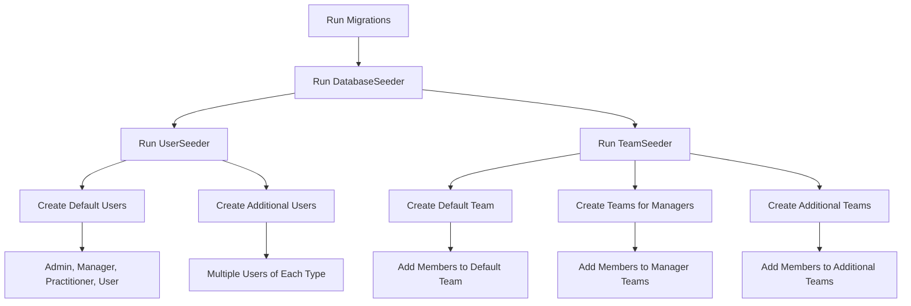

# Create UserSeeder & TeamSeeder

<link rel="stylesheet" href="../../assets/css/styles.css">

## Goal

Create seeders to populate our database with realistic test data for users and teams, supporting our Single Table Inheritance implementation.

## Overview

We'll create two seeders:

1. **UserSeeder**: To create users of different types (Admin, Manager, Practitioner, and regular User)
2. **TeamSeeder**: To create teams with members and different roles

These seeders will use our factories to generate realistic test data for development and testing.

## Step 1: Create the UserSeeder

Create a new file at `database/seeders/UserSeeder.php`:

```php
<?php

namespace Database\Seeders;

use App\Models\Admin;
use App\Models\Manager;
use App\Models\Practitioner;
use App\Models\User;
use Illuminate\Database\Seeder;
use Illuminate\Support\Facades\Hash;

class UserSeeder extends Seeder
{
    /**
     * Run the database seeds.
     *
     * @return void
     */
    public function run()
    {
        // Create a default admin user for development
        Admin::factory()->create([
            'given_name' => 'Admin',
            'family_name' => 'User',
            'email' => 'admin@example.com',
            'password' => Hash::make('password'),
        ]);

        // Create a default manager user for development
        Manager::factory()->create([
            'given_name' => 'Manager',
            'family_name' => 'User',
            'email' => 'manager@example.com',
            'password' => Hash::make('password'),
        ]);

        // Create a default practitioner user for development
        Practitioner::factory()->create([
            'given_name' => 'Practitioner',
            'family_name' => 'User',
            'email' => 'practitioner@example.com',
            'password' => Hash::make('password'),
        ]);

        // Create a default regular user for development
        User::factory()->create([
            'given_name' => 'Regular',
            'family_name' => 'User',
            'email' => 'user@example.com',
            'password' => Hash::make('password'),
        ]);

        // Create additional users of each type
        Admin::factory()->count(3)->create();
        Manager::factory()->count(5)->create();
        Practitioner::factory()->count(10)->create();
        User::factory()->count(20)->create();

        // Create some users with specific states
        Admin::factory()->superAdmin()->withCompleteProfile()->create();
        Admin::factory()->departmentAdmin()->create();
        
        Manager::factory()->senior()->premium()->create();
        Manager::factory()->department('Sales')->create();
        Manager::factory()->department('Marketing')->create();
        
        Practitioner::factory()->therapist()->withExperience(10)->create();
        Practitioner::factory()->coach()->withExperience(5)->create();
        Practitioner::factory()->consultant()->withExperience(15)->create();
        
        User::factory()->unverified()->count(5)->create();
        User::factory()->premium()->count(3)->create();
        User::factory()->withCompleteProfile()->count(5)->create();
    }
}
```

## Step 2: Create the TeamSeeder

Create a new file at `database/seeders/TeamSeeder.php`:

```php
<?php

namespace Database\Seeders;

use App\Models\Manager;
use App\Models\Practitioner;
use App\Models\Team;
use App\Models\User;
use Illuminate\Database\Seeder;

class TeamSeeder extends Seeder
{
    /**
     * Run the database seeds.
     *
     * @return void
     */
    public function run()
    {
        // Get users for adding to teams
        $managers = Manager::all();
        $practitioners = Practitioner::take(10)->get();
        $regularUsers = User::where('type', User::class)->take(15)->get();
        
        // Create a default team for development
        $defaultTeam = Team::factory()->create([
            'name' => 'Development Team',
            'description' => 'Team for development and testing',
            'owner_id' => Manager::first()->id,
        ]);
        
        // Add some members to the default team
        $defaultTeam->addMember(Practitioner::first(), 'member');
        $defaultTeam->addMember(User::where('type', User::class)->first(), 'member');
        
        // Create teams owned by managers
        $managers->each(function ($manager) use ($practitioners, $regularUsers) {
            // Skip if the manager already has a team (created by the factory)
            if ($manager->ownedTeams()->exists()) {
                $team = $manager->ownedTeams()->first();
            } else {
                $team = Team::factory()->create([
                    'owner_id' => $manager->id,
                ]);
            }
            
            // Add some practitioners to the team
            $teamPractitioners = $practitioners->random(min(2, $practitioners->count()));
            $teamPractitioners->each(function ($practitioner) use ($team) {
                if (!$team->hasMember($practitioner)) {
                    $team->addMember($practitioner, 'member');
                }
            });
            
            // Add some regular users to the team
            $teamUsers = $regularUsers->random(min(3, $regularUsers->count()));
            $teamUsers->each(function ($user) use ($team) {
                if (!$team->hasMember($user)) {
                    $team->addMember($user, 'member');
                }
            });
        });
        
        // Create some additional teams
        Team::factory()->count(5)->create()->each(function ($team) use ($managers, $practitioners, $regularUsers) {
            // Add a manager as admin
            $teamManager = $managers->random();
            if (!$team->hasMember($teamManager)) {
                $team->addMember($teamManager, 'admin');
            }
            
            // Add some practitioners to the team
            $teamPractitioners = $practitioners->random(min(2, $practitioners->count()));
            $teamPractitioners->each(function ($practitioner) use ($team) {
                if (!$team->hasMember($practitioner)) {
                    $team->addMember($practitioner, 'member');
                }
            });
            
            // Add some regular users to the team
            $teamUsers = $regularUsers->random(min(3, $regularUsers->count()));
            $teamUsers->each(function ($user) use ($team) {
                if (!$team->hasMember($user)) {
                    $team->addMember($user, 'member');
                }
            });
        });
    }
}
```

## Step 3: Update the DatabaseSeeder

Now, let's update the main DatabaseSeeder to call our new seeders:

```php
<?php

namespace Database\Seeders;

use Illuminate\Database\Seeder;

class DatabaseSeeder extends Seeder
{
    /**
     * Seed the application's database.
     *
     * @return void
     */
    public function run()
    {
        $this->call([
            UserSeeder::class,
            TeamSeeder::class,
        ]);
    }
}
```

## Testing the Seeders

Let's create a test to ensure our seeders work correctly:

```php
<?php

namespace Tests\Feature;

use App\Models\Admin;use App\Models\Manager;use App\Models\Practitioner;use App\Models\Team;use App\Models\User;use Database\Seeders\TeamSeeder;use Database\Seeders\UserSeeder;use Illuminate\Foundation\Testing\RefreshDatabase;use old\TestCase;use PHPUnit\Framework\Attributes\Test;

class SeederTest extends TestCase
{
    use RefreshDatabase;

    #[Test]
    public function user_seeder_creates_expected_users()
    {
        // Run the seeder
        $this->seed(UserSeeder::class);
        
        // Check that we have the expected number of users
        $this->assertDatabaseCount('users', 56); // 4 default + 3 + 5 + 10 + 20 + 1 + 1 + 1 + 1 + 1 + 1 + 1 + 1 + 5 + 3 + 5
        
        // Check that we have users of each type
        $this->assertDatabaseHas('users', [
            'email' => 'admin@example.com',
            'type' => Admin::class,
        ]);
        
        $this->assertDatabaseHas('users', [
            'email' => 'manager@example.com',
            'type' => Manager::class,
        ]);
        
        $this->assertDatabaseHas('users', [
            'email' => 'practitioner@example.com',
            'type' => Practitioner::class,
        ]);
        
        $this->assertDatabaseHas('users', [
            'email' => 'user@example.com',
            'type' => User::class,
        ]);
        
        // Check that we have the expected number of each type
        $this->assertEquals(5, Admin::count()); // 1 default + 3 + 1 super admin + 1 department admin
        $this->assertEquals(8, Manager::count()); // 1 default + 5 + 1 senior + 1 department
        $this->assertEquals(13, Practitioner::count()); // 1 default + 10 + 1 therapist + 1 coach + 1 consultant
        $this->assertEquals(30, User::where('type', User::class)->count()); // 1 default + 20 + 5 unverified + 3 premium + 5 complete profile
    }

    #[Test]
    public function team_seeder_creates_expected_teams()
    {
        // Run the user seeder first
        $this->seed(UserSeeder::class);
        
        // Run the team seeder
        $this->seed(TeamSeeder::class);
        
        // Check that we have teams
        $this->assertGreaterThan(0, Team::count());
        
        // Check that the default team exists
        $this->assertDatabaseHas('teams', [
            'name' => 'Development Team',
        ]);
        
        // Check that teams have members
        $teams = Team::all();
        foreach ($teams as $team) {
            $this->assertGreaterThan(0, $team->members()->count());
        }
        
        // Check that users belong to teams
        $users = User::all();
        $usersInTeams = 0;
        foreach ($users as $user) {
            if ($user->teams()->count() > 0) {
                $usersInTeams++;
            }
        }
        $this->assertGreaterThan(0, $usersInTeams);
    }
}
```

## Running the Seeders

To run the seeders, use the following Artisan command:

```bash
php artisan db:seed
```

To run a specific seeder:

```bash
php artisan db:seed --class=UserSeeder
```

To refresh the database and run the seeders:

```bash
php artisan migrate:fresh --seed
```

## Customizing the Seeders for Different Environments

You might want to customize the seeders for different environments. For example, you might want to create more test data in the development environment but less in production.

```php
public function run()
{
    // Create default users in all environments
    Admin::factory()->create([
        'given_name' => 'Admin',
        'family_name' => 'User',
        'email' => 'admin@example.com',
        'password' => Hash::make('password'),
    ]);

    // Only create additional test data in non-production environments
    if (app()->environment() !== 'production') {
        // Create additional users
        Admin::factory()->count(3)->create();
        Manager::factory()->count(5)->create();
        // ...
    }
}
```

## Diagram: Seeding Process



## Next Steps

Now that we've created seeders for users and teams, let's move on to [Update DatabaseSeeder](./170-update-database-seeder.md) to ensure our seeders are properly integrated into the main database seeder.
