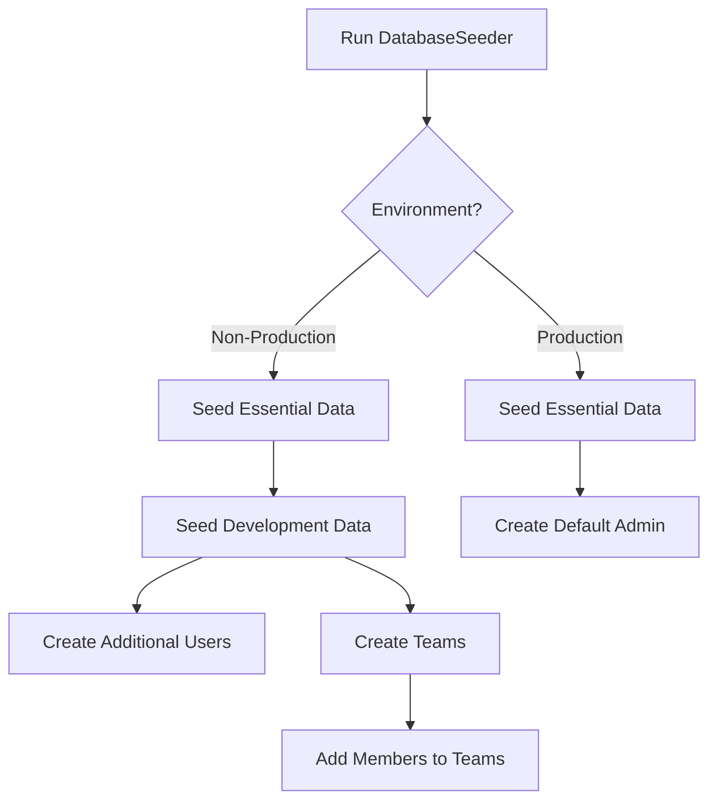

# Update DatabaseSeeder

<link rel="stylesheet" href="../../assets/css/styles.css">

## Goal

Update the main DatabaseSeeder to orchestrate all our seeders in the correct order, ensuring that our database is populated with consistent test data.

## Overview

The DatabaseSeeder is the entry point for database seeding in Laravel. It's responsible for calling other seeders in the correct order, ensuring that dependencies are respected. We'll update it to:

1. **Call Our Seeders**: Include our UserSeeder and TeamSeeder
2. **Set the Order**: Ensure seeders run in the correct order
3. **Handle Environments**: Customize seeding based on the environment

## Step 1: Update the DatabaseSeeder

Open the `database/seeders/DatabaseSeeder.php` file and update it:

```php
<?php

namespace Database\Seeders;

use Illuminate\Database\Seeder;
use Illuminate\Support\Facades\App;

class DatabaseSeeder extends Seeder
{
    /**
     * Seed the application's database.
     *
     * @return void
     */
    public function run()
    {
        // Always seed essential data
        $this->seedEssentialData();
        
        // Seed development data in non-production environments
        if (!App::environment('production')) {
            $this->seedDevelopmentData();
        }
    }

    /**
     * Seed essential data that is required in all environments.
     *
     * @return void
     */
    protected function seedEssentialData()
    {
        // Seed the default admin user
        $this->call(UserSeeder::class, true, ['mode' => 'essential']);
    }

    /**
     * Seed development data for testing and local development.
     *
     * @return void
     */
    protected function seedDevelopmentData()
    {
        // Seed additional users
        $this->call(UserSeeder::class, true, ['mode' => 'development']);
        
        // Seed teams
        $this->call(TeamSeeder::class);
        
        // Add more seeders as needed
        // $this->call(OtherSeeder::class);
    }
}
```

## Step 2: Update the UserSeeder to Support Modes

Now, let's update our UserSeeder to support the 'essential' and 'development' modes:

```php
<?php

namespace Database\Seeders;

use App\Models\Admin;
use App\Models\Manager;
use App\Models\Practitioner;
use App\Models\User;
use Illuminate\Database\Seeder;
use Illuminate\Support\Facades\Hash;

class UserSeeder extends Seeder
{
    /**
     * Run the database seeds.
     *
     * @param array $options
     * @return void
     */
    public function run(array $options = [])
    {
        // Default to development mode if not specified
        $mode = $options['mode'] ?? 'development';
        
        // Always create essential users
        $this->createEssentialUsers();
        
        // Create additional development data if in development mode
        if ($mode === 'development') {
            $this->createDevelopmentUsers();
        }
    }

    /**
     * Create essential users that are required in all environments.
     *
     * @return void
     */
    protected function createEssentialUsers()
    {
        // Create a default admin user
        Admin::factory()->create([
            'given_name' => 'Admin',
            'family_name' => 'User',
            'email' => 'admin@example.com',
            'password' => Hash::make('password'),
        ]);
    }

    /**
     * Create additional users for development and testing.
     *
     * @return void
     */
    protected function createDevelopmentUsers()
    {
        // Create default users for each type
        Manager::factory()->create([
            'given_name' => 'Manager',
            'family_name' => 'User',
            'email' => 'manager@example.com',
            'password' => Hash::make('password'),
        ]);

        Practitioner::factory()->create([
            'given_name' => 'Practitioner',
            'family_name' => 'User',
            'email' => 'practitioner@example.com',
            'password' => Hash::make('password'),
        ]);

        User::factory()->create([
            'given_name' => 'Regular',
            'family_name' => 'User',
            'email' => 'user@example.com',
            'password' => Hash::make('password'),
        ]);

        // Create additional users of each type
        Admin::factory()->count(3)->create();
        Manager::factory()->count(5)->create();
        Practitioner::factory()->count(10)->create();
        User::factory()->count(20)->create();

        // Create some users with specific states
        Admin::factory()->superAdmin()->withCompleteProfile()->create();
        Admin::factory()->departmentAdmin()->create();
        
        Manager::factory()->senior()->premium()->create();
        Manager::factory()->department('Sales')->create();
        Manager::factory()->department('Marketing')->create();
        
        Practitioner::factory()->therapist()->withExperience(10)->create();
        Practitioner::factory()->coach()->withExperience(5)->create();
        Practitioner::factory()->consultant()->withExperience(15)->create();
        
        User::factory()->unverified()->count(5)->create();
        User::factory()->premium()->count(3)->create();
        User::factory()->withCompleteProfile()->count(5)->create();
    }
}
```

## Step 3: Update the TeamSeeder to Support Modes

Similarly, let's update our TeamSeeder to support different modes:

```php
<?php

namespace Database\Seeders;

use App\Models\Manager;
use App\Models\Practitioner;
use App\Models\Team;
use App\Models\User;
use Illuminate\Database\Seeder;

class TeamSeeder extends Seeder
{
    /**
     * Run the database seeds.
     *
     * @param array $options
     * @return void
     */
    public function run(array $options = [])
    {
        // Default to development mode if not specified
        $mode = $options['mode'] ?? 'development';
        
        // Always create essential teams
        $this->createEssentialTeams();
        
        // Create additional development data if in development mode
        if ($mode === 'development') {
            $this->createDevelopmentTeams();
        }
    }

    /**
     * Create essential teams that are required in all environments.
     *
     * @return void
     */
    protected function createEssentialTeams()
    {
        // Create a default team
        $admin = Admin::first();
        
        if ($admin) {
            $defaultTeam = Team::factory()->create([
                'name' => 'Default Team',
                'description' => 'The default team for the application',
                'owner_id' => $admin->id,
            ]);
            
            // Add the admin as a member with admin role
            $defaultTeam->addMember($admin, 'admin');
        }
    }

    /**
     * Create additional teams for development and testing.
     *
     * @return void
     */
    protected function createDevelopmentTeams()
    {
        // Get users for adding to teams
        $managers = Manager::all();
        $practitioners = Practitioner::take(10)->get();
        $regularUsers = User::where('type', User::class)->take(15)->get();
        
        // Create a development team
        $defaultTeam = Team::factory()->create([
            'name' => 'Development Team',
            'description' => 'Team for development and testing',
            'owner_id' => Manager::first()->id,
        ]);
        
        // Add some members to the default team
        $defaultTeam->addMember(Practitioner::first(), 'member');
        $defaultTeam->addMember(User::where('type', User::class)->first(), 'member');
        
        // Create teams owned by managers
        $managers->each(function ($manager) use ($practitioners, $regularUsers) {
            // Skip if the manager already has a team (created by the factory)
            if ($manager->ownedTeams()->exists()) {
                $team = $manager->ownedTeams()->first();
            } else {
                $team = Team::factory()->create([
                    'owner_id' => $manager->id,
                ]);
            }
            
            // Add some practitioners to the team
            $teamPractitioners = $practitioners->random(min(2, $practitioners->count()));
            $teamPractitioners->each(function ($practitioner) use ($team) {
                if (!$team->hasMember($practitioner)) {
                    $team->addMember($practitioner, 'member');
                }
            });
            
            // Add some regular users to the team
            $teamUsers = $regularUsers->random(min(3, $regularUsers->count()));
            $teamUsers->each(function ($user) use ($team) {
                if (!$team->hasMember($user)) {
                    $team->addMember($user, 'member');
                }
            });
        });
        
        // Create some additional teams
        Team::factory()->count(5)->create()->each(function ($team) use ($managers, $practitioners, $regularUsers) {
            // Add a manager as admin
            $teamManager = $managers->random();
            if (!$team->hasMember($teamManager)) {
                $team->addMember($teamManager, 'admin');
            }
            
            // Add some practitioners to the team
            $teamPractitioners = $practitioners->random(min(2, $practitioners->count()));
            $teamPractitioners->each(function ($practitioner) use ($team) {
                if (!$team->hasMember($practitioner)) {
                    $team->addMember($practitioner, 'member');
                }
            });
            
            // Add some regular users to the team
            $teamUsers = $regularUsers->random(min(3, $regularUsers->count()));
            $teamUsers->each(function ($user) use ($team) {
                if (!$team->hasMember($user)) {
                    $team->addMember($user, 'member');
                }
            });
        });
    }
}
```

## Testing the Updated DatabaseSeeder

Let's create a test to ensure our updated DatabaseSeeder works correctly:

```php
<?php

namespace Tests\Feature;

use App\Models\Admin;use App\Models\Manager;use App\Models\Practitioner;use App\Models\Team;use App\Models\User;use Illuminate\Foundation\Testing\RefreshDatabase;use old\TestCase;use PHPUnit\Framework\Attributes\Test;

class DatabaseSeederTest extends TestCase
{
    use RefreshDatabase;

    #[Test]
    public function database_seeder_creates_essential_data()
    {
        // Set the environment to production
        $this->app->detectEnvironment(function () {
            return 'production';
        });
        
        // Run the seeder
        $this->seed();
        
        // Check that we have the essential admin user
        $this->assertDatabaseHas('users', [
            'email' => 'admin@example.com',
            'type' => Admin::class,
        ]);
        
        // Check that we don't have development data
        $this->assertDatabaseMissing('users', [
            'email' => 'manager@example.com',
        ]);
        
        // Check that we have only one user
        $this->assertEquals(1, User::count());
    }

    #[Test]
    public function database_seeder_creates_development_data_in_non_production()
    {
        // Set the environment to local
        $this->app->detectEnvironment(function () {
            return 'local';
        });
        
        // Run the seeder
        $this->seed();
        
        // Check that we have the essential admin user
        $this->assertDatabaseHas('users', [
            'email' => 'admin@example.com',
            'type' => Admin::class,
        ]);
        
        // Check that we have development data
        $this->assertDatabaseHas('users', [
            'email' => 'manager@example.com',
            'type' => Manager::class,
        ]);
        
        $this->assertDatabaseHas('users', [
            'email' => 'practitioner@example.com',
            'type' => Practitioner::class,
        ]);
        
        $this->assertDatabaseHas('users', [
            'email' => 'user@example.com',
            'type' => User::class,
        ]);
        
        // Check that we have teams
        $this->assertGreaterThan(0, Team::count());
    }
}
```

## Running the DatabaseSeeder

To run the DatabaseSeeder, use the following Artisan command:

```bash
php artisan db:seed
```

To refresh the database and run the seeder:

```bash
php artisan migrate:fresh --seed
```

## Seeding in Different Environments

The updated DatabaseSeeder behaves differently based on the environment:

### Production Environment

In production, only essential data is seeded:
- Default admin user

### Non-Production Environments (local, development, testing)

In non-production environments, both essential and development data is seeded:
- Default admin user
- Additional users of each type
- Teams with members

## Diagram: DatabaseSeeder Flow



## Next Steps

Now that we've updated the DatabaseSeeder, let's move on to [Understanding The Service Layer](./180-service-layer.md) to learn about implementing a service layer for our application.
