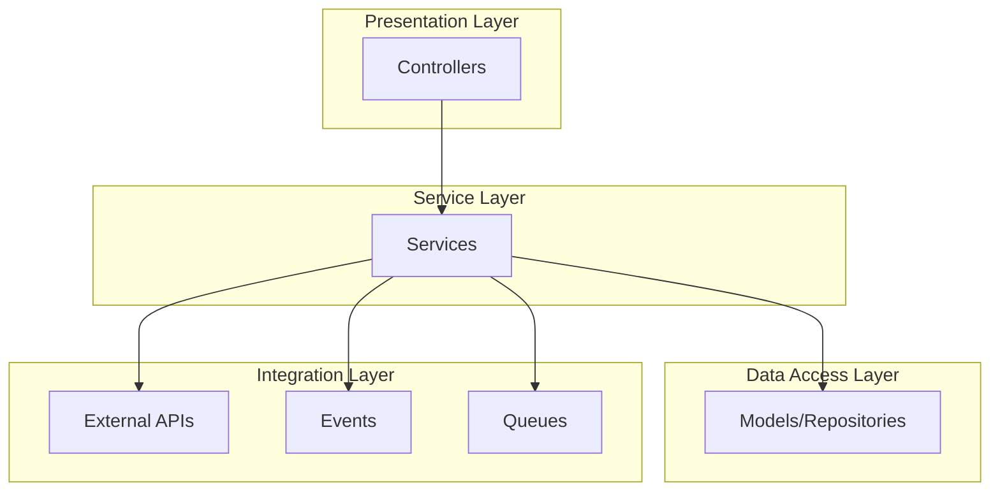

# Understanding The Service Layer

<link rel="stylesheet" href="../../assets/css/styles.css">

## Goal

Understand the Service Layer pattern and how it can be implemented in Laravel to encapsulate business logic and keep controllers thin.

## What is the Service Layer?

The Service Layer is an architectural pattern that defines an application's boundary and its set of available operations from the perspective of interfacing client layers. It encapsulates the application's business logic, controlling transactions and coordinating responses in the implementation of its operations.

### Key Benefits of the Service Layer

1. **Separation of Concerns**: Keeps business logic separate from controllers and models
2. **Reusability**: Business logic can be reused across different parts of the application
3. **Testability**: Business logic is easier to test in isolation
4. **Maintainability**: Changes to business logic don't affect controllers or models
5. **Scalability**: Business logic can be scaled independently

## Why Use a Service Layer in Laravel?

Laravel doesn't enforce a service layer, but it's a common pattern in larger applications for several reasons:

1. **Fat Models, Thin Controllers**: Prevents controllers and models from becoming too large
2. **Complex Business Logic**: Provides a home for complex business logic
3. **Cross-Cutting Concerns**: Handles concerns that span multiple models
4. **API Consistency**: Ensures consistent behavior across different entry points
5. **Transaction Management**: Centralizes transaction handling

## Service Layer vs. Repository Pattern

The Service Layer and Repository Pattern are complementary:

- **Repository Pattern**: Abstracts data access and persistence
- **Service Layer**: Encapsulates business logic and orchestrates operations

You can use both patterns together, with services using repositories to access data.

## Implementing a Service Layer in Laravel

### Basic Structure

Services are typically organized in a `app/Services` directory:

```
app/
├── Services/
│   ├── BaseService.php
│   ├── UserService.php
│   ├── TeamService.php
│   └── ...
```

### Service Interface

It's often a good practice to define interfaces for your services:

```php
<?php

namespace App\Contracts\Services;

interface UserServiceInterface
{
    public function createUser(array $data): User;
    public function updateUser(User $user, array $data): User;
    public function deleteUser(User $user): bool;
    // ...
}
```

### Service Implementation

```php
<?php

namespace App\Services;

use App\Contracts\Services\UserServiceInterface;
use App\Models\User;
use Illuminate\Support\Facades\DB;

class UserService extends BaseService implements UserServiceInterface
{
    public function createUser(array $data): User
    {
        return DB::transaction(function () use ($data) {
            $user = User::create([
                'given_name' => $data['given_name'],
                'family_name' => $data['family_name'],
                'email' => $data['email'],
                'password' => bcrypt($data['password']),
                'type' => $data['type'] ?? User::class,
            ]);
            
            // Additional logic here...
            
            return $user;
        });
    }
    
    public function updateUser(User $user, array $data): User
    {
        return DB::transaction(function () use ($user, $data) {
            $user->update($data);
            
            // Additional logic here...
            
            return $user;
        });
    }
    
    public function deleteUser(User $user): bool
    {
        return DB::transaction(function () use ($user) {
            // Additional logic before deletion...
            
            return $user->delete();
        });
    }
}
```

### Base Service

A base service can provide common functionality for all services:

```php
<?php

namespace App\Services;

use Illuminate\Support\Facades\Log;

abstract class BaseService
{
    /**
     * Log an action performed by a service.
     *
     * @param string $action
     * @param array $data
     * @return void
     */
    protected function logAction(string $action, array $data = []): void
    {
        Log::info("Service action: {$action}", $data);
    }
    
    /**
     * Handle exceptions in a consistent way.
     *
     * @param \Throwable $exception
     * @param string $context
     * @throws \Throwable
     */
    protected function handleException(\Throwable $exception, string $context): void
    {
        Log::error("Service exception in {$context}: " . $exception->getMessage(), [
            'exception' => get_class($exception),
            'file' => $exception->getFile(),
            'line' => $exception->getLine(),
            'trace' => $exception->getTraceAsString(),
        ]);
        
        throw $exception;
    }
}
```

## Using Services in Controllers

Services are typically injected into controllers using dependency injection:

```php
<?php

namespace App\Http\Controllers;

use App\Contracts\Services\UserServiceInterface;
use App\Http\Requests\StoreUserRequest;
use App\Http\Requests\UpdateUserRequest;
use App\Models\User;
use Illuminate\Http\RedirectResponse;
use Illuminate\View\View;

class UserController extends Controller
{
    protected $userService;
    
    public function __construct(UserServiceInterface $userService)
    {
        $this->userService = $userService;
    }
    
    public function store(StoreUserRequest $request): RedirectResponse
    {
        $user = $this->userService->createUser($request->validated());
        
        return redirect()->route('users.show', $user)
            ->with('success', 'User created successfully.');
    }
    
    public function update(UpdateUserRequest $request, User $user): RedirectResponse
    {
        $this->userService->updateUser($user, $request->validated());
        
        return redirect()->route('users.show', $user)
            ->with('success', 'User updated successfully.');
    }
    
    public function destroy(User $user): RedirectResponse
    {
        $this->userService->deleteUser($user);
        
        return redirect()->route('users.index')
            ->with('success', 'User deleted successfully.');
    }
}
```

## Service Provider Registration

Register your services in a service provider:

```php
<?php

namespace App\Providers;

use App\Contracts\Services\UserServiceInterface;
use App\Services\UserService;
use Illuminate\Support\ServiceProvider;

class AppServiceProvider extends ServiceProvider
{
    /**
     * Register any application services.
     *
     * @return void
     */
    public function register()
    {
        $this->app->bind(UserServiceInterface::class, UserService::class);
        
        // Register other services...
    }
}
```

## Testing Services

Services are easy to test in isolation:

```php
<?php

namespace Tests\Unit\Services;

use App\Models\User;use App\Services\UserService;use Illuminate\Foundation\Testing\RefreshDatabase;use old\TestCase;use PHPUnit\Framework\Attributes\Test;

class UserServiceTest extends TestCase
{
    use RefreshDatabase;
    
    protected UserService $userService;
    
    protected function setUp(): void
    {
        parent::setUp();
        
        $this->userService = new UserService();
    }
    
    #[Test]
    public function it_can_create_a_user()
    {
        $userData = [
            'given_name' => 'John',
            'family_name' => 'Doe',
            'email' => 'john@example.com',
            'password' => 'password',
        ];
        
        $user = $this->userService->createUser($userData);
        
        $this->assertInstanceOf(User::class, $user);
        $this->assertEquals('John', $user->given_name);
        $this->assertEquals('Doe', $user->family_name);
        $this->assertEquals('john@example.com', $user->email);
    }
    
    #[Test]
    public function it_can_update_a_user()
    {
        $user = User::factory()->create();
        
        $updatedData = [
            'given_name' => 'Jane',
            'family_name' => 'Smith',
        ];
        
        $updatedUser = $this->userService->updateUser($user, $updatedData);
        
        $this->assertEquals('Jane', $updatedUser->given_name);
        $this->assertEquals('Smith', $updatedUser->family_name);
    }
    
    #[Test]
    public function it_can_delete_a_user()
    {
        $user = User::factory()->create();
        
        $result = $this->userService->deleteUser($user);
        
        $this->assertTrue($result);
        $this->assertDatabaseMissing('users', ['id' => $user->id]);
    }
}
```

## Service Layer Best Practices

1. **Keep Services Focused**: Each service should focus on a specific domain
2. **Use Interfaces**: Define interfaces for your services
3. **Dependency Injection**: Inject dependencies rather than creating them
4. **Transaction Management**: Use transactions for operations that affect multiple models
5. **Error Handling**: Handle exceptions consistently
6. **Logging**: Log important actions and errors
7. **Validation**: Validate input data before processing
8. **Return Types**: Use return type hints and docblocks
9. **Testing**: Write comprehensive tests for your services

## Diagram: Service Layer Architecture



## Next Steps

Now that you understand the Service Layer pattern, let's move on to [Create BaseService](./190-base-service.md) to implement a base service class for our application.
