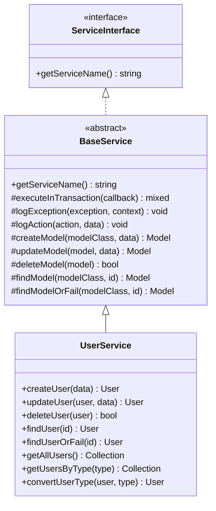

# Create BaseService

<link rel="stylesheet" href="../../assets/css/styles.css">

## Goal

Create a BaseService class that provides common functionality for all services in our application, establishing a foundation for our service layer.

## Overview

The BaseService will:

1. **Provide Common Methods**: Implement methods used by all services
2. **Handle Exceptions**: Provide consistent exception handling
3. **Manage Transactions**: Simplify transaction management
4. **Support Logging**: Include logging capabilities
5. **Define Contracts**: Establish a common interface for services

## Step 1: Create the Service Directory

First, let's create a directory for our services:

```bash
mkdir -p app/Services
```

## Step 2: Create the BaseService Class

Create a new file at `app/Services/BaseService.php`:

```php
<?php

namespace App\Services;

use Illuminate\Database\Eloquent\Model;
use Illuminate\Support\Facades\DB;
use Illuminate\Support\Facades\Log;
use Throwable;

abstract class BaseService
{
    /**
     * Execute a callback within a transaction.
     *
     * @param callable $callback
     * @return mixed
     *
     * @throws Throwable
     */
    protected function executeInTransaction(callable $callback)
    {
        try {
            return DB::transaction($callback);
        } catch (Throwable $e) {
            $this->logException($e);
            throw $e;
        }
    }

    /**
     * Log an exception.
     *
     * @param Throwable $exception
     * @param array $context
     * @return void
     */
    protected function logException(Throwable $exception, array $context = []): void
    {
        $context = array_merge([
            'exception' => get_class($exception),
            'file' => $exception->getFile(),
            'line' => $exception->getLine(),
            'trace' => $exception->getTraceAsString(),
        ], $context);

        Log::error("Service exception: {$exception->getMessage()}", $context);
    }

    /**
     * Log an action.
     *
     * @param string $action
     * @param array $data
     * @return void
     */
    protected function logAction(string $action, array $data = []): void
    {
        Log::info("Service action: {$action}", $data);
    }

    /**
     * Create a new model.
     *
     * @param string $modelClass
     * @param array $data
     * @return Model
     */
    protected function createModel(string $modelClass, array $data): Model
    {
        return $this->executeInTransaction(function () use ($modelClass, $data) {
            $model = $modelClass::create($data);
            $this->logAction('created', [
                'model' => $modelClass,
                'id' => $model->id,
            ]);
            return $model;
        });
    }

    /**
     * Update a model.
     *
     * @param Model $model
     * @param array $data
     * @return Model
     */
    protected function updateModel(Model $model, array $data): Model
    {
        return $this->executeInTransaction(function () use ($model, $data) {
            $model->update($data);
            $this->logAction('updated', [
                'model' => get_class($model),
                'id' => $model->id,
            ]);
            return $model;
        });
    }

    /**
     * Delete a model.
     *
     * @param Model $model
     * @return bool
     */
    protected function deleteModel(Model $model): bool
    {
        return $this->executeInTransaction(function () use ($model) {
            $modelClass = get_class($model);
            $modelId = $model->id;
            
            $result = $model->delete();
            
            $this->logAction('deleted', [
                'model' => $modelClass,
                'id' => $modelId,
            ]);
            
            return $result;
        });
    }

    /**
     * Find a model by ID.
     *
     * @param string $modelClass
     * @param mixed $id
     * @return Model|null
     */
    protected function findModel(string $modelClass, $id): ?Model
    {
        return $modelClass::find($id);
    }

    /**
     * Find a model by ID or throw an exception.
     *
     * @param string $modelClass
     * @param mixed $id
     * @return Model
     *
     * @throws \Illuminate\Database\Eloquent\ModelNotFoundException
     */
    protected function findModelOrFail(string $modelClass, $id): Model
    {
        return $modelClass::findOrFail($id);
    }
}
```

## Step 3: Create a Service Interface

Create a new directory for contracts:

```bash
mkdir -p app/Contracts/Services
```

Create a new file at `app/Contracts/Services/ServiceInterface.php`:

```php
<?php

namespace App\Contracts\Services;

interface ServiceInterface
{
    /**
     * Get the service name.
     *
     * @return string
     */
    public function getServiceName(): string;
}
```

## Step 4: Update the BaseService to Implement the Interface

Update the BaseService to implement the ServiceInterface:

```php
<?php

namespace App\Services;

use App\Contracts\Services\ServiceInterface;
use Illuminate\Database\Eloquent\Model;
use Illuminate\Support\Facades\DB;
use Illuminate\Support\Facades\Log;
use Throwable;

abstract class BaseService implements ServiceInterface
{
    /**
     * Get the service name.
     *
     * @return string
     */
    public function getServiceName(): string
    {
        return class_basename($this);
    }

    // ... rest of the methods remain the same
}
```

## Step 5: Create a UserService Example

Let's create a simple UserService to demonstrate how to extend the BaseService:

```php
<?php

namespace App\Services;

use App\Models\User;
use Illuminate\Database\Eloquent\Collection;

class UserService extends BaseService
{
    /**
     * Create a new user.
     *
     * @param array $data
     * @return User
     */
    public function createUser(array $data): User
    {
        // Ensure password is hashed
        if (isset($data['password'])) {
            $data['password'] = bcrypt($data['password']);
        }

        return $this->createModel(User::class, $data);
    }

    /**
     * Update a user.
     *
     * @param User $user
     * @param array $data
     * @return User
     */
    public function updateUser(User $user, array $data): User
    {
        // Hash password if provided
        if (isset($data['password'])) {
            $data['password'] = bcrypt($data['password']);
        }

        return $this->updateModel($user, $data);
    }

    /**
     * Delete a user.
     *
     * @param User $user
     * @return bool
     */
    public function deleteUser(User $user): bool
    {
        return $this->deleteModel($user);
    }

    /**
     * Find a user by ID.
     *
     * @param mixed $id
     * @return User|null
     */
    public function findUser($id): ?User
    {
        return $this->findModel(User::class, $id);
    }

    /**
     * Find a user by ID or throw an exception.
     *
     * @param mixed $id
     * @return User
     *
     * @throws \Illuminate\Database\Eloquent\ModelNotFoundException
     */
    public function findUserOrFail($id): User
    {
        return $this->findModelOrFail(User::class, $id);
    }

    /**
     * Get all users.
     *
     * @return Collection
     */
    public function getAllUsers(): Collection
    {
        return User::all();
    }

    /**
     * Get users by type.
     *
     * @param string $type
     * @return Collection
     */
    public function getUsersByType(string $type): Collection
    {
        return User::where('type', $type)->get();
    }

    /**
     * Convert a user to a different type.
     *
     * @param User $user
     * @param string $type
     * @return User
     */
    public function convertUserType(User $user, string $type): User
    {
        return $this->executeInTransaction(function () use ($user, $type) {
            $convertedUser = $user->convertToChildType($type);
            $convertedUser->save();
            
            $this->logAction('converted_user_type', [
                'user_id' => $user->id,
                'from_type' => $user->type,
                'to_type' => $type,
            ]);
            
            return $convertedUser;
        });
    }
}
```

## Step 6: Register the Service in a Service Provider

Create a new service provider:

```bash
php artisan make:provider ServiceServiceProvider
```

Open the newly created provider at `app/Providers/ServiceServiceProvider.php` and update it:

```php
<?php

namespace App\Providers;

use App\Contracts\Services\ServiceInterface;
use App\Services\UserService;
use Illuminate\Support\ServiceProvider;

class ServiceServiceProvider extends ServiceProvider
{
    /**
     * Register services.
     *
     * @return void
     */
    public function register()
    {
        // Register UserService
        $this->app->bind(UserService::class, function ($app) {
            return new UserService();
        });

        // Register other services here...
    }

    /**
     * Bootstrap services.
     *
     * @return void
     */
    public function boot()
    {
        //
    }
}
```

Register the service provider in `config/app.php`:

```php
'providers' => [
    // ...
    App\Providers\ServiceServiceProvider::class,
],
```

## Testing the BaseService

Let's create a test for our BaseService implementation:

```php
<?php

namespace Tests\Unit\Services;

use App\Models\User;use App\Services\UserService;use Illuminate\Foundation\Testing\RefreshDatabase;use old\TestCase;use PHPUnit\Framework\Attributes\Test;

class BaseServiceTest extends TestCase
{
    use RefreshDatabase;

    protected UserService $userService;

    protected function setUp(): void
    {
        parent::setUp();
        $this->userService = new UserService();
    }

    #[Test]
    public function it_can_get_service_name()
    {
        $this->assertEquals('UserService', $this->userService->getServiceName());
    }

    #[Test]
    public function it_can_create_a_model()
    {
        $userData = [
            'given_name' => 'John',
            'family_name' => 'Doe',
            'email' => 'john@example.com',
            'password' => 'password',
            'type' => User::class,
        ];

        $user = $this->userService->createUser($userData);

        $this->assertInstanceOf(User::class, $user);
        $this->assertEquals('John', $user->given_name);
        $this->assertEquals('Doe', $user->family_name);
        $this->assertEquals('john@example.com', $user->email);
        $this->assertEquals(User::class, $user->type);
    }

    #[Test]
    public function it_can_update_a_model()
    {
        $user = User::factory()->create();

        $updatedData = [
            'given_name' => 'Jane',
            'family_name' => 'Smith',
        ];

        $updatedUser = $this->userService->updateUser($user, $updatedData);

        $this->assertEquals('Jane', $updatedUser->given_name);
        $this->assertEquals('Smith', $updatedUser->family_name);
    }

    #[Test]
    public function it_can_delete_a_model()
    {
        $user = User::factory()->create();

        $result = $this->userService->deleteUser($user);

        $this->assertTrue($result);
        $this->assertDatabaseMissing('users', ['id' => $user->id]);
    }

    #[Test]
    public function it_can_find_a_model()
    {
        $user = User::factory()->create();

        $foundUser = $this->userService->findUser($user->id);

        $this->assertInstanceOf(User::class, $foundUser);
        $this->assertEquals($user->id, $foundUser->id);
    }

    #[Test]
    public function it_can_convert_user_type()
    {
        $user = User::factory()->create();

        $admin = $this->userService->convertUserType($user, \App\Models\Admin::class);

        $this->assertInstanceOf(\App\Models\Admin::class, $admin);
        $this->assertEquals(\App\Models\Admin::class, $admin->type);
        $this->assertEquals($user->id, $admin->id);
    }
}
```

## Using the Service in a Controller

Here's an example of how to use the UserService in a controller:

```php
<?php

namespace App\Http\Controllers;

use App\Http\Requests\StoreUserRequest;
use App\Http\Requests\UpdateUserRequest;
use App\Models\User;
use App\Services\UserService;
use Illuminate\Http\RedirectResponse;
use Illuminate\View\View;

class UserController extends Controller
{
    protected UserService $userService;

    public function __construct(UserService $userService)
    {
        $this->userService = $userService;
    }

    public function index(): View
    {
        $users = $this->userService->getAllUsers();

        return view('users.index', compact('users'));
    }

    public function create(): View
    {
        return view('users.create');
    }

    public function store(StoreUserRequest $request): RedirectResponse
    {
        $user = $this->userService->createUser($request->validated());

        return redirect()->route('users.show', $user)
            ->with('success', 'User created successfully.');
    }

    public function show(User $user): View
    {
        return view('users.show', compact('user'));
    }

    public function edit(User $user): View
    {
        return view('users.edit', compact('user'));
    }

    public function update(UpdateUserRequest $request, User $user): RedirectResponse
    {
        $this->userService->updateUser($user, $request->validated());

        return redirect()->route('users.show', $user)
            ->with('success', 'User updated successfully.');
    }

    public function destroy(User $user): RedirectResponse
    {
        $this->userService->deleteUser($user);

        return redirect()->route('users.index')
            ->with('success', 'User deleted successfully.');
    }
}
```

## Diagram: BaseService Class Structure



## Next Steps

Now that we've created the BaseService, let's move on to [Initial Filament Resource Setup](./200-filament-resources.md) to set up Filament resources for our models.
