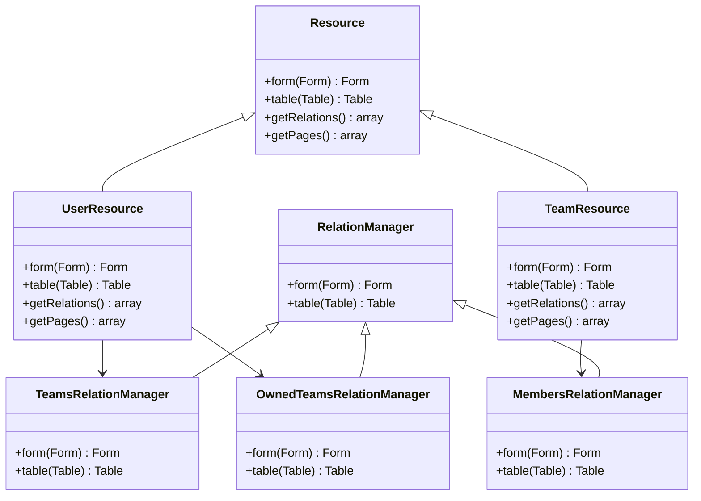

# Initial Filament Resource Setup

<link rel="stylesheet" href="../../assets/css/styles.css">

## Goal

Set up Filament resources for our User and Team models to provide a powerful admin interface for managing them.

## What is Filament?

Filament is a collection of tools for rapidly building beautiful TALL stack (Tailwind CSS, Alpine.js, Laravel, Livewire) applications. The Filament admin panel allows you to quickly build admin interfaces for your Laravel applications.

## Installing Filament

First, let's install Filament:

```bash
composer require filament/filament:"^3.0"
```

Then, let's publish the configuration:

```bash
php artisan vendor:publish --tag=filament-config
```

Next, let's create a user for the admin panel:

```bash
php artisan make:filament-user
```

## Creating Resources

Filament resources provide a way to manage models in the admin panel. Let's create resources for our User and Team models.

### User Resource

```bash
php artisan make:filament-resource User
```

This will create several files:

- `app/Filament/Resources/UserResource.php`
- `app/Filament/Resources/UserResource/Pages/CreateUser.php`
- `app/Filament/Resources/UserResource/Pages/EditUser.php`
- `app/Filament/Resources/UserResource/Pages/ListUsers.php`

Let's customize the UserResource:

```php
<?php

namespace App\Filament\Resources;

use App\Filament\Resources\UserResource\Pages;
use App\Models\Admin;
use App\Models\Manager;
use App\Models\Practitioner;
use App\Models\User;
use Filament\Forms;
use Filament\Forms\Form;
use Filament\Resources\Resource;
use Filament\Tables;
use Filament\Tables\Table;
use Illuminate\Database\Eloquent\Builder;
use Illuminate\Database\Eloquent\SoftDeletingScope;

class UserResource extends Resource
{
    protected static ?string $model = User::class;

    protected static ?string $navigationIcon = 'heroicon-o-users';

    protected static ?string $navigationGroup = 'User Management';

    protected static ?int $navigationSort = 1;

    public static function form(Form $form): Form
    {
        return $form
            ->schema([
                Forms\Components\Select::make('type')
                    ->options([
                        User::class => 'User',
                        Admin::class => 'Admin',
                        Manager::class => 'Manager',
                        Practitioner::class => 'Practitioner',
                    ])
                    ->required()
                    ->default(User::class),
                Forms\Components\TextInput::make('given_name')
                    ->required()
                    ->maxLength(255),
                Forms\Components\TextInput::make('family_name')
                    ->required()
                    ->maxLength(255),
                Forms\Components\TextInput::make('other_names')
                    ->maxLength(255),
                Forms\Components\TextInput::make('email')
                    ->email()
                    ->required()
                    ->maxLength(255)
                    ->unique(ignoreRecord: true),
                Forms\Components\DateTimePicker::make('email_verified_at'),
                Forms\Components\TextInput::make('password')
                    ->password()
                    ->dehydrateStateUsing(fn (string $state): string => bcrypt($state))
                    ->dehydrated(fn (?string $state): bool => filled($state))
                    ->required(fn (string $operation): bool => $operation === 'create'),
                Forms\Components\KeyValue::make('metadata')
                    ->keyLabel('Key')
                    ->valueLabel('Value')
                    ->reorderable()
                    ->collapsible(),
            ]);
    }

    public static function table(Table $table): Table
    {
        return $table
            ->columns([
                Tables\Columns\TextColumn::make('type')
                    ->formatStateUsing(fn (string $state): string => class_basename($state))
                    ->sortable(),
                Tables\Columns\TextColumn::make('given_name')
                    ->searchable(),
                Tables\Columns\TextColumn::make('family_name')
                    ->searchable(),
                Tables\Columns\TextColumn::make('email')
                    ->searchable(),
                Tables\Columns\TextColumn::make('email_verified_at')
                    ->dateTime()
                    ->sortable(),
                Tables\Columns\TextColumn::make('created_at')
                    ->dateTime()
                    ->sortable()
                    ->toggleable(isToggledHiddenByDefault: true),
                Tables\Columns\TextColumn::make('updated_at')
                    ->dateTime()
                    ->sortable()
                    ->toggleable(isToggledHiddenByDefault: true),
            ])
            ->filters([
                Tables\Filters\SelectFilter::make('type')
                    ->options([
                        User::class => 'User',
                        Admin::class => 'Admin',
                        Manager::class => 'Manager',
                        Practitioner::class => 'Practitioner',
                    ]),
                Tables\Filters\Filter::make('verified')
                    ->query(fn (Builder $query): Builder => $query->whereNotNull('email_verified_at')),
                Tables\Filters\Filter::make('unverified')
                    ->query(fn (Builder $query): Builder => $query->whereNull('email_verified_at')),
            ])
            ->actions([
                Tables\Actions\EditAction::make(),
                Tables\Actions\DeleteAction::make(),
            ])
            ->bulkActions([
                Tables\Actions\BulkActionGroup::make([
                    Tables\Actions\DeleteBulkAction::make(),
                ]),
            ]);
    }

    public static function getRelations(): array
    {
        return [
            //
        ];
    }

    public static function getPages(): array
    {
        return [
            'index' => Pages\ListUsers::route('/'),
            'create' => Pages\CreateUser::route('/create'),
            'edit' => Pages\EditUser::route('/{record}/edit'),
        ];
    }
}
```

### Team Resource

```bash
php artisan make:filament-resource Team
```

This will create several files:

- `app/Filament/Resources/TeamResource.php`
- `app/Filament/Resources/TeamResource/Pages/CreateTeam.php`
- `app/Filament/Resources/TeamResource/Pages/EditTeam.php`
- `app/Filament/Resources/TeamResource/Pages/ListTeams.php`

Let's customize the TeamResource:

```php
<?php

namespace App\Filament\Resources;

use App\Filament\Resources\TeamResource\Pages;
use App\Models\Team;
use App\Models\User;
use Filament\Forms;
use Filament\Forms\Form;
use Filament\Resources\Resource;
use Filament\Tables;
use Filament\Tables\Table;
use Illuminate\Database\Eloquent\Builder;
use Illuminate\Database\Eloquent\SoftDeletingScope;

class TeamResource extends Resource
{
    protected static ?string $model = Team::class;

    protected static ?string $navigationIcon = 'heroicon-o-user-group';

    protected static ?string $navigationGroup = 'User Management';

    protected static ?int $navigationSort = 2;

    public static function form(Form $form): Form
    {
        return $form
            ->schema([
                Forms\Components\TextInput::make('name')
                    ->required()
                    ->maxLength(255),
                Forms\Components\TextInput::make('slug')
                    ->maxLength(255),
                Forms\Components\Textarea::make('description')
                    ->maxLength(65535)
                    ->columnSpanFull(),
                Forms\Components\Select::make('owner_id')
                    ->label('Owner')
                    ->options(User::all()->pluck('name', 'id'))
                    ->required()
                    ->searchable(),
                Forms\Components\KeyValue::make('metadata')
                    ->keyLabel('Key')
                    ->valueLabel('Value')
                    ->reorderable()
                    ->collapsible(),
            ]);
    }

    public static function table(Table $table): Table
    {
        return $table
            ->columns([
                Tables\Columns\TextColumn::make('name')
                    ->searchable(),
                Tables\Columns\TextColumn::make('slug')
                    ->searchable(),
                Tables\Columns\TextColumn::make('owner.name')
                    ->numeric()
                    ->sortable(),
                Tables\Columns\TextColumn::make('created_at')
                    ->dateTime()
                    ->sortable()
                    ->toggleable(isToggledHiddenByDefault: true),
                Tables\Columns\TextColumn::make('updated_at')
                    ->dateTime()
                    ->sortable()
                    ->toggleable(isToggledHiddenByDefault: true),
            ])
            ->filters([
                //
            ])
            ->actions([
                Tables\Actions\EditAction::make(),
                Tables\Actions\DeleteAction::make(),
            ])
            ->bulkActions([
                Tables\Actions\BulkActionGroup::make([
                    Tables\Actions\DeleteBulkAction::make(),
                ]),
            ]);
    }

    public static function getRelations(): array
    {
        return [
            //
        ];
    }

    public static function getPages(): array
    {
        return [
            'index' => Pages\ListTeams::route('/'),
            'create' => Pages\CreateTeam::route('/create'),
            'edit' => Pages\EditTeam::route('/{record}/edit'),
        ];
    }
}
```

## Adding Relations

Let's add relations to our resources to make them more useful.

### Update UserResource with Team Relations

```php
public static function getRelations(): array
{
    return [
        \App\Filament\Resources\UserResource\RelationManagers\TeamsRelationManager::class,
        \App\Filament\Resources\UserResource\RelationManagers\OwnedTeamsRelationManager::class,
    ];
}
```

Create the TeamsRelationManager:

```bash
php artisan make:filament-relation-manager UserResource teams
```

Update the TeamsRelationManager:

```php
<?php

namespace App\Filament\Resources\UserResource\RelationManagers;

use Filament\Forms;
use Filament\Forms\Form;
use Filament\Resources\RelationManagers\RelationManager;
use Filament\Tables;
use Filament\Tables\Table;
use Illuminate\Database\Eloquent\Builder;
use Illuminate\Database\Eloquent\SoftDeletingScope;

class TeamsRelationManager extends RelationManager
{
    protected static string $relationship = 'teams';

    public function form(Form $form): Form
    {
        return $form
            ->schema([
                Forms\Components\TextInput::make('name')
                    ->required()
                    ->maxLength(255),
                Forms\Components\TextInput::make('slug')
                    ->maxLength(255),
                Forms\Components\Textarea::make('description')
                    ->maxLength(65535),
                Forms\Components\Select::make('role')
                    ->options([
                        'admin' => 'Admin',
                        'member' => 'Member',
                    ])
                    ->default('member')
                    ->required(),
            ]);
    }

    public function table(Table $table): Table
    {
        return $table
            ->recordTitleAttribute('name')
            ->columns([
                Tables\Columns\TextColumn::make('name'),
                Tables\Columns\TextColumn::make('slug'),
                Tables\Columns\TextColumn::make('pivot.role')
                    ->label('Role'),
            ])
            ->filters([
                //
            ])
            ->headerActions([
                Tables\Actions\AttachAction::make()
                    ->preloadRecordSelect()
                    ->form(fn (Tables\Actions\AttachAction $action): array => [
                        $action->getRecordSelect(),
                        Forms\Components\Select::make('role')
                            ->options([
                                'admin' => 'Admin',
                                'member' => 'Member',
                            ])
                            ->default('member')
                            ->required(),
                    ]),
            ])
            ->actions([
                Tables\Actions\EditAction::make()
                    ->form(fn (Tables\Actions\EditAction $action): array => [
                        Forms\Components\Select::make('role')
                            ->options([
                                'admin' => 'Admin',
                                'member' => 'Member',
                            ])
                            ->default('member')
                            ->required(),
                    ]),
                Tables\Actions\DetachAction::make(),
            ])
            ->bulkActions([
                Tables\Actions\BulkActionGroup::make([
                    Tables\Actions\DetachBulkAction::make(),
                ]),
            ]);
    }
}
```

Create the OwnedTeamsRelationManager:

```bash
php artisan make:filament-relation-manager UserResource ownedTeams
```

Update the OwnedTeamsRelationManager:

```php
<?php

namespace App\Filament\Resources\UserResource\RelationManagers;

use Filament\Forms;
use Filament\Forms\Form;
use Filament\Resources\RelationManagers\RelationManager;
use Filament\Tables;
use Filament\Tables\Table;
use Illuminate\Database\Eloquent\Builder;
use Illuminate\Database\Eloquent\SoftDeletingScope;

class OwnedTeamsRelationManager extends RelationManager
{
    protected static string $relationship = 'ownedTeams';

    public function form(Form $form): Form
    {
        return $form
            ->schema([
                Forms\Components\TextInput::make('name')
                    ->required()
                    ->maxLength(255),
                Forms\Components\TextInput::make('slug')
                    ->maxLength(255),
                Forms\Components\Textarea::make('description')
                    ->maxLength(65535),
            ]);
    }

    public function table(Table $table): Table
    {
        return $table
            ->recordTitleAttribute('name')
            ->columns([
                Tables\Columns\TextColumn::make('name'),
                Tables\Columns\TextColumn::make('slug'),
                Tables\Columns\TextColumn::make('members_count')
                    ->counts('members')
                    ->label('Members'),
            ])
            ->filters([
                //
            ])
            ->headerActions([
                Tables\Actions\CreateAction::make(),
            ])
            ->actions([
                Tables\Actions\EditAction::make(),
                Tables\Actions\DeleteAction::make(),
            ])
            ->bulkActions([
                Tables\Actions\BulkActionGroup::make([
                    Tables\Actions\DeleteBulkAction::make(),
                ]),
            ]);
    }
}
```

### Update TeamResource with Member Relations

```php
public static function getRelations(): array
{
    return [
        \App\Filament\Resources\TeamResource\RelationManagers\MembersRelationManager::class,
    ];
}
```

Create the MembersRelationManager:

```bash
php artisan make:filament-relation-manager TeamResource members
```

Update the MembersRelationManager:

```php
<?php

namespace App\Filament\Resources\TeamResource\RelationManagers;

use App\Models\Admin;
use App\Models\Manager;
use App\Models\Practitioner;
use App\Models\User;
use Filament\Forms;
use Filament\Forms\Form;
use Filament\Resources\RelationManagers\RelationManager;
use Filament\Tables;
use Filament\Tables\Table;
use Illuminate\Database\Eloquent\Builder;
use Illuminate\Database\Eloquent\SoftDeletingScope;

class MembersRelationManager extends RelationManager
{
    protected static string $relationship = 'members';

    public function form(Form $form): Form
    {
        return $form
            ->schema([
                Forms\Components\TextInput::make('given_name')
                    ->required()
                    ->maxLength(255),
                Forms\Components\TextInput::make('family_name')
                    ->required()
                    ->maxLength(255),
                Forms\Components\TextInput::make('email')
                    ->email()
                    ->required()
                    ->maxLength(255),
                Forms\Components\Select::make('role')
                    ->options([
                        'admin' => 'Admin',
                        'member' => 'Member',
                    ])
                    ->default('member')
                    ->required(),
            ]);
    }

    public function table(Table $table): Table
    {
        return $table
            ->recordTitleAttribute('name')
            ->columns([
                Tables\Columns\TextColumn::make('given_name'),
                Tables\Columns\TextColumn::make('family_name'),
                Tables\Columns\TextColumn::make('email'),
                Tables\Columns\TextColumn::make('type')
                    ->formatStateUsing(fn (string $state): string => class_basename($state)),
                Tables\Columns\TextColumn::make('pivot.role')
                    ->label('Role'),
            ])
            ->filters([
                Tables\Filters\SelectFilter::make('type')
                    ->options([
                        User::class => 'User',
                        Admin::class => 'Admin',
                        Manager::class => 'Manager',
                        Practitioner::class => 'Practitioner',
                    ]),
            ])
            ->headerActions([
                Tables\Actions\AttachAction::make()
                    ->preloadRecordSelect()
                    ->form(fn (Tables\Actions\AttachAction $action): array => [
                        $action->getRecordSelect(),
                        Forms\Components\Select::make('role')
                            ->options([
                                'admin' => 'Admin',
                                'member' => 'Member',
                            ])
                            ->default('member')
                            ->required(),
                    ]),
            ])
            ->actions([
                Tables\Actions\EditAction::make()
                    ->form(fn (Tables\Actions\EditAction $action): array => [
                        Forms\Components\Select::make('role')
                            ->options([
                                'admin' => 'Admin',
                                'member' => 'Member',
                            ])
                            ->default('member')
                            ->required(),
                    ]),
                Tables\Actions\DetachAction::make(),
            ])
            ->bulkActions([
                Tables\Actions\BulkActionGroup::make([
                    Tables\Actions\DetachBulkAction::make(),
                ]),
            ]);
    }
}
```

## Customizing the Dashboard

Let's customize the Filament dashboard to show some useful widgets:

```bash
php artisan make:filament-widget StatsOverview
```

Update the StatsOverview widget:

```php
<?php

namespace App\Filament\Widgets;

use App\Models\Admin;
use App\Models\Manager;
use App\Models\Practitioner;
use App\Models\Team;
use App\Models\User;
use Filament\Widgets\StatsOverviewWidget as BaseWidget;
use Filament\Widgets\StatsOverviewWidget\Stat;

class StatsOverview extends BaseWidget
{
    protected function getStats(): array
    {
        return [
            Stat::make('Total Users', User::count())
                ->description('All users in the system')
                ->descriptionIcon('heroicon-m-users')
                ->color('primary'),
            Stat::make('Admins', Admin::count())
                ->description('Administrator users')
                ->descriptionIcon('heroicon-m-shield-check')
                ->color('danger'),
            Stat::make('Managers', Manager::count())
                ->description('Manager users')
                ->descriptionIcon('heroicon-m-user-group')
                ->color('warning'),
            Stat::make('Practitioners', Practitioner::count())
                ->description('Practitioner users')
                ->descriptionIcon('heroicon-m-academic-cap')
                ->color('success'),
            Stat::make('Teams', Team::count())
                ->description('Total teams')
                ->descriptionIcon('heroicon-m-user-group')
                ->color('info'),
        ];
    }
}
```

## Testing the Filament Resources

Let's create a test to ensure our Filament resources work correctly:

```php
<?php

namespace Tests\Feature\Filament;

use App\Models\Admin;use App\Models\User;use Illuminate\Foundation\Testing\RefreshDatabase;use old\TestCase;use PHPUnit\Framework\Attributes\Test;

class FilamentResourceTest extends TestCase
{
    use RefreshDatabase;

    #[Test]
    public function admin_can_view_user_resource_list()
    {
        $admin = Admin::factory()->create();
        
        $this->actingAs($admin);
        
        $response = $this->get(route('filament.admin.resources.users.index'));
        
        $response->assertSuccessful();
    }

    #[Test]
    public function admin_can_create_user()
    {
        $admin = Admin::factory()->create();
        
        $this->actingAs($admin);
        
        $response = $this->post(route('filament.admin.resources.users.create'), [
            'given_name' => 'John',
            'family_name' => 'Doe',
            'email' => 'john@example.com',
            'password' => 'password',
            'type' => User::class,
        ]);
        
        $response->assertRedirect(route('filament.admin.resources.users.index'));
        
        $this->assertDatabaseHas('users', [
            'given_name' => 'John',
            'family_name' => 'Doe',
            'email' => 'john@example.com',
            'type' => User::class,
        ]);
    }

    #[Test]
    public function admin_can_view_team_resource_list()
    {
        $admin = Admin::factory()->create();
        
        $this->actingAs($admin);
        
        $response = $this->get(route('filament.admin.resources.teams.index'));
        
        $response->assertSuccessful();
    }
}
```

## Accessing the Filament Admin Panel

To access the Filament admin panel, visit `/admin` in your browser. You'll need to log in with the user you created with the `make:filament-user` command.

## Diagram: Filament Resource Structure



## Next Steps

Now that we've set up Filament resources for our models, let's move on to [Phase 1 Git Commit](./210-git-commit.md) to save our progress.
