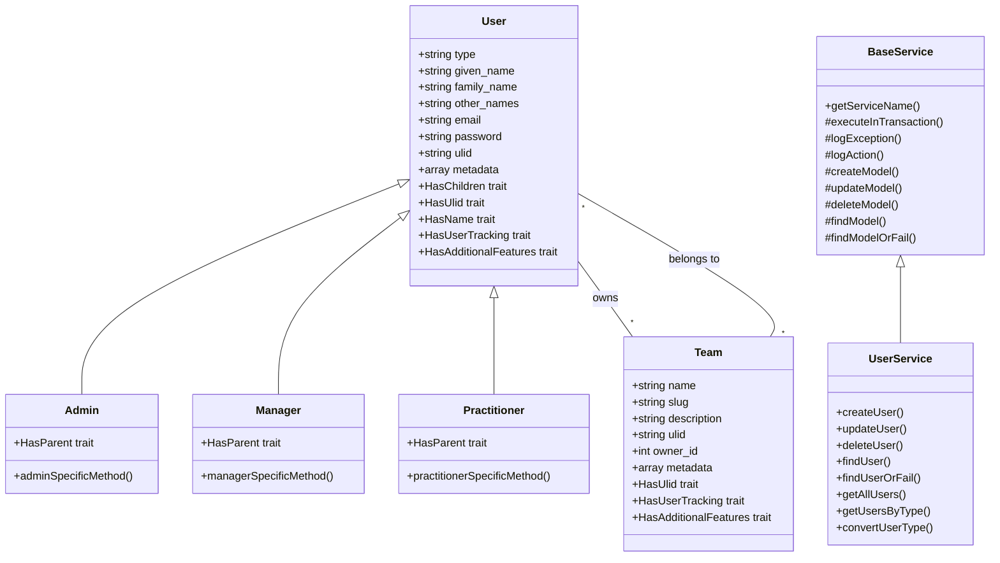

# Phase 1 Git Commit

<link rel="stylesheet" href="../../assets/css/styles.css">

## Goal

Save our progress by committing the changes we've made in Phase 1 to Git.

## Overview

In Phase 1, we've implemented Single Table Inheritance (STI) for the User model, created child models, set up traits for reusable functionality, enhanced the database schema, created factories and seeders, implemented a service layer, and set up Filament resources. Let's commit these changes to Git to save our progress.

## Step 1: Check the Status of Your Changes

First, let's check the status of our changes to see what files have been modified:

```bash
git status
```

You should see a list of modified and new files, including:

- Models (User, Admin, Manager, Practitioner, Team)
- Traits (HasUlid, HasUserTracking, HasName, HasAdditionalFeatures)
- Migrations (enhance_users_table, create_teams_table, create_team_user_table)
- Factories (UserFactory, AdminFactory, ManagerFactory, PractitionerFactory, TeamFactory)
- Seeders (UserSeeder, TeamSeeder, DatabaseSeeder)
- Services (BaseService, UserService)
- Filament Resources (UserResource, TeamResource)

## Step 2: Stage the Changes

Let's stage all the changes for commit:

```bash
git add .
```

If you want to be more selective, you can stage files individually:

```bash
git add app/Models/User.php
git add app/Models/Admin.php
git add app/Models/Manager.php
git add app/Models/Practitioner.php
git add app/Models/Team.php
git add app/Traits/HasUlid.php
git add app/Traits/HasUserTracking.php
git add app/Traits/HasName.php
git add app/Traits/HasAdditionalFeatures.php
git add database/migrations/xxxx_xx_xx_xxxxxx_enhance_users_table.php
git add database/migrations/xxxx_xx_xx_xxxxxx_create_teams_table.php
git add database/migrations/xxxx_xx_xx_xxxxxx_create_team_user_table.php
git add database/factories/UserFactory.php
git add database/factories/AdminFactory.php
git add database/factories/ManagerFactory.php
git add database/factories/PractitionerFactory.php
git add database/factories/TeamFactory.php
git add database/seeders/UserSeeder.php
git add database/seeders/TeamSeeder.php
git add database/seeders/DatabaseSeeder.php
git add app/Services/BaseService.php
git add app/Services/UserService.php
git add app/Filament/Resources/UserResource.php
git add app/Filament/Resources/TeamResource.php
```

## Step 3: Commit the Changes

Now, let's commit the changes with a descriptive message:

```bash
git commit -m "Phase 1: Implement Single Table Inheritance for User model

- Add STI with tightenco/parental for User model
- Create Admin, Manager, and Practitioner child models
- Implement HasUlid, HasUserTracking, HasName, and HasAdditionalFeatures traits
- Enhance users table with type, name components, and metadata
- Create Team model and team_user pivot table
- Update factories and seeders for STI
- Implement service layer with BaseService
- Set up Filament resources for User and Team"
```

## Step 4: Push the Changes (Optional)

If you're working with a remote repository, you can push your changes:

```bash
git push origin main
```

Replace `main` with your branch name if you're working on a different branch.

## Step 5: Create a Tag (Optional)

To mark this milestone, you can create a tag:

```bash
git tag -a v0.1.0 -m "Phase 1: Core Models & Architecture"
git push origin v0.1.0
```

## Summary of Changes

Here's a summary of the changes we've made in Phase 1:

### Models

- Enhanced the User model with STI support
- Created Admin, Manager, and Practitioner child models
- Implemented the Team model with relationships

### Traits

- Created HasUlid trait for ULID generation
- Created HasUserTracking trait for tracking user actions
- Created HasName trait for handling name components
- Created HasAdditionalFeatures trait for metadata

### Database

- Enhanced the users table with type, name components, and metadata
- Created the teams table
- Created the team_user pivot table

### Factories & Seeders

- Updated UserFactory for STI
- Created child model factories
- Created UserSeeder and TeamSeeder
- Updated DatabaseSeeder

### Service Layer

- Implemented BaseService
- Created UserService

### Admin Interface

- Set up Filament resources for User and Team

## Next Phase

In the next phase, we'll focus on authentication and user profiles, building on the foundation we've established in Phase 1.

## Diagram: Phase 1 Architecture



## Conclusion

Congratulations! You've completed Phase 1 of the UME tutorial, implementing Single Table Inheritance for the User model and setting up the core architecture of the application. In the next phase, we'll build on this foundation to implement authentication and user profiles.
