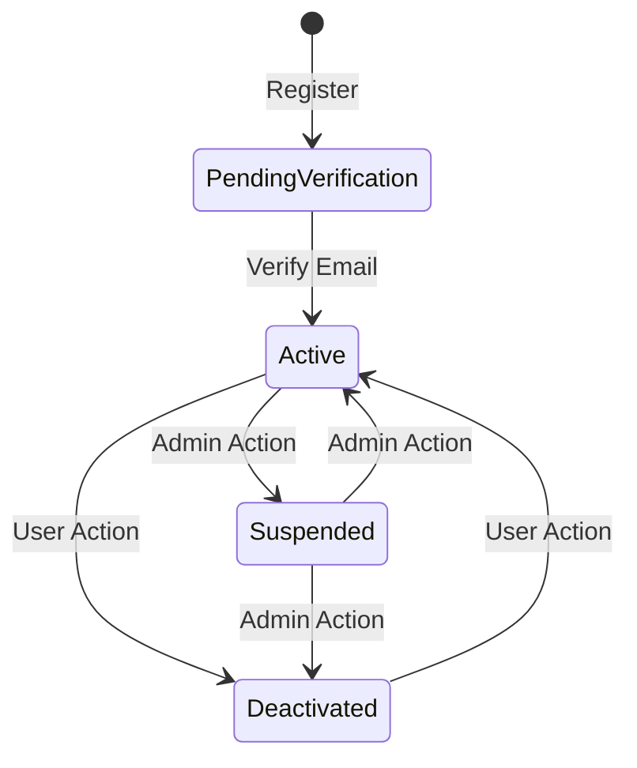

# Phase 2: Authentication, Profile Basics & State Machine

<link rel="stylesheet" href="../../assets/css/styles.css">

**Goal:** Enhance authentication with state machines for account lifecycle management, implement two-factor authentication, create enhanced user profiles with granular name components and avatar uploads, and set up the service layer for user management.

## In This Phase

1. [Understanding Fortify & Authentication](./010-understanding-fortify.md) - Learn about Laravel Fortify
2. [Configure Fortify Features](./020-configure-fortify.md) - Set up authentication features
3. [Understanding Enums & State Machines](./010-state-machines.md) - Learn about state machines
4. [Define AccountStatus Enum](./020-account-status-enum.md) - Create an enum for account statuses
5. [Create Account State Machine Classes](./030-state-machine-classes.md) - Implement the state machine
6. [Understanding Email Verification Flow](./040-email-verification.md) - Learn about email verification
7. [Integrate State Machine with Email Verification](./050-state-machine-integration.md) - Connect state machine to verification
8. [Testing the Account State Machine](./060-state-machine-testing.md) - Test the state machine implementation
9. [State Machine Workflows for Future Development](./070-state-machine-workflows.md) - Explore future enhancements
10. [Understanding Two-Factor Authentication](./100-2fa.md) - Learn about 2FA in Laravel
11. [Implement 2FA UI with Flux UI](./110-2fa-ui-flux.md) - Create the 2FA interface with Flux UI
12. [Implement Profile Information UI with Flux UI](./080-flux-ui-profile-component.md) - Create the profile edit form
13. [Understanding File Uploads & Media Library](./130-media-library.md) - Learn about file uploads
14. [Implement Avatar Upload Backend](./140-avatar-backend.md) - Set up avatar uploads
15. [Implement Avatar Upload UI with Flux UI](./150-avatar-ui-flux.md) - Create the avatar upload interface
16. [Understanding Dependency Injection & Service Providers](./160-dependency-injection.md) - Learn about services
17. [Create UserService](./170-user-service.md) - Implement the user service
18. [Create UserTypeService & UserTypeChanged Event](./180-user-type-service.md) - Handle user type changes
19. [Customize Fortify's User Creation](./190-customize-fortify.md) - Use services for user creation
20. [Understanding Events & Listeners](./200-events-listeners.md) - Learn about Laravel events
21. [Define Initial Events & Listeners](./210-define-events.md) - Create event classes
22. [Register Events & Listeners](./220-register-events.md) - Set up event listeners
23. [UI Integration with UserType](./090-ui-integration-usertype.md) - Implement UI components for user types
24. [Phase 2 Git Commit](./230-git-commit.md) - Save your progress

## Authentication and Profiles with Flux UI

In this phase, we'll use Flux UI components to create polished, user-friendly interfaces for:

- Two-factor authentication setup and management
- Profile information editing with split name components
- Avatar upload and management
- Account status visualization

Let's begin by [Understanding Fortify & Authentication](./010-understanding-fortify.md).
